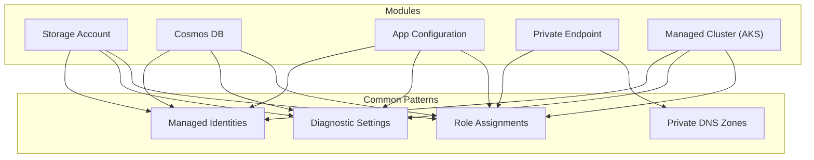
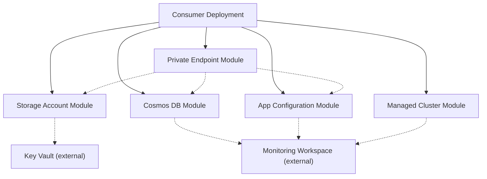
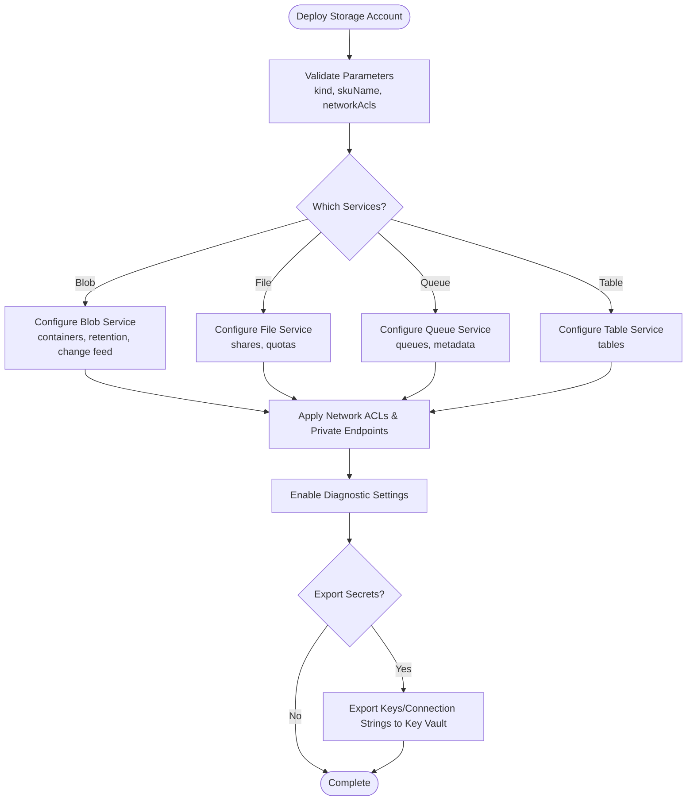
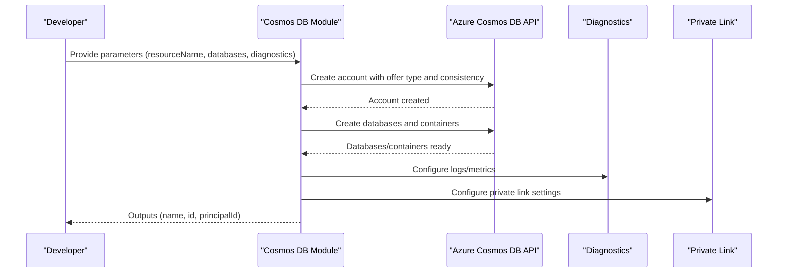
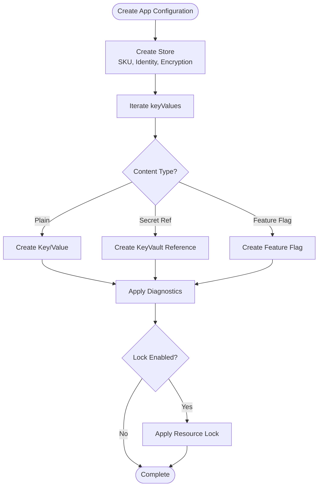
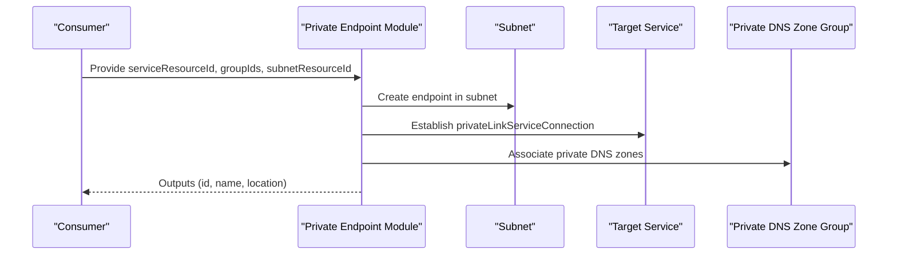
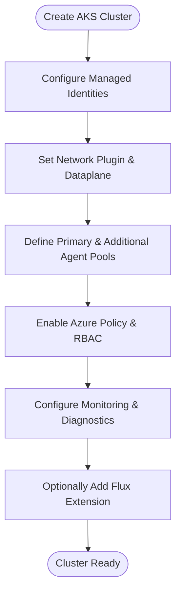
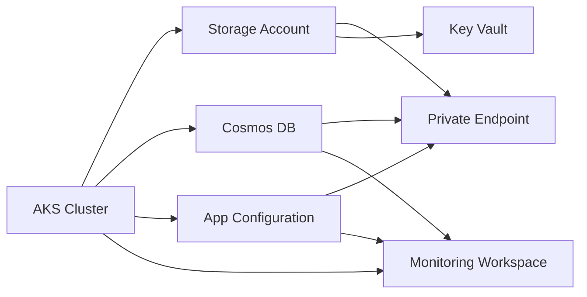

# Reusable Module Library

<cite>
**Referenced Files in This Document**
- [bicep/README.md](file://bicep/README.md)
- [storage-account/main.bicep](file://bicep/modules/storage-account/main.bicep)
- [storage-account/README.md](file://bicep/modules/storage-account/README.md)
- [storage-account/version.json](file://bicep/modules/storage-account/version.json)
- [cosmos-db/main.bicep](file://bicep/modules/cosmos-db/main.bicep)
- [cosmos-db/README.md](file://bicep/modules/cosmos-db/README.md)
- [cosmos-db/version.json](file://bicep/modules/cosmos-db/version.json)
- [cosmos-db/test/main.test.bicep](file://bicep/modules/cosmos-db/test/main.test.bicep)
- [app-configuration/main.bicep](file://bicep/modules/app-configuration/main.bicep)
- [app-configuration/README.md](file://bicep/modules/app-configuration/README.md)
- [app-configuration/version.json](file://bicep/modules/app-configuration/version.json)
- [private-endpoint/main.bicep](file://bicep/modules/private-endpoint/main.bicep)
- [private-endpoint/README.md](file://bicep/modules/private-endpoint/README.md)
- [private-endpoint/version.json](file://bicep/modules/private-endpoint/version.json)
- [managed-cluster/main.bicep](file://bicep/modules/managed-cluster/main.bicep)
- [managed-cluster/README.md](file://bicep/modules/managed-cluster/README.md)
- [managed-cluster/version.json](file://bicep/modules/managed-cluster/version.json)
</cite>

## Table of Contents
1. [Introduction](#introduction)
2. [Project Structure](#project-structure)
3. [Core Components](#core-components)
4. [Architecture Overview](#architecture-overview)
5. [Detailed Component Analysis](#detailed-component-analysis)
6. [Dependency Analysis](#dependency-analysis)
7. [Performance Considerations](#performance-considerations)
8. [Troubleshooting Guide](#troubleshooting-guide)
9. [Conclusion](#conclusion)
10. [Appendices](#appendices)

## Introduction
This document describes the reusable Bicep module library that provides standardized implementations for common Azure resources. It focuses on five major module categories: storage accounts, Cosmos DB, application configuration, private endpoints, and managed clusters (AKS). For each module, we explain purpose, inputs, outputs, usage patterns, versioning, testing, and best practices for extension. We also cover composition patterns and parameter validation used across the codebase.

## Project Structure
The repository organizes infrastructure as Bicep modules under bicep/modules. Each module typically includes:
- A main entry file (main.bicep) defining parameters, resources, and outputs
- A README with examples, parameters, and outputs
- A version.json declaring the published module version and path filters
- Optional nested modules (.bicep), tests (test or tests), and metadata (metadata.json)

[No sources needed since this diagram shows conceptual structure]

## Core Components
This section summarizes the core modules and their responsibilities:
- Storage Account: Deploys a versatile storage account with optional blob/file/queue/table services, private endpoints, network ACLs, management policies, and secrets export to Key Vault.
- Cosmos DB: Deploys a Cosmos DB account with SQL/Gremlin/MongoDB databases and containers, backup policies, diagnostics, identity, and private link settings.
- App Configuration: Deploys an App Configuration store with key values, feature flags, diagnostics, locks, and CMEK support.
- Private Endpoint: Deploys a private endpoint with optional private DNS zone groups and role assignments.
- Managed Cluster (AKS): Deploys an AKS cluster with agent pools, networking options, security add-ons, monitoring, and Flux extensions.

**Section sources**
- [storage-account/main.bicep:1-200](file://bicep/modules/storage-account/main.bicep#L1-L200)
- [cosmos-db/main.bicep:1-200](file://bicep/modules/cosmos-db/main.bicep#L1-L200)
- [app-configuration/main.bicep:1-200](file://bicep/modules/app-configuration/main.bicep#L1-L200)
- [private-endpoint/main.bicep:1-140](file://bicep/modules/private-endpoint/main.bicep#L1-L140)
- [managed-cluster/main.bicep:1-200](file://bicep/modules/managed-cluster/main.bicep#L1-L200)

## Architecture Overview
The overall architecture composes multiple modules to provision a secure, observable, and manageable environment. The following diagram maps high-level relationships between modules and shared capabilities such as identity, diagnostics, and networking.

[No sources needed since this diagram shows conceptual workflow]

## Detailed Component Analysis

### Storage Account Module
Purpose:
- Deploy a configurable storage account supporting Blob, File, Queue, and Table services.
- Provide secure defaults (deny public access, HTTPS-only, minimum TLS), private endpoints, network ACLs, lifecycle rules, and secrets export to Key Vault.

Inputs (selected):
- name, location, kind, skuName, accessTier, allowBlobPublicAccess
- blobServices, fileServices, queueServices, tableServices
- privateEndpoints, networkAcls, managementPolicyRules
- diagnosticSettings, lock, tags, managedIdentities
- customerManagedKey, secretsExportConfiguration

Outputs:
- Standard resource identifiers and properties are exposed by the module’s outputs (see module outputs in source files).

Usage patterns:
- Minimal deployment with secure defaults
- Enabling changefeed only
- Exporting secrets to Key Vault via secretsExportConfiguration
- Configuring private endpoints per service (blob, file, queue, table, web, dfs)
- Applying lifecycle rules and network ACLs

Parameter validation highlights:
- Allowed kinds and SKUs enforced via @allowed
- Minimum TLS version constrained to TLS1_2/TLS1_3
- Conditional features (e.g., hierarchical namespace required for SFTP/NFS)

Testing:
- Example deployments and parameter sets documented in README; tests reside under test folders.

Versioning:
- Declared in version.json with pathFilters indicating published artifacts.

Best practices for extension:
- Add new service configurations via existing typed parameters (e.g., queueServices, tableServices).
- Use nested modules for complex sub-resources (e.g., containers, shares, queues).
- Maintain secure defaults and enforce least privilege via roleAssignments.

**Section sources**
- [storage-account/README.md:1-800](file://bicep/modules/storage-account/README.md#L1-L800)
- [storage-account/main.bicep:1-200](file://bicep/modules/storage-account/main.bicep#L1-L200)
- [storage-account/version.json:1-7](file://bicep/modules/storage-account/version.json#L1-L7)

#### Storage Account Data Flow

**Diagram sources**
- [storage-account/main.bicep:1-200](file://bicep/modules/storage-account/main.bicep#L1-L200)
- [storage-account/README.md:1-800](file://bicep/modules/storage-account/README.md#L1-L800)

### Cosmos DB Module
Purpose:
- Deploy a Cosmos DB account with SQL, Gremlin, or MongoDB capabilities, including databases and containers, backup policies, diagnostics, identity, and private link.

Inputs (selected):
- resourceName, resourceLocation, tags
- multiwriteRegions, throughput/maxThroughput
- systemAssignedIdentity, userAssignedIdentities, defaultIdentity
- databaseAccountOfferType, defaultConsistencyLevel, automaticFailover
- sqlDatabases, gremlinDatabases, mongodbDatabases
- capabilitiesToAdd, backupPolicyType, backupPolicyContinuousTier
- diagnosticWorkspaceId, diagnosticStorageAccountId, logsToEnable, metricsToEnable
- kvKeyUri, privateLinkSettings, roleAssignments

Outputs:
- name, id, resourceGroupName, systemAssignedPrincipalId, location

Usage patterns:
- SQL database with containers
- Gremlin graphs with automatic indexing
- Multi-region write with periodic backups
- Private link integration and diagnostics

Parameter validation highlights:
- Consistency level allowed values
- Backup intervals and retention ranges
- Capability flags for enabling APIs

Testing:
- Unit tests demonstrate SQL database and container creation.

Versioning:
- Declared in version.json with pathFilters for main.json and metadata.json.

Best practices for extension:
- Extend database/container arrays for additional schemas.
- Integrate diagnostics and private link consistently.
- Use roleAssignments to grant least privilege.

**Section sources**
- [cosmos-db/README.md:1-168](file://bicep/modules/cosmos-db/README.md#L1-L168)
- [cosmos-db/main.bicep:1-200](file://bicep/modules/cosmos-db/main.bicep#L1-L200)
- [cosmos-db/version.json:1-8](file://bicep/modules/cosmos-db/version.json#L1-L8)
- [cosmos-db/test/main.test.bicep:1-39](file://bicep/modules/cosmos-db/test/main.test.bicep#L1-L39)

#### Cosmos DB Provisioning Sequence

**Diagram sources**
- [cosmos-db/main.bicep:1-200](file://bicep/modules/cosmos-db/main.bicep#L1-L200)
- [cosmos-db/README.md:1-168](file://bicep/modules/cosmos-db/README.md#L1-L168)

### App Configuration Module
Purpose:
- Deploy an App Configuration store with key values, feature flags, diagnostics, locks, and CMEK support.

Inputs (selected):
- resourceName, location, lock, tags
- sku, createMode, disableLocalAuth
- systemAssignedIdentity, userAssignedIdentities
- keyValues (including secret references and feature flags)
- roleAssignments, diagnosticWorkspaceId, logsToEnable, metricsToEnable
- cmekConfiguration

Outputs:
- name, id, endpoint

Usage patterns:
- Simple key-value pairs
- Key Vault secret references using content types
- Feature flag configuration
- Locks for protection and diagnostics streaming

Parameter validation highlights:
- SKU allowed values
- Logs and metrics allowed categories
- CMEK configuration fields

Testing:
- Tests validate module usage and parameter combinations.

Versioning:
- Declared in version.json with pathFilters.

Best practices for extension:
- Use keyValues array to add new keys and labels.
- Apply locks for production safety.
- Enable diagnostics and integrate with centralized logging.

**Section sources**
- [app-configuration/README.md:1-179](file://bicep/modules/app-configuration/README.md#L1-L179)
- [app-configuration/main.bicep:1-200](file://bicep/modules/app-configuration/main.bicep#L1-L200)
- [app-configuration/version.json:1-7](file://bicep/modules/app-configuration/version.json#L1-L7)

#### App Configuration Key Value Flow

**Diagram sources**
- [app-configuration/main.bicep:1-200](file://bicep/modules/app-configuration/main.bicep#L1-L200)
- [app-configuration/README.md:1-179](file://bicep/modules/app-configuration/README.md#L1-L179)

### Private Endpoint Module
Purpose:
- Deploy a private endpoint connecting to a target service, with optional private DNS zone groups and role assignments.

Inputs (selected):
- resourceName, subnetResourceId, serviceResourceId, groupIds
- applicationSecurityGroups, customNetworkInterfaceName, ipConfigurations
- privateDnsZoneGroup, location, crossTenant, roleAssignments, tags, lock
- customDnsConfigs, manualPrivateLinkServiceConnections

Outputs:
- resourceGroupName, name, id, location

Usage patterns:
- Connect storage services via groupIds (e.g., blob)
- Associate private DNS zones for internal resolution
- Apply role assignments and locks

Parameter validation highlights:
- Required parameters enforced
- Cross-tenant support for role assignments

Testing:
- Examples show integration with storage and network modules.

Versioning:
- Declared in version.json with pathFilters.

Best practices for extension:
- Reuse privateDnsZoneGroup for multiple endpoints sharing DNS zones.
- Combine with network modules to ensure correct subnet policies.

**Section sources**
- [private-endpoint/README.md:1-115](file://bicep/modules/private-endpoint/README.md#L1-L115)
- [private-endpoint/main.bicep:1-140](file://bicep/modules/private-endpoint/main.bicep#L1-L140)
- [private-endpoint/version.json:1-8](file://bicep/modules/private-endpoint/version.json#L1-L8)

#### Private Endpoint Connection Flow

**Diagram sources**
- [private-endpoint/main.bicep:1-140](file://bicep/modules/private-endpoint/main.bicep#L1-L140)
- [private-endpoint/README.md:1-115](file://bicep/modules/private-endpoint/README.md#L1-L115)

### Managed Cluster (AKS) Module
Purpose:
- Deploy an AKS managed cluster with agent pools, networking options, security add-ons, monitoring, and Flux extensions.

Inputs (selected):
- name, location, dnsPrefix
- managedIdentities, networkDataplane, networkPlugin, networkPluginMode
- podCidr, serviceCidr, dnsServiceIP, loadBalancerSku, outboundType
- skuTier, skuName, kubernetesVersion
- aadProfile settings, enableRBAC, disableLocalAccounts
- nodeResourceGroup, authorizedIPRanges, publicNetworkAccess, enablePrivateCluster
- primaryAgentPoolProfile, agentPools, maintenanceConfiguration
- costAnalysisEnabled, httpApplicationRoutingEnabled, webApplicationRoutingEnabled
- ingressApplicationGatewayEnabled, azurePolicyEnabled, monitoringWorkspaceId
- fluxExtension, diagnosticSettings, roleAssignments

Outputs:
- Standard resource identifiers and properties are exposed by the module’s outputs (see module outputs in source files).

Usage patterns:
- Defaults with automatic mode
- Azure CNI or Kubenet networking
- Private cluster with managed NAT Gateway
- WAF-aligned configurations and monitoring

Parameter validation highlights:
- Allowed network plugins and modes
- Public network access constraints
- Agent pool profiles validated for scaling and taints

Testing:
- E2E and unit tests under tests/e2e and tests/unit demonstrate various configurations.

Versioning:
- Declared in version.json with pathFilters.

Best practices for extension:
- Separate agent pools for system and workloads.
- Enable Azure Policy and monitoring for governance and observability.
- Use Flux extensions for GitOps-driven application delivery.

**Section sources**
- [managed-cluster/README.md:1-800](file://bicep/modules/managed-cluster/README.md#L1-L800)
- [managed-cluster/main.bicep:1-200](file://bicep/modules/managed-cluster/main.bicep#L1-L200)
- [managed-cluster/version.json:1-7](file://bicep/modules/managed-cluster/version.json#L1-L7)

#### AKS Cluster Creation Flow

**Diagram sources**
- [managed-cluster/main.bicep:1-200](file://bicep/modules/managed-cluster/main.bicep#L1-L200)
- [managed-cluster/README.md:1-800](file://bicep/modules/managed-cluster/README.md#L1-L800)

## Dependency Analysis
Module dependencies and interactions:
- Storage Account depends on network ACLs, private endpoints, and optionally Key Vault for secrets export.
- Cosmos DB depends on diagnostics, identity, and optional private link.
- App Configuration depends on diagnostics, identity, and optional CMEK.
- Private Endpoint depends on subnets and private DNS zones; connects to services like storage, Cosmos DB, and App Configuration.
- AKS depends on networking, identity, monitoring, and optional Flux extensions.

**Diagram sources**
- [bicep/README.md:1-87](file://bicep/README.md#L1-L87)
- [storage-account/main.bicep:1-200](file://bicep/modules/storage-account/main.bicep#L1-L200)
- [cosmos-db/main.bicep:1-200](file://bicep/modules/cosmos-db/main.bicep#L1-L200)
- [app-configuration/main.bicep:1-200](file://bicep/modules/app-configuration/main.bicep#L1-L200)
- [private-endpoint/main.bicep:1-140](file://bicep/modules/private-endpoint/main.bicep#L1-L140)
- [managed-cluster/main.bicep:1-200](file://bicep/modules/managed-cluster/main.bicep#L1-L200)

**Section sources**
- [bicep/README.md:1-87](file://bicep/README.md#L1-L87)

## Performance Considerations
- Prefer private endpoints and deny public access where possible to reduce exposure and improve performance through optimized routing.
- Use appropriate SKUs and tiers (e.g., Premium storage, AKS Standard/Premium) based on workload requirements.
- Enable autoscaling for agent pools and Cosmos DB throughput when predictable spikes occur.
- Configure diagnostics selectively to avoid excessive log ingestion costs.
- Leverage lifecycle policies for storage to manage data tiering and retention efficiently.

[No sources needed since this section provides general guidance]

## Troubleshooting Guide
Common issues and resolutions:
- Parameter validation errors: Ensure allowed values match module constraints (e.g., network plugin compatibility, SKU tiers).
- Private endpoint connectivity failures: Verify subnet policies, private DNS zone associations, and service groupIds.
- Diagnostics not streaming: Confirm workspace IDs and permissions; check logsToEnable and metricsToEnable lists.
- Role assignment conflicts: Review crossTenant settings and principal IDs; ensure correct roleDefinitionIdOrName.
- CMEK configuration: Validate Key Vault URL, key name, and identity ID for encryption settings.

**Section sources**
- [storage-account/main.bicep:1-200](file://bicep/modules/storage-account/main.bicep#L1-L200)
- [cosmos-db/main.bicep:1-200](file://bicep/modules/cosmos-db/main.bicep#L1-L200)
- [app-configuration/main.bicep:1-200](file://bicep/modules/app-configuration/main.bicep#L1-L200)
- [private-endpoint/main.bicep:1-140](file://bicep/modules/private-endpoint/main.bicep#L1-L140)
- [managed-cluster/main.bicep:1-200](file://bicep/modules/managed-cluster/main.bicep#L1-L200)

## Conclusion
The reusable Bicep module library provides consistent, secure, and extensible implementations for critical Azure resources. By leveraging standardized parameters, validation, and testing patterns, teams can compose reliable infrastructure deployments while maintaining control over security, observability, and operational excellence.

[No sources needed since this section summarizes without analyzing specific files]

## Appendices

### Module Versioning Strategy
- Each module declares a version in version.json with pathFilters indicating which artifacts are published.
- Consumers should pin versions to ensure stability and reproducibility.

**Section sources**
- [storage-account/version.json:1-7](file://bicep/modules/storage-account/version.json#L1-L7)
- [cosmos-db/version.json:1-8](file://bicep/modules/cosmos-db/version.json#L1-L8)
- [app-configuration/version.json:1-7](file://bicep/modules/app-configuration/version.json#L1-L7)
- [private-endpoint/version.json:1-8](file://bicep/modules/private-endpoint/version.json#L1-L8)
- [managed-cluster/version.json:1-7](file://bicep/modules/managed-cluster/version.json#L1-L7)

### Testing Approaches
- Unit tests validate minimal and maximal parameter sets.
- E2E tests verify end-to-end provisioning and integration scenarios.
- Examples in READMEs serve as reference deployments for validation.

**Section sources**
- [cosmos-db/test/main.test.bicep:1-39](file://bicep/modules/cosmos-db/test/main.test.bicep#L1-L39)
- [storage-account/README.md:1-800](file://bicep/modules/storage-account/README.md#L1-L800)
- [managed-cluster/README.md:1-800](file://bicep/modules/managed-cluster/README.md#L1-L800)

### Best Practices for Extending Modules
- Add new capabilities via typed parameters and nested modules to maintain clarity.
- Preserve secure defaults and enforce least privilege through roleAssignments.
- Include diagnostics and locks for production readiness.
- Update README with new parameters, examples, and outputs.

[No sources needed since this section provides general guidance]