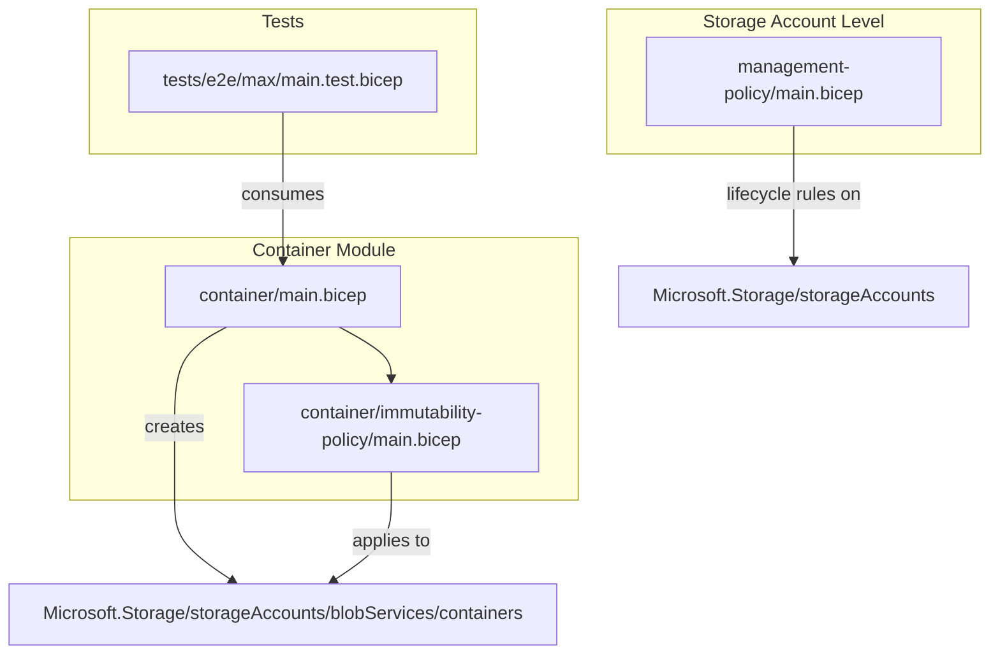
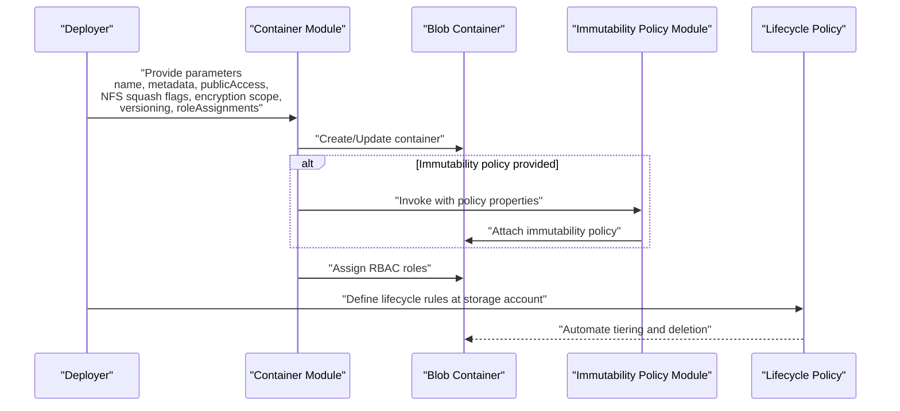
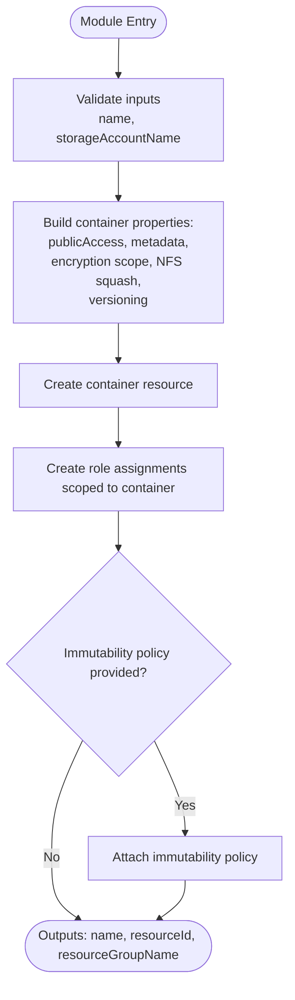
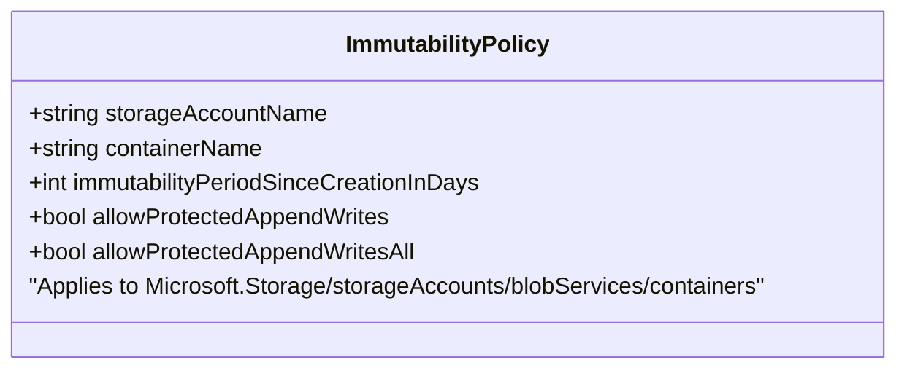
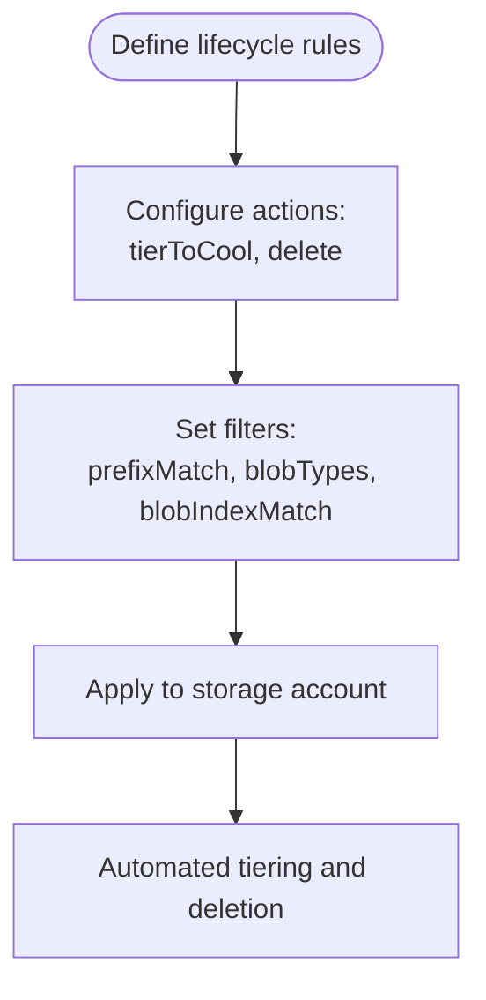
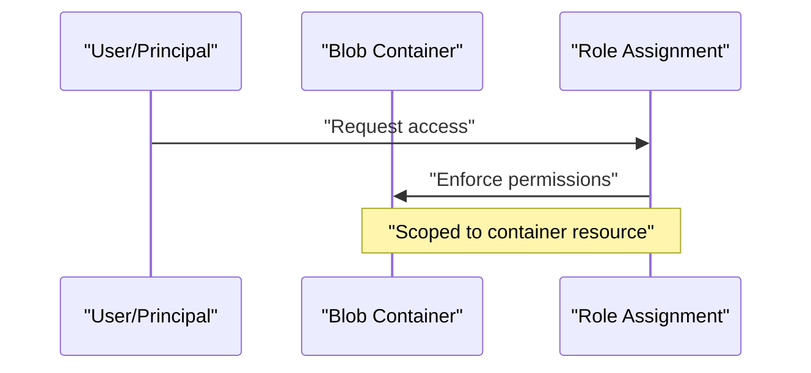
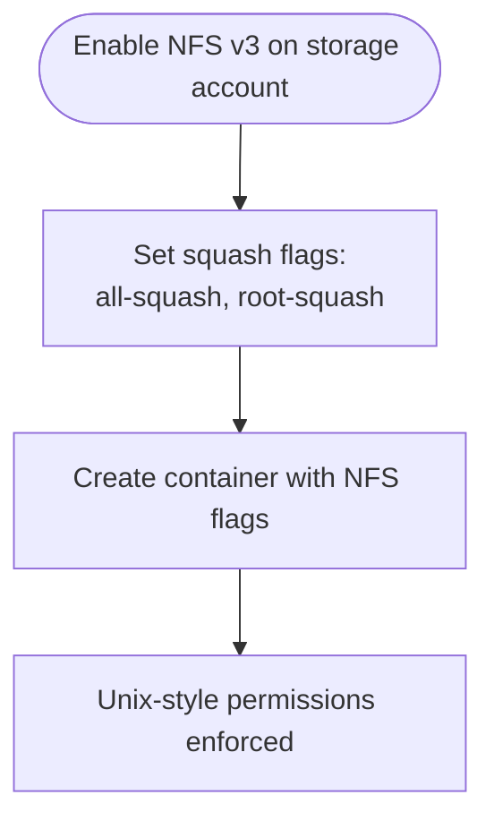
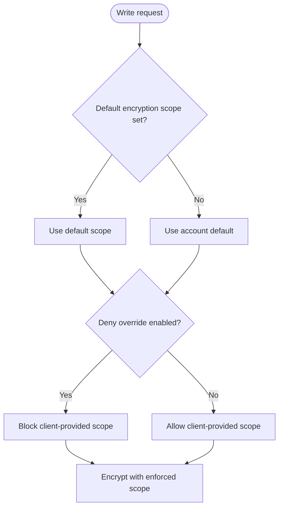
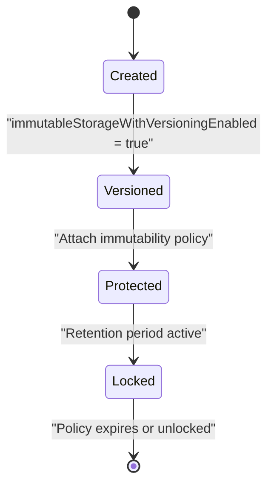
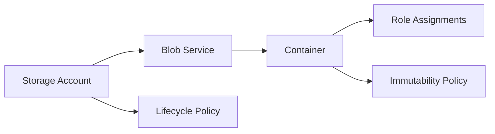

# Blob Containers Management

<cite>
**Referenced Files in This Document**
- [main.bicep](file://bicep/modules/storage-account/blob-service/container/main.bicep)
- [README.md](file://bicep/modules/storage-account/blob-service/container/README.md)
- [immutability-policy/main.bicep](file://bicep/modules/storage-account/blob-service/container/immutability-policy/main.bicep)
- [management-policy/main.bicep](file://bicep/modules/storage-account/management-policy/main.bicep)
- [max/main.test.bicep](file://bicep/modules/storage-account/tests/e2e/max/main.test.bicep)
</cite>

## Table of Contents
1. [Introduction](#introduction)
2. [Project Structure](#project-structure)
3. [Core Components](#core-components)
4. [Architecture Overview](#architecture-overview)
5. [Detailed Component Analysis](#detailed-component-analysis)
6. [Dependency Analysis](#dependency-analysis)
7. [Performance Considerations](#performance-considerations)
8. [Troubleshooting Guide](#troubleshooting-guide)
9. [Conclusion](#conclusion)
10. [Appendices](#appendices)

## Introduction
This document explains the Blob Container Bicep module that provisions Azure Blob Storage containers with advanced features. It covers container creation, access tiers (Hot, Cool, Archive), versioning and immutability, soft delete via lifecycle policies, metadata management, NFS v3 support including squash settings for Unix-style permissions, encryption scope configuration with default scopes and override policies, and examples of lifecycle management, access control patterns, and performance optimization strategies aligned to different data access patterns.

## Project Structure
The blob container capability is implemented as a reusable Bicep module under the storage account modules. The module creates a container resource, applies optional immutability policy, and assigns role-based access controls scoped to the container. A separate management policy module defines lifecycle rules at the storage account level. End-to-end tests demonstrate usage scenarios, including NFS-enabled configurations and comprehensive parameter sets.

**Diagram sources**
- [main.bicep:116-132](file://bicep/modules/storage-account/blob-service/container/main.bicep#L116-L132)
- [immutability-policy/main.bicep:21-41](file://bicep/modules/storage-account/blob-service/container/immutability-policy/main.bicep#L21-L41)
- [management-policy/main.bicep:12-25](file://bicep/modules/storage-account/management-policy/main.bicep#L12-L25)
- [max/main.test.bicep:220-255](file://bicep/modules/storage-account/tests/e2e/max/main.test.bicep#L220-L255)

**Section sources**
- [main.bicep:1-169](file://bicep/modules/storage-account/blob-service/container/main.bicep#L1-L169)
- [README.md:1-277](file://bicep/modules/storage-account/blob-service/container/README.md#L1-L277)
- [management-policy/main.bicep:1-35](file://bicep/modules/storage-account/management-policy/main.bicep#L1-L35)
- [max/main.test.bicep:1-513](file://bicep/modules/storage-account/tests/e2e/max/main.test.bicep#L1-L513)

## Core Components
- Container resource: Creates a blob container with properties such as public access, metadata, NFS v3 squash flags, immutable storage with versioning, and encryption scope settings.
- Immutability policy: Optional nested module to apply time-based retention and append-write protections to the container.
- Role assignments: Scoped RBAC assignments to principals for fine-grained access control on the container.
- Lifecycle management: Storage account-level management policy module to define automatic tiering and deletion rules.

Key capabilities exposed by parameters:
- Access tiers: Hot, Cool, Archive are managed via storage account or lifecycle policies; the container module supports metadata and access controls while lifecycle policies automate tier transitions.
- Versioning and immutability: Enable object-level immutability at container creation time and attach an immutability policy.
- Soft delete: Controlled via lifecycle policies at the storage account level.
- NFS v3 squash: Configure all-squash and root-squash for Unix-style permission mapping when NFS is enabled on the storage account.
- Encryption scope: Set a default encryption scope for writes and optionally deny overrides from clients.

**Section sources**
- [main.bicep:15-37](file://bicep/modules/storage-account/blob-service/container/main.bicep#L15-L37)
- [main.bicep:116-132](file://bicep/modules/storage-account/blob-service/container/main.bicep#L116-L132)
- [immutability-policy/main.bicep:12-19](file://bicep/modules/storage-account/blob-service/container/immutability-policy/main.bicep#L12-L19)
- [management-policy/main.bicep:9-25](file://bicep/modules/storage-account/management-policy/main.bicep#L9-L25)
- [README.md:20-48](file://bicep/modules/storage-account/blob-service/container/README.md#L20-L48)

## Architecture Overview
The module composes several Azure resources to deliver a secure, compliant, and performant blob container:
- Container resource with optional NFS v3 squash and immutability settings.
- Optional immutability policy attached to the container.
- Role assignments scoped to the container for least-privilege access.
- Storage account lifecycle policy for automated data movement and retention.

**Diagram sources**
- [main.bicep:116-159](file://bicep/modules/storage-account/blob-service/container/main.bicep#L116-L159)
- [immutability-policy/main.bicep:21-41](file://bicep/modules/storage-account/blob-service/container/immutability-policy/main.bicep#L21-L41)
- [management-policy/main.bicep:12-25](file://bicep/modules/storage-account/management-policy/main.bicep#L12-L25)

## Detailed Component Analysis

### Container Resource and Parameters
- Purpose: Provisions a blob container with security, compliance, and operational settings.
- Key parameters:
  - name: Required container name.
  - storageAccountName and blobServiceName: Parent references.
  - defaultEncryptionScope and denyEncryptionScopeOverride: Enforce encryption scope defaults and prevent client overrides.
  - enableNfsV3AllSquash and enableNfsV3RootSquash: Map Unix-style permissions for NFS v3 access.
  - immutableStorageWithVersioningEnabled: Enables object-level immutability at creation time.
  - immutabilityPolicyName and immutabilityPolicyProperties: Attach a time-based retention policy.
  - metadata: Name-value pairs for organizational tagging.
  - publicAccess: Restrict or allow anonymous access levels.
  - roleAssignments: Array of RBAC assignments scoped to the container.

**Diagram sources**
- [main.bicep:116-159](file://bicep/modules/storage-account/blob-service/container/main.bicep#L116-L159)

**Section sources**
- [main.bicep:5-49](file://bicep/modules/storage-account/blob-service/container/main.bicep#L5-L49)
- [main.bicep:116-132](file://bicep/modules/storage-account/blob-service/container/main.bicep#L116-L132)
- [README.md:20-48](file://bicep/modules/storage-account/blob-service/container/README.md#L20-L48)

### Immutability Policy Module
- Purpose: Applies time-based retention and append-write protections to the container.
- Key parameters:
  - immutabilityPeriodSinceCreationInDays: Retention duration.
  - allowProtectedAppendWrites and allowProtectedAppendWritesAll: Control append behavior under protection.

**Diagram sources**
- [immutability-policy/main.bicep:5-19](file://bicep/modules/storage-account/blob-service/container/immutability-policy/main.bicep#L5-L19)
- [immutability-policy/main.bicep:21-41](file://bicep/modules/storage-account/blob-service/container/immutability-policy/main.bicep#L21-L41)

**Section sources**
- [immutability-policy/main.bicep:1-51](file://bicep/modules/storage-account/blob-service/container/immutability-policy/main.bicep#L1-L51)

### Lifecycle Management (Management Policy)
- Purpose: Automates data lifecycle actions such as tiering and deletion based on age, access patterns, and filters.
- Key aspects:
  - Rules array passed into the module configures actions like baseBlob tierToCool and delete after days since modification/access.
  - Filters can target prefixes, blob types, or indexed tags.

**Diagram sources**
- [management-policy/main.bicep:9-25](file://bicep/modules/storage-account/management-policy/main.bicep#L9-L25)

**Section sources**
- [management-policy/main.bicep:1-35](file://bicep/modules/storage-account/management-policy/main.bicep#L1-L35)
- [max/main.test.bicep:467-500](file://bicep/modules/storage-account/tests/e2e/max/main.test.bicep#L467-L500)

### Access Control Patterns
- Role assignments are created per container with support for built-in names or explicit IDs, conditions, and principal types.
- Examples include assigning Owner, Reader, and storage-specific data roles to service principals or users.

**Diagram sources**
- [main.bicep:47-106](file://bicep/modules/storage-account/blob-service/container/main.bicep#L47-L106)
- [main.bicep:145-159](file://bicep/modules/storage-account/blob-service/container/main.bicep#L145-L159)

**Section sources**
- [main.bicep:47-106](file://bicep/modules/storage-account/blob-service/container/main.bicep#L47-L106)
- [main.bicep:145-159](file://bicep/modules/storage-account/blob-service/container/main.bicep#L145-L159)
- [README.md:151-260](file://bicep/modules/storage-account/blob-service/container/README.md#L151-L260)

### NFS v3 Support and Squash Settings
- NFS v3 squash settings map Unix-style permissions:
  - enableNfsV3AllSquash: Maps all UIDs/GIDs to a single user/group.
  - enableNfsV3RootSquash: Maps root UID/GID to anonymous user/group.
- These flags are applied at container creation and require NFS-enabled storage accounts.

**Diagram sources**
- [main.bicep:21-25](file://bicep/modules/storage-account/blob-service/container/main.bicep#L21-L25)
- [main.bicep:122-123](file://bicep/modules/storage-account/blob-service/container/main.bicep#L122-L123)

**Section sources**
- [main.bicep:21-25](file://bicep/modules/storage-account/blob-service/container/main.bicep#L21-L25)
- [main.bicep:122-123](file://bicep/modules/storage-account/blob-service/container/main.bicep#L122-L123)
- [README.md:88-102](file://bicep/modules/storage-account/blob-service/container/README.md#L88-L102)

### Encryption Scope Configuration
- Default encryption scope: Sets the encryption scope used for all writes unless overridden.
- Deny override: Prevents clients from specifying a different encryption scope at write time.

**Diagram sources**
- [main.bicep:15-19](file://bicep/modules/storage-account/blob-service/container/main.bicep#L15-L19)
- [main.bicep:120-121](file://bicep/modules/storage-account/blob-service/container/main.bicep#L120-L121)

**Section sources**
- [main.bicep:15-19](file://bicep/modules/storage-account/blob-service/container/main.bicep#L15-L19)
- [main.bicep:120-121](file://bicep/modules/storage-account/blob-service/container/main.bicep#L120-L121)
- [README.md:72-86](file://bicep/modules/storage-account/blob-service/container/README.md#L72-L86)

### Versioning and Immutability
- Versioning: Enabled at container creation via immutableStorageWithVersioningEnabled.
- Immutability policy: Time-based retention and append-write protections applied via the nested module.

**Diagram sources**
- [main.bicep:27-34](file://bicep/modules/storage-account/blob-service/container/main.bicep#L27-L34)
- [main.bicep:124-128](file://bicep/modules/storage-account/blob-service/container/main.bicep#L124-L128)
- [immutability-policy/main.bicep:12-19](file://bicep/modules/storage-account/blob-service/container/immutability-policy/main.bicep#L12-L19)

**Section sources**
- [main.bicep:27-34](file://bicep/modules/storage-account/blob-service/container/main.bicep#L27-L34)
- [immutability-policy/main.bicep:12-19](file://bicep/modules/storage-account/blob-service/container/immutability-policy/main.bicep#L12-L19)

### Metadata Management
- Metadata: Arbitrary name-value pairs attached to the container for organization and governance.

**Section sources**
- [main.bicep:36-37](file://bicep/modules/storage-account/blob-service/container/main.bicep#L36-L37)
- [main.bicep:129](file://bicep/modules/storage-account/blob-service/container/main.bicep#L129)
- [README.md:127-133](file://bicep/modules/storage-account/blob-service/container/README.md#L127-L133)

### Example Usage Patterns
- NFS-enabled container with squash flags and role assignments.
- Container with metadata and append-write restrictions.
- Comprehensive deployment demonstrating multiple services, private endpoints, diagnostics, and lifecycle rules.

**Section sources**
- [max/main.test.bicep:220-255](file://bicep/modules/storage-account/tests/e2e/max/main.test.bicep#L220-L255)
- [max/main.test.bicep:467-500](file://bicep/modules/storage-account/tests/e2e/max/main.test.bicep#L467-L500)

## Dependency Analysis
- Container module depends on:
  - Existing storage account and blob service references.
  - Optional immutability policy module.
  - Role assignment resource type for RBAC.
- Lifecycle policy module depends on existing storage account.

**Diagram sources**
- [main.bicep:108-114](file://bicep/modules/storage-account/blob-service/container/main.bicep#L108-L114)
- [main.bicep:116-159](file://bicep/modules/storage-account/blob-service/container/main.bicep#L116-L159)
- [immutability-policy/main.bicep:21-41](file://bicep/modules/storage-account/blob-service/container/immutability-policy/main.bicep#L21-L41)
- [management-policy/main.bicep:12-25](file://bicep/modules/storage-account/management-policy/main.bicep#L12-L25)

**Section sources**
- [main.bicep:108-159](file://bicep/modules/storage-account/blob-service/container/main.bicep#L108-L159)
- [immutability-policy/main.bicep:21-41](file://bicep/modules/storage-account/blob-service/container/immutability-policy/main.bicep#L21-L41)
- [management-policy/main.bicep:12-25](file://bicep/modules/storage-account/management-policy/main.bicep#L12-L25)

## Performance Considerations
- Access tiers:
  - Hot: Optimal for frequently accessed data.
  - Cool: Suitable for infrequent access with longer retention.
  - Archive: Lowest cost for long-term archival; retrieval latency higher.
- Lifecycle policies:
  - Automate tier transitions based on last access time or modification date.
  - Use filters (prefixMatch, blobTypes, blobIndexMatch) to target specific datasets.
- NFS v3:
  - Use squash settings to enforce consistent Unix-style permissions and reduce permission complexity.
- Encryption:
  - Default encryption scope reduces overhead by avoiding per-write scope negotiation.
  - Deny override ensures consistent encryption posture.
- Diagnostics and monitoring:
  - Enable metrics and logs to track access patterns and optimize lifecycle rules.

[No sources needed since this section provides general guidance]

## Troubleshooting Guide
- Common issues:
  - NFS v3 not available: Ensure storage account kind and SKU support NFS and that NFS is enabled before setting squash flags.
  - Immutability policy conflicts: Verify policy unlock state and mutually exclusive append-write flags.
  - Lifecycle rule errors: Validate rule syntax, filters, and action combinations.
  - RBAC failures: Confirm principalId, roleDefinitionIdOrName, and condition versions.
- Validation steps:
  - Review module outputs for resource IDs and names.
  - Inspect role assignments and policy attachments in the portal or CLI.
  - Check diagnostics and logs for errors during deployments.

**Section sources**
- [README.md:262-268](file://bicep/modules/storage-account/blob-service/container/README.md#L262-L268)
- [main.bicep:161-169](file://bicep/modules/storage-account/blob-service/container/main.bicep#L161-L169)

## Conclusion
The Blob Container Bicep module provides a robust foundation for managing Azure Blob Storage containers with strong security, compliance, and automation capabilities. By combining encryption scopes, immutability policies, lifecycle management, and NFS v3 squash settings, teams can tailor storage behavior to diverse data access patterns while maintaining least-privilege access and operational efficiency.

[No sources needed since this section summarizes without analyzing specific files]

## Appendices

### Parameter Quick Reference
- Container parameters: name, storageAccountName, blobServiceName, defaultEncryptionScope, denyEncryptionScopeOverride, enableNfsV3AllSquash, enableNfsV3RootSquash, immutableStorageWithVersioningEnabled, immutabilityPolicyName, immutabilityPolicyProperties, metadata, publicAccess, roleAssignments.
- Lifecycle rules: rules array with actions and filters.

**Section sources**
- [README.md:20-48](file://bicep/modules/storage-account/blob-service/container/README.md#L20-L48)
- [management-policy/main.bicep:9-25](file://bicep/modules/storage-account/management-policy/main.bicep#L9-L25)