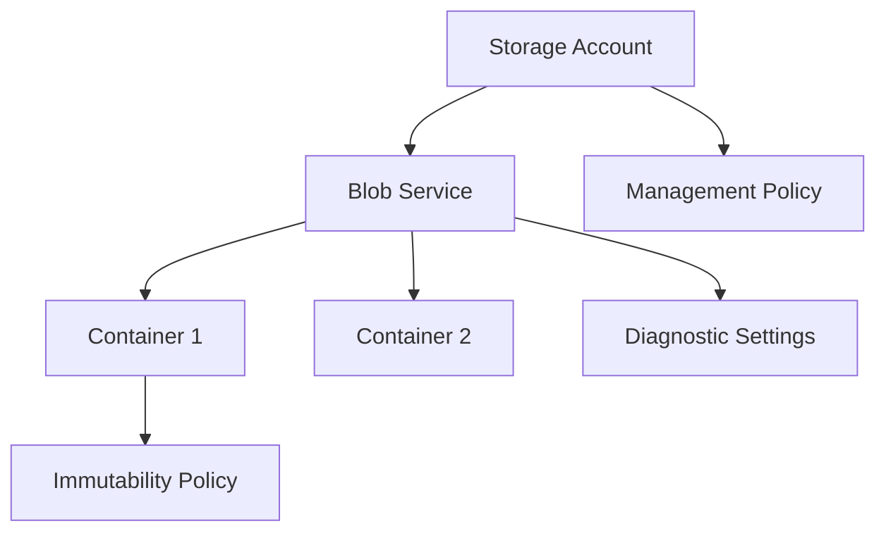
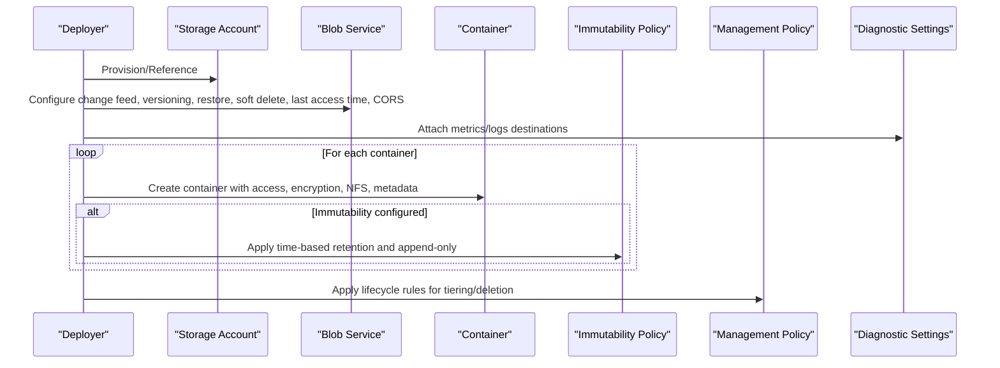
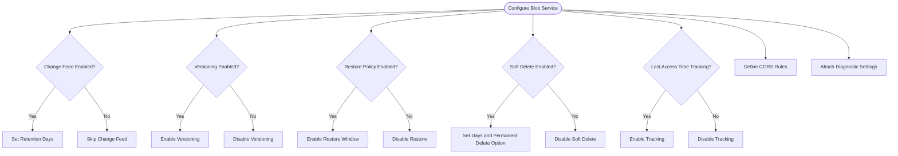
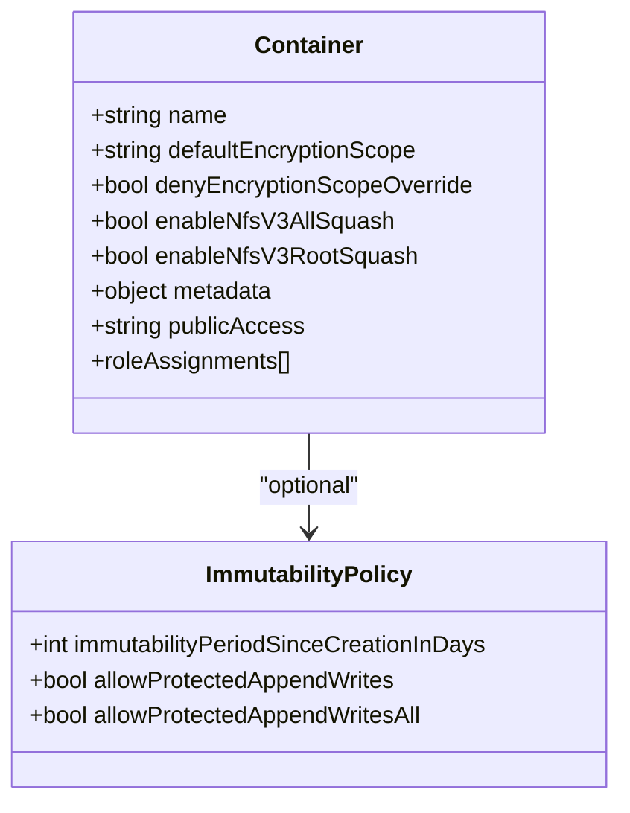
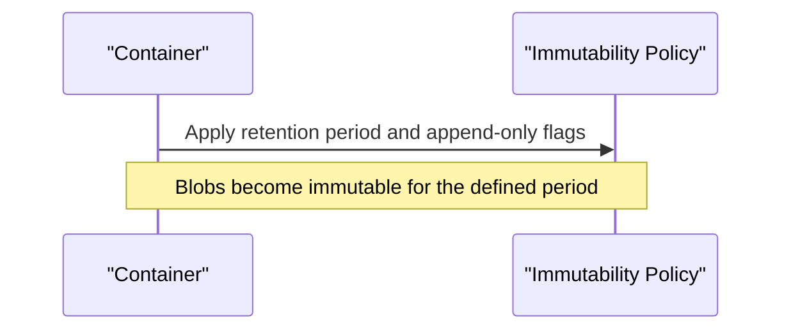
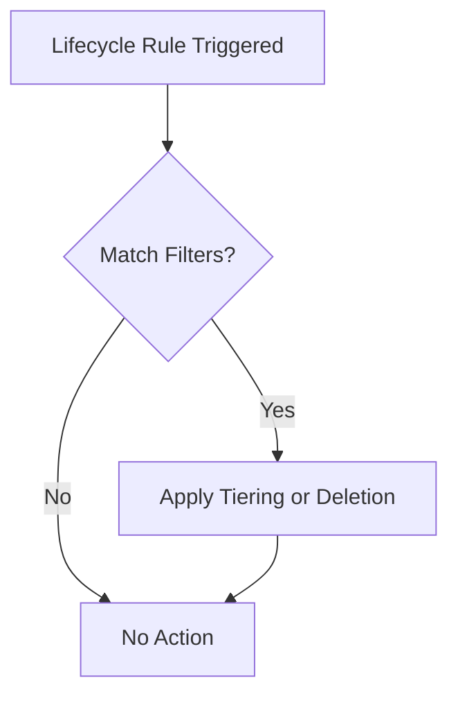
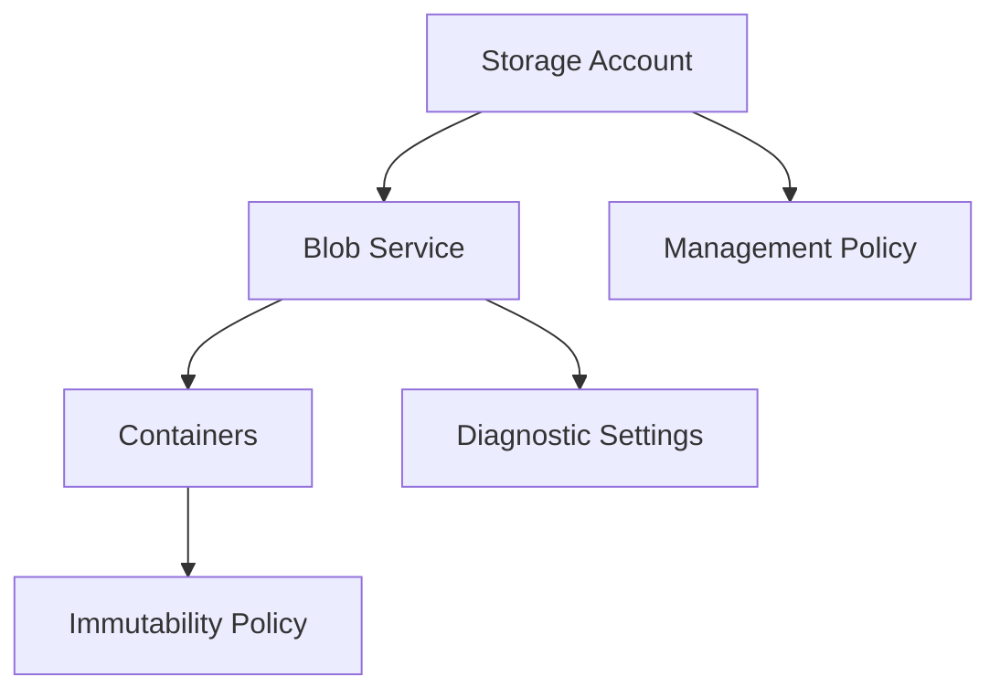

# Blob Service Module

<cite>
**Referenced Files in This Document**
- [blob-service/main.bicep](file://bicep/modules/storage-account/blob-service/main.bicep)
- [container/main.bicep](file://bicep/modules/storage-account/blob-service/container/main.bicep)
- [immutability-policy/main.bicep](file://bicep/modules/storage-account/blob-service/container/immutability-policy/main.bicep)
- [management-policy/main.bicep](file://bicep/modules/storage-account/management-policy/main.bicep)
- [storage-account README.md](file://bicep/modules/storage-account/README.md)
- [container README.md](file://bicep/modules/storage-account/blob-service/container/README.md)
- [immutability-policy README.md](file://bicep/modules/storage-account/blob-service/container/immutability-policy/README.md)
- [test blob main.test.bicep](file://bicep/modules/storage-account/tests/e2e/blob/main.test.bicep)
- [test changefeed main.test.bicep](file://bicep/modules/storage-account/tests/e2e/changefeed/main.test.bicep)
</cite>

## Table of Contents
1. [Introduction](#introduction)
2. [Project Structure](#project-structure)
3. [Core Components](#core-components)
4. [Architecture Overview](#architecture-overview)
5. [Detailed Component Analysis](#detailed-component-analysis)
6. [Dependency Analysis](#dependency-analysis)
7. [Performance Considerations](#performance-considerations)
8. [Troubleshooting Guide](#troubleshooting-guide)
9. [Conclusion](#conclusion)
10. [Appendices](#appendices)

## Introduction
This document provides comprehensive documentation for the Blob Service Bicep module that configures Azure Blob Storage with containers, retention policies, and immutability settings. It explains how to create containers with access controls, versioning, change feed, and snapshot policies; configure immutability policies for compliance (time-based retention and append-only behavior); set CORS rules; enable diagnostics; and tune performance-related parameters. It also includes practical examples for common scenarios such as data lake setup, backup strategies, and secure container access patterns.

## Project Structure
The Blob Service module is organized into focused submodules:
- Blob service configuration: enables change feed, versioning, restore policy, soft delete, last access time tracking, and diagnostic settings.
- Container creation: creates containers with encryption scope, NFS options, public access, metadata, role assignments, and optional immutability policy.
- Immutability policy: defines time-based retention and append-only behavior for compliance.
- Management policy: applies lifecycle rules for tiering and deletion.



**Diagram sources**
- [blob-service/main.bicep:71-117](file://bicep/modules/storage-account/blob-service/main.bicep#L71-L117)
- [container/main.bicep:108-132](file://bicep/modules/storage-account/blob-service/container/main.bicep#L108-L132)
- [immutability-policy/main.bicep:21-41](file://bicep/modules/storage-account/blob-service/container/immutability-policy/main.bicep#L21-L41)
- [management-policy/main.bicep:12-25](file://bicep/modules/storage-account/management-policy/main.bicep#L12-L25)

**Section sources**
- [blob-service/main.bicep:1-176](file://bicep/modules/storage-account/blob-service/main.bicep#L1-L176)
- [container/main.bicep:1-169](file://bicep/modules/storage-account/blob-service/container/main.bicep#L1-L169)
- [immutability-policy/main.bicep:1-51](file://bicep/modules/storage-account/blob-service/container/immutability-policy/main.bicep#L1-L51)
- [management-policy/main.bicep:1-35](file://bicep/modules/storage-account/management-policy/main.bicep#L1-L35)

## Core Components
- Blob service resource: Configures change feed, versioning, restore policy, soft delete (blobs and containers), last access time tracking, default service version, and CORS rules. Also provisions diagnostic settings for metrics and logs.
- Container resource: Creates containers with encryption scope, NFSv3 squash options, public access level, metadata, and role assignments. Optionally attaches an immutability policy.
- Immutability policy resource: Defines time-based retention and append-only behavior for compliance.
- Management policy resource: Applies lifecycle rules for automatic tiering and deletion based on age or access patterns.

Key capabilities exposed by parameters:
- Change feed: enable and retain events for a configurable number of days.
- Versioning: maintain previous versions of blobs.
- Restore policy: point-in-time restore window when enabled.
- Soft delete: retain deleted blobs and containers for a specified period; optionally allow permanent deletion.
- Last access time tracking: enable access-time-based tiering via management policies.
- Diagnostics: stream metrics and logs to Log Analytics or Event Hubs.
- Containers: define multiple containers with distinct access and security settings.
- Immutability: enforce retention and append-only writes for compliance.
- Lifecycle: automate cost optimization through tiering and cleanup.

**Section sources**
- [blob-service/main.bicep:5-66](file://bicep/modules/storage-account/blob-service/main.bicep#L5-L66)
- [blob-service/main.bicep:71-146](file://bicep/modules/storage-account/blob-service/main.bicep#L71-L146)
- [container/main.bicep:5-49](file://bicep/modules/storage-account/blob-service/container/main.bicep#L5-L49)
- [immutability-policy/main.bicep:5-19](file://bicep/modules/storage-account/blob-service/container/immutability-policy/main.bicep#L5-L19)
- [management-policy/main.bicep:5-10](file://bicep/modules/storage-account/management-policy/main.bicep#L5-L10)

## Architecture Overview
The module composes resources around a single storage account’s blob service. Containers are created under the blob service, each optionally protected by an immutability policy. Diagnostic settings are attached at the blob service level, while lifecycle rules apply at the storage account level.



**Diagram sources**
- [blob-service/main.bicep:71-146](file://bicep/modules/storage-account/blob-service/main.bicep#L71-L146)
- [container/main.bicep:108-143](file://bicep/modules/storage-account/blob-service/container/main.bicep#L108-L143)
- [immutability-policy/main.bicep:21-41](file://bicep/modules/storage-account/blob-service/container/immutability-policy/main.bicep#L21-L41)
- [management-policy/main.bicep:12-25](file://bicep/modules/storage-account/management-policy/main.bicep#L12-L25)

## Detailed Component Analysis

### Blob Service Configuration
- Change feed: Enable event logging and set retention in days. When enabled without explicit retention, it retains indefinitely.
- Versioning: Maintain previous versions of blobs for rollback and audit.
- Restore policy: Enable point-in-time restore with a defined window; requires versioning, change feed, and blob soft delete.
- Soft delete: Retain deleted blobs and containers for a defined period; optionally allow permanent deletion of soft-deleted items.
- Last access time tracking: Enable per-blob last access time tracking to support access-time-based tiering.
- Default service version: Set API version for requests not specifying one.
- CORS: Define up to five rules to control cross-origin access.
- Diagnostics: Stream metrics and logs to Log Analytics or Event Hubs.



**Diagram sources**
- [blob-service/main.bicep:71-117](file://bicep/modules/storage-account/blob-service/main.bicep#L71-L117)
- [blob-service/main.bicep:119-146](file://bicep/modules/storage-account/blob-service/main.bicep#L119-L146)

**Section sources**
- [blob-service/main.bicep:5-66](file://bicep/modules/storage-account/blob-service/main.bicep#L5-L66)
- [blob-service/main.bicep:71-146](file://bicep/modules/storage-account/blob-service/main.bicep#L71-L146)

### Container Creation and Security
- Encryption scope: Set a default encryption scope and optionally deny overrides.
- NFSv3: Enable all-squash and root-squash for NFSv3 access patterns.
- Public access: Control visibility from None to Blob or Container.
- Metadata: Tag containers with key-value pairs.
- Role assignments: Assign built-in or custom roles scoped to the container.
- Immutable storage with versioning: Enable object-level immutability at container creation time.



**Diagram sources**
- [container/main.bicep:116-132](file://bicep/modules/storage-account/blob-service/container/main.bicep#L116-L132)
- [immutability-policy/main.bicep:33-41](file://bicep/modules/storage-account/blob-service/container/immutability-policy/main.bicep#L33-L41)

**Section sources**
- [container/main.bicep:5-49](file://bicep/modules/storage-account/blob-service/container/main.bicep#L5-L49)
- [container/main.bicep:108-159](file://bicep/modules/storage-account/blob-service/container/main.bicep#L108-L159)
- [container README.md:20-48](file://bicep/modules/storage-account/blob-service/container/README.md#L20-L48)

### Immutability Policy for Compliance
- Time-based retention: Enforce a minimum retention period since policy creation.
- Append-only behavior: Allow protected append writes to append or block blobs while maintaining immutability.
- Policy application: Attached to a specific container under the blob service.



**Diagram sources**
- [immutability-policy/main.bicep:21-41](file://bicep/modules/storage-account/blob-service/container/immutability-policy/main.bicep#L21-L41)

**Section sources**
- [immutability-policy/main.bicep:5-19](file://bicep/modules/storage-account/blob-service/container/immutability-policy/main.bicep#L5-L19)
- [immutability-policy/main.bicep:21-41](file://bicep/modules/storage-account/blob-service/container/immutability-policy/main.bicep#L21-L41)
- [immutability-policy README.md:17-33](file://bicep/modules/storage-account/blob-service/container/immutability-policy/README.md#L17-L33)

### Management Policy (Lifecycle)
- Lifecycle rules: Automate tiering (Hot/Cool/Archive) and deletion based on modification date, last access time, or filters.
- Integration: Works effectively with last access time tracking to optimize costs.



**Diagram sources**
- [management-policy/main.bicep:12-25](file://bicep/modules/storage-account/management-policy/main.bicep#L12-L25)

**Section sources**
- [management-policy/main.bicep:5-10](file://bicep/modules/storage-account/management-policy/main.bicep#L5-L10)
- [management-policy/main.bicep:12-25](file://bicep/modules/storage-account/management-policy/main.bicep#L12-L25)

### CORS Rules and Diagnostics
- CORS: Define allowed origins, methods, headers, and exposure headers to control cross-origin requests.
- Diagnostics: Route metrics and logs to Log Analytics workspaces or Event Hubs for monitoring and alerting.

```mermaid
graph LR
Client["External Clients"] --> |HTTP(S)| Blob["Blob Service"]
Blob --> Diag["Diagnostic Settings"]
Diag --> LA["Log Analytics / Event Hubs"]
```

**Diagram sources**
- [blob-service/main.bicep:93-95](file://bicep/modules/storage-account/blob-service/main.bicep#L93-L95)
- [blob-service/main.bicep:119-146](file://bicep/modules/storage-account/blob-service/main.bicep#L119-L146)

**Section sources**
- [blob-service/main.bicep:31-35](file://bicep/modules/storage-account/blob-service/main.bicep#L31-L35)
- [blob-service/main.bicep:93-95](file://bicep/modules/storage-account/blob-service/main.bicep#L93-L95)
- [blob-service/main.bicep:119-146](file://bicep/modules/storage-account/blob-service/main.bicep#L119-L146)

## Dependency Analysis
- The blob service module depends on an existing storage account and references types for diagnostic settings.
- The container module depends on the storage account and blob service and conditionally deploys an immutability policy.
- The immutability policy module depends on the storage account, blob service, and target container.
- The management policy module depends on the storage account.



**Diagram sources**
- [blob-service/main.bicep:71-117](file://bicep/modules/storage-account/blob-service/main.bicep#L71-L117)
- [container/main.bicep:108-143](file://bicep/modules/storage-account/blob-service/container/main.bicep#L108-L143)
- [immutability-policy/main.bicep:21-41](file://bicep/modules/storage-account/blob-service/container/immutability-policy/main.bicep#L21-L41)
- [management-policy/main.bicep:12-25](file://bicep/modules/storage-account/management-policy/main.bicep#L12-L25)

**Section sources**
- [blob-service/main.bicep:64-66](file://bicep/modules/storage-account/blob-service/main.bicep#L64-L66)
- [container/main.bicep:108-143](file://bicep/modules/storage-account/blob-service/container/main.bicep#L108-L143)
- [immutability-policy/main.bicep:21-41](file://bicep/modules/storage-account/blob-service/container/immutability-policy/main.bicep#L21-L41)
- [management-policy/main.bicep:12-25](file://bicep/modules/storage-account/management-policy/main.bicep#L12-L25)

## Performance Considerations
- Enable last access time tracking to leverage access-time-based tiering in lifecycle rules for cost optimization.
- Use versioning judiciously; it increases storage usage and may affect performance if many versions accumulate.
- Configure appropriate change feed retention to balance operational needs and storage costs.
- Tune soft delete retention periods to manage recovery windows versus storage consumption.
- Use management policies to automatically move infrequently accessed data to cooler tiers.
- Restrict public access and use role assignments to minimize unnecessary network exposure and improve security posture.

[No sources needed since this section provides general guidance]

## Troubleshooting Guide
- Change feed not emitting events: Ensure change feed is enabled and required dependencies (versioning, restore policy, soft delete) are configured as needed.
- Point-in-time restore fails: Verify versioning, change feed, and blob soft delete are enabled before enabling restore policy.
- CORS errors: Confirm CORS rules include the correct origin, methods, headers, and exposure headers.
- Diagnostics not flowing: Validate diagnostic settings targets (workspace or event hub) and permissions.
- Immutability policy conflicts: Ensure append-only flags are set correctly and understand that some properties cannot be changed after policy lock.
- Lifecycle rules not applied: Check filters and ensure last access time tracking is enabled if using access-time conditions.

**Section sources**
- [blob-service/main.bicep:48-60](file://bicep/modules/storage-account/blob-service/main.bicep#L48-L60)
- [blob-service/main.bicep:93-95](file://bicep/modules/storage-account/blob-service/main.bicep#L93-L95)
- [blob-service/main.bicep:119-146](file://bicep/modules/storage-account/blob-service/main.bicep#L119-L146)
- [immutability-policy/main.bicep:12-19](file://bicep/modules/storage-account/blob-service/container/immutability-policy/main.bicep#L12-L19)
- [management-policy/main.bicep:12-25](file://bicep/modules/storage-account/management-policy/main.bicep#L12-L25)

## Conclusion
The Blob Service module provides a robust foundation for configuring Azure Blob Storage with strong compliance and observability features. By combining change feed, versioning, restore policies, soft delete, immutability policies, and lifecycle rules, you can build secure, compliant, and cost-efficient storage architectures. Use the provided modules to create containers with fine-grained access controls, attach diagnostics for monitoring, and automate data lifecycle management.

[No sources needed since this section summarizes without analyzing specific files]

## Appendices

### Common Scenarios and Examples

- Data Lake Setup
  - Enable hierarchical namespace at the storage account level and configure containers with appropriate access controls and lifecycle rules.
  - Reference example demonstrating Blob Storage kind deployment and large parameter sets including hierarchical namespace and file services.

  **Section sources**
  - [storage-account README.md:46-56](file://bicep/modules/storage-account/README.md#L46-L56)
  - [storage-account README.md:456-653](file://bicep/modules/storage-account/README.md#L456-L653)

- Backup Strategies
  - Enable versioning and soft delete for blobs and containers to support recovery.
  - Configure restore policy with an appropriate retention window.
  - Use lifecycle rules to archive older versions and reduce costs.

  **Section sources**
  - [blob-service/main.bicep:48-60](file://bicep/modules/storage-account/blob-service/main.bicep#L48-L60)
  - [management-policy/main.bicep:12-25](file://bicep/modules/storage-account/management-policy/main.bicep#L12-L25)

- Secure Container Access Patterns
  - Set public access to None and assign least-privilege roles via role assignments scoped to containers.
  - Use default encryption scopes and deny overrides to enforce consistent encryption.
  - Restrict network access at the storage account level and use private endpoints where applicable.

  **Section sources**
  - [container/main.bicep:15-49](file://bicep/modules/storage-account/blob-service/container/main.bicep#L15-L49)
  - [container/main.bicep:145-159](file://bicep/modules/storage-account/blob-service/container/main.bicep#L145-L159)

- Change Feed Usage
  - Enable change feed to capture data changes for downstream processing.
  - Set retention to align with consumer processing requirements.

  **Section sources**
  - [blob-service/main.bicep:12-18](file://bicep/modules/storage-account/blob-service/main.bicep#L12-L18)
  - [test changefeed main.test.bicep:43-50](file://bicep/modules/storage-account/tests/e2e/changefeed/main.test.bicep#L43-L50)

- Snapshot Policies
  - Automatic snapshots can be enabled at the blob service level to protect against accidental deletions or corruption.

  **Section sources**
  - [blob-service/main.bicep:9-10](file://bicep/modules/storage-account/blob-service/main.bicep#L9-L10)

- Test References
  - Example deployments demonstrate Blob Storage kind and minimal change feed configuration.

  **Section sources**
  - [test blob main.test.bicep:38-50](file://bicep/modules/storage-account/tests/e2e/blob/main.test.bicep#L38-L50)
  - [test changefeed main.test.bicep:38-53](file://bicep/modules/storage-account/tests/e2e/changefeed/main.test.bicep#L38-L53)