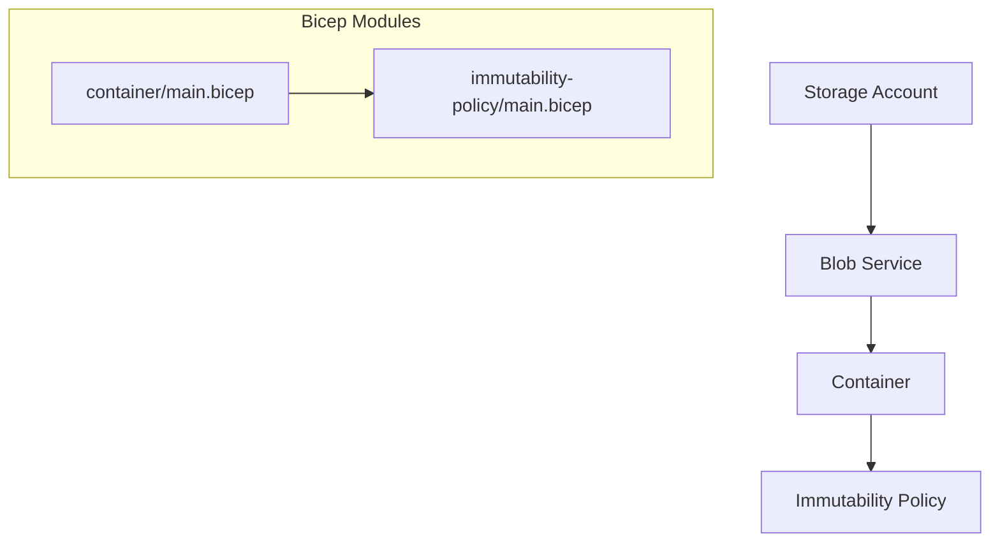
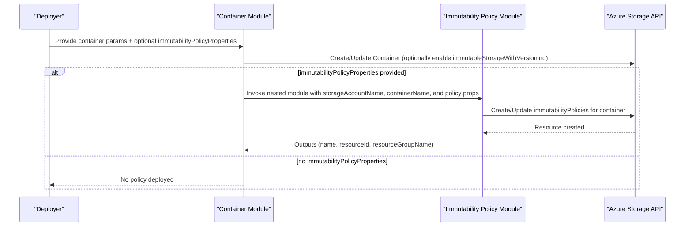
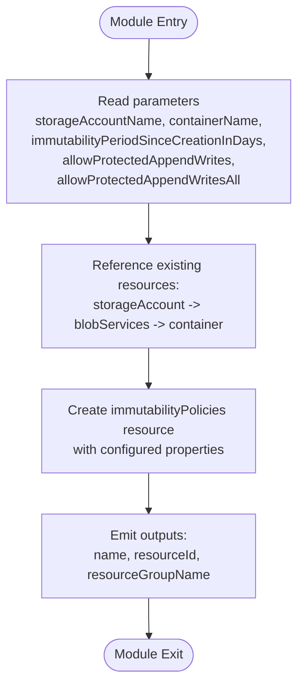
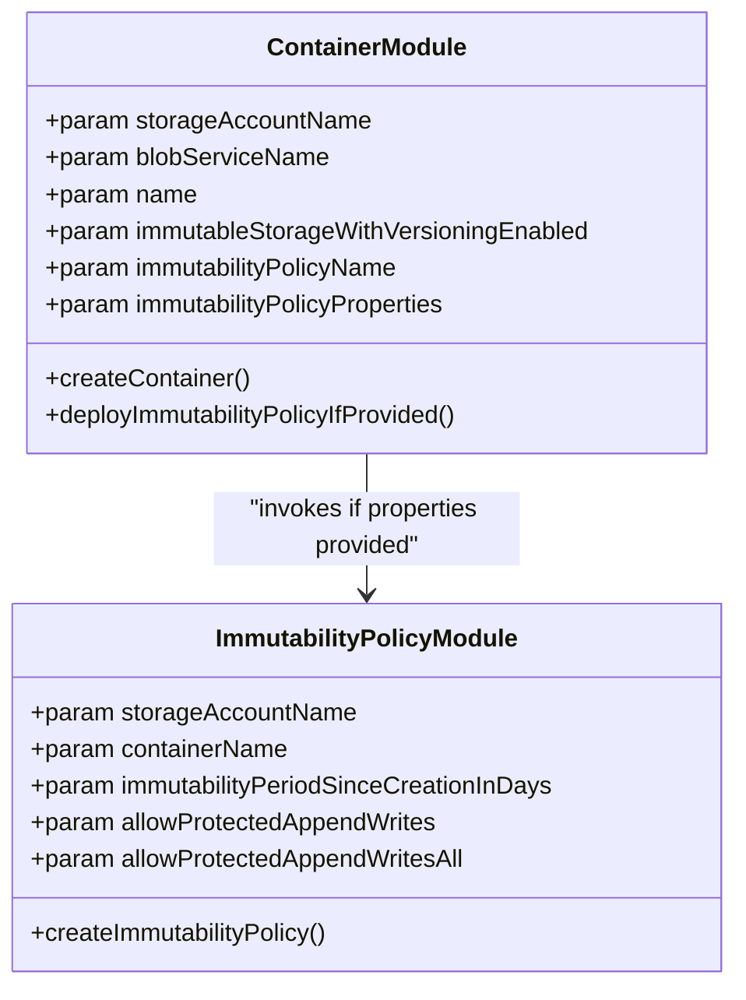
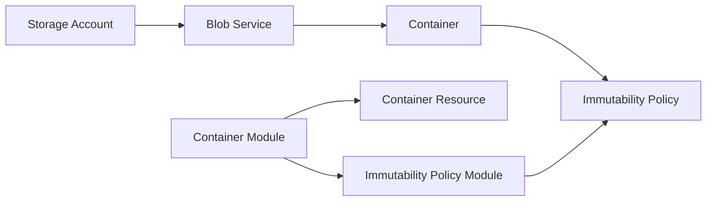

# Immutability Policy Configuration

<cite>
**Referenced Files in This Document**
- [main.bicep](file://bicep/modules/storage-account/blob-service/container/immutability-policy/main.bicep)
- [README.md](file://bicep/modules/storage-account/blob-service/container/immutability-policy/README.md)
- [main.json](file://bicep/modules/storage-account/blob-service/container/immutability-policy/main.json)
- [container main.bicep](file://bicep/modules/storage-account/blob-service/container/main.bicep)
- [container README.md](file://bicep/modules/storage-account/blob-service/container/README.md)
- [blob service README.md](file://bicep/modules/storage-account/blob-service/README.md)
</cite>

## Table of Contents
1. [Introduction](#introduction)
2. [Project Structure](#project-structure)
3. [Core Components](#core-components)
4. [Architecture Overview](#architecture-overview)
5. [Detailed Component Analysis](#detailed-component-analysis)
6. [Dependency Analysis](#dependency-analysis)
7. [Performance Considerations](#performance-considerations)
8. [Troubleshooting Guide](#troubleshooting-guide)
9. [Conclusion](#conclusion)
10. [Appendices](#appendices)

## Introduction
This document explains the Blob Immutability Policy Bicep module that enforces compliance-focused retention for Azure Blob Storage containers. It covers time-based retention configuration, append-only write controls, and how immutability policies integrate with container-level immutable storage and versioning to support regulatory scenarios. It also outlines policy states and their implications, relationships with blob versioning, and provides guidance for compliance workflows, enforcement strategies, and audit trail maintenance.

## Project Structure
The immutability policy is implemented as a reusable Bicep module under the storage account blob service container hierarchy. The module creates an immutability policy resource scoped to a specific container and exposes outputs for downstream use. A parent container module can optionally configure and deploy this policy via a nested module call.

**Diagram sources**
- [container main.bicep:116-143](file://bicep/modules/storage-account/blob-service/container/main.bicep#L116-L143)
- [main.bicep:21-41](file://bicep/modules/storage-account/blob-service/container/immutability-policy/main.bicep#L21-L41)

**Section sources**
- [container main.bicep:116-143](file://bicep/modules/storage-account/blob-service/container/main.bicep#L116-L143)
- [main.bicep:21-41](file://bicep/modules/storage-account/blob-service/container/immutability-policy/main.bicep#L21-L41)

## Core Components
- Immutability Policy Module
  - Deploys Microsoft.Storage/storageAccounts/blobServices/containers/immutabilityPolicies
  - Configures time-based retention period and append-only write behavior
  - Outputs policy name, resource ID, and resource group
- Container Module Integration
  - Optionally enables container-level immutable storage with versioning
  - Conditionally deploys the immutability policy module based on provided properties

Key capabilities exposed by the module:
- Time-based retention period since creation (in days)
- Protected append writes for append blobs or both append and block blobs
- Conditional deployment of the policy when immutability policy properties are supplied

**Section sources**
- [README.md:17-70](file://bicep/modules/storage-account/blob-service/container/immutability-policy/README.md#L17-L70)
- [main.bicep:12-41](file://bicep/modules/storage-account/blob-service/container/immutability-policy/main.bicep#L12-L41)
- [container README.md:104-125](file://bicep/modules/storage-account/blob-service/container/README.md#L104-L125)
- [container main.bicep:27-34](file://bicep/modules/storage-account/blob-service/container/main.bicep#L27-L34)

## Architecture Overview
The architecture centers on a container-scoped immutability policy that enforces retention and write protections. The container module can enable object-level immutability with versioning and then attach an immutability policy to enforce time-based retention.

**Diagram sources**
- [container main.bicep:116-143](file://bicep/modules/storage-account/blob-service/container/main.bicep#L116-L143)
- [main.bicep:21-41](file://bicep/modules/storage-account/blob-service/container/immutability-policy/main.bicep#L21-L41)

## Detailed Component Analysis

### Immutability Policy Module
- Purpose: Create a container-scoped immutability policy with configurable retention and protected append writes.
- Parameters:
  - storageAccountName (conditional)
  - containerName (conditional)
  - immutabilityPeriodSinceCreationInDays (default 365)
  - allowProtectedAppendWrites (default true)
  - allowProtectedAppendWritesAll (default true; mutually exclusive with allowProtectedAppendWrites)
- Behavior:
  - References existing storage account, blob service, and container
  - Creates an immutability policy named default
  - Exposes outputs for name, resourceId, and resourceGroupName

**Diagram sources**
- [main.bicep:12-41](file://bicep/modules/storage-account/blob-service/container/immutability-policy/main.bicep#L12-L41)

**Section sources**
- [main.bicep:12-41](file://bicep/modules/storage-account/blob-service/container/immutability-policy/main.bicep#L12-L41)
- [README.md:17-70](file://bicep/modules/storage-account/blob-service/container/immutability-policy/README.md#L17-L70)
- [main.json:14-83](file://bicep/modules/storage-account/blob-service/container/immutability-policy/main.json#L14-L83)

### Container Module Integration
- Optional container-level immutable storage with versioning:
  - When enabled at container creation, it supports object-level immutability and versioning for compliance.
- Conditional immutability policy deployment:
  - If immutabilityPolicyProperties is provided, the container module invokes the immutability policy module with the specified settings.

**Diagram sources**
- [container main.bicep:27-34](file://bicep/modules/storage-account/blob-service/container/main.bicep#L27-L34)
- [container main.bicep:116-143](file://bicep/modules/storage-account/blob-service/container/main.bicep#L116-L143)
- [main.bicep:12-41](file://bicep/modules/storage-account/blob-service/container/immutability-policy/main.bicep#L12-L41)

**Section sources**
- [container main.bicep:27-34](file://bicep/modules/storage-account/blob-service/container/main.bicep#L27-L34)
- [container main.bicep:116-143](file://bicep/modules/storage-account/blob-service/container/main.bicep#L116-L143)
- [container README.md:104-125](file://bicep/modules/storage-account/blob-service/container/README.md#L104-L125)

### Relationship with Blob Versioning
- Container-level immutable storage with versioning can be enabled at container creation time.
- Enabling this feature supports object-level immutability and maintains previous versions of blobs, which complements immutability policies for regulatory retention and recovery scenarios.
- The blob service module exposes versioning controls that can be combined with container immutability and policies for comprehensive data governance.

**Section sources**
- [container main.bicep:27-28](file://bicep/modules/storage-account/blob-service/container/main.bicep#L27-L28)
- [container main.bicep:124-128](file://bicep/modules/storage-account/blob-service/container/main.bicep#L124-L128)
- [blob service README.md:298-304](file://bicep/modules/storage-account/blob-service/README.md#L298-L304)

## Dependency Analysis
- The immutability policy module depends on existing storage account, blob service, and container resources.
- The container module conditionally depends on the immutability policy module only when immutability policy properties are supplied.
- Both modules rely on Azure Storage API resource types for containers and immutability policies.

**Diagram sources**
- [container main.bicep:116-143](file://bicep/modules/storage-account/blob-service/container/main.bicep#L116-L143)
- [main.bicep:21-41](file://bicep/modules/storage-account/blob-service/container/immutability-policy/main.bicep#L21-L41)

**Section sources**
- [container main.bicep:116-143](file://bicep/modules/storage-account/blob-service/container/main.bicep#L116-L143)
- [main.bicep:21-41](file://bicep/modules/storage-account/blob-service/container/immutability-policy/main.bicep#L21-L41)

## Performance Considerations
- Time-based retention periods should align with data volume and access patterns to avoid excessive storage costs.
- Protected append writes may impact ingestion throughput; evaluate workload requirements before enabling.
- Enabling immutable storage with versioning increases storage usage due to retained versions; plan capacity accordingly.

[No sources needed since this section provides general guidance]

## Troubleshooting Guide
- Parameter validation:
  - Ensure storageAccountName and containerName are provided when deploying the immutability policy module standalone.
  - Verify immutabilityPeriodSinceCreationInDays is set appropriately for your compliance requirements.
- Append-only write conflicts:
  - allowProtectedAppendWrites and allowProtectedAppendWritesAll are mutually exclusive; choose one based on whether you need append-only for append blobs only or both append and block blobs.
- Immutable property constraints:
  - Container-level immutable storage with versioning is immutable at creation time; existing containers require migration to enable this feature.
- Deployment dependencies:
  - The immutability policy module references existing resources; ensure they exist prior to deployment.

**Section sources**
- [README.md:17-70](file://bicep/modules/storage-account/blob-service/container/immutability-policy/README.md#L17-L70)
- [container README.md:104-125](file://bicep/modules/storage-account/blob-service/container/README.md#L104-L125)
- [container main.bicep:27-34](file://bicep/modules/storage-account/blob-service/container/main.bicep#L27-L34)

## Conclusion
The Blob Immutability Policy Bicep module provides a focused, composable way to enforce time-based retention and protected append writes for Azure Blob Storage containers. Integrated with container-level immutable storage and versioning, it supports robust data governance for regulated industries. By configuring retention periods and append-only behaviors, organizations can maintain compliant, auditable data stores while balancing performance and cost considerations.

[No sources needed since this section summarizes without analyzing specific files]

## Appendices

### Compliance Workflows and Enforcement Strategies
- Define retention periods aligned with regulatory requirements using immutabilityPeriodSinceCreationInDays.
- Enable protected append writes to prevent modification or deletion of existing blocks during the retention window.
- Combine immutable storage with versioning to preserve historical versions for audit and recovery.
- Use role assignments on containers to restrict who can modify policies or manage data access.

[No sources needed since this section provides general guidance]

### Audit Trail Maintenance
- Leverage diagnostic settings on the blob service to collect logs and metrics for auditing purposes.
- Retain change feed events where applicable to track data mutations over time.
- Integrate with centralized logging and monitoring solutions to maintain a complete audit trail.

**Section sources**
- [blob service README.md:152-171](file://bicep/modules/storage-account/blob-service/README.md#L152-L171)
- [blob service README.md:67-81](file://bicep/modules/storage-account/blob-service/README.md#L67-L81)