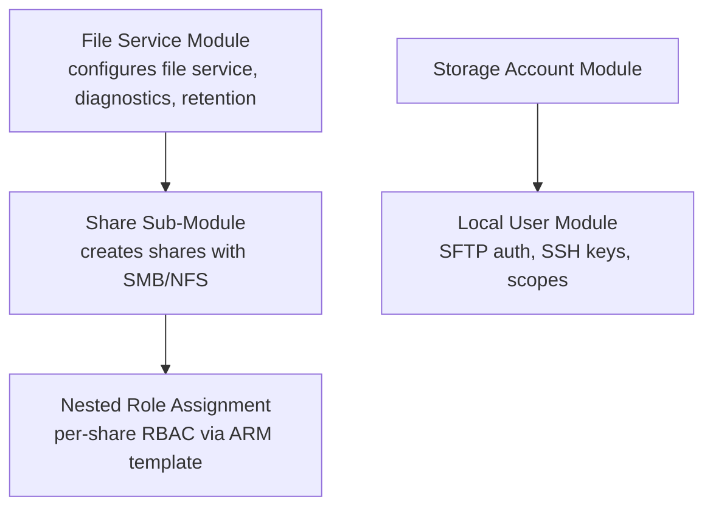
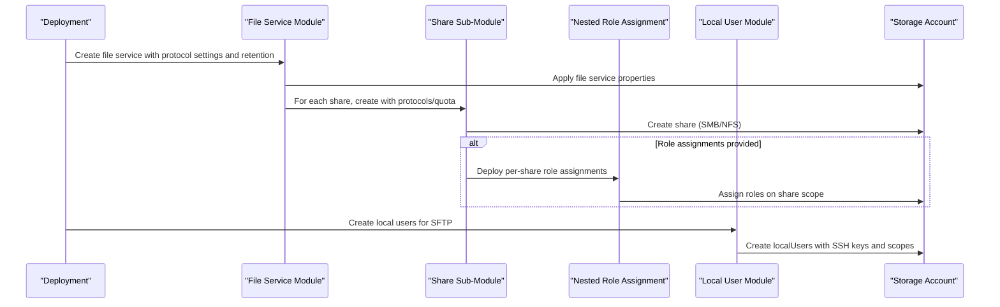
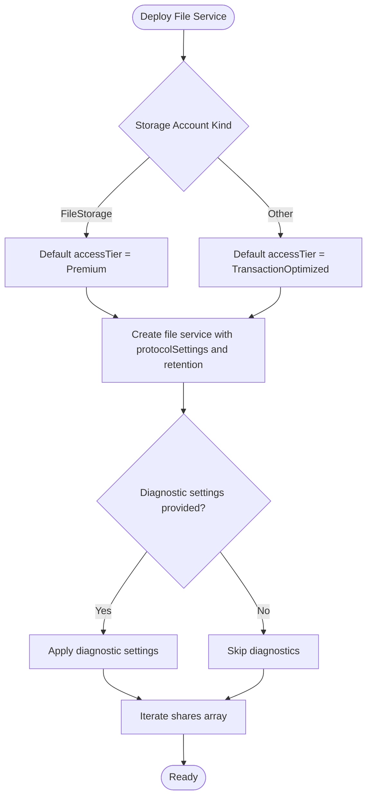
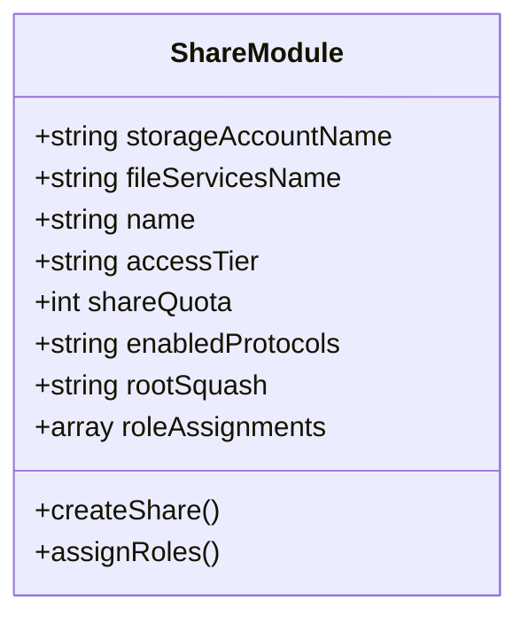
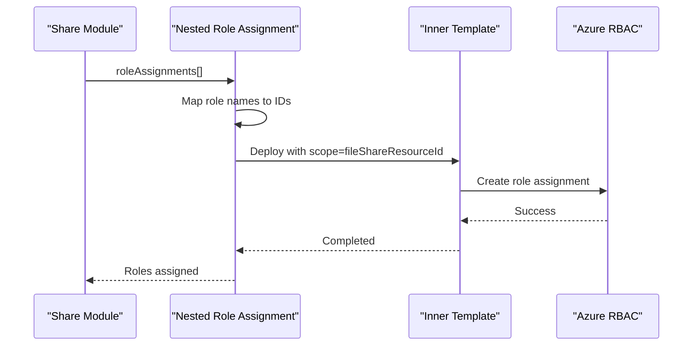
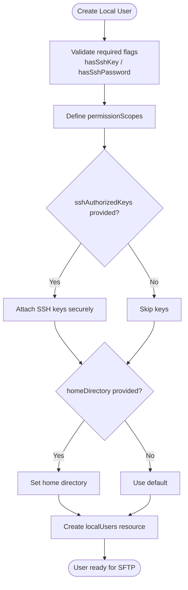
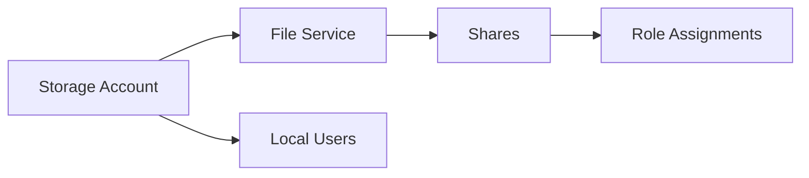

# File Service Module

<cite>
**Referenced Files in This Document**
- [main.bicep](file://bicep/modules/storage-account/file-service/main.bicep)
- [share/main.bicep](file://bicep/modules/storage-account/file-service/share/main.bicep)
- [nested_roleAssignment.bicep](file://bicep/modules/storage-account/file-service/share/modules/nested_roleAssignment.bicep)
- [nested_inner_roleAssignment.json](file://bicep/modules/storage-account/file-service/share/modules/nested_inner_roleAssignment.json)
- [local-user/main.bicep](file://bicep/modules/storage-account/local-user/main.bicep)
- [storage-account main.bicep](file://bicep/modules/storage-account/main.bicep)
- [services_core_file.md](file://docs/src/services_core_file.md)
</cite>

## Table of Contents
1. Introduction
2. Project Structure
3. Core Components
4. Architecture Overview
5. Detailed Component Analysis
6. Dependency Analysis
7. Performance Considerations
8. Troubleshooting Guide
9. Conclusion
10. Appendices

## Introduction
This document explains the File Service Bicep module that provisions Azure Files with shares, protocols, and authentication. It covers creating SMB and NFS file shares, configuring share quotas and access tiers, enabling soft delete retention policies, and managing local users for SFTP access including SSH key management and permission scopes. It also outlines how to assign RBAC roles to shares and provides guidance for cross-platform file sharing scenarios using SMB or NFS.

## Project Structure
The File Service module is composed of:
- A top-level file service module that configures the storage account’s file service, protocol settings, diagnostic settings, and share deletion retention policy, and iterates over an array of shares to create them.
- A share sub-module that creates individual file shares with protocol-specific options (SMB/NFS), quotas, and optional role assignments.
- A nested role assignment helper that deploys per-share RBAC via a nested deployment template.
- A local user module that provisions storage account local users for SFTP authentication, including SSH keys and permission scopes.
- The parent storage account module orchestrates instantiation of local users.

**Diagram sources**
- [main.bicep:34-86](file://bicep/modules/storage-account/file-service/main.bicep#L34-L86)
- [share/main.bicep:54-72](file://bicep/modules/storage-account/file-service/share/main.bicep#L54-L72)
- [nested_roleAssignment.bicep:61-106](file://bicep/modules/storage-account/file-service/share/modules/nested_roleAssignment.bicep#L61-L106)
- [storage-account main.bicep:567-581](file://bicep/modules/storage-account/main.bicep#L567-L581)

**Section sources**
- [main.bicep:1-96](file://bicep/modules/storage-account/file-service/main.bicep#L1-L96)
- [share/main.bicep:1-82](file://bicep/modules/storage-account/file-service/share/main.bicep#L1-L82)
- [nested_roleAssignment.bicep:1-107](file://bicep/modules/storage-account/file-service/share/modules/nested_roleAssignment.bicep#L1-L107)
- [nested_inner_roleAssignment.json:1-94](file://bicep/modules/storage-account/file-service/share/modules/nested_inner_roleAssignment.json#L1-L94)
- [local-user/main.bicep:1-71](file://bicep/modules/storage-account/local-user/main.bicep#L1-L71)
- [storage-account main.bicep:554-581](file://bicep/modules/storage-account/main.bicep#L554-L581)

## Core Components
- File Service configuration: Creates the storage account’s file service resource, applies protocol settings, and sets share delete retention policy. Also supports diagnostic settings for metrics and logs.
- Share creation: For each share definition, creates a file share with access tier, quota, enabled protocols (SMB or NFS), and optional root squash behavior for NFS.
- Role-based access control: Assigns built-in or custom roles to shares via a nested deployment that targets the correct scope for file shares.
- Local users for SFTP: Provisions local users on the storage account with SSH key/password flags, home directory, and permission scopes for secure file transfer.

Key capabilities:
- Protocol selection per share: SMB or NFS at share creation time.
- Quota and access tier: Configure size limits and performance tiers appropriate to workload.
- Soft delete retention: Enable and configure retention days for deleted shares.
- Diagnostics: Stream metrics and logs to Log Analytics, Event Hubs, or Storage.
- RBAC: Fine-grained permissions on shares for users, groups, or identities.
- SFTP: Local users with SSH keys and scoped permissions for secure transfers.

**Section sources**
- [main.bicep:12-41](file://bicep/modules/storage-account/file-service/main.bicep#L12-L41)
- [main.bicep:43-70](file://bicep/modules/storage-account/file-service/main.bicep#L43-L70)
- [main.bicep:72-86](file://bicep/modules/storage-account/file-service/main.bicep#L72-L86)
- [share/main.bicep:15-44](file://bicep/modules/storage-account/file-service/share/main.bicep#L15-L44)
- [share/main.bicep:54-72](file://bicep/modules/storage-account/file-service/share/main.bicep#L54-L72)
- [nested_roleAssignment.bicep:7-58](file://bicep/modules/storage-account/file-service/share/modules/nested_roleAssignment.bicep#L7-L58)
- [local-user/main.bicep:9-45](file://bicep/modules/storage-account/local-user/main.bicep#L9-L45)

## Architecture Overview
The architecture centers around the storage account’s file service and its shares. Shares are created with specific protocols and quotas. Optional RBAC grants controlled access. Diagnostic settings enable observability. Local users provide SFTP access with SSH keys and scoped permissions.

**Diagram sources**
- [main.bicep:34-86](file://bicep/modules/storage-account/file-service/main.bicep#L34-L86)
- [share/main.bicep:54-72](file://bicep/modules/storage-account/file-service/share/main.bicep#L54-L72)
- [nested_roleAssignment.bicep:61-106](file://bicep/modules/storage-account/file-service/share/modules/nested_roleAssignment.bicep#L61-L106)
- [local-user/main.bicep:34-45](file://bicep/modules/storage-account/local-user/main.bicep#L34-L45)
- [storage-account main.bicep:567-581](file://bicep/modules/storage-account/main.bicep#L567-L581)

## Detailed Component Analysis

### File Service Module
- Purpose: Configures the storage account’s file service, including protocol settings and share delete retention policy. Supports diagnostic settings for metrics and logs. Iterates over a shares array to provision multiple shares.
- Key parameters:
  - storageAccountName: Parent storage account reference.
  - name: File service name.
  - protocolSettings: Object passed through to the file service.
  - shareDeleteRetentionPolicy: Enables soft delete and sets retention days.
  - diagnosticSettings: Streams metrics/logs to configured destinations.
  - shares: Array defining each share’s name, access tier, protocols, quota, and role assignments.
- Behavior:
  - Determines default access tier based on storage account kind.
  - Creates one file service resource.
  - Applies diagnostic settings if provided.
  - Loops over shares to create each via the share sub-module.

**Diagram sources**
- [main.bicep:28-41](file://bicep/modules/storage-account/file-service/main.bicep#L28-L41)
- [main.bicep:43-70](file://bicep/modules/storage-account/file-service/main.bicep#L43-L70)
- [main.bicep:72-86](file://bicep/modules/storage-account/file-service/main.bicep#L72-L86)

**Section sources**
- [main.bicep:1-96](file://bicep/modules/storage-account/file-service/main.bicep#L1-L96)

### Share Sub-Module
- Purpose: Creates individual file shares under the specified file service with protocol-specific settings.
- Key parameters:
  - storageAccountName and fileServicesName: Parent references.
  - name: Share name.
  - accessTier: Premium/Hot/Cool/TransactionOptimized depending on account type.
  - shareQuota: Maximum size in GB.
  - enabledProtocols: SMB or NFS (set at creation).
  - rootSquash: Only applied when enabledProtocols is NFS.
  - roleAssignments: Array of roles to assign to the share.
- Behavior:
  - Creates the share resource with the selected protocol and quota.
  - Applies rootSquash only for NFS.
  - Uses a nested deployment to assign roles to the share scope.

**Diagram sources**
- [share/main.bicep:15-44](file://bicep/modules/storage-account/file-service/share/main.bicep#L15-L44)
- [share/main.bicep:54-72](file://bicep/modules/storage-account/file-service/share/main.bicep#L54-L72)

**Section sources**
- [share/main.bicep:1-82](file://bicep/modules/storage-account/file-service/share/main.bicep#L1-L82)

### Nested Role Assignment Helper
- Purpose: Deploys per-share role assignments by invoking an inner ARM template. Maps friendly role names to their IDs and constructs unique assignment names.
- Key behaviors:
  - Accepts an array of role assignments with principalId and roleDefinitionIdOrName.
  - Resolves built-in role names to IDs or uses provided fully qualified IDs.
  - Deploys Microsoft.Authorization/roleAssignments scoped to the share.
  - Supports conditions, condition versions, descriptions, and delegated managed identity resources.

**Diagram sources**
- [nested_roleAssignment.bicep:7-58](file://bicep/modules/storage-account/file-service/share/modules/nested_roleAssignment.bicep#L7-L58)
- [nested_roleAssignment.bicep:61-106](file://bicep/modules/storage-account/file-service/share/modules/nested_roleAssignment.bicep#L61-L106)
- [nested_inner_roleAssignment.json:76-92](file://bicep/modules/storage-account/file-service/share/modules/nested_inner_roleAssignment.json#L76-L92)

**Section sources**
- [nested_roleAssignment.bicep:1-107](file://bicep/modules/storage-account/file-service/share/modules/nested_roleAssignment.bicep#L1-L107)
- [nested_inner_roleAssignment.json:1-94](file://bicep/modules/storage-account/file-service/share/modules/nested_inner_roleAssignment.json#L1-L94)

### Local User Module (SFTP Authentication)
- Purpose: Creates storage account local users for SFTP authentication with SSH key/password controls, home directories, and permission scopes.
- Key parameters:
  - storageAccountName: Parent storage account.
  - name: Local user name.
  - hasSharedKey: Flag to manage shared key presence.
  - hasSshKey: Flag to manage SSH key presence.
  - hasSshPassword: Flag to manage SSH password presence.
  - homeDirectory: Optional home directory path.
  - permissionScopes: Required array defining access scopes.
  - sshAuthorizedKeys: Secure list of SSH public keys with optional descriptions.
- Behavior:
  - Creates a localUsers resource under the storage account.
  - Applies SSH authorized keys securely.
  - Enforces permission scopes for the user.

**Diagram sources**
- [local-user/main.bicep:9-45](file://bicep/modules/storage-account/local-user/main.bicep#L9-L45)
- [local-user/main.bicep:60-70](file://bicep/modules/storage-account/local-user/main.bicep#L60-L70)

**Section sources**
- [local-user/main.bicep:1-71](file://bicep/modules/storage-account/local-user/main.bicep#L1-L71)

### Integration with Parent Storage Account Module
- The parent storage account module instantiates local users from a provided array, passing all relevant parameters including SSH keys and permission scopes. This ensures SFTP users are provisioned alongside other storage resources.

**Section sources**
- [storage-account main.bicep:567-581](file://bicep/modules/storage-account/main.bicep#L567-L581)

## Dependency Analysis
- File Service depends on the existing storage account and optionally on diagnostic resources.
- Share creation depends on the file service and can depend on nested deployments for RBAC.
- Role assignments target the share scope and require proper principal IDs and role definitions.
- Local users depend on the storage account and are orchestrated by the parent storage account module.

**Diagram sources**
- [main.bicep:30-41](file://bicep/modules/storage-account/file-service/main.bicep#L30-L41)
- [share/main.bicep:46-72](file://bicep/modules/storage-account/file-service/share/main.bicep#L46-L72)
- [nested_roleAssignment.bicep:61-106](file://bicep/modules/storage-account/file-service/share/modules/nested_roleAssignment.bicep#L61-L106)
- [local-user/main.bicep:30-45](file://bicep/modules/storage-account/local-user/main.bicep#L30-L45)
- [storage-account main.bicep:567-581](file://bicep/modules/storage-account/main.bicep#L567-L581)

**Section sources**
- [main.bicep:30-86](file://bicep/modules/storage-account/file-service/main.bicep#L30-L86)
- [share/main.bicep:46-72](file://bicep/modules/storage-account/file-service/share/main.bicep#L46-L72)
- [nested_roleAssignment.bicep:61-106](file://bicep/modules/storage-account/file-service/share/modules/nested_roleAssignment.bicep#L61-L106)
- [local-user/main.bicep:30-45](file://bicep/modules/storage-account/local-user/main.bicep#L30-L45)
- [storage-account main.bicep:567-581](file://bicep/modules/storage-account/main.bicep#L567-L581)

## Performance Considerations
- Access tier selection: Use Premium for FileStorage accounts; otherwise choose TransactionOptimized, Hot, or Cool based on workload patterns.
- Share quotas: Size shares appropriately to avoid unnecessary scaling and ensure predictable performance.
- Diagnostics: Enable selective metric and log categories to balance observability with cost.
- Role assignments: Minimize the number of assignments and use conditions where possible to reduce evaluation overhead.

[No sources needed since this section provides general guidance]

## Troubleshooting Guide
Common issues and resolutions:
- Invalid protocol setting: Ensure enabledProtocols is set at share creation time and matches supported values (SMB or NFS). Root squash is only applicable for NFS.
- Missing role assignment scope: When assigning roles, confirm the scope is correctly mapped to the share resource ID.
- SFTP authentication failures: Verify local user flags (hasSshKey, hasSshPassword) match your intended authentication method and that SSH keys are provided securely. Confirm permissionScopes include the intended paths.
- Diagnostic streams not appearing: Validate diagnostic settings destinations (Log Analytics workspace, Event Hub, or Storage) and ensure connectivity and permissions.

**Section sources**
- [share/main.bicep:27-40](file://bicep/modules/storage-account/file-service/share/main.bicep#L27-L40)
- [nested_roleAssignment.bicep:61-106](file://bicep/modules/storage-account/file-service/share/modules/nested_roleAssignment.bicep#L61-L106)
- [local-user/main.bicep:15-45](file://bicep/modules/storage-account/local-user/main.bicep#L15-L45)
- [main.bicep:43-70](file://bicep/modules/storage-account/file-service/main.bicep#L43-L70)

## Conclusion
The File Service Bicep module provides a robust foundation for deploying Azure Files with flexible protocol support, configurable quotas, soft delete retention, diagnostics, and fine-grained RBAC. Local users enable secure SFTP access with SSH key management and scoped permissions. Together, these components support cross-platform file sharing scenarios across Windows (SMB) and Linux/macOS (NFS), while maintaining strong security and operational visibility.

[No sources needed since this section summarizes without analyzing specific files]

## Appendices

### Examples and Scenarios

- Shared folder deployment (SMB):
  - Define a share with enabledProtocols set to SMB, choose an appropriate access tier and quota, and optionally assign roles for read/write access.
  - Reference: [share/main.bicep:27-40](file://bicep/modules/storage-account/file-service/share/main.bicep#L27-L40), [share/main.bicep:54-72](file://bicep/modules/storage-account/file-service/share/main.bicep#L54-L72)

- Shared folder deployment (NFS):
  - Define a share with enabledProtocols set to NFS and configure rootSquash to control root user permissions.
  - Reference: [share/main.bicep:27-40](file://bicep/modules/storage-account/file-service/share/main.bicep#L27-L40), [share/main.bicep:54-72](file://bicep/modules/storage-account/file-service/share/main.bicep#L54-L72)

- User access management (RBAC on shares):
  - Provide roleAssignments in the share definition to grant roles such as Reader, Contributor, or Storage File Data roles scoped to the share.
  - Reference: [nested_roleAssignment.bicep:7-58](file://bicep/modules/storage-account/file-service/share/modules/nested_roleAssignment.bicep#L7-L58), [nested_inner_roleAssignment.json:76-92](file://bicep/modules/storage-account/file-service/share/modules/nested_inner_roleAssignment.json#L76-L92)

- Cross-platform file sharing:
  - SMB for Windows clients; NFS for Linux/macOS clients. Choose protocol per share based on client requirements.
  - Reference: [share/main.bicep:27-40](file://bicep/modules/storage-account/file-service/share/main.bicep#L27-L40)

- SFTP access with SSH keys:
  - Create a local user with hasSshKey true and provide sshAuthorizedKeys securely. Set permissionScopes to restrict access to specific paths.
  - Reference: [local-user/main.bicep:15-45](file://bicep/modules/storage-account/local-user/main.bicep#L15-L45), [local-user/main.bicep:60-70](file://bicep/modules/storage-account/local-user/main.bicep#L60-L70)

- Protocol settings and retention:
  - Configure protocolSettings on the file service and enable share delete retention with desired days.
  - Reference: [main.bicep:12-41](file://bicep/modules/storage-account/file-service/main.bicep#L12-L41)

- Application integration notes:
  - The file service can be run locally with appropriate environment variables and endpoints for development workflows.
  - Reference: [services_core_file.md:14-27](file://docs/src/services_core_file.md#L14-L27)

[No additional sources beyond those listed above]