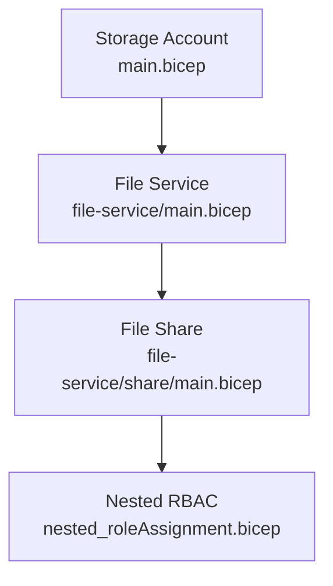
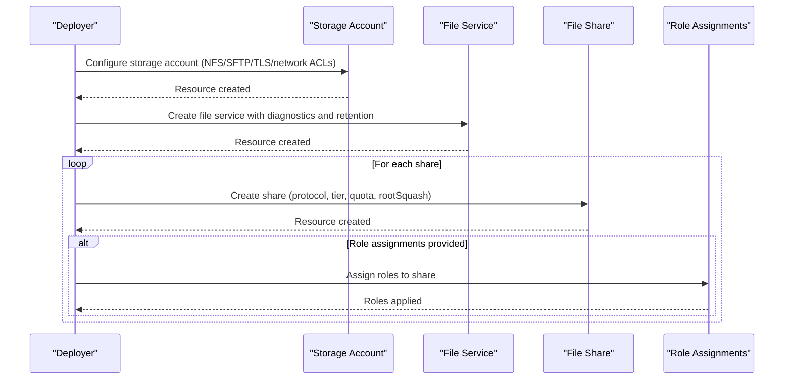
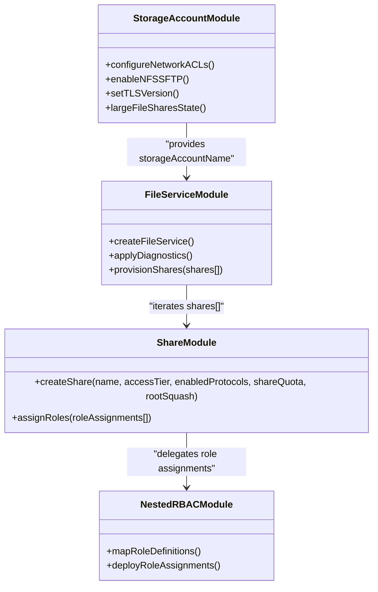
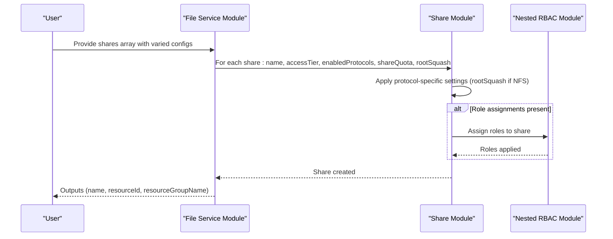
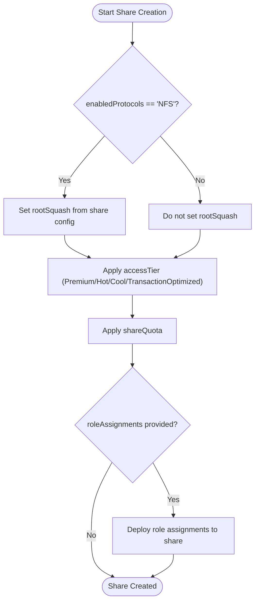
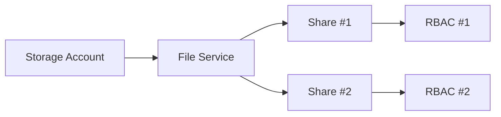

# File Shares Management

<cite>
**Referenced Files in This Document**
- [bicep/modules/storage-account/main.bicep](file://bicep/modules/storage-account/main.bicep)
- [bicep/modules/storage-account/file-service/main.bicep](file://bicep/modules/storage-account/file-service/main.bicep)
- [bicep/modules/storage-account/file-service/share/main.bicep](file://bicep/modules/storage-account/file-service/share/main.bicep)
- [bicep/modules/storage-account/file-service/share/modules/nested_roleAssignment.bicep](file://bicep/modules/storage-account/file-service/share/modules/nested_roleAssignment.bicep)
- [bicep/modules/storage-account/file-service/README.md](file://bicep/modules/storage-account/file-service/README.md)
- [bicep/modules/storage-account/file-service/share/README.md](file://bicep/modules/storage-account/file-service/share/README.md)
</cite>

## Table of Contents
1. [Introduction](#introduction)
2. [Project Structure](#project-structure)
3. [Core Components](#core-components)
4. [Architecture Overview](#architecture-overview)
5. [Detailed Component Analysis](#detailed-component-analysis)
6. [Dependency Analysis](#dependency-analysis)
7. [Performance Considerations](#performance-considerations)
8. [Troubleshooting Guide](#troubleshooting-guide)
9. [Conclusion](#conclusion)
10. [Appendices](#appendices)

## Introduction
This document explains how Azure Files shares are managed within the OSDU platform using Infrastructure-as-Code modules. It covers creating file shares with SMB and NFS protocols, configuring access tiers (Premium vs TransactionOptimized), setting quotas, enabling protocol-specific options such as rootSquash for NFS, managing share lifecycle including deletion policies, and integrating with storage account configurations. It also provides guidance on role-based access control (RBAC) for shared folders and examples for deploying multiple shares with different settings to support cross-platform compatibility.

## Project Structure
The file share management is implemented through a set of Bicep modules under the storage-account module:
- Storage Account module: configures the storage account and exposes parameters for file services and shares.
- File Service module: creates the file service resource and iterates over an array of shares to create each one.
- Share module: defines individual file shares with protocol, quota, access tier, and RBAC.
- Nested RBAC module: assigns roles to the file share resource.

**Diagram sources**
- [bicep/modules/storage-account/main.bicep:351-450](file://bicep/modules/storage-account/main.bicep#L351-L450)
- [bicep/modules/storage-account/file-service/main.bicep:34-86](file://bicep/modules/storage-account/file-service/main.bicep#L34-L86)
- [bicep/modules/storage-account/file-service/share/main.bicep:46-72](file://bicep/modules/storage-account/file-service/share/main.bicep#L46-L72)
- [bicep/modules/storage-account/file-service/share/modules/nested_roleAssignment.bicep:61-106](file://bicep/modules/storage-account/file-service/share/modules/nested_roleAssignment.bicep#L61-L106)

**Section sources**
- [bicep/modules/storage-account/main.bicep:351-450](file://bicep/modules/storage-account/main.bicep#L351-L450)
- [bicep/modules/storage-account/file-service/main.bicep:34-86](file://bicep/modules/storage-account/file-service/main.bicep#L34-L86)
- [bicep/modules/storage-account/file-service/share/main.bicep:46-72](file://bicep/modules/storage-account/file-service/share/main.bicep#L46-L72)
- [bicep/modules/storage-account/file-service/share/modules/nested_roleAssignment.bicep:61-106](file://bicep/modules/storage-account/file-service/share/modules/nested_roleAssignment.bicep#L61-L106)

## Core Components
- Storage Account configuration: Enables or disables features relevant to files (e.g., NFS v3, large file shares state, TLS version). It also supports identity-based authentication for Azure Files and network ACLs.
- File Service: Creates the file service resource and applies diagnostic settings and soft delete retention policy for shares.
- File Share: Defines per-share properties including enabledProtocols (SMB/NFS), accessTier (Premium/Hot/Cool/TransactionOptimized), shareQuota, and rootSquash for NFS.
- Role Assignments: Applies built-in or custom roles scoped to the file share resource.

Key capabilities:
- Protocol selection: SMB by default; NFS can be enabled per share.
- Access tier: Defaults based on storage account kind; Premium required for FileStorage accounts.
- Quotas: Configurable per share up to 5TB or 100TB for large file shares.
- Deletion policy: Soft delete retention configured at the file service level.
- RBAC: Fine-grained permissions assigned directly to the share.

**Section sources**
- [bicep/modules/storage-account/main.bicep:126-139](file://bicep/modules/storage-account/main.bicep#L126-L139)
- [bicep/modules/storage-account/main.bicep:423-427](file://bicep/modules/storage-account/main.bicep#L423-L427)
- [bicep/modules/storage-account/file-service/main.bicep:12-27](file://bicep/modules/storage-account/file-service/main.bicep#L12-L27)
- [bicep/modules/storage-account/file-service/main.bicep:34-41](file://bicep/modules/storage-account/file-service/main.bicep#L34-L41)
- [bicep/modules/storage-account/file-service/share/main.bicep:15-40](file://bicep/modules/storage-account/file-service/share/main.bicep#L15-L40)
- [bicep/modules/storage-account/file-service/share/modules/nested_roleAssignment.bicep:7-47](file://bicep/modules/storage-account/file-service/share/modules/nested_roleAssignment.bicep#L7-L47)

## Architecture Overview
The deployment flow orchestrates storage account setup, file service creation, and per-share provisioning with optional RBAC assignments.

**Diagram sources**
- [bicep/modules/storage-account/main.bicep:351-450](file://bicep/modules/storage-account/main.bicep#L351-L450)
- [bicep/modules/storage-account/file-service/main.bicep:34-86](file://bicep/modules/storage-account/file-service/main.bicep#L34-L86)
- [bicep/modules/storage-account/file-service/share/main.bicep:54-72](file://bicep/modules/storage-account/file-service/share/main.bicep#L54-L72)
- [bicep/modules/storage-account/file-service/share/modules/nested_roleAssignment.bicep:61-106](file://bicep/modules/storage-account/file-service/share/modules/nested_roleAssignment.bicep#L61-L106)

## Detailed Component Analysis

### Storage Account Module
Responsibilities:
- Configures storage account kind, SKU, encryption, TLS, NFS v3, SFTP, hierarchical namespace, and large file shares state.
- Exposes parameters for file services and shares via the fileServices parameter object.
- Sets network ACLs and public network access controls.

Important behaviors:
- NFS v3 enablement requires hierarchical namespace.
- Large file shares state is only applicable for specific SKUs.
- Minimum TLS version enforced for secure communications.

**Section sources**
- [bicep/modules/storage-account/main.bicep:126-139](file://bicep/modules/storage-account/main.bicep#L126-L139)
- [bicep/modules/storage-account/main.bicep:423-427](file://bicep/modules/storage-account/main.bicep#L423-L427)
- [bicep/modules/storage-account/main.bicep:428-449](file://bicep/modules/storage-account/main.bicep#L428-L449)

### File Service Module
Responsibilities:
- Creates the file service resource on the storage account.
- Applies protocolSettings and shareDeleteRetentionPolicy.
- Iterates over the shares array to provision each share with specified properties.
- Attaches diagnostic settings for metrics and logs.

Key logic:
- Default access tier for shares depends on storage account kind: Premium for FileStorage, otherwise TransactionOptimized.
- Each share inherits defaults unless overridden.

**Section sources**
- [bicep/modules/storage-account/file-service/main.bicep:12-27](file://bicep/modules/storage-account/file-service/main.bicep#L12-L27)
- [bicep/modules/storage-account/file-service/main.bicep:28-41](file://bicep/modules/storage-account/file-service/main.bicep#L28-L41)
- [bicep/modules/storage-account/file-service/main.bicep:72-86](file://bicep/modules/storage-account/file-service/main.bicep#L72-L86)

### File Share Module
Responsibilities:
- Creates a single file share with:
  - enabledProtocols: SMB or NFS
  - accessTier: Premium, Hot, Cool, or TransactionOptimized
  - shareQuota: maximum size in GB
  - rootSquash: only applied when enabledProtocols is NFS
- Optionally assigns RBAC roles scoped to the share.

Behavioral notes:
- rootSquash is conditionally set only for NFS shares.
- Role assignments are delegated to a nested module that maps role names/IDs and scopes them to the share.

**Section sources**
- [bicep/modules/storage-account/file-service/share/main.bicep:15-40](file://bicep/modules/storage-account/file-service/share/main.bicep#L15-L40)
- [bicep/modules/storage-account/file-service/share/main.bicep:54-63](file://bicep/modules/storage-account/file-service/share/main.bicep#L54-L63)
- [bicep/modules/storage-account/file-service/share/main.bicep:65-72](file://bicep/modules/storage-account/file-service/share/main.bicep#L65-L72)

### Nested Role Assignment Module
Responsibilities:
- Accepts an array of role assignments and maps roleDefinitionIdOrName to full role definition IDs.
- Deploys incremental deployments to assign roles scoped to the file share resource.
- Supports conditions and principal types for fine-grained access control.

Built-in roles supported include storage file data roles for SMB shares and elevated contributor roles.

**Section sources**
- [bicep/modules/storage-account/file-service/share/modules/nested_roleAssignment.bicep:7-47](file://bicep/modules/storage-account/file-service/share/modules/nested_roleAssignment.bicep#L7-L47)
- [bicep/modules/storage-account/file-service/share/modules/nested_roleAssignment.bicep:61-106](file://bicep/modules/storage-account/file-service/share/modules/nested_roleAssignment.bicep#L61-L106)

### Class Diagram of Modules and Resources

**Diagram sources**
- [bicep/modules/storage-account/main.bicep:351-450](file://bicep/modules/storage-account/main.bicep#L351-L450)
- [bicep/modules/storage-account/file-service/main.bicep:34-86](file://bicep/modules/storage-account/file-service/main.bicep#L34-L86)
- [bicep/modules/storage-account/file-service/share/main.bicep:54-72](file://bicep/modules/storage-account/file-service/share/main.bicep#L54-L72)
- [bicep/modules/storage-account/file-service/share/modules/nested_roleAssignment.bicep:61-106](file://bicep/modules/storage-account/file-service/share/modules/nested_roleAssignment.bicep#L61-L106)

### Sequence Diagram: Creating Multiple Shares with Different Protocols and Tiers

**Diagram sources**
- [bicep/modules/storage-account/file-service/main.bicep:72-86](file://bicep/modules/storage-account/file-service/main.bicep#L72-L86)
- [bicep/modules/storage-account/file-service/share/main.bicep:54-72](file://bicep/modules/storage-account/file-service/share/main.bicep#L54-L72)
- [bicep/modules/storage-account/file-service/share/modules/nested_roleAssignment.bicep:61-106](file://bicep/modules/storage-account/file-service/share/modules/nested_roleAssignment.bicep#L61-L106)

### Flowchart: Share Creation Logic

**Diagram sources**
- [bicep/modules/storage-account/file-service/share/main.bicep:54-63](file://bicep/modules/storage-account/file-service/share/main.bicep#L54-L63)
- [bicep/modules/storage-account/file-service/share/modules/nested_roleAssignment.bicep:61-106](file://bicep/modules/storage-account/file-service/share/modules/nested_roleAssignment.bicep#L61-L106)

## Dependency Analysis
- The storage account module must be deployed first to provide the target storage account for file services and shares.
- The file service module depends on the storage account and creates the file service resource before iterating over shares.
- Each share module instance depends on the file service and storage account references.
- Role assignments depend on the share resource ID and are scoped accordingly.

**Diagram sources**
- [bicep/modules/storage-account/main.bicep:351-450](file://bicep/modules/storage-account/main.bicep#L351-L450)
- [bicep/modules/storage-account/file-service/main.bicep:34-86](file://bicep/modules/storage-account/file-service/main.bicep#L34-L86)
- [bicep/modules/storage-account/file-service/share/main.bicep:54-72](file://bicep/modules/storage-account/file-service/share/main.bicep#L54-L72)
- [bicep/modules/storage-account/file-service/share/modules/nested_roleAssignment.bicep:61-106](file://bicep/modules/storage-account/file-service/share/modules/nested_roleAssignment.bicep#L61-L106)

**Section sources**
- [bicep/modules/storage-account/main.bicep:351-450](file://bicep/modules/storage-account/main.bicep#L351-L450)
- [bicep/modules/storage-account/file-service/main.bicep:34-86](file://bicep/modules/storage-account/file-service/main.bicep#L34-L86)
- [bicep/modules/storage-account/file-service/share/main.bicep:54-72](file://bicep/modules/storage-account/file-service/share/main.bicep#L54-L72)
- [bicep/modules/storage-account/file-service/share/modules/nested_roleAssignment.bicep:61-106](file://bicep/modules/storage-account/file-service/share/modules/nested_roleAssignment.bicep#L61-L106)

## Performance Considerations
- Choose access tiers aligned with workload patterns:
  - Premium for high-performance scenarios (required for FileStorage accounts).
  - TransactionOptimized for general-purpose accounts where cost efficiency matters.
  - Hot/Cool tiers available for general-purpose accounts depending on usage.
- Large file shares state impacts maximum share sizes and should be enabled only when necessary and supported by SKU.
- Network ACLs and private endpoints reduce latency exposure but require proper routing and DNS configuration.
- Diagnostic settings add overhead; configure only necessary metrics and logs.

[No sources needed since this section provides general guidance]

## Troubleshooting Guide
Common issues and resolutions:
- NFS v3 not available: Ensure hierarchical namespace is enabled and NFS v3 is explicitly enabled on the storage account.
- Invalid access tier: For FileStorage accounts, use Premium; for general-purpose accounts, choose among TransactionOptimized, Hot, or Cool.
- rootSquash not applied: Confirm enabledProtocols is set to NFS; rootSquash is ignored for SMB shares.
- Quota errors: Verify shareQuota is within allowed limits (up to 5TB or 100TB for large file shares).
- RBAC assignment failures: Validate roleDefinitionIdOrName mapping and principalId; ensure scope is correctly set to the file share resource.

Operational tips:
- Use diagnostic settings to monitor file service metrics and logs.
- Leverage soft delete retention policy to recover accidentally deleted shares.
- Restrict public network access and enforce HTTPS-only traffic for security.

**Section sources**
- [bicep/modules/storage-account/main.bicep:126-139](file://bicep/modules/storage-account/main.bicep#L126-L139)
- [bicep/modules/storage-account/file-service/main.bicep:12-27](file://bicep/modules/storage-account/file-service/main.bicep#L12-L27)
- [bicep/modules/storage-account/file-service/share/main.bicep:15-40](file://bicep/modules/storage-account/file-service/share/main.bicep#L15-L40)
- [bicep/modules/storage-account/file-service/share/modules/nested_roleAssignment.bicep:61-106](file://bicep/modules/storage-account/file-service/share/modules/nested_roleAssignment.bicep#L61-L106)

## Conclusion
The OSDU platform’s file share management leverages modular Bicep templates to provision Azure Files shares with flexible protocol support, access tiers, quotas, and RBAC. By configuring the storage account appropriately and using the file service and share modules, teams can deploy multiple shares tailored to diverse workloads and cross-platform requirements. Soft delete retention and diagnostics enhance operational resilience and observability.

[No sources needed since this section summarizes without analyzing specific files]

## Appendices

### Parameter Reference Summary
- Storage Account:
  - Enable NFS v3 and SFTP with hierarchical namespace.
  - Configure minimum TLS version and network ACLs.
  - Set large file shares state for supported SKUs.
- File Service:
  - Define protocolSettings and shareDeleteRetentionPolicy.
  - Provide an array of shares with per-share overrides.
- Share:
  - enabledProtocols: SMB or NFS.
  - accessTier: Premium, Hot, Cool, or TransactionOptimized.
  - shareQuota: maximum size in GB.
  - rootSquash: AllSquash, NoRootSquash, RootSquash (NFS only).
  - roleAssignments: array of principals and roles scoped to the share.

**Section sources**
- [bicep/modules/storage-account/file-service/README.md:20-36](file://bicep/modules/storage-account/file-service/README.md#L20-L36)
- [bicep/modules/storage-account/file-service/share/README.md:20-41](file://bicep/modules/storage-account/file-service/share/README.md#L20-L41)