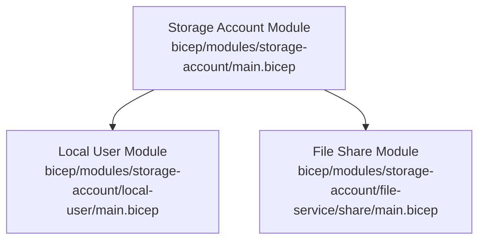
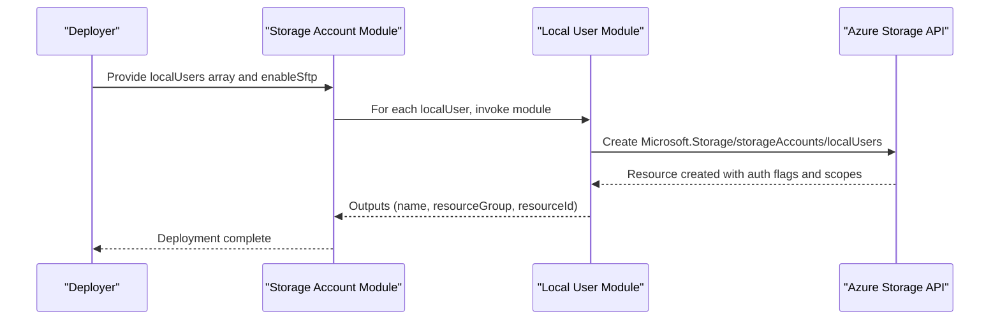
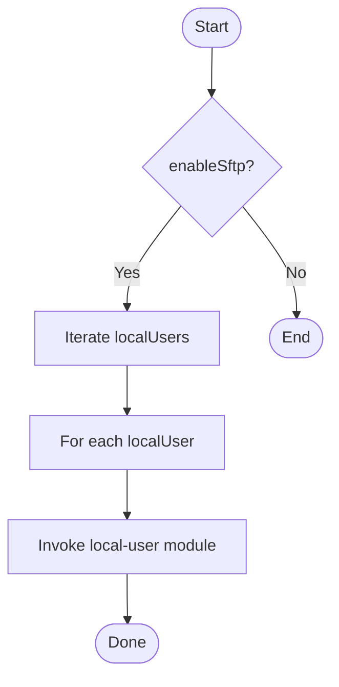
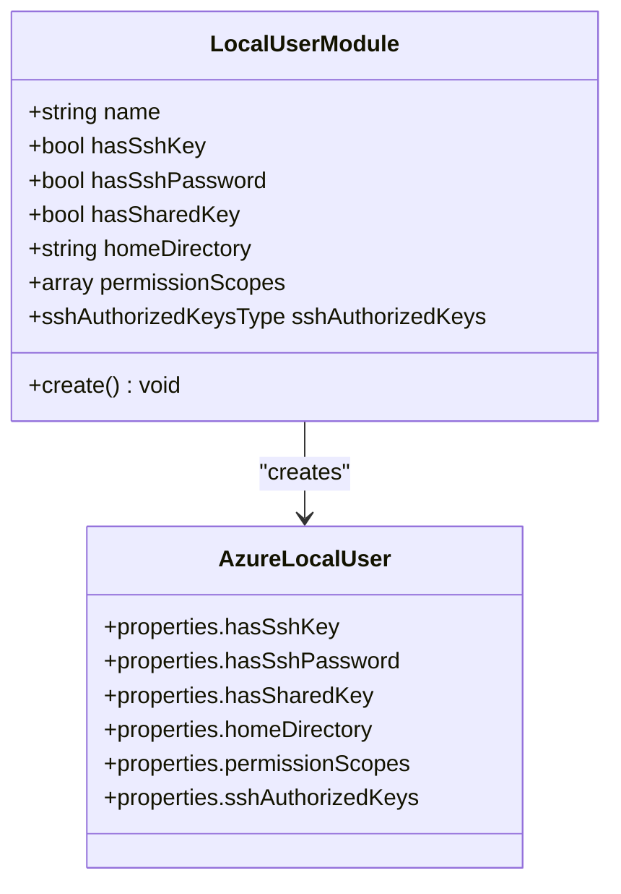
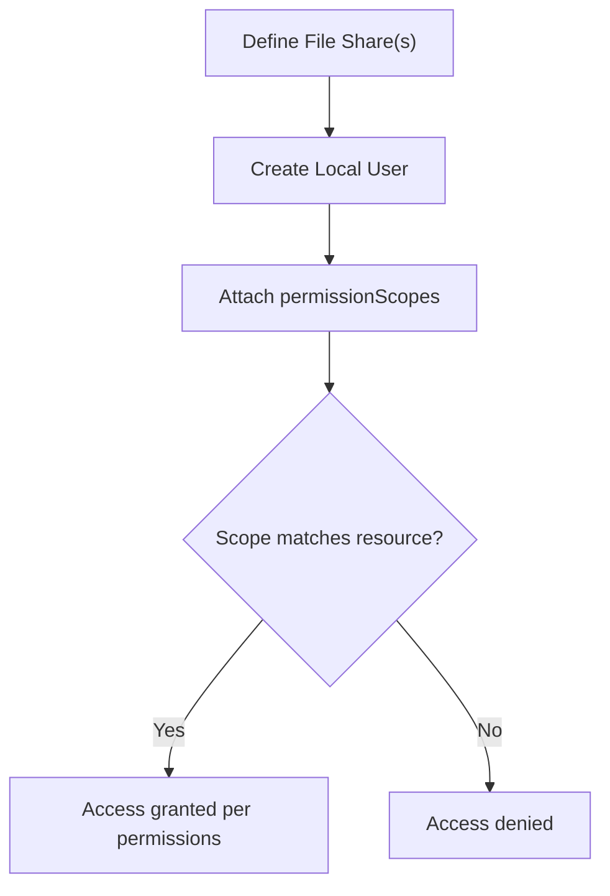
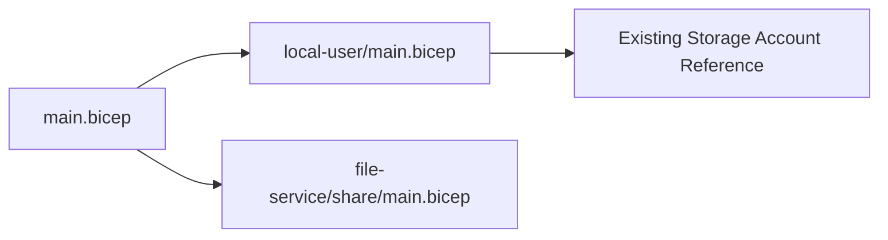

# Local User Authentication

<cite>
**Referenced Files in This Document**
- [main.bicep](file://bicep/modules/storage-account/main.bicep)
- [local-user/main.bicep](file://bicep/modules/storage-account/local-user/main.bicep)
- [local-user/README.md](file://bicep/modules/storage-account/local-user/README.md)
- [storage-account/README.md](file://bicep/modules/storage-account/README.md)
- [file-service/share/main.bicep](file://bicep/modules/storage-account/file-service/share/main.bicep)
</cite>

## Table of Contents
1. [Introduction](#introduction)
2. [Project Structure](#project-structure)
3. [Core Components](#core-components)
4. [Architecture Overview](#architecture-overview)
5. [Detailed Component Analysis](#detailed-component-analysis)
6. [Dependency Analysis](#dependency-analysis)
7. [Performance Considerations](#performance-considerations)
8. [Troubleshooting Guide](#troubleshooting-guide)
9. [Conclusion](#conclusion)
10. [Appendices](#appendices)

## Introduction
This document explains how local user authentication for Azure Files SFTP is implemented and configured in this repository. It focuses on creating local users, managing SSH keys and passwords, defining permission scopes, and enabling SFTP access through Bicep modules. It also outlines best practices for secure credential management and provides troubleshooting guidance based on the module parameters and resource properties exposed by the templates.

## Project Structure
The relevant implementation is centered around the storage account module and a dedicated local user sub-module:
- The storage account module defines parameters to enable SFTP and configure local users.
- The local user module creates an Azure Storage Account local user with authentication flags, home directory, permission scopes, and optional SSH authorized keys.
- File share configuration is provided by a separate file service module that can be used alongside local users.

**Diagram sources**
- [main.bicep:126-136](file://bicep/modules/storage-account/main.bicep#L126-L136)
- [main.bicep:566-581](file://bicep/modules/storage-account/main.bicep#L566-L581)
- [local-user/main.bicep:30-45](file://bicep/modules/storage-account/local-user/main.bicep#L30-L45)
- [file-service/share/main.bicep:46-63](file://bicep/modules/storage-account/file-service/share/main.bicep#L46-L63)

**Section sources**
- [main.bicep:126-136](file://bicep/modules/storage-account/main.bicep#L126-L136)
- [main.bicep:566-581](file://bicep/modules/storage-account/main.bicep#L566-L581)
- [local-user/main.bicep:30-45](file://bicep/modules/storage-account/local-user/main.bicep#L30-L45)
- [file-service/share/main.bicep:46-63](file://bicep/modules/storage-account/file-service/share/main.bicep#L46-L63)

## Core Components
- Storage Account Module:
  - Enables SFTP via a parameter and accepts an array of local users to deploy.
  - Iterates over the localUsers array and deploys each as a local user resource.
- Local User Module:
  - Creates a Microsoft.Storage/storageAccounts/localUsers resource.
  - Exposes parameters to control authentication methods (SSH key, SSH password), shared key usage, home directory, permission scopes, and SSH authorized keys.
- File Share Module:
  - Deploys file shares under the storage account’s file service, which are the targets of permission scopes.

Key capabilities exposed by the templates:
- Enable SFTP on the storage account.
- Define one or more local users with specific authentication modes.
- Restrict each user’s access using permissionScopes targeting specific services and resources.
- Optionally attach multiple SSH public keys per user.

**Section sources**
- [main.bicep:126-136](file://bicep/modules/storage-account/main.bicep#L126-L136)
- [main.bicep:566-581](file://bicep/modules/storage-account/main.bicep#L566-L581)
- [local-user/main.bicep:9-28](file://bicep/modules/storage-account/local-user/main.bicep#L9-L28)
- [local-user/main.bicep:30-45](file://bicep/modules/storage-account/local-user/main.bicep#L30-L45)
- [file-service/share/main.bicep:46-63](file://bicep/modules/storage-account/file-service/share/main.bicep#L46-L63)

## Architecture Overview
The deployment flow configures SFTP-enabled storage accounts and provisions local users scoped to specific file shares or blob containers. Permission scopes define what each local user can read or write.

**Diagram sources**
- [main.bicep:566-581](file://bicep/modules/storage-account/main.bicep#L566-L581)
- [local-user/main.bicep:30-45](file://bicep/modules/storage-account/local-user/main.bicep#L30-L45)

## Detailed Component Analysis

### Storage Account Module: SFTP and Local Users
- Parameters:
  - enableSftp: enables Secure File Transfer Protocol support.
  - localUsers: array of user definitions including name, authentication flags, homeDirectory, and permissionScopes.
  - isLocalUserEnabled: feature flag for local users.
- Behavior:
  - Iterates over localUsers and invokes the local user module for each entry.
  - Passes hasSshKey, hasSshPassword, permissionScopes, homeDirectory, and sshAuthorizedKeys to the child module.

**Diagram sources**
- [main.bicep:126-136](file://bicep/modules/storage-account/main.bicep#L126-L136)
- [main.bicep:566-581](file://bicep/modules/storage-account/main.bicep#L566-L581)

**Section sources**
- [main.bicep:126-136](file://bicep/modules/storage-account/main.bicep#L126-L136)
- [main.bicep:566-581](file://bicep/modules/storage-account/main.bicep#L566-L581)

### Local User Module: Authentication and Scopes
- Parameters:
  - name: local user name.
  - hasSshKey: indicates presence/removal of SSH key.
  - hasSshPassword: indicates presence/removal of SSH password.
  - hasSharedKey: indicates presence/removal of shared key.
  - homeDirectory: user’s home directory path.
  - permissionScopes: array defining allowed permissions per resource/service.
  - sshAuthorizedKeys: optional list of SSH public keys (secure).
- Resource:
  - Creates Microsoft.Storage/storageAccounts/localUsers with the above properties.

**Diagram sources**
- [local-user/main.bicep:9-28](file://bicep/modules/storage-account/local-user/main.bicep#L9-L28)
- [local-user/main.bicep:30-45](file://bicep/modules/storage-account/local-user/main.bicep#L30-L45)

**Section sources**
- [local-user/main.bicep:9-28](file://bicep/modules/storage-account/local-user/main.bicep#L9-L28)
- [local-user/main.bicep:30-45](file://bicep/modules/storage-account/local-user/main.bicep#L30-L45)
- [local-user/README.md:17-40](file://bicep/modules/storage-account/local-user/README.md#L17-L40)

### File Shares and Permission Scopes
- File shares are deployed via the file service module and can be referenced in permissionScopes to limit local user access.
- Permission scopes specify:
  - service: target service (e.g., blob or file).
  - resourceName: the specific container or share name.
  - permissions: allowed operations (e.g., read-only).

**Diagram sources**
- [file-service/share/main.bicep:46-63](file://bicep/modules/storage-account/file-service/share/main.bicep#L46-L63)
- [storage-account/README.md:592-608](file://bicep/modules/storage-account/README.md#L592-L608)

**Section sources**
- [file-service/share/main.bicep:46-63](file://bicep/modules/storage-account/file-service/share/main.bicep#L46-L63)
- [storage-account/README.md:592-608](file://bicep/modules/storage-account/README.md#L592-L608)

## Dependency Analysis
- The storage account module depends on the local user module to provision per-user authentication and scoping.
- The local user module depends on an existing storage account resource reference.
- File shares are independent but commonly targeted by permission scopes defined for local users.

**Diagram sources**
- [main.bicep:566-581](file://bicep/modules/storage-account/main.bicep#L566-L581)
- [local-user/main.bicep:30-32](file://bicep/modules/storage-account/local-user/main.bicep#L30-L32)
- [file-service/share/main.bicep:46-52](file://bicep/modules/storage-account/file-service/share/main.bicep#L46-L52)

**Section sources**
- [main.bicep:566-581](file://bicep/modules/storage-account/main.bicep#L566-L581)
- [local-user/main.bicep:30-32](file://bicep/modules/storage-account/local-user/main.bicep#L30-L32)
- [file-service/share/main.bicep:46-52](file://bicep/modules/storage-account/file-service/share/main.bicep#L46-L52)

## Performance Considerations
- Keep the number of local users minimal and scope them tightly to reduce evaluation overhead during access checks.
- Use specific permissionScopes to avoid granting broad access across all resources.
- Prefer SSH key-based authentication where possible to minimize password-related overhead and improve security posture.

[No sources needed since this section provides general guidance]

## Troubleshooting Guide
Common issues and resolutions derived from module parameters and resource properties:
- SFTP not available:
  - Ensure enableSftp is set to true in the storage account module.
  - Verify hierarchical namespace requirements if applicable at the platform level.
- Authentication failures:
  - Confirm hasSshKey and hasSshPassword flags match your intended method.
  - If removing credentials, set the corresponding flag to false to remove existing keys/passwords.
  - Validate that sshAuthorizedKeys contains correctly formatted public keys when enabled.
- Access denied despite correct credentials:
  - Review permissionScopes to ensure they target the correct service and resource names.
  - Confirm the permissions string grants the required operations (e.g., read vs. read/write).
- Home directory behavior:
  - Set homeDirectory to restrict the user’s starting path within the storage service.

Operational references:
- SFTP enablement and local user iteration: [main.bicep:126-136](file://bicep/modules/storage-account/main.bicep#L126-L136), [main.bicep:566-581](file://bicep/modules/storage-account/main.bicep#L566-L581)
- Local user properties and flags: [local-user/main.bicep:9-28](file://bicep/modules/storage-account/local-user/main.bicep#L9-L28), [local-user/main.bicep:30-45](file://bicep/modules/storage-account/local-user/main.bicep#L30-L45)
- Example permission scopes: [storage-account/README.md:592-608](file://bicep/modules/storage-account/README.md#L592-L608)

**Section sources**
- [main.bicep:126-136](file://bicep/modules/storage-account/main.bicep#L126-L136)
- [main.bicep:566-581](file://bicep/modules/storage-account/main.bicep#L566-L581)
- [local-user/main.bicep:9-28](file://bicep/modules/storage-account/local-user/main.bicep#L9-L28)
- [local-user/main.bicep:30-45](file://bicep/modules/storage-account/local-user/main.bicep#L30-L45)
- [storage-account/README.md:592-608](file://bicep/modules/storage-account/README.md#L592-L608)

## Conclusion
This repository implements local user authentication for Azure Files SFTP through a modular Bicep approach. The storage account module enables SFTP and orchestrates local user creation, while the local user module configures authentication methods, home directories, and fine-grained permission scopes. By combining these modules with file share definitions, you can securely provision users with precise access rights. Follow the troubleshooting steps and best practices outlined here to maintain a robust and secure SFTP environment.

[No sources needed since this section summarizes without analyzing specific files]

## Appendices

### Configuration Examples and References
- Example local user definition with read-only access to a specific resource:
  - See example entries in the storage account README demonstrating localUsers arrays with permissionScopes.
  - Reference: [storage-account/README.md:592-608](file://bicep/modules/storage-account/README.md#L592-L608)
- Parameter documentation for local users:
  - See the local user module README for parameter descriptions and types.
  - Reference: [local-user/README.md:17-40](file://bicep/modules/storage-account/local-user/README.md#L17-L40)

[No additional diagram sources needed since this appendix references existing sections]