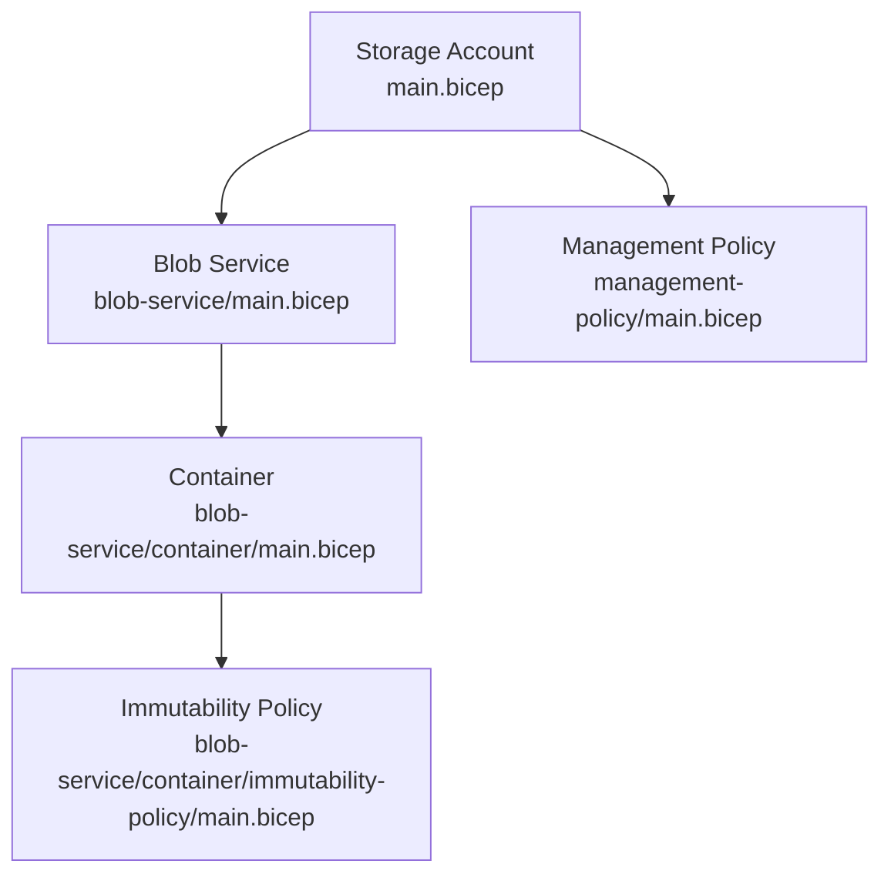
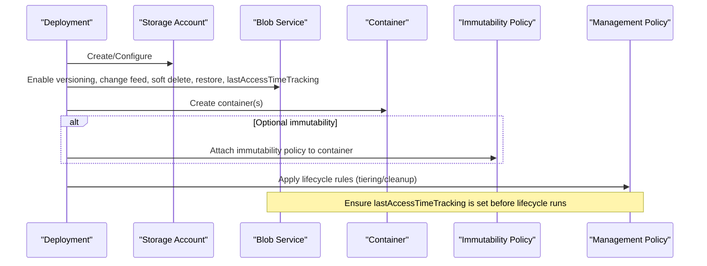
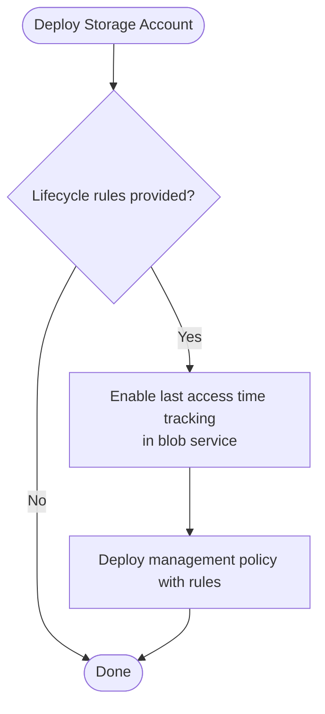
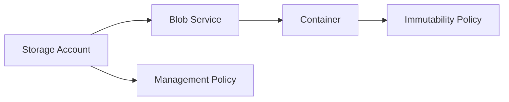

# Management Policies Module

<cite>
**Referenced Files in This Document**
- [main.bicep](file://bicep/modules/storage-account/management-policy/main.bicep)
- [README.md](file://bicep/modules/storage-account/management-policy/README.md)
- [main.bicep](file://bicep/modules/storage-account/blob-service/main.bicep)
- [main.bicep](file://bicep/modules/storage-account/blob-service/container/main.bicep)
- [main.bicep](file://bicep/modules/storage-account/blob-service/container/immutability-policy/main.bicep)
- [main.bicep](file://bicep/modules/storage-account/main.bicep)
</cite>

## Table of Contents
1. [Introduction](#introduction)
2. [Project Structure](#project-structure)
3. [Core Components](#core-components)
4. [Architecture Overview](#architecture-overview)
5. [Detailed Component Analysis](#detailed-component-analysis)
6. [Dependency Analysis](#dependency-analysis)
7. [Performance Considerations](#performance-considerations)
8. [Troubleshooting Guide](#troubleshooting-guide)
9. [Conclusion](#conclusion)
10. [Appendices](#appendices)

## Introduction
This document explains the Management Policies Bicep module that automates data lifecycle management for Azure Storage. It covers how to define policy rules for automatic tiering between Hot, Cool, and Archive tiers based on access patterns, how last access time tracking integrates with these policies, and how cleanup actions (delete/expiry) are configured. It also details integration points with blob versioning and container-level immutability policies to support compliance-driven retention and automated archival workflows. Examples illustrate cost optimization strategies and compliance scenarios using the provided modules.

## Project Structure
The storage account module orchestrates several submodules:
- Blob service configuration including versioning, change feed, soft delete, restore policy, and last access time tracking.
- Container creation with optional immutability policy attachment.
- Management policy deployment that applies lifecycle rules to the storage account.

**Diagram sources**
- [main.bicep:554-564](file://bicep/modules/storage-account/main.bicep#L554-L564)
- [main.bicep:71-117](file://bicep/modules/storage-account/blob-service/main.bicep#L71-L117)
- [main.bicep:116-165](file://bicep/modules/storage-account/blob-service/container/main.bicep#L116-L165)
- [main.bicep:21-41](file://bicep/modules/storage-account/blob-service/container/immutability-policy/main.bicep#L21-L41)
- [main.bicep:12-25](file://bicep/modules/storage-account/management-policy/main.bicep#L12-L25)

**Section sources**
- [main.bicep:554-564](file://bicep/modules/storage-account/main.bicep#L554-L564)
- [main.bicep:71-117](file://bicep/modules/storage-account/blob-service/main.bicep#L71-L117)
- [main.bicep:116-165](file://bicep/modules/storage-account/blob-service/container/main.bicep#L116-L165)
- [main.bicep:21-41](file://bicep/modules/storage-account/blob-service/container/immutability-policy/main.bicep#L21-L41)
- [main.bicep:12-25](file://bicep/modules/storage-account/management-policy/main.bicep#L12-L25)

## Core Components
- Management Policy module: Deploys a single default management policy resource under the storage account and accepts an array of rule definitions.
- Blob Service module: Enables features like versioning, change feed, soft delete, restore policy, and last access time tracking.
- Container module: Creates containers and optionally attaches an immutability policy per container.
- Immutability Policy module: Defines retention periods and append-write behavior for compliant blobs.

Key capabilities exposed by parameters:
- Last access time tracking at the blob service level to enable time-based tiering and deletion decisions.
- Versioning and immutability to preserve historical versions and enforce retention.
- Lifecycle rules to automate tiering and cleanup.

**Section sources**
- [main.bicep:12-25](file://bicep/modules/storage-account/management-policy/main.bicep#L12-L25)
- [main.bicep:71-117](file://bicep/modules/storage-account/blob-service/main.bicep#L71-L117)
- [main.bicep:116-165](file://bicep/modules/storage-account/blob-service/container/main.bicep#L116-L165)
- [main.bicep:21-41](file://bicep/modules/storage-account/blob-service/container/immutability-policy/main.bicep#L21-L41)

## Architecture Overview
The storage account module composes services and policies as follows:
- The main module deploys the storage account and conditionally deploys the management policy module when lifecycle rules are provided.
- The blob service module configures versioning, change feed, soft delete, restore policy, and last access time tracking.
- Containers can be created with optional immutability policies attached.
- A dependency ensures last access time tracking is enabled before applying lifecycle rules that rely on it.

**Diagram sources**
- [main.bicep:554-564](file://bicep/modules/storage-account/main.bicep#L554-L564)
- [main.bicep:71-117](file://bicep/modules/storage-account/blob-service/main.bicep#L71-L117)
- [main.bicep:116-165](file://bicep/modules/storage-account/blob-service/container/main.bicep#L116-L165)
- [main.bicep:21-41](file://bicep/modules/storage-account/blob-service/container/immutability-policy/main.bicep#L21-L41)
- [main.bicep:12-25](file://bicep/modules/storage-account/management-policy/main.bicep#L12-L25)

## Detailed Component Analysis

### Management Policy Module
Purpose:
- Deploys a default management policy resource under the specified storage account.
- Accepts an array of rule definitions to configure lifecycle behaviors such as tiering and deletion.

Inputs:
- storageAccountName: Parent storage account reference.
- rules: Array of lifecycle rule definitions.

Outputs:
- Resource ID, name, and resource group of the deployed policy.

Behavior:
- Creates a management policy named “default” and assigns the provided rules to it.

Usage notes:
- Rules typically include filters (e.g., prefixMatch, blobTypes, blobIndexMatch) and actions (e.g., tierToCool, tierToArchive, delete).
- For last-access-time-based actions, ensure last access time tracking is enabled at the blob service level.

**Section sources**
- [main.bicep:12-25](file://bicep/modules/storage-account/management-policy/main.bicep#L12-L25)
- [README.md:17-52](file://bicep/modules/storage-account/management-policy/README.md#L17-L52)

### Blob Service Module
Purpose:
- Configures core blob service settings relevant to lifecycle and compliance:
  - Versioning: maintains previous versions of blobs.
  - Change feed: event logging for blob changes.
  - Soft delete: retains deleted blobs/containers for a configurable period.
  - Restore policy: point-in-time restore capability (requires versioning, change feed, and soft delete).
  - Last access time tracking: enables time-based lifecycle actions.

Key parameters:
- isVersioningEnabled: toggles versioning.
- lastAccessTimeTrackingPolicyEnabled: toggles last access time tracking and sets granularity.
- deleteRetentionPolicyEnabled/days: soft delete retention for blobs.
- containerDeleteRetentionPolicyEnabled/days: soft delete retention for containers.
- restorePolicyEnabled/days: point-in-time restore window.

Integration:
- When last access time tracking is enabled, lifecycle rules can use daysAfterLastAccessTimeGreaterThan to move blobs to lower-cost tiers or delete them.

**Section sources**
- [main.bicep:71-117](file://bicep/modules/storage-account/blob-service/main.bicep#L71-L117)

### Container Module
Purpose:
- Creates one or more containers with optional encryption scope, NFS settings, metadata, and public access controls.
- Supports enabling immutable storage with versioning at the container level.
- Optionally attaches an immutability policy to enforce retention and write protections.

Key parameters:
- immutableStorageWithVersioningEnabled: enables object-level immutability with versioning at container creation.
- immutabilityPolicyProperties: passes through immutability policy settings to the nested module.

Outputs:
- Name, resource ID, and resource group of the container.

**Section sources**
- [main.bicep:116-165](file://bicep/modules/storage-account/blob-service/container/main.bicep#L116-L165)

### Immutability Policy Module
Purpose:
- Deploys an immutability policy for a specific container to enforce retention and controlled writes.

Parameters:
- immutabilityPeriodSinceCreationInDays: retention duration since policy creation.
- allowProtectedAppendWrites: allows appending to append blobs while maintaining protection.
- allowProtectedAppendWritesAll: allows appending to both append and block blobs while maintaining protection.

Outputs:
- Name, resource ID, and resource group of the immutability policy.

Compliance impact:
- Enforces retention windows and prevents modification/deletion within the protected period, supporting regulatory requirements.

**Section sources**
- [main.bicep:21-41](file://bicep/modules/storage-account/blob-service/container/immutability-policy/main.bicep#L21-L41)

### Integration Between Modules
- The main storage account module conditionally deploys the management policy module only when lifecycle rules are provided.
- A dependency ensures that last access time tracking is configured before lifecycle rules are applied, preventing misconfiguration errors.

**Diagram sources**
- [main.bicep:554-564](file://bicep/modules/storage-account/main.bicep#L554-L564)
- [main.bicep:71-117](file://bicep/modules/storage-account/blob-service/main.bicep#L71-L117)

**Section sources**
- [main.bicep:554-564](file://bicep/modules/storage-account/main.bicep#L554-L564)

## Dependency Analysis
- Management policy depends on the storage account and should be applied after last access time tracking is enabled.
- Container immutability policy depends on the container and storage account.
- Blob service features (versioning, change feed, soft delete, restore) are independent but often used together to support lifecycle and compliance.

**Diagram sources**
- [main.bicep:554-564](file://bicep/modules/storage-account/main.bicep#L554-L564)
- [main.bicep:71-117](file://bicep/modules/storage-account/blob-service/main.bicep#L71-L117)
- [main.bicep:116-165](file://bicep/modules/storage-account/blob-service/container/main.bicep#L116-L165)
- [main.bicep:21-41](file://bicep/modules/storage-account/blob-service/container/immutability-policy/main.bicep#L21-L41)
- [main.bicep:12-25](file://bicep/modules/storage-account/management-policy/main.bicep#L12-L25)

**Section sources**
- [main.bicep:554-564](file://bicep/modules/storage-account/main.bicep#L554-L564)
- [main.bicep:71-117](file://bicep/modules/storage-account/blob-service/main.bicep#L71-L117)
- [main.bicep:116-165](file://bicep/modules/storage-account/blob-service/container/main.bicep#L116-L165)
- [main.bicep:21-41](file://bicep/modules/storage-account/blob-service/container/immutability-policy/main.bicep#L21-L41)
- [main.bicep:12-25](file://bicep/modules/storage-account/management-policy/main.bicep#L12-L25)

## Performance Considerations
- Enable last access time tracking only when needed; it adds overhead to track access patterns.
- Use precise filters (prefixMatch, blobTypes, blobIndexMatch) to limit the scope of lifecycle rules and reduce processing load.
- Combine soft delete and restore policies to balance recoverability with storage costs.
- Avoid overly aggressive deletion thresholds; tune daysAfterModificationGreaterThan and daysAfterLastAccessTimeGreaterThan based on workload patterns.

[No sources needed since this section provides general guidance]

## Troubleshooting Guide
Common issues and resolutions:
- Lifecycle rules not triggering tiering or deletion:
  - Verify last access time tracking is enabled in the blob service.
  - Confirm filters match your blob naming and types.
  - Ensure rules are enabled and correctly structured.
- Immutability policy conflicts:
  - Retention periods must align with operational needs; extending or shortening requires unlocked policies where applicable.
  - Protected append writes cannot be changed via certain APIs; plan updates accordingly.
- Restore policy prerequisites:
  - Requires versioning, change feed, and soft delete to be enabled simultaneously.

Operational checks:
- Validate blob service settings for versioning, change feed, soft delete, and restore policy.
- Review container immutability policy properties and retention windows.
- Inspect management policy rules and their dependencies.

**Section sources**
- [main.bicep:71-117](file://bicep/modules/storage-account/blob-service/main.bicep#L71-L117)
- [main.bicep:116-165](file://bicep/modules/storage-account/blob-service/container/main.bicep#L116-L165)
- [main.bicep:21-41](file://bicep/modules/storage-account/blob-service/container/immutability-policy/main.bicep#L21-L41)
- [main.bicep:12-25](file://bicep/modules/storage-account/management-policy/main.bicep#L12-L25)

## Conclusion
The Management Policies module, combined with blob service features and container immutability policies, provides a robust foundation for automated data lifecycle management in Azure Storage. By enabling last access time tracking and defining precise lifecycle rules, organizations can optimize costs through tiering and implement compliance-driven retention via immutability policies. The modular design ensures clear separation of concerns and flexible composition for diverse workloads.

[No sources needed since this section summarizes without analyzing specific files]

## Appendices

### Example Scenarios Using Provided Parameters
- Cost optimization strategy:
  - Enable last access time tracking.
  - Define a lifecycle rule that moves blobs to Cool after a threshold of days without access and deletes them after a longer inactivity period.
  - Filter by prefix or tags to target specific datasets.
- Compliance-driven retention:
  - Enable immutable storage with versioning at the container level.
  - Attach an immutability policy with a retention period aligned to regulatory requirements.
  - Use soft delete and restore policy to protect against accidental loss while honoring retention.
- Automated archival workflow:
  - Configure lifecycle rules to archive infrequently accessed data to Archive tier.
  - Combine with change feed to trigger downstream processes for archival notifications or indexing.

References to parameter examples:
- Management policy rules and last access time tracking usage are demonstrated in the storage account module’s documentation examples.

**Section sources**
- [main.bicep:554-564](file://bicep/modules/storage-account/main.bicep#L554-L564)
- [main.bicep:71-117](file://bicep/modules/storage-account/blob-service/main.bicep#L71-L117)
- [main.bicep:116-165](file://bicep/modules/storage-account/blob-service/container/main.bicep#L116-L165)
- [main.bicep:21-41](file://bicep/modules/storage-account/blob-service/container/immutability-policy/main.bicep#L21-L41)
- [README.md:17-52](file://bicep/modules/storage-account/management-policy/README.md#L17-L52)