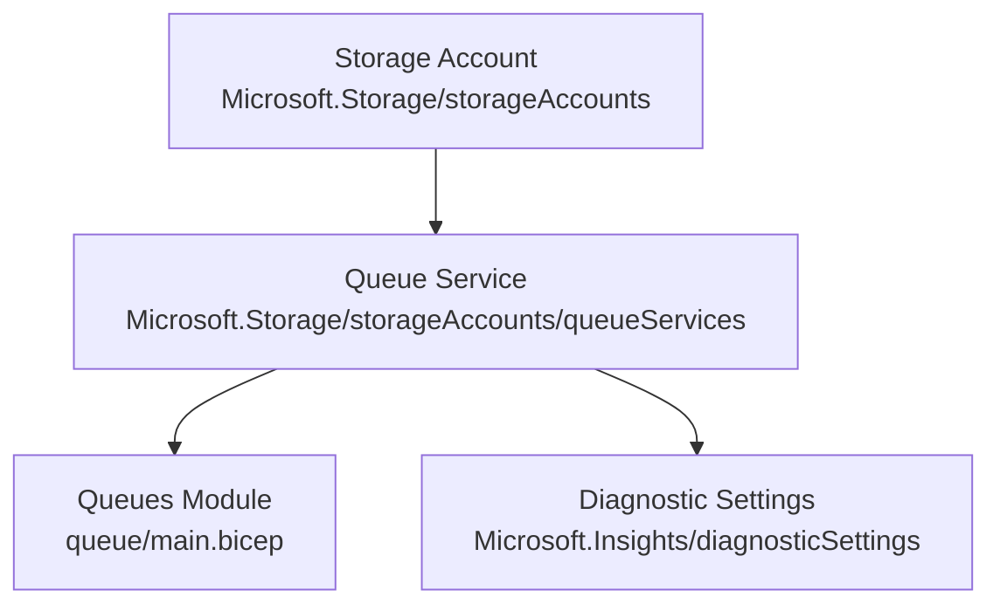
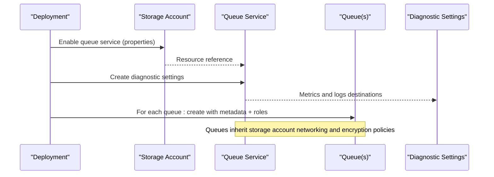
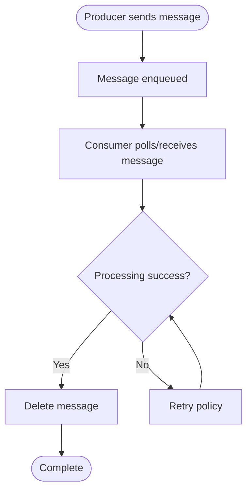
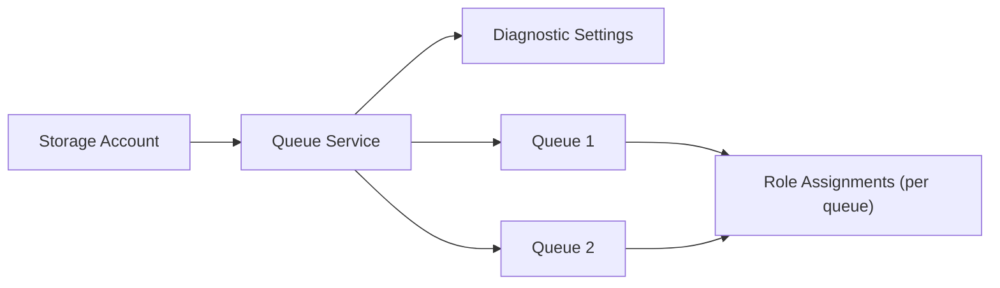

# Queue Service Module

<cite>
**Referenced Files in This Document**
- [main.bicep](file://bicep/modules/storage-account/queue-service/main.bicep)
- [README.md](file://bicep/modules/storage-account/queue-service/README.md)
- [queue/main.bicep](file://bicep/modules/storage-account/queue-service/queue/main.bicep)
- [queue/README.md](file://bicep/modules/storage-account/queue-service/queue/README.md)
- [storage main.bicep](file://bicep/modules/storage-account/main.bicep)
- [storage main.json](file://bicep/modules/storage-account/main.json)
- [e2e max test](file://bicep/modules/storage-account/tests/e2e/max/main.test.bicep)
</cite>

## Table of Contents
1. Introduction
2. Project Structure
3. Core Components
4. Architecture Overview
5. Detailed Component Analysis
6. Dependency Analysis
7. Performance Considerations
8. Troubleshooting Guide
9. Conclusion
10. Appendices

## Introduction
This document explains the Queue Service Bicep module that provisions Azure Queue Storage within a storage account, creates queues with metadata and role-based access control, and configures diagnostic settings for monitoring and metrics collection. It also outlines integration patterns with Azure Functions, Logic Apps, and custom applications, along with guidance on message processing workflows, error handling strategies, and performance tuning for high-throughput scenarios.

## Project Structure
The queue service is implemented as a reusable Bicep module under the storage account module hierarchy:
- Queue Service module: provisions the queue service endpoint and optional diagnostic settings; iterates over a list of queues to create them via a nested module.
- Queue module: provisions individual queues under the default queue service and applies role assignments scoped to each queue.
- Parent storage account module: enables the queue service at the storage account level and passes parameters down to the queue service module.

**Diagram sources**
- [storage main.bicep:351-396](file://bicep/modules/storage-account/main.bicep#L351-L396)
- [main.bicep:19-56](file://bicep/modules/storage-account/queue-service/main.bicep#L19-L56)
- [queue/main.bicep:76-90](file://bicep/modules/storage-account/queue-service/queue/main.bicep#L76-L90)

**Section sources**
- [storage main.bicep:110-114](file://bicep/modules/storage-account/main.bicep#L110-L114)
- [main.bicep:1-27](file://bicep/modules/storage-account/queue-service/main.bicep#L1-L27)
- [queue/main.bicep:1-16](file://bicep/modules/storage-account/queue-service/queue/main.bicep#L1-L16)

## Core Components
- Queue Service resource: references an existing storage account and enables the queue service endpoint.
- Diagnostic settings: one or more configurations to stream metrics and logs to Log Analytics, Storage, or Event Hubs.
- Queues: created by iterating over a parameter array; each queue supports metadata and role assignments.
- Role assignments: built-in roles are supported by name or ID, including dedicated queue data roles (sender, processor, reader).

Key capabilities exposed by the modules:
- Create multiple queues in a single deployment.
- Attach metadata to queues for classification or routing hints.
- Assign least-privilege roles per queue.
- Configure centralized diagnostics for observability.

**Section sources**
- [main.bicep:23-68](file://bicep/modules/storage-account/queue-service/main.bicep#L23-L68)
- [queue/main.bicep:19-74](file://bicep/modules/storage-account/queue-service/queue/main.bicep#L19-L74)
- [queue/main.bicep:84-106](file://bicep/modules/storage-account/queue-service/queue/main.bicep#L84-L106)
- [README.md:21-34](file://bicep/modules/storage-account/queue-service/README.md#L21-L34)
- [queue/README.md:19-38](file://bicep/modules/storage-account/queue-service/queue/README.md#L19-L38)

## Architecture Overview
The module composes resources to deliver a secure, observable queueing capability:
- The parent storage account module enables the queue service and exposes parameters for queue creation and diagnostics.
- The queue service module instantiates the queue service endpoint and sets up diagnostic settings.
- A nested loop deploys each queue with metadata and role assignments.

**Diagram sources**
- [storage main.bicep:351-396](file://bicep/modules/storage-account/main.bicep#L351-L396)
- [main.bicep:23-68](file://bicep/modules/storage-account/queue-service/main.bicep#L23-L68)
- [queue/main.bicep:84-106](file://bicep/modules/storage-account/queue-service/queue/main.bicep#L84-L106)

## Detailed Component Analysis

### Queue Service Module (parent)
Responsibilities:
- Reference an existing storage account.
- Create the queue service endpoint.
- Configure one or more diagnostic settings targeting metrics and logs.
- Iterate over a queues array to deploy each queue via the nested module.

Parameters and behavior:
- storageAccountName: required when used standalone; otherwise provided by parent.
- queues: array of queue definitions (name, metadata, roleAssignments).
- diagnosticSettings: array of diagnostic setting objects supporting metric categories, log categories/groups, and destinations (Log Analytics, Storage, Event Hubs).

Outputs:
- name, resourceId, resourceGroupName for the queue service endpoint.

**Section sources**
- [main.bicep:5-14](file://bicep/modules/storage-account/queue-service/main.bicep#L5-L14)
- [main.bicep:19-27](file://bicep/modules/storage-account/queue-service/main.bicep#L19-L27)
- [main.bicep:29-56](file://bicep/modules/storage-account/queue-service/main.bicep#L29-L56)
- [main.bicep:58-77](file://bicep/modules/storage-account/queue-service/main.bicep#L58-L77)
- [README.md:21-34](file://bicep/modules/storage-account/queue-service/README.md#L21-L34)

### Queue Module (nested)
Responsibilities:
- Create a queue under the default queue service of the specified storage account.
- Apply metadata to the queue.
- Assign roles scoped to the queue using either built-in role names or IDs.

Role support:
- Built-in mapping includes queue-specific roles such as Storage Queue Data Message Sender, Processor, and Reader, plus broader storage roles.

Outputs:
- name, resourceId, resourceGroupName for the created queue.

**Section sources**
- [queue/main.bicep:5-17](file://bicep/modules/storage-account/queue-service/queue/main.bicep#L5-L17)
- [queue/main.bicep:19-74](file://bicep/modules/storage-account/queue-service/queue/main.bicep#L19-L74)
- [queue/main.bicep:76-90](file://bicep/modules/storage-account/queue-service/queue/main.bicep#L76-L90)
- [queue/main.bicep:92-116](file://bicep/modules/storage-account/queue-service/queue/main.bicep#L92-L116)
- [queue/README.md:19-38](file://bicep/modules/storage-account/queue-service/queue/README.md#L19-L38)

### Diagnostic Settings Configuration
Capabilities:
- Stream all metrics or specific metric categories.
- Stream all logs or specific log categories/groups.
- Route to Log Analytics workspace, storage account, or Event Hubs.
- Support marketplace partner integrations and Log Analytics destination type selection.

Usage examples in tests demonstrate enabling AllMetrics and configuring destinations.

**Section sources**
- [main.bicep:29-56](file://bicep/modules/storage-account/queue-service/main.bicep#L29-L56)
- [README.md:43-180](file://bicep/modules/storage-account/queue-service/README.md#L43-L180)
- [e2e max test:375-389](file://bicep/modules/storage-account/tests/e2e/max/main.test.bicep#L375-L389)

### Integration Patterns

#### Azure Functions
- Use the Queue Trigger to process messages automatically when they appear.
- Bindings can be configured to read from the queue name provisioned by this module.
- Ensure the function’s managed identity or service principal has the Storage Queue Data Message Processor role on the queue.

#### Logic Apps
- Use the “When a queue message is received” trigger to start workflows.
- Alternatively, use actions to peek, get, update, or delete messages for custom orchestration.
- Grant appropriate queue data roles to the Logic App identity.

#### Custom Applications
- Use the Azure SDK or REST API to send, receive, update, and delete messages.
- Authenticate via Azure AD (preferred) or shared key if enabled.
- Apply least privilege by granting only the necessary queue data roles per application identity.

Note: These patterns rely on standard Azure Queue Storage client libraries and bindings; the module provides the queue resources and permissions needed for these integrations.

[No sources needed since this section describes general integration patterns without analyzing specific files]

### Message Processing Workflows
A typical end-to-end flow:
- Producer sends a message to the queue.
- Consumer (Function, Logic App, or app) receives the message.
- On successful processing, the consumer deletes the message.
- If processing fails, the consumer handles retries and dead-lettering according to application logic.

[No sources needed since this diagram shows conceptual workflow, not actual code structure]

### Error Handling Strategies
Recommended approaches:
- Implement retry with exponential backoff for transient errors.
- Move persistently failing messages to a dead-letter queue after a threshold.
- Capture detailed error context in logs and correlate with request IDs.
- Use diagnostic settings to monitor failure rates and latency.

[No sources needed since this section provides general guidance]

### Performance Tuning for High Throughput
Guidance:
- Scale consumers horizontally to match throughput requirements.
- Tune concurrency settings in Function triggers or application workers.
- Batch operations where possible to reduce round trips.
- Monitor metrics and logs via diagnostic settings to identify bottlenecks.
- Choose appropriate storage SKU and network configuration at the storage account level.

[No sources needed since this section provides general guidance]

## Dependency Analysis
The queue service depends on the parent storage account and optionally on diagnostic destinations. Each queue depends on the queue service and its assigned roles.

**Diagram sources**
- [storage main.bicep:351-396](file://bicep/modules/storage-account/main.bicep#L351-L396)
- [main.bicep:23-68](file://bicep/modules/storage-account/queue-service/main.bicep#L23-L68)
- [queue/main.bicep:84-106](file://bicep/modules/storage-account/queue-service/queue/main.bicep#L84-L106)

**Section sources**
- [storage main.json:4252-4279](file://bicep/modules/storage-account/main.json#L4252-L4279)
- [main.bicep:58-68](file://bicep/modules/storage-account/queue-service/main.bicep#L58-L68)

## Performance Considerations
- Use horizontal scaling for consumers to handle spikes.
- Leverage diagnostic settings to collect AllMetrics and relevant logs for capacity planning.
- Align storage account SKU and network settings with expected throughput and latency targets.
- Avoid excessive small-message churn; consider batching at the application layer.

[No sources needed since this section provides general guidance]

## Troubleshooting Guide
Common issues and resolutions:
- Authentication failures: verify the identity has the correct queue data role (Sender, Processor, or Reader) on the target queue.
- Network connectivity: ensure private endpoints or firewall rules allow access from consumers.
- Missing diagnostics: confirm diagnostic settings are deployed and point to valid destinations.
- Deployment ordering: queue service must exist before creating queues; the module enforces dependencies.

Validation references:
- Role mappings include queue-specific roles and are applied per queue.
- Diagnostic settings support multiple destinations and can be validated via ARM/Bicep outputs.

**Section sources**
- [queue/main.bicep:19-74](file://bicep/modules/storage-account/queue-service/queue/main.bicep#L19-L74)
- [main.bicep:29-56](file://bicep/modules/storage-account/queue-service/main.bicep#L29-L56)
- [README.md:43-180](file://bicep/modules/storage-account/queue-service/README.md#L43-L180)

## Conclusion
The Queue Service Bicep module provides a robust foundation for provisioning Azure Queue Storage with secure access controls and comprehensive observability. By combining queue creation, metadata, role assignments, and diagnostic settings, teams can integrate reliably with Azure Functions, Logic Apps, and custom applications while following best practices for performance and error handling.

[No sources needed since this section summarizes without analyzing specific files]

## Appendices

### Parameters Summary
- Queue Service module parameters:
  - storageAccountName: string
  - queues: array of { name, metadata, roleAssignments }
  - diagnosticSettings: array of diagnostic setting objects
- Queue module parameters:
  - storageAccountName: string
  - name: string
  - metadata: object
  - roleAssignments: array of role assignment objects

**Section sources**
- [README.md:21-34](file://bicep/modules/storage-account/queue-service/README.md#L21-L34)
- [queue/README.md:19-38](file://bicep/modules/storage-account/queue-service/queue/README.md#L19-L38)

### Example Usage References
- E2E test demonstrates diagnostic settings and queue creation with metadata and role assignments.

**Section sources**
- [e2e max test:375-422](file://bicep/modules/storage-account/tests/e2e/max/main.test.bicep#L375-L422)