# Storage Account Module

<cite>
**Referenced Files in This Document**
- [main.bicep](file://bicep/modules/storage-account/main.bicep)
- [README.md](file://bicep/modules/storage-account/README.md)
- [blob-service/main.bicep](file://bicep/modules/storage-account/blob-service/main.bicep)
- [blob-service/container/main.bicep](file://bicep/modules/storage-account/blob-service/container/main.bicep)
- [blob-service/container/immutability-policy/main.bicep](file://bicep/modules/storage-account/blob-service/container/immutability-policy/main.bicep)
- [file-service/main.bicep](file://bicep/modules/storage-account/file-service/main.bicep)
- [file-service/share/main.bicep](file://bicep/modules/storage-account/file-service/share/main.bicep)
- [queue-service/main.bicep](file://bicep/modules/storage-account/queue-service/main.bicep)
- [queue-service/queue/main.bicep](file://bicep/modules/storage-account/queue-service/queue/main.bicep)
- [table-service/main.bicep](file://bicep/modules/storage-account/table-service/main.bicep)
- [table-service/table/main.bicep](file://bicep/modules/storage-account/table-service/table/main.bicep)
- [local-user/main.bicep](file://bicep/modules/storage-account/local-user/main.bicep)
- [management-policy/main.bicep](file://bicep/modules/storage-account/management-policy/main.bicep)
- [modules/keyVaultExport.bicep](file://bicep/modules/storage-account/modules/keyVaultExport.bicep)
</cite>

## Table of Contents
1. [Introduction](#introduction)
2. [Project Structure](#project-structure)
3. [Core Components](#core-components)
4. [Architecture Overview](#architecture-overview)
5. [Detailed Component Analysis](#detailed-component-analysis)
6. [Dependency Analysis](#dependency-analysis)
7. [Performance Considerations](#performance-considerations)
8. [Troubleshooting Guide](#troubleshooting-guide)
9. [Conclusion](#conclusion)
10. [Appendices](#appendices)

## Introduction
This document provides comprehensive documentation for the Storage Account Bicep module that deploys a complete Azure Storage account with multiple service types: Blob, File, Queue, and Table. It covers main storage account configuration including networking, security, encryption, and local user authentication. It also details each sub-service module (containers with immutability policies, file shares with access controls, queues, tables), parameter validation, outputs, and integration patterns with Key Vault secrets. Examples of common deployment scenarios, performance optimization settings, and troubleshooting guidance are included to help you deploy and operate storage securely and efficiently.

## Project Structure
The module is organized into a top-level storage account module and nested modules for each service and feature:
- Top-level module orchestrates the storage account, networking, encryption, diagnostics, locks, role assignments, private endpoints, management policies, local users, and service modules.
- Sub-modules encapsulate specific services and resources:
  - Blob service: container creation, versioning, soft delete, change feed, last access time tracking, restore policy, and immutability policies.
  - File service: share creation, protocol settings, quotas, NFS/SMB options.
  - Queue service: queue creation and metadata.
  - Table service: table creation.
  - Local user: SFTP authentication via local users.
  - Management policy: lifecycle rules for data tiering and retention.
  - Key Vault export: writes storage keys, connection strings, endpoints, and SAS tokens to Key Vault.

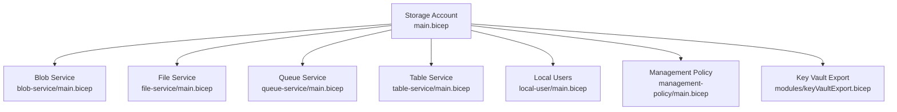

**Diagram sources**
- [main.bicep:351-701](file://bicep/modules/storage-account/main.bicep#L351-L701)

**Section sources**
- [main.bicep:1-190](file://bicep/modules/storage-account/main.bicep#L1-L190)
- [README.md:15-56](file://bicep/modules/storage-account/README.md#L15-L56)

## Core Components
- Storage Account resource with identity, SKU, kind, access tier, TLS, network ACLs, public access, and encryption (including customer-managed keys).
- Private endpoints per service (blob, file, queue, table, web, dfs).
- Role assignments at account level.
- Diagnostic settings for logs and metrics.
- Locks for protection.
- Management policies for lifecycle automation.
- Local users for SFTP authentication.
- Service modules for blob, file, queue, and table.
- Key Vault export for secrets (account name, keys, connection strings, endpoints, SAS token).

Key capabilities exposed by parameters include:
- Networking: default deny firewall, IP/VNet rules, bypass, private endpoints, DNS endpoint type, custom domain.
- Security: minimum TLS, shared key access toggle, OAuth default, cross-tenant replication, allowed copy scope.
- Encryption: infrastructure encryption, customer-managed keys with optional user-assigned identity.
- Services: enable/disable features per service type based on account kind; defaults for retention and policies.

**Section sources**
- [main.bicep:193-451](file://bicep/modules/storage-account/main.bicep#L193-L451)
- [main.bicep:453-701](file://bicep/modules/storage-account/main.bicep#L453-L701)

## Architecture Overview
The module composes a storage account with optional services and integrations. The flow includes:
- Provisioning the storage account with identity and encryption.
- Applying network ACLs and private endpoints.
- Creating service modules for blob, file, queue, and table as configured.
- Optionally deploying management policies and local users.
- Exporting secrets to Key Vault when configured.

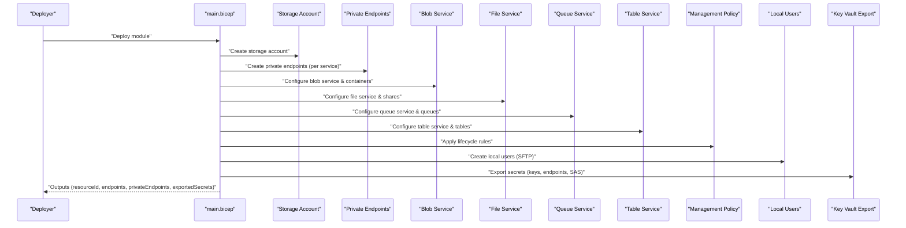

**Diagram sources**
- [main.bicep:351-701](file://bicep/modules/storage-account/main.bicep#L351-L701)

## Detailed Component Analysis

### Storage Account Configuration (Networking, Security, Encryption)
- Identity: supports system-assigned and/or user-assigned managed identities.
- SKU and kind: configurable storage account types and SKUs; access tier applies where supported.
- Network ACLs: default deny with optional IP and VNet rules; bypass options; public network access control.
- TLS: minimum TLS version enforced.
- Encryption: infrastructure encryption enabled by default; support for customer-managed keys with optional user-assigned identity.
- Private endpoints: one per service group; supports manual or automatic connections and DNS zone groups.
- Diagnostics and locks: configurable diagnostic settings and resource locks.
- Outputs: resource ID, name, location, service endpoints, private endpoints, and exported secrets references.

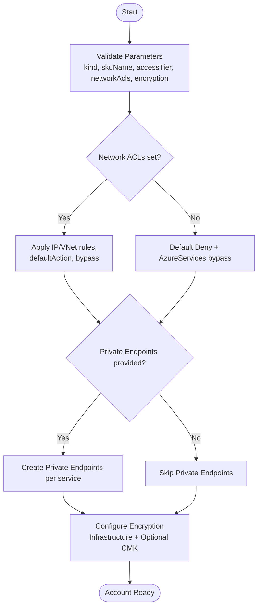

**Diagram sources**
- [main.bicep:351-451](file://bicep/modules/storage-account/main.bicep#L351-L451)
- [main.bicep:502-552](file://bicep/modules/storage-account/main.bicep#L502-L552)

**Section sources**
- [main.bicep:193-451](file://bicep/modules/storage-account/main.bicep#L193-L451)
- [main.bicep:703-741](file://bicep/modules/storage-account/main.bicep#L703-L741)

### Blob Service: Containers and Immutability Policies
- Container-level features: soft delete, versioning, restore policy, last access time tracking, change feed, CORS, default service version.
- Container creation: name, metadata, public access, encryption scope, NFS squash options, immutable storage with versioning.
- Immutability policy: time-based retention, protected append writes, and all-blob append behavior.

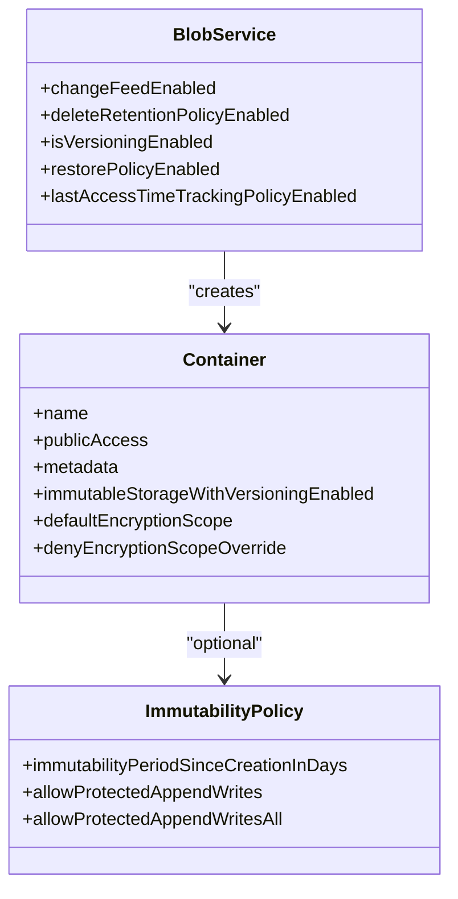

**Diagram sources**
- [blob-service/main.bicep:75-117](file://bicep/modules/storage-account/blob-service/main.bicep#L75-L117)
- [blob-service/container/main.bicep:116-143](file://bicep/modules/storage-account/blob-service/container/main.bicep#L116-L143)
- [blob-service/container/immutability-policy/main.bicep:33-41](file://bicep/modules/storage-account/blob-service/container/immutability-policy/main.bicep#L33-L41)

**Section sources**
- [blob-service/main.bicep:1-176](file://bicep/modules/storage-account/blob-service/main.bicep#L1-L176)
- [blob-service/container/main.bicep:1-169](file://bicep/modules/storage-account/blob-service/container/main.bicep#L1-L169)
- [blob-service/container/immutability-policy/main.bicep:1-51](file://bicep/modules/storage-account/blob-service/container/immutability-policy/main.bicep#L1-L51)

### File Service: Shares with Access Controls
- File service configuration: protocol settings, share delete retention policy.
- Share creation: name, access tier (Premium for FileStorage kind, otherwise TransactionOptimized/Hot/Cool), quota, protocols (NFS/SMB), root squash for NFS.
- Role assignments for shares via nested module workaround.

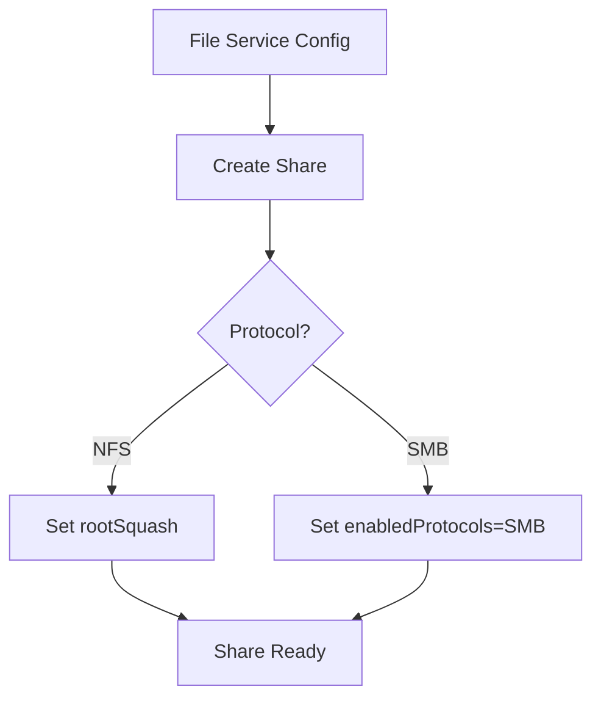

**Diagram sources**
- [file-service/main.bicep:34-41](file://bicep/modules/storage-account/file-service/main.bicep#L34-L41)
- [file-service/share/main.bicep:54-63](file://bicep/modules/storage-account/file-service/share/main.bicep#L54-L63)

**Section sources**
- [file-service/main.bicep:1-96](file://bicep/modules/storage-account/file-service/main.bicep#L1-L96)
- [file-service/share/main.bicep:1-82](file://bicep/modules/storage-account/file-service/share/main.bicep#L1-L82)

### Queue Service: Message Handling
- Queue service provisioning and queue creation with metadata.
- Role assignments for queues using built-in roles mapping.

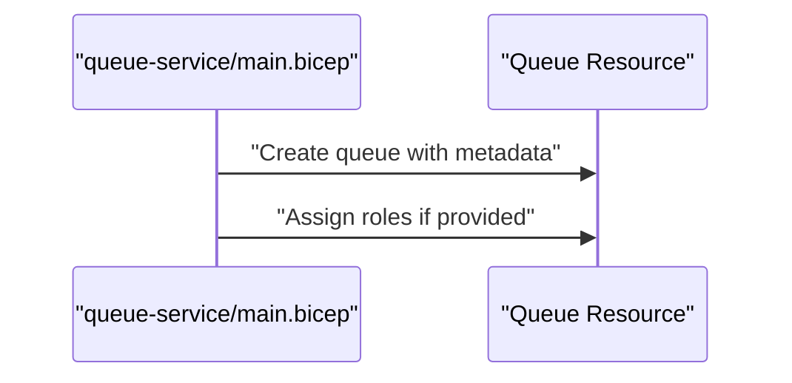

**Diagram sources**
- [queue-service/main.bicep:23-27](file://bicep/modules/storage-account/queue-service/main.bicep#L23-L27)
- [queue-service/queue/main.bicep:84-90](file://bicep/modules/storage-account/queue-service/queue/main.bicep#L84-L90)

**Section sources**
- [queue-service/main.bicep:1-78](file://bicep/modules/storage-account/queue-service/main.bicep#L1-L78)
- [queue-service/queue/main.bicep:1-116](file://bicep/modules/storage-account/queue-service/queue/main.bicep#L1-L116)

### Table Service: Entity Management
- Table service provisioning and table creation.
- Role assignments for tables using built-in roles mapping.

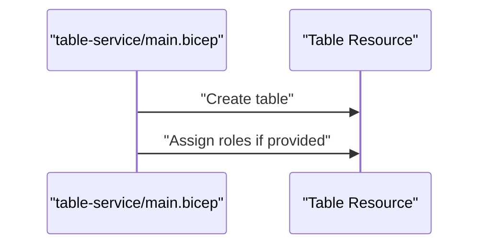

**Diagram sources**
- [table-service/main.bicep:23-27](file://bicep/modules/storage-account/table-service/main.bicep#L23-L27)
- [table-service/table/main.bicep:73-76](file://bicep/modules/storage-account/table-service/table/main.bicep#L73-L76)

**Section sources**
- [table-service/main.bicep:1-77](file://bicep/modules/storage-account/table-service/main.bicep#L1-L77)
- [table-service/table/main.bicep:1-102](file://bicep/modules/storage-account/table-service/table/main.bicep#L1-L102)

### Local User Authentication (SFTP)
- Local user creation for SFTP with SSH key/password flags, home directory, permission scopes, and authorized keys.
- Requires hierarchical namespace and SFTP enabled at account level.

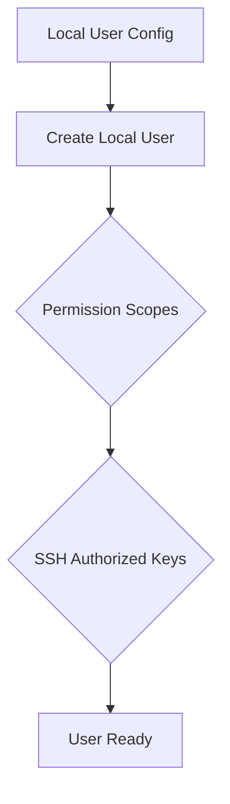

**Diagram sources**
- [local-user/main.bicep:34-45](file://bicep/modules/storage-account/local-user/main.bicep#L34-L45)

**Section sources**
- [local-user/main.bicep:1-71](file://bicep/modules/storage-account/local-user/main.bicep#L1-L71)

### Management Policy (Lifecycle Rules)
- Lifecycle rules for tiering and deletion actions based on filters and tags.
- Applied after blob service configuration to ensure last access time tracking is available if used.

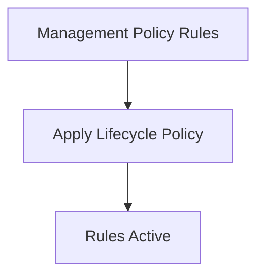

**Diagram sources**
- [management-policy/main.bicep:17-25](file://bicep/modules/storage-account/management-policy/main.bicep#L17-L25)

**Section sources**
- [management-policy/main.bicep:1-35](file://bicep/modules/storage-account/management-policy/main.bicep#L1-L35)

### Key Vault Integration (Secrets Export)
- Exports account name, access keys, connection strings, endpoints, and SAS token to Key Vault.
- Uses a helper module to create secrets and returns references for downstream consumption.

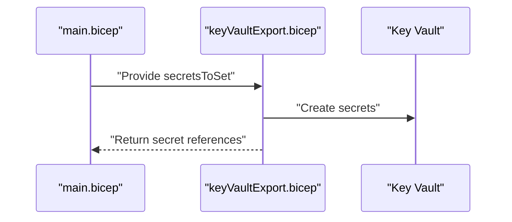

**Diagram sources**
- [main.bicep:640-701](file://bicep/modules/storage-account/main.bicep#L640-L701)
- [modules/keyVaultExport.bicep:16-42](file://bicep/modules/storage-account/modules/keyVaultExport.bicep#L16-L42)

**Section sources**
- [main.bicep:640-701](file://bicep/modules/storage-account/main.bicep#L640-L701)
- [modules/keyVaultExport.bicep:1-43](file://bicep/modules/storage-account/modules/keyVaultExport.bicep#L1-L43)

## Dependency Analysis
- The top-level module depends on:
  - Private endpoint module for secure connectivity per service.
  - Service modules for blob, file, queue, and table.
  - Management policy module for lifecycle rules.
  - Local user module for SFTP.
  - Key Vault export module for secrets.
- Service modules depend on existing storage account resources and may reference nested modules for role assignments or policies.

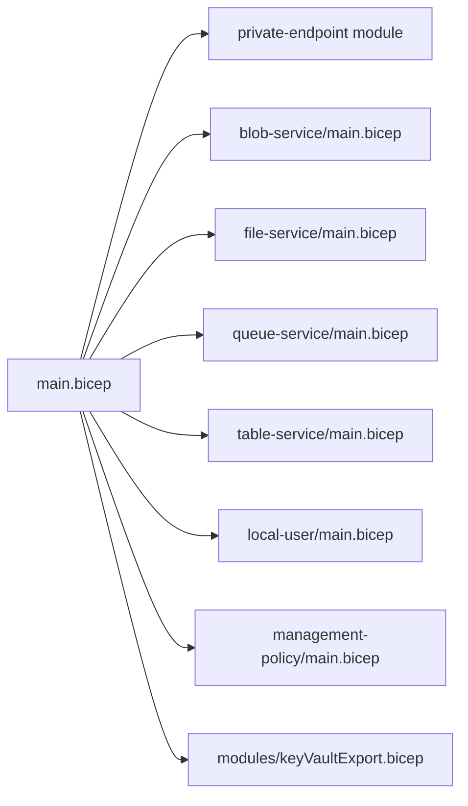

**Diagram sources**
- [main.bicep:502-701](file://bicep/modules/storage-account/main.bicep#L502-L701)

**Section sources**
- [main.bicep:502-701](file://bicep/modules/storage-account/main.bicep#L502-L701)

## Performance Considerations
- Choose appropriate SKU and kind:
  - Premium block blobs for high-performance workloads.
  - Standard tiers for cost-effective general-purpose storage.
- Enable last access time tracking for lifecycle rules that rely on access patterns.
- Use management policies to automate tiering and deletion to optimize costs and performance.
- Configure private endpoints to reduce latency and improve security for internal workloads.
- Set minimum TLS version to modern standards for secure and efficient communications.
- For large file shares, ensure SKU supports large file shares and configure appropriately.

[No sources needed since this section provides general guidance]

## Troubleshooting Guide
Common issues and resolutions:
- Connectivity denied by network ACLs:
  - Ensure default action is set appropriately and required IPs/VNets are whitelisted.
  - Verify bypass settings allow necessary Azure services.
- Private endpoint resolution failures:
  - Confirm private DNS zone groups are correctly configured.
  - Validate subnet and resource group scoping for private endpoints.
- SFTP login failures:
  - Ensure hierarchical namespace and SFTP are enabled at account level.
  - Check local user permissions and SSH keys.
- Immutability policy errors:
  - Verify container-level immutability is enabled before applying policies.
  - Review allowed operations for protected append writes.
- Key Vault secret export failures:
  - Confirm Key Vault exists and has proper permissions.
  - Validate secret names and values being exported.

**Section sources**
- [main.bicep:428-451](file://bicep/modules/storage-account/main.bicep#L428-L451)
- [main.bicep:502-552](file://bicep/modules/storage-account/main.bicep#L502-L552)
- [local-user/main.bicep:34-45](file://bicep/modules/storage-account/local-user/main.bicep#L34-L45)
- [blob-service/container/immutability-policy/main.bicep:33-41](file://bicep/modules/storage-account/blob-service/container/immutability-policy/main.bicep#L33-L41)
- [modules/keyVaultExport.bicep:16-42](file://bicep/modules/storage-account/modules/keyVaultExport.bicep#L16-L42)

## Conclusion
The Storage Account Bicep module provides a robust, modular approach to deploying Azure Storage with comprehensive networking, security, encryption, and service configurations. It supports advanced features such as immutability policies, lifecycle management, private endpoints, and Key Vault secret exports. By leveraging the documented parameters and outputs, teams can deploy secure and performant storage solutions tailored to their needs.

[No sources needed since this section summarizes without analyzing specific files]

## Appendices

### Common Deployment Scenarios
- Blob-only storage with containers and immutability policies:
  - Configure blobServices with containers and immutabilityPolicyProperties.
  - Enable change feed and versioning for auditability.
- File shares with NFS or SMB:
  - Set enabledProtocols and rootSquash for NFS; use Premium access tier for FileStorage kind.
- Queues and Tables for messaging and structured data:
  - Define queues and tables with metadata and role assignments.
- Local users for SFTP:
  - Enable hierarchical namespace and SFTP; create local users with SSH keys and permission scopes.
- Customer-managed keys:
  - Provide key vault and key details; optionally assign user-assigned identity for encryption operations.

**Section sources**
- [README.md:58-800](file://bicep/modules/storage-account/README.md#L58-L800)
- [main.bicep:97-140](file://bicep/modules/storage-account/main.bicep#L97-L140)
- [blob-service/container/main.bicep:27-35](file://bicep/modules/storage-account/blob-service/container/main.bicep#L27-L35)
- [file-service/share/main.bicep:15-41](file://bicep/modules/storage-account/file-service/share/main.bicep#L15-L41)
- [local-user/main.bicep:9-28](file://bicep/modules/storage-account/local-user/main.bicep#L9-L28)
- [main.bicep:331-408](file://bicep/modules/storage-account/main.bicep#L331-L408)

### Parameter Validation Highlights
- Name constraints and allowed kinds/SKUs.
- Conditional parameters (e.g., hierarchical namespace required for SFTP/NFS).
- Allowed values for TLS versions, access tiers, and public access modes.
- Network ACL structure with default deny and bypass options.

**Section sources**
- [main.bicep:5-190](file://bicep/modules/storage-account/main.bicep#L5-L190)
- [main.bicep:747-800](file://bicep/modules/storage-account/main.bicep#L747-L800)

### Outputs Summary
- Resource identifiers and locations.
- Service endpoints and private endpoints.
- Exported secrets references for downstream consumption.

**Section sources**
- [main.bicep:703-741](file://bicep/modules/storage-account/main.bicep#L703-L741)