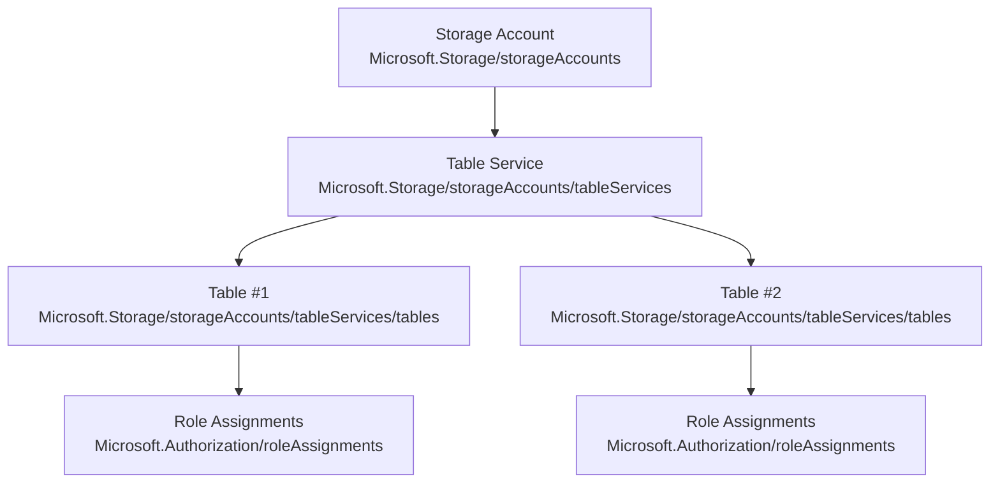
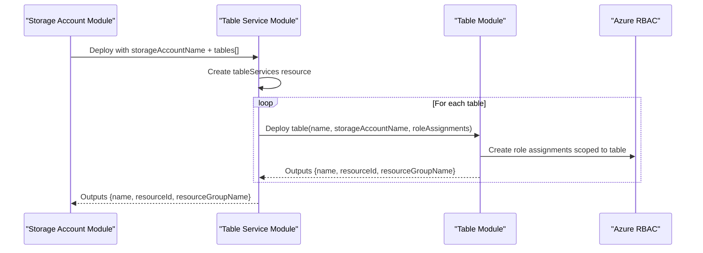
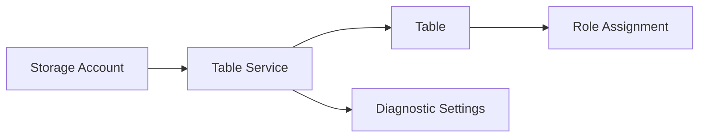

# Table Service Module

<cite>
**Referenced Files in This Document**
- [main.bicep](file://bicep/modules/storage-account/table-service/main.bicep)
- [README.md](file://bicep/modules/storage-account/table-service/README.md)
- [table/main.bicep](file://bicep/modules/storage-account/table-service/table/main.bicep)
- [table/README.md](file://bicep/modules/storage-account/table-service/table/README.md)
- [storage-account main.bicep](file://bicep/modules/storage-account/main.bicep)
- [storage-account README.md](file://bicep/modules/storage-account/README.md)
</cite>

## Table of Contents
1. [Introduction](#introduction)
2. [Project Structure](#project-structure)
3. [Core Components](#core-components)
4. [Architecture Overview](#architecture-overview)
5. [Detailed Component Analysis](#detailed-component-analysis)
6. [Dependency Analysis](#dependency-analysis)
7. [Performance Considerations](#performance-considerations)
8. [Troubleshooting Guide](#troubleshooting-guide)
9. [Conclusion](#conclusion)
10. [Appendices](#appendices)

## Introduction
This document explains the Table Service Bicep module that provisions Azure Storage Account table services and tables for NoSQL data management. It covers how to create tables, assign roles, enable diagnostics, and integrate with the broader storage account deployment. It also provides guidance on data modeling patterns (partition keys, row keys, entity properties), query optimization strategies, indexing considerations, migration scenarios with Cosmos DB, and performance techniques for large-scale workloads.

## Project Structure
The Table Service is implemented as a reusable Bicep module under the storage account module hierarchy:
- The top-level storage account module orchestrates services including blob, file, queue, and table.
- The table service module creates the table service resource and instantiates one or more table resources.
- Each table resource supports role assignments and outputs key identifiers for downstream use.

**Diagram sources**
- [storage-account main.bicep:351-451](file://bicep/modules/storage-account/main.bicep#L351-L451)
- [storage-account main.bicep:630-638](file://bicep/modules/storage-account/main.bicep#L630-L638)
- [main.bicep:19-27](file://bicep/modules/storage-account/table-service/main.bicep#L19-L27)
- [table/main.bicep:65-76](file://bicep/modules/storage-account/table-service/table/main.bicep#L65-L76)
- [table/main.bicep:78-92](file://bicep/modules/storage-account/table-service/table/main.bicep#L78-L92)

**Section sources**
- [storage-account main.bicep:351-451](file://bicep/modules/storage-account/main.bicep#L351-L451)
- [storage-account main.bicep:630-638](file://bicep/modules/storage-account/main.bicep#L630-L638)
- [main.bicep:19-27](file://bicep/modules/storage-account/table-service/main.bicep#L19-L27)
- [table/main.bicep:65-76](file://bicep/modules/storage-account/table-service/table/main.bicep#L65-L76)

## Core Components
- Table Service Resource: Provisions the table service endpoint for a storage account.
- Table Resources: One or more tables are created under the table service.
- Role Assignments: Per-table RBAC via built-in or custom role definitions.
- Diagnostics: Metrics and logs can be streamed from the table service.

Key capabilities exposed by the modules:
- Create multiple tables declaratively via an array parameter.
- Attach role assignments per table using a flexible role definition input.
- Configure diagnostic settings at the table service level.
- Export names, resource IDs, and resource group for integration.

**Section sources**
- [main.bicep:5-14](file://bicep/modules/storage-account/table-service/main.bicep#L5-L14)
- [main.bicep:29-67](file://bicep/modules/storage-account/table-service/main.bicep#L29-L67)
- [table/main.bicep:5-15](file://bicep/modules/storage-account/table-service/table/main.bicep#L5-L15)
- [table/main.bicep:16-63](file://bicep/modules/storage-account/table-service/table/main.bicep#L16-L63)
- [table/main.bicep:78-92](file://bicep/modules/storage-account/table-service/table/main.bicep#L78-L92)

## Architecture Overview
The deployment flow starts from the storage account module, which conditionally deploys the table service module when configured. The table service module then iterates over the provided tables array to create each table and its role assignments.

**Diagram sources**
- [storage-account main.bicep:630-638](file://bicep/modules/storage-account/main.bicep#L630-L638)
- [main.bicep:58-67](file://bicep/modules/storage-account/table-service/main.bicep#L58-L67)
- [table/main.bicep:78-92](file://bicep/modules/storage-account/table-service/table/main.bicep#L78-L92)

## Detailed Component Analysis

### Table Service Module
- Purpose: Creates the table service resource for a given storage account and optionally configures diagnostics.
- Inputs:
  - storageAccountName: Parent storage account reference.
  - tables: Array of table definitions to instantiate.
  - diagnosticSettings: Optional metrics/logs configuration.
- Outputs:
  - name, resourceId, resourceGroupName for the table service.

Implementation highlights:
- References existing storage account by name.
- Declares tableServices resource with default properties.
- Iterates over tables to deploy individual tables via the nested table module.
- Applies diagnostic settings scoped to the table service.

**Section sources**
- [main.bicep:5-14](file://bicep/modules/storage-account/table-service/main.bicep#L5-L14)
- [main.bicep:19-27](file://bicep/modules/storage-account/table-service/main.bicep#L19-L27)
- [main.bicep:29-67](file://bicep/modules/storage-account/table-service/main.bicep#L29-L67)
- [main.bicep:69-77](file://bicep/modules/storage-account/table-service/main.bicep#L69-L77)

### Table Module
- Purpose: Deploys a single table under the table service and assigns RBAC roles.
- Inputs:
  - name: Table name.
  - storageAccountName: Parent storage account.
  - roleAssignments: Array of role assignments scoped to the table.
- Outputs:
  - name, resourceId, resourceGroupName for the table.

Implementation highlights:
- Resolves built-in role names to their IDs for convenience.
- Normalizes role assignment inputs to include required fields.
- Creates role assignments scoped to the table resource.

**Section sources**
- [table/main.bicep:5-15](file://bicep/modules/storage-account/table-service/table/main.bicep#L5-L15)
- [table/main.bicep:16-63](file://bicep/modules/storage-account/table-service/table/main.bicep#L16-L63)
- [table/main.bicep:65-76](file://bicep/modules/storage-account/table-service/table/main.bicep#L65-L76)
- [table/main.bicep:78-92](file://bicep/modules/storage-account/table-service/table/main.bicep#L78-L92)
- [table/main.bicep:94-102](file://bicep/modules/storage-account/table-service/table/main.bicep#L94-L102)

### Integration with Storage Account Module
- The storage account module includes a conditional block to deploy the table service module when tableServices is configured.
- It passes storageAccountName, optional diagnosticSettings, and the tables array to the table service module.
- It exposes endpoints and secrets export for table endpoints alongside other services.

**Section sources**
- [storage-account main.bicep:113-114](file://bicep/modules/storage-account/main.bicep#L113-L114)
- [storage-account main.bicep:630-638](file://bicep/modules/storage-account/main.bicep#L630-L638)
- [storage-account main.bicep:673-676](file://bicep/modules/storage-account/main.bicep#L673-L676)

## Dependency Analysis
- The table service depends on an existing storage account.
- Each table depends on the table service and may depend on RBAC role definitions.
- Diagnostic settings depend on target destinations (Log Analytics, Event Hubs, Storage).

**Diagram sources**
- [main.bicep:19-27](file://bicep/modules/storage-account/table-service/main.bicep#L19-L27)
- [table/main.bicep:65-76](file://bicep/modules/storage-account/table-service/table/main.bicep#L65-L76)
- [table/main.bicep:78-92](file://bicep/modules/storage-account/table-service/table/main.bicep#L78-L92)
- [main.bicep:29-56](file://bicep/modules/storage-account/table-service/main.bicep#L29-L56)

**Section sources**
- [main.bicep:29-56](file://bicep/modules/storage-account/table-service/main.bicep#L29-L56)
- [table/main.bicep:78-92](file://bicep/modules/storage-account/table-service/table/main.bicep#L78-L92)

## Performance Considerations
While the modules focus on infrastructure provisioning, consider these operational practices for high-performance table usage:
- Partitioning strategy: Choose partition keys that distribute writes evenly and align with query patterns to avoid hot partitions.
- Row key design: Combine attributes to ensure uniqueness and support efficient range queries where applicable.
- Entity property design: Keep entities small; store heavy payloads in blobs and reference them via URIs in table entities.
- Batch operations: Use batch transactions to reduce round trips and improve throughput.
- Throttling and retries: Implement exponential backoff and retry policies in clients to handle transient throttling.
- Monitoring: Enable diagnostics to track request units, latency, and errors; set alerts for throttling events.
- Network access: Prefer private endpoints to minimize latency and secure traffic within your network boundary.

[No sources needed since this section provides general guidance]

## Troubleshooting Guide
Common issues and resolutions:
- Missing parent storage account: Ensure the storageAccountName exists and is accessible in the same scope.
- Role assignment failures: Verify principalId and roleDefinitionIdOrName; confirm permissions to assign roles.
- Diagnostic settings misconfiguration: Validate destination IDs (workspace/event hub/storage) and category selections.
- Table not found: Confirm table name and that the table service is deployed before attempting operations.

Operational checks:
- Inspect outputs from the table service and table modules to verify resource IDs.
- Review diagnostic logs and metrics for errors and throttling signals.
- Validate network ACLs and private endpoints if connectivity issues occur.

**Section sources**
- [main.bicep:29-56](file://bicep/modules/storage-account/table-service/main.bicep#L29-L56)
- [table/main.bicep:78-92](file://bicep/modules/storage-account/table-service/table/main.bicep#L78-L92)
- [storage-account main.bicep:630-638](file://bicep/modules/storage-account/main.bicep#L630-L638)

## Conclusion
The Table Service Bicep module provides a clean, composable way to provision Azure Storage table services and tables with fine-grained RBAC and diagnostics. By combining robust infrastructure-as-code with thoughtful data modeling and client-side best practices, teams can build scalable NoSQL solutions on Azure Tables.

[No sources needed since this section summarizes without analyzing specific files]

## Appendices

### Data Modeling Patterns for Azure Tables
- Partition Key: Group related entities to optimize query locality and balance load across partitions.
- Row Key: Uniquely identifies an entity within a partition; choose values that support common query ranges.
- Entity Properties: Include only frequently queried fields; offload large or complex data to blob storage and link via references.

[No sources needed since this section provides general guidance]

### Query Optimization and Indexing Strategies
- Favor queries that filter by partition key and narrow row key ranges.
- Avoid full table scans; use targeted queries leveraging partition and row key design.
- Leverage client-side batching to reduce overhead and improve throughput.

[No sources needed since this section provides general guidance]

### Migration Scenarios with Cosmos DB and Hybrid Cloud Architectures
- Migrate from Azure Tables to Cosmos DB:
  - Map table entities to Cosmos DB documents; preserve partition key semantics in the document’s partition key field.
  - Use change feed or ETL pipelines to synchronize data during cutover.
  - Update application clients to use Cosmos DB SDKs and adjust query patterns to SQL API or core APIs.
- Hybrid cloud architectures:
  - Expose services behind private endpoints and configure DNS to route traffic consistently across environments.
  - Centralize secrets and connection strings in Key Vault; export endpoints via the storage account module’s secret export feature.

[No sources needed since this section provides general guidance]

### Examples: Entity CRUD Operations, Batch Processing, and Performance Techniques
- CRUD operations:
  - Insert: Create entities with partition key, row key, and properties.
  - Read: Query by partition key and row key for point lookups; use filters for attribute-based reads.
  - Update: Merge or replace entities atomically within a partition.
  - Delete: Remove entities by partition and row key.
- Batch processing:
  - Use batch transactions to perform multiple operations in a single request for improved efficiency.
  - Handle partial failures by inspecting operation results and retrying failed items.
- Performance techniques:
  - Design partition keys to avoid hotspots and align with access patterns.
  - Implement retry with exponential backoff and circuit breakers in clients.
  - Monitor with diagnostics and set alerts for throttling and latency spikes.

[No sources needed since this section provides general guidance]