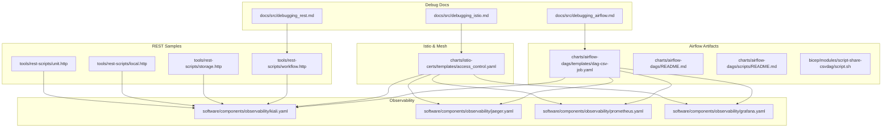
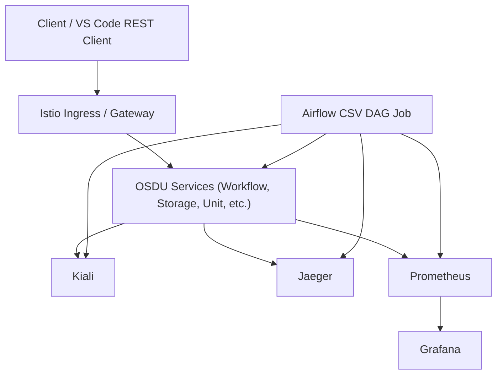
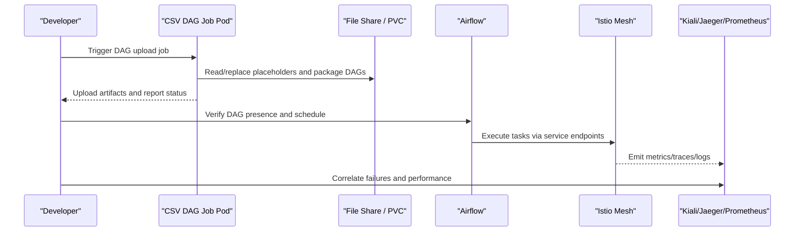
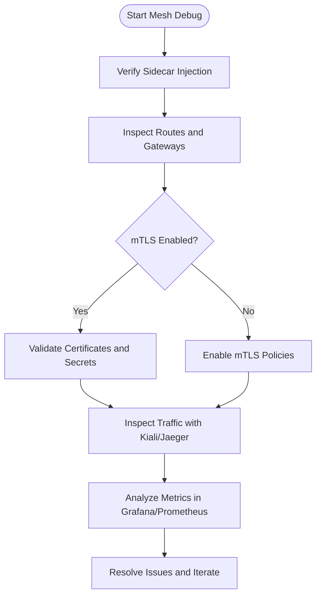
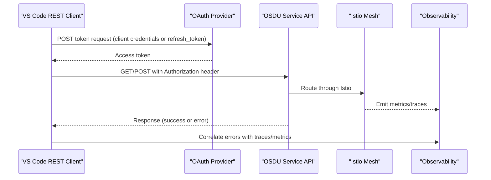
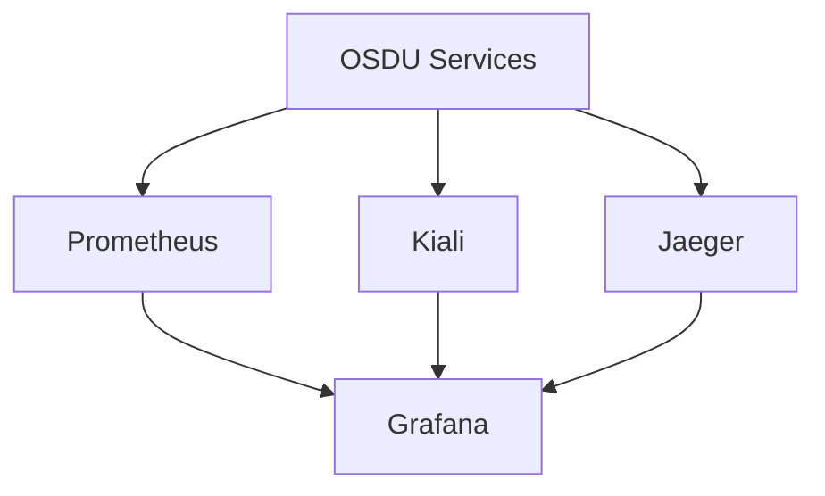
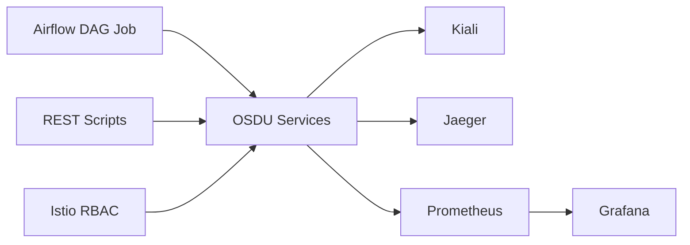
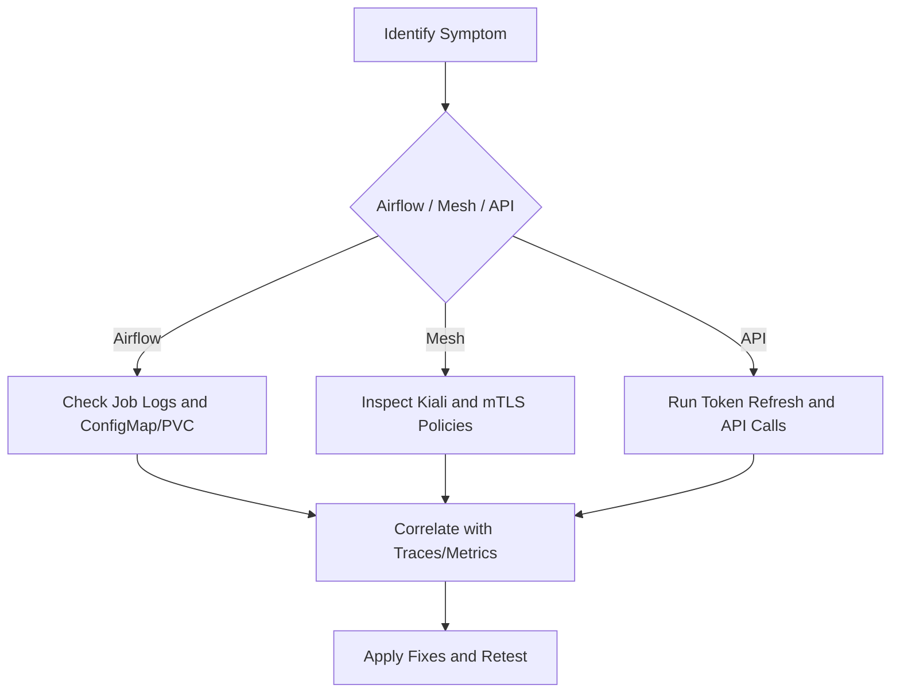

# Debugging Workflows and Services

<cite>
**Referenced Files in This Document**
- [debugging_airflow.md](file://docs/src/debugging_airflow.md)
- [debugging_istio.md](file://docs/src/debugging_istio.md)
- [debugging_rest.md](file://docs/src/debugging_rest.md)
- [dag-csv-job.yaml](file://charts/airflow-dags/templates/dag-csv-job.yaml)
- [README.md (Airflow DAGs)](file://charts/airflow-dags/README.md)
- [README.md (Airflow scripts)](file://charts/airflow-dags/scripts/README.md)
- [script.sh (CSV DAG share)](file://bicep/modules/script-share-csvdag/script.sh)
- [access_control.yaml](file://charts/istio-certs/templates/access_control.yaml)
- [kiali.yaml](file://software/components/observability/kiali.yaml)
- [jaeger.yaml](file://software/components/observability/jaeger.yaml)
- [prometheus.yaml](file://software/components/observability/prometheus.yaml)
- [grafana.yaml](file://software/components/observability/grafana.yaml)
- [workflow.http](file://tools/rest-scripts/workflow.http)
- [storage.http](file://tools/rest-scripts/storage.http)
- [local.http](file://tools/rest-scripts/local.http)
- [unit.http](file://tools/rest-scripts/unit.http)
- [elastic-init.yaml](file://charts/osdu-developer-init/templates/elastic-init.yaml)
</cite>

## Table of Contents
1. [Introduction](#introduction)
2. [Project Structure](#project-structure)
3. [Core Components](#core-components)
4. [Architecture Overview](#architecture-overview)
5. [Detailed Component Analysis](#detailed-component-analysis)
6. [Dependency Analysis](#dependency-analysis)
7. [Performance Considerations](#performance-considerations)
8. [Troubleshooting Guide](#troubleshooting-guide)
9. [Conclusion](#conclusion)
10. [Appendices](#appendices)

## Introduction
This document provides a comprehensive, practical guide to debugging OSDU workflows and services. It focuses on:
- Systematic Airflow workflow debugging: task failure analysis, execution history review, and log correlation
- Service mesh debugging with Istio: traffic inspection, mTLS troubleshooting, and policy enforcement issues
- REST API debugging techniques: error response analysis and client-side troubleshooting using the provided HTTP samples
- Step-by-step debugging workflows for common scenarios
- Performance profiling methods and root cause analysis techniques
- Guidance on using observability tools together for effective problem diagnosis

The repository includes dedicated documentation stubs for Airflow, Istio, and REST debugging, along with operational manifests for Airflow DAG jobs, Istio/Kiali/Jaeger/Prometheus/Grafana, and sample HTTP request files that demonstrate how to call OSDU APIs during development and troubleshooting.

## Project Structure
Key areas relevant to debugging:
- docs/src: Contains documentation stubs for Airflow, Istio, Kibana, and REST debugging
- charts/airflow-dags: Defines Airflow DAG job manifests and helper scripts used to prepare and upload DAG artifacts
- charts/istio-certs: Provides RBAC and access control resources related to Istio ingress management
- software/components/observability: Deploys Kiali, Jaeger, Prometheus, Grafana, and subnet monitoring components
- tools/rest-scripts: Sample HTTP request files for calling OSDU APIs (e.g., workflow, storage, unit, local)

**Diagram sources**
- [dag-csv-job.yaml:1-50](file://charts/airflow-dags/templates/dag-csv-job.yaml#L1-L50)
- [access_control.yaml:1-37](file://charts/istio-certs/templates/access_control.yaml#L1-L37)
- [kiali.yaml:1-563](file://software/components/observability/kiali.yaml#L1-L563)
- [jaeger.yaml:1-122](file://software/components/observability/jaeger.yaml#L1-L122)
- [prometheus.yaml:1-554](file://software/components/observability/prometheus.yaml#L1-L554)
- [grafana.yaml:1-200](file://software/components/observability/grafana.yaml#L1-L200)
- [workflow.http:1-64](file://tools/rest-scripts/workflow.http#L1-L64)
- [storage.http:1-58](file://tools/rest-scripts/storage.http#L1-L58)
- [local.http:1-54](file://tools/rest-scripts/local.http#L1-L54)
- [unit.http:1-60](file://tools/rest-scripts/unit.http#L1-L60)

**Section sources**
- [debugging_airflow.md:1-3](file://docs/src/debugging_airflow.md#L1-L3)
- [debugging_istio.md:1-3](file://docs/src/debugging_istio.md#L1-L3)
- [debugging_rest.md:1-14](file://docs/src/debugging_rest.md#L1-L14)

## Core Components
- Airflow DAG Job: The CSV DAG upload job prepares and deploys DAG artifacts into the Airflow environment. It uses a ConfigMap-mounted script and a PVC for shared storage.
- Istio Access Control: RBAC resources enable external DNS and certificate management for Istio ingress components.
- Observability Stack:
  - Kiali: Service mesh visualization and diagnostics
  - Jaeger: Distributed tracing
  - Prometheus: Metrics collection and alerting
  - Grafana: Dashboards and visualization
  - Subnet Monitoring: Log and metric collection settings for Kubernetes
- REST Scripts: Predefined HTTP requests to exercise OSDU APIs for authentication and service calls.

These components form the foundation for diagnosing workflow failures, inspecting service-to-service communication, and correlating logs and metrics across the system.

**Section sources**
- [dag-csv-job.yaml:1-50](file://charts/airflow-dags/templates/dag-csv-job.yaml#L1-L50)
- [access_control.yaml:1-37](file://charts/istio-certs/templates/access_control.yaml#L1-L37)
- [kiali.yaml:1-563](file://software/components/observability/kiali.yaml#L1-L563)
- [jaeger.yaml:1-122](file://software/components/observability/jaeger.yaml#L1-L122)
- [prometheus.yaml:1-554](file://software/components/observability/prometheus.yaml#L1-L554)
- [grafana.yaml:1-200](file://software/components/observability/grafana.yaml#L1-L200)
- [workflow.http:1-64](file://tools/rest-scripts/workflow.http#L1-L64)
- [storage.http:1-58](file://tools/rest-scripts/storage.http#L1-L58)
- [local.http:1-54](file://tools/rest-scripts/local.http#L1-L54)
- [unit.http:1-60](file://tools/rest-scripts/unit.http#L1-L60)

## Architecture Overview
The debugging architecture integrates Airflow DAG execution with an Istio-enabled service mesh and a full observability stack. Requests flow through the mesh, are observed by Kiali and Jaeger, and their performance is captured by Prometheus and visualized in Grafana. REST scripts provide a repeatable way to trigger and validate API behavior during troubleshooting.

[No sources needed since this diagram shows conceptual workflow, not actual code structure]

## Detailed Component Analysis

### Airflow Workflow Debugging
Systematic approach:
- Task failure analysis: Inspect the CSV DAG job pod logs and verify artifact preparation steps. Use the job’s ConfigMap and PVC to confirm correct script injection and file availability.
- Execution history review: Validate DAG deployment and scheduling via Airflow UI or CLI; correlate timestamps with cluster events.
- Log correlation: Cross-reference Airflow job logs with service mesh traces (Kiali/Jaeger) and metrics (Prometheus/Grafana) to identify bottlenecks or failures.

Operational references:
- CSV DAG job manifest defines the container image, command, environment variables, and volume mounts for scripts and shared storage.
- README entries provide example commands to retrieve logs and describe configuration verification steps.
- Scripting helpers show how placeholders are replaced and how DAG artifacts are packaged and uploaded.

**Diagram sources**
- [dag-csv-job.yaml:1-50](file://charts/airflow-dags/templates/dag-csv-job.yaml#L1-L50)
- [README.md (Airflow DAGs):104-115](file://charts/airflow-dags/README.md#L104-L115)
- [README.md (Airflow scripts):22-68](file://charts/airflow-dags/scripts/README.md#L22-L68)
- [script.sh (CSV DAG share):115-144](file://bicep/modules/script-share-csvdag/script.sh#L115-L144)

**Section sources**
- [dag-csv-job.yaml:1-50](file://charts/airflow-dags/templates/dag-csv-job.yaml#L1-L50)
- [README.md (Airflow DAGs):104-115](file://charts/airflow-dags/README.md#L104-L115)
- [README.md (Airflow scripts):22-68](file://charts/airflow-dags/scripts/README.md#L22-L68)
- [script.sh (CSV DAG share):115-144](file://bicep/modules/script-share-csvdag/script.sh#L115-L144)

### Istio Service Mesh Debugging
Focus areas:
- Traffic inspection: Use Kiali to visualize service graphs, route definitions, and request flows. Confirm sidecar injection and gateway routing.
- mTLS troubleshooting: Validate PeerAuthentication and DestinationRule configurations; check connection_security_policy labels in metrics.
- Policy enforcement issues: Review AuthorizationPolicy and RequestAuthentication to ensure intended access controls are applied.

Operational references:
- Kiali deployment and configuration expose mesh visibility and diagnostics.
- Access control resources grant permissions for managing gateways and certificates.
- Grafana dashboards include Istio metrics queries filtered by mutual TLS connections.

**Diagram sources**
- [kiali.yaml:1-563](file://software/components/observability/kiali.yaml#L1-L563)
- [access_control.yaml:1-37](file://charts/istio-certs/templates/access_control.yaml#L1-L37)
- [grafana.yaml:316-961](file://software/components/observability/grafana.yaml#L316-L961)

**Section sources**
- [kiali.yaml:1-563](file://software/components/observability/kiali.yaml#L1-L563)
- [access_control.yaml:1-37](file://charts/istio-certs/templates/access_control.yaml#L1-L37)
- [grafana.yaml:316-961](file://software/components/observability/grafana.yaml#L316-L961)

### REST API Debugging
Techniques:
- Use the provided HTTP scripts to authenticate and call OSDU APIs (workflow, storage, unit, local).
- Validate OAuth token acquisition and refresh flows before invoking service endpoints.
- Analyze error responses and headers to pinpoint authentication, authorization, or routing issues.

Operational references:
- HTTP scripts define variable scopes, token refresh sequences, and API calls with required headers such as data-partition-id.
- Documentation explains integration with VS Code REST Client and how to execute sequences from top to bottom.

**Diagram sources**
- [workflow.http:1-64](file://tools/rest-scripts/workflow.http#L1-L64)
- [storage.http:1-58](file://tools/rest-scripts/storage.http#L1-L58)
- [local.http:1-54](file://tools/rest-scripts/local.http#L1-L54)
- [unit.http:1-60](file://tools/rest-scripts/unit.http#L1-L60)

**Section sources**
- [debugging_rest.md:1-14](file://docs/src/debugging_rest.md#L1-L14)
- [workflow.http:1-64](file://tools/rest-scripts/workflow.http#L1-L64)
- [storage.http:1-58](file://tools/rest-scripts/storage.http#L1-L58)
- [local.http:1-54](file://tools/rest-scripts/local.http#L1-L54)
- [unit.http:1-60](file://tools/rest-scripts/unit.http#L1-L60)

### Observability Tools Integration
- Kiali: Visualize service topology, routes, and health; inspect sidecar status and certificate information.
- Jaeger: Capture distributed traces to understand end-to-end latency and failure points.
- Prometheus: Collect metrics including Istio request duration and bytes with mTLS filters; configure scrape targets and rules.
- Grafana: Provide dashboards for Istio metrics and service performance; connect to Prometheus and Loki.

**Diagram sources**
- [kiali.yaml:1-563](file://software/components/observability/kiali.yaml#L1-L563)
- [jaeger.yaml:1-122](file://software/components/observability/jaeger.yaml#L1-L122)
- [prometheus.yaml:1-554](file://software/components/observability/prometheus.yaml#L1-L554)
- [grafana.yaml:1-200](file://software/components/observability/grafana.yaml#L1-L200)

**Section sources**
- [kiali.yaml:1-563](file://software/components/observability/kiali.yaml#L1-L563)
- [jaeger.yaml:1-122](file://software/components/observability/jaeger.yaml#L1-L122)
- [prometheus.yaml:1-554](file://software/components/observability/prometheus.yaml#L1-L554)
- [grafana.yaml:1-200](file://software/components/observability/grafana.yaml#L1-L200)

## Dependency Analysis
- Airflow DAG job depends on ConfigMap scripts and PVC storage; it interacts with OSDU services via internal endpoints.
- Istio access control grants permissions for managing gateways and certificates; policies affect traffic routing and security.
- Observability tools depend on proper service discovery and metrics exposure; Grafana relies on Prometheus and Loki datasources.
- REST scripts depend on correctly configured OAuth tokens and service endpoints; they exercise the mesh and services for validation.

**Diagram sources**
- [dag-csv-job.yaml:1-50](file://charts/airflow-dags/templates/dag-csv-job.yaml#L1-L50)
- [access_control.yaml:1-37](file://charts/istio-certs/templates/access_control.yaml#L1-L37)
- [kiali.yaml:1-563](file://software/components/observability/kiali.yaml#L1-L563)
- [jaeger.yaml:1-122](file://software/components/observability/jaeger.yaml#L1-L122)
- [prometheus.yaml:1-554](file://software/components/observability/prometheus.yaml#L1-L554)
- [grafana.yaml:1-200](file://software/components/observability/grafana.yaml#L1-L200)
- [workflow.http:1-64](file://tools/rest-scripts/workflow.http#L1-L64)

**Section sources**
- [dag-csv-job.yaml:1-50](file://charts/airflow-dags/templates/dag-csv-job.yaml#L1-L50)
- [access_control.yaml:1-37](file://charts/istio-certs/templates/access_control.yaml#L1-L37)
- [prometheus.yaml:1-554](file://software/components/observability/prometheus.yaml#L1-L554)
- [grafana.yaml:1-200](file://software/components/observability/grafana.yaml#L1-L200)

## Performance Considerations
- Use Grafana dashboards to monitor Istio request durations and byte sizes, filtering by mutual TLS connections to isolate secure traffic performance.
- Leverage Prometheus recording rules and scrape intervals to balance detail and overhead.
- Ensure sidecar injection is enabled for services under investigation; disabled injection can hide critical telemetry.
- For long-running workflows, correlate Airflow task durations with service-level latency to identify bottlenecks.

[No sources needed since this section provides general guidance]

## Troubleshooting Guide
Common scenarios and steps:
- Airflow DAG job fails to upload artifacts:
  - Verify ConfigMap content and PVC availability; check pod logs for script execution errors.
  - Confirm placeholder replacement logic and file packaging steps.
  - Reference example commands to list pods and view logs.

- Istio mTLS handshake failures:
  - Inspect Kiali for certificate indicators and sidecar status.
  - Validate PeerAuthentication and DestinationRule policies.
  - Use Grafana Istio dashboards to filter by connection_security_policy and analyze error rates.

- REST API authentication errors:
  - Re-run token refresh sequence in HTTP scripts; ensure tenant, client ID, and secret are correct.
  - Validate Authorization headers and data-partition-id usage.
  - Correlate API errors with traces in Jaeger and metrics in Prometheus.

- Elasticsearch initialization timeouts:
  - Check initContainer health checks and retry backoff limits.
  - Ensure service endpoints are reachable and credentials are mounted correctly.

**Section sources**
- [README.md (Airflow DAGs):104-115](file://charts/airflow-dags/README.md#L104-L115)
- [grafana.yaml:316-961](file://software/components/observability/grafana.yaml#L316-L961)
- [workflow.http:1-64](file://tools/rest-scripts/workflow.http#L1-L64)
- [elastic-init.yaml:1-40](file://charts/osdu-developer-init/templates/elastic-init.yaml#L1-L40)

## Conclusion
Effective debugging in OSDU requires combining Airflow job diagnostics, Istio mesh visibility, and a robust observability stack. By systematically analyzing task failures, inspecting service mesh traffic, validating REST API flows, and correlating logs, traces, and metrics, teams can quickly identify and resolve issues. The provided manifests and scripts serve as a practical foundation for consistent troubleshooting and performance optimization.

[No sources needed since this section summarizes without analyzing specific files]

## Appendices
- Quick links to debug documentation stubs:
  - Airflow: [debugging_airflow.md](file://docs/src/debugging_airflow.md)
  - Istio: [debugging_istio.md](file://docs/src/debugging_istio.md)
  - REST: [debugging_rest.md](file://docs/src/debugging_rest.md)

[No sources needed since this section lists references without analyzing specific files]