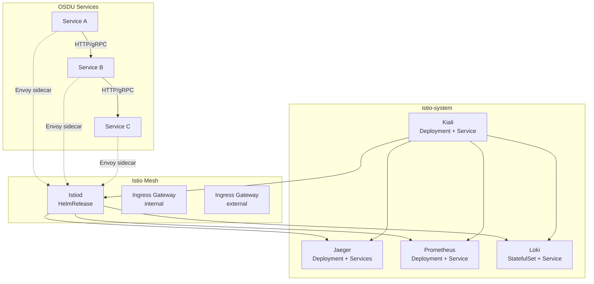
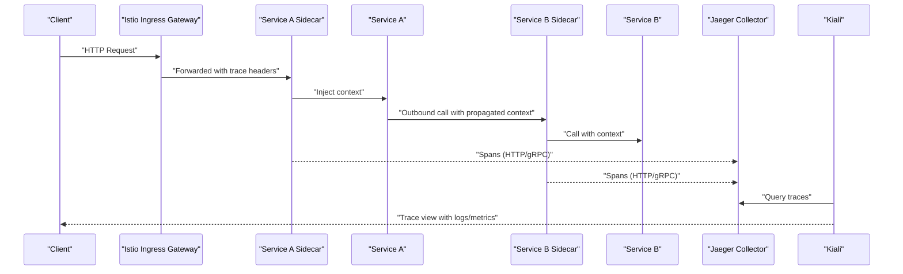
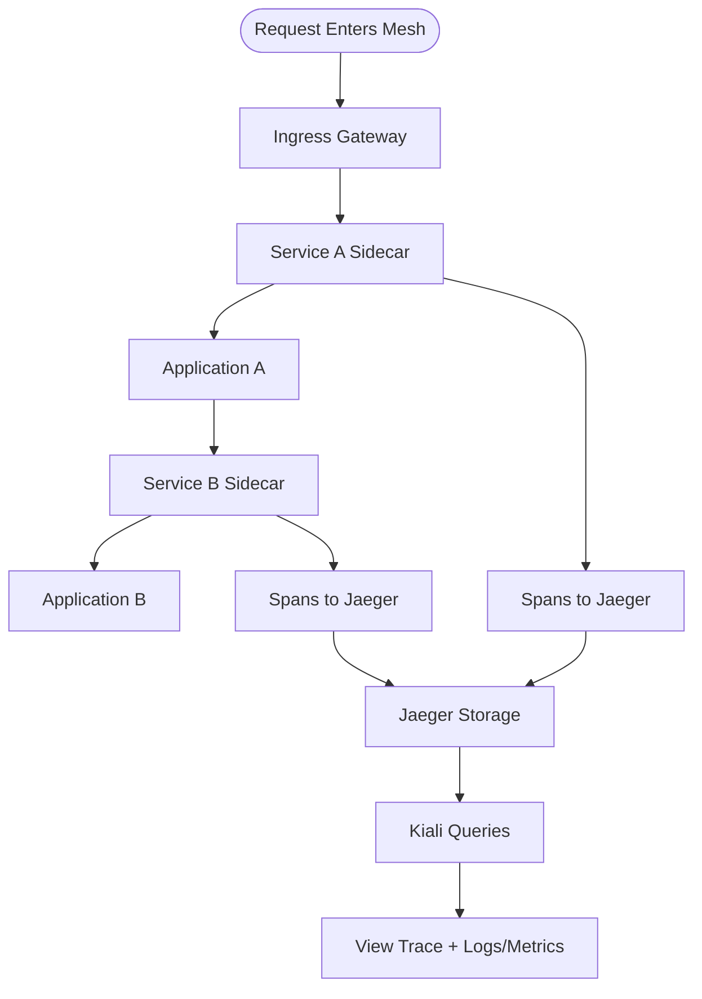
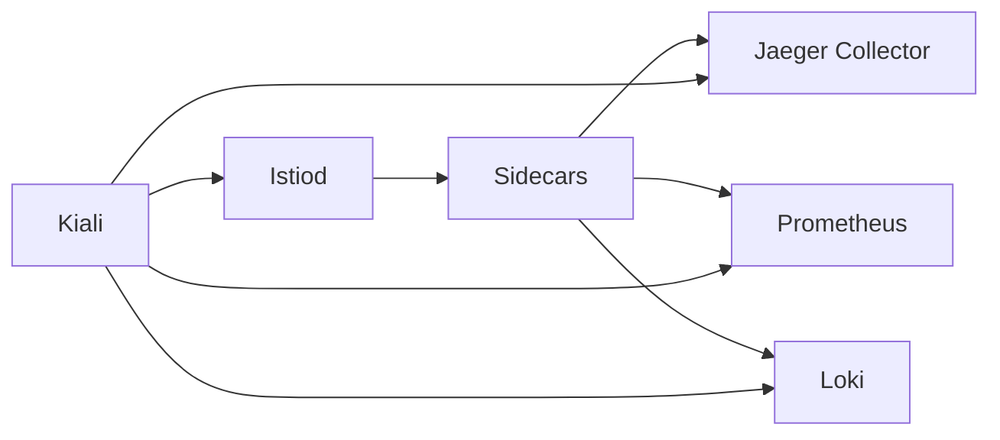

# Distributed Tracing

<cite>
**Referenced Files in This Document**
- [jaeger.yaml](file://software/components/observability/jaeger.yaml)
- [kiali.yaml](file://software/components/observability/kiali.yaml)
- [prometheus.yaml](file://software/components/observability/prometheus.yaml)
- [loki.yaml](file://software/components/observability/loki.yaml)
- [mesh.yaml](file://software/components/osdu-system/mesh.yaml)
- [envoy-filter.yaml](file://charts/osdu-developer-base/templates/envoy-filter.yaml)
</cite>

## Table of Contents
1. [Introduction](#introduction)
2. [Project Structure](#project-structure)
3. [Core Components](#core-components)
4. [Architecture Overview](#architecture-overview)
5. [Detailed Component Analysis](#detailed-component-analysis)
6. [Dependency Analysis](#dependency-analysis)
7. [Performance Considerations](#performance-considerations)
8. [Troubleshooting Guide](#troubleshooting-guide)
9. [Conclusion](#conclusion)
10. [Appendices](#appendices)

## Introduction
This document explains how distributed tracing is set up and used across the OSDU microservices architecture. It covers:
- Installing and configuring Jaeger for end-to-end request tracing
- Enabling Istio service mesh tracing and using Kiali to visualize traces
- Correlating traces with logs via Loki and Prometheus
- Practical guidance for sampling, filtering noisy traces, and integrating tracing into application code
- Identifying bottlenecks and debugging inter-service communication issues

## Project Structure
The observability stack is deployed as Kubernetes resources under istio-system and integrated with the Istio service mesh. Key components include:
- Jaeger (all-in-one) for trace storage and UI
- Kiali for service mesh visualization and trace correlation
- Prometheus for metrics collection
- Loki for log aggregation
- Istio control plane and gateways configured via Helm releases

**Diagram sources**
- [jaeger.yaml:1-122](file://software/components/observability/jaeger.yaml#L1-L122)
- [kiali.yaml:1-563](file://software/components/observability/kiali.yaml#L1-L563)
- [prometheus.yaml:1-554](file://software/components/observability/prometheus.yaml#L1-L554)
- [loki.yaml:1-290](file://software/components/observability/loki.yaml#L1-L290)
- [mesh.yaml:101-241](file://software/components/osdu-system/mesh.yaml#L101-L241)

**Section sources**
- [jaeger.yaml:1-122](file://software/components/observability/jaeger.yaml#L1-L122)
- [kiali.yaml:1-563](file://software/components/observability/kiali.yaml#L1-L563)
- [prometheus.yaml:1-554](file://software/components/observability/prometheus.yaml#L1-L554)
- [loki.yaml:1-290](file://software/components/observability/loki.yaml#L1-L290)
- [mesh.yaml:101-241](file://software/components/osdu-system/mesh.yaml#L101-L241)

## Core Components
- Jaeger all-in-one deployment provides a query UI, collector endpoints (HTTP/gRPC), Zipkin compatibility, and OpenTelemetry endpoints.
- Kiali is configured to integrate with Istio and exposes dashboards and trace correlation.
- Prometheus scrapes metrics from services and components based on annotations.
- Loki stores logs for centralized querying and correlation with traces.
- Istio is installed via Helm releases with two ingress gateways (internal and external).

Key configuration highlights:
- Jaeger uses BadgerDB for spans and exposes multiple ports for collectors and queries.
- Kiali runs without sidecar injection and integrates with Istio’s root namespace.
- Prometheus configures scraping jobs for pods and services with slow-scrape variants.
- Loki is deployed as a single-binary StatefulSet with persistent storage.

**Section sources**
- [jaeger.yaml:21-55](file://software/components/observability/jaeger.yaml#L21-L55)
- [jaeger.yaml:57-122](file://software/components/observability/jaeger.yaml#L57-L122)
- [kiali.yaml:34-140](file://software/components/observability/kiali.yaml#L34-L140)
- [prometheus.yaml:39-196](file://software/components/observability/prometheus.yaml#L39-L196)
- [loki.yaml:28-75](file://software/components/observability/loki.yaml#L28-L75)
- [mesh.yaml:101-241](file://software/components/osdu-system/mesh.yaml#L101-L241)

## Architecture Overview
The Istio sidecars automatically capture HTTP/gRPC spans and forward them to Jaeger. Kiali visualizes the mesh and links traces to logs and metrics. Prometheus collects runtime metrics; Loki aggregates logs. The Envoy filter demonstrates header manipulation for identity propagation, which can be extended to propagate trace context headers.

**Diagram sources**
- [jaeger.yaml:95-122](file://software/components/observability/jaeger.yaml#L95-L122)
- [kiali.yaml:34-140](file://software/components/observability/kiali.yaml#L34-L140)
- [mesh.yaml:101-241](file://software/components/osdu-system/mesh.yaml#L101-L241)

## Detailed Component Analysis

### Jaeger Setup and Configuration
- Deployment runs an all-in-one image with BadgerDB storage and exposes:
  - Query UI service named tracing
  - Zipkin-compatible service named zipkin
  - Collector service exposing HTTP, gRPC, Zipkin, and OpenTelemetry endpoints
- Environment variables configure storage type, memory limits, and base path for query UI.

Operational notes:
- Use the collector endpoints for SDKs or rely on Istio sidecars to auto-propagate spans.
- The Zipkin service enables compatibility with tools expecting Zipkin endpoints.

**Section sources**
- [jaeger.yaml:21-55](file://software/components/observability/jaeger.yaml#L21-L55)
- [jaeger.yaml:57-122](file://software/components/observability/jaeger.yaml#L57-L122)

### Istio Integration and Kiali Visualization
- Istio control plane and gateways are installed via Helm releases.
- Kiali is configured with anonymous auth for development and integrates with Istio’s root namespace.
- Kiali’s pod disables sidecar injection to avoid interfering with its own operations.

Operational notes:
- Use Kiali to navigate service graphs, view latency/error rates, and open traces.
- Ensure access to the Kiali service port and enable ingress if needed.

**Section sources**
- [mesh.yaml:101-241](file://software/components/osdu-system/mesh.yaml#L101-L241)
- [kiali.yaml:34-140](file://software/components/observability/kiali.yaml#L34-L140)
- [kiali.yaml:439-563](file://software/components/observability/kiali.yaml#L439-L563)

### Metrics and Logs Correlation
- Prometheus scrapes metrics from pods/services annotated for scraping, including slow scrape jobs for heavy endpoints.
- Loki stores logs in a single-binary deployment with persistent storage and exposes HTTP/gRPC APIs.

Operational notes:
- Annotate services/pods with Prometheus scrape annotations to enable metric collection.
- Correlate traces with logs by matching trace IDs in logs and viewing in Kiali or Grafana.

**Section sources**
- [prometheus.yaml:39-196](file://software/components/observability/prometheus.yaml#L39-L196)
- [prometheus.yaml:236-348](file://software/components/observability/prometheus.yaml#L236-L348)
- [loki.yaml:28-75](file://software/components/observability/loki.yaml#L28-L75)
- [loki.yaml:171-290](file://software/components/observability/loki.yaml#L171-L290)

### Envoy Filter and Context Propagation
- An EnvoyFilter injects identity-related headers from JWT metadata and logs header changes.
- While not directly setting trace headers, this pattern shows how to manipulate headers at the proxy layer, which can be adapted to ensure trace context propagation when necessary.

Operational notes:
- Extend the Lua filter to propagate W3C Trace Context headers if your services require explicit propagation.
- Use logging within the filter to debug header presence during requests.

**Section sources**
- [envoy-filter.yaml:1-143](file://charts/osdu-developer-base/templates/envoy-filter.yaml#L1-L143)

### End-to-End Request Flow Through the Mesh

**Diagram sources**
- [jaeger.yaml:95-122](file://software/components/observability/jaeger.yaml#L95-L122)
- [kiali.yaml:34-140](file://software/components/observability/kiali.yaml#L34-L140)
- [mesh.yaml:101-241](file://software/components/osdu-system/mesh.yaml#L101-L241)

## Dependency Analysis
- Istio sidecars depend on the control plane and generate spans for outbound/inbound traffic.
- Jaeger depends on collector endpoints exposed by its service.
- Kiali depends on Istio APIs and optionally integrates with Jaeger/Prometheus/Loki for enriched views.
- Prometheus depends on service/pod annotations to discover targets.
- Loki depends on persistent storage and headless service for stateful deployment.

**Diagram sources**
- [mesh.yaml:101-241](file://software/components/osdu-system/mesh.yaml#L101-L241)
- [jaeger.yaml:95-122](file://software/components/observability/jaeger.yaml#L95-L122)
- [kiali.yaml:34-140](file://software/components/observability/kiali.yaml#L34-L140)
- [prometheus.yaml:39-196](file://software/components/observability/prometheus.yaml#L39-L196)
- [loki.yaml:171-290](file://software/components/observability/loki.yaml#L171-L290)

**Section sources**
- [mesh.yaml:101-241](file://software/components/osdu-system/mesh.yaml#L101-L241)
- [jaeger.yaml:95-122](file://software/components/observability/jaeger.yaml#L95-L122)
- [kiali.yaml:34-140](file://software/components/observability/kiali.yaml#L34-L140)
- [prometheus.yaml:39-196](file://software/components/observability/prometheus.yaml#L39-L196)
- [loki.yaml:171-290](file://software/components/observability/loki.yaml#L171-L290)

## Performance Considerations
- Sampling: Adjust Istio sampling rates at the mesh level to reduce overhead while retaining visibility for critical paths.
- Storage: Tune Jaeger’s memory and storage settings to balance retention and performance.
- Scraping: Configure Prometheus scrape intervals and timeouts to avoid excessive load; use slow-scrape jobs for heavy endpoints.
- Logging: Limit verbose logging in production; use structured logs with trace IDs for correlation.
- Resources: Ensure adequate CPU/memory requests/limits for Jaeger, Kiali, Prometheus, and Loki to prevent resource contention.

[No sources needed since this section provides general guidance]

## Troubleshooting Guide
Common issues and resolutions:
- Missing traces:
  - Verify Istio sidecars are injected and enabled for tracing.
  - Confirm Jaeger collector endpoints are reachable from the mesh.
  - Check Kiali integration with Jaeger and that the query service is accessible.
- High noise:
  - Reduce sampling rate for non-critical routes.
  - Filter out health checks and internal probes from traces.
- Slow operations:
  - Use Kiali to identify hotspots and long-latency spans.
  - Correlate with Prometheus metrics to detect resource saturation.
  - Inspect logs in Loki using trace IDs to pinpoint failures.
- Header propagation:
  - If custom headers are required for tracing, extend the EnvoyFilter to propagate W3C Trace Context headers.
  - Validate header presence using the existing logging patterns in the filter.

**Section sources**
- [jaeger.yaml:21-55](file://software/components/observability/jaeger.yaml#L21-L55)
- [jaeger.yaml:95-122](file://software/components/observability/jaeger.yaml#L95-L122)
- [kiali.yaml:34-140](file://software/components/observability/kiali.yaml#L34-L140)
- [prometheus.yaml:39-196](file://software/components/observability/prometheus.yaml#L39-L196)
- [loki.yaml:28-75](file://software/components/observability/loki.yaml#L28-L75)
- [envoy-filter.yaml:90-143](file://charts/osdu-developer-base/templates/envoy-filter.yaml#L90-L143)

## Conclusion
The OSDU observability stack leverages Istio, Jaeger, Kiali, Prometheus, and Loki to provide comprehensive distributed tracing and correlation. By configuring sampling appropriately, filtering noisy traces, and integrating tracing contexts into application code, teams can efficiently identify bottlenecks and debug inter-service communication issues. Kiali serves as a central interface to visualize the mesh, explore traces, and correlate logs and metrics for faster resolution.

[No sources needed since this section summarizes without analyzing specific files]

## Appendices

### Configuring Application Code for Tracing
- Use OpenTelemetry SDKs compatible with the Jaeger collector endpoints exposed by the service.
- Propagate W3C Trace Context headers across HTTP/gRPC calls to maintain span continuity.
- Inject trace IDs into logs to correlate with traces in Kiali or Grafana.

[No sources needed since this section provides general guidance]