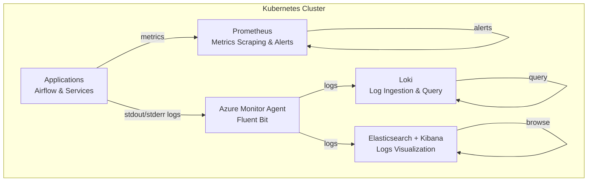
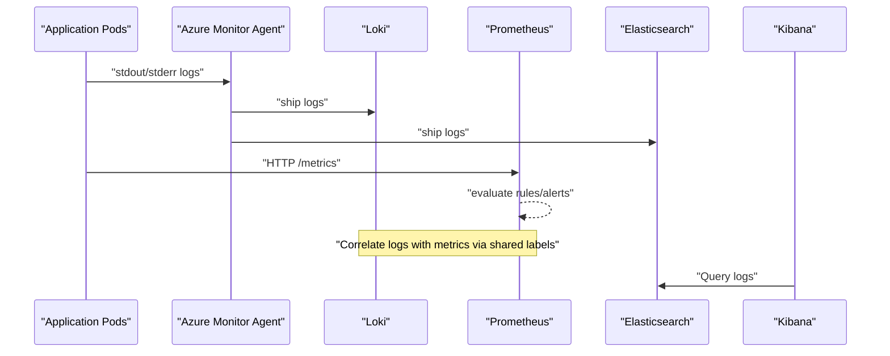
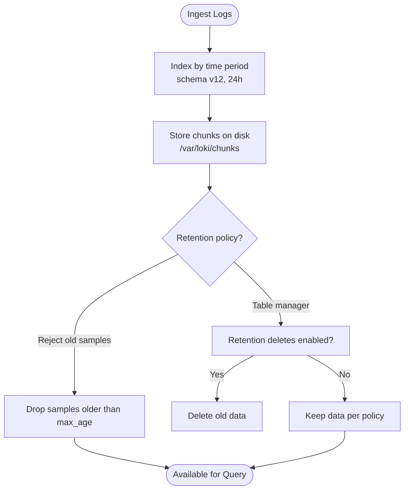
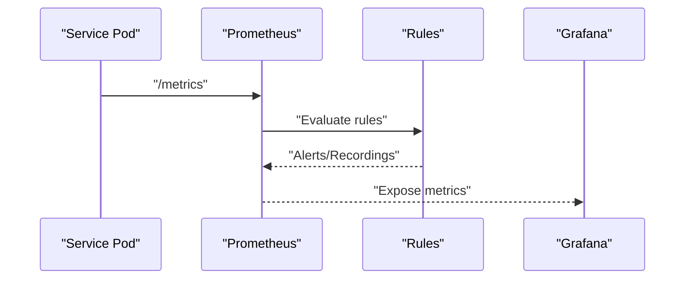
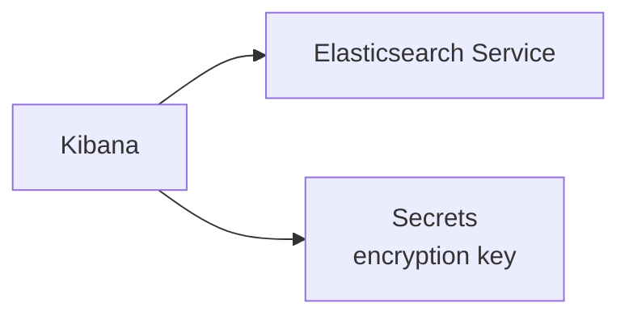
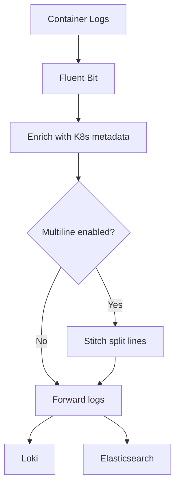
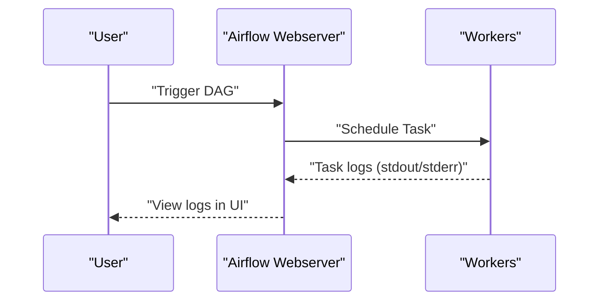
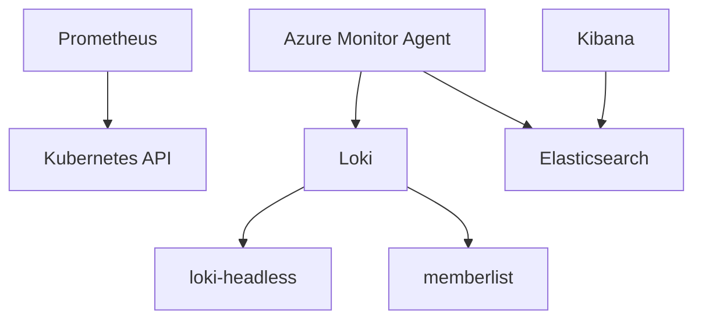

# Log Management and Analysis

<cite>
**Referenced Files in This Document**
- [loki.yaml](file://software/components/observability/loki.yaml)
- [prometheus.yaml](file://software/components/observability/prometheus.yaml)
- [kibana.yaml](file://software/components/elastic-search/kibana.yaml)
- [subnet_monitoring.yaml](file://software/components/observability/subnet_monitoring.yaml)
- [debugging_airflow.md](file://docs/src/debugging_airflow.md)
- [debugging_kibana.md](file://docs/src/debugging_kibana.md)
- [release.yaml](file://software/components/airflow/release.yaml)
- [main.bicep](file://bicep/main.bicep)
- [main-minimal.bicep](file://bicep/main-minimal.bicep)
</cite>

## Table of Contents
1. Introduction
2. Project Structure
3. Core Components
4. Architecture Overview
5. Detailed Component Analysis
6. Dependency Analysis
7. Performance Considerations
8. Troubleshooting Guide
9. Conclusion
10. Appendices

## Introduction
This document provides a comprehensive guide to log management and analysis using Loki for log aggregation, with integration points for metrics (Prometheus), traces (Jaeger), and Elasticsearch/Kibana. It covers log collection strategies, structured logging standards, querying techniques, correlation across logs/metrics/traces, alerting, dashboards, retention policies, Airflow workflow logging, and troubleshooting workflows.

## Project Structure
The observability stack is deployed under the istio-system namespace and includes:
- Loki single-binary deployment for log ingestion and querying
- Prometheus for metrics scraping and alerting rules
- Kibana connected to an Elasticsearch cluster for log visualization
- Azure Monitor Fluent Bit configuration for Kubernetes container logs and metadata
- Airflow components with environment variables that influence runtime behavior and logging

**Diagram sources**
- [loki.yaml:16-75](file://software/components/observability/loki.yaml#L16-L75)
- [prometheus.yaml:33-49](file://software/components/observability/prometheus.yaml#L33-L49)
- [kibana.yaml:1-49](file://software/components/elastic-search/kibana.yaml#L1-L49)
- [subnet_monitoring.yaml:58-95](file://software/components/observability/subnet_monitoring.yaml#L58-L95)

**Section sources**
- [loki.yaml:16-75](file://software/components/observability/loki.yaml#L16-L75)
- [prometheus.yaml:33-49](file://software/components/observability/prometheus.yaml#L33-L49)
- [kibana.yaml:1-49](file://software/components/elastic-search/kibana.yaml#L1-L49)
- [subnet_monitoring.yaml:58-95](file://software/components/observability/subnet_monitoring.yaml#L58-L95)

## Core Components
- Loki: Single-binary mode with local filesystem storage, schema v12, index period 24h, query range alignment, and retention controls via limits_config and table_manager settings.
- Prometheus: Configured with scrape intervals, rule files, and recording rules; supports alerting and metric-based triggers.
- Kibana: Deployed with Elasticsearch reference and environment variables for secure saved objects and host discovery.
- Azure Monitor Agent (Fluent Bit): Collects container logs, optional multiline stitching, metadata enrichment, and filtering by annotations.

Key responsibilities:
- Log ingestion and indexing (Loki)
- Metrics collection and alerting (Prometheus)
- Log visualization and search (Kibana/Elasticsearch)
- Kubernetes log collection and enrichment (Azure Monitor Agent)

**Section sources**
- [loki.yaml:29-75](file://software/components/observability/loki.yaml#L29-L75)
- [prometheus.yaml:33-49](file://software/components/observability/prometheus.yaml#L33-L49)
- [kibana.yaml:1-49](file://software/components/elastic-search/kibana.yaml#L1-L49)
- [subnet_monitoring.yaml:58-95](file://software/components/observability/subnet_monitoring.yaml#L58-L95)

## Architecture Overview
The system collects application logs from stdout/stderr, enriches them with Kubernetes metadata, and forwards them to both Loki and Elasticsearch. Prometheus scrapes metrics from services and exposes alerting capabilities. Grafana can visualize Loki logs and Prometheus metrics together, enabling cross-correlation.

**Diagram sources**
- [loki.yaml:16-75](file://software/components/observability/loki.yaml#L16-L75)
- [prometheus.yaml:33-49](file://software/components/observability/prometheus.yaml#L33-L49)
- [kibana.yaml:1-49](file://software/components/elastic-search/kibana.yaml#L1-L49)
- [subnet_monitoring.yaml:58-95](file://software/components/observability/subnet_monitoring.yaml#L58-L95)

## Detailed Component Analysis

### Loki Configuration and Retention
- Schema and Indexing: Uses schema v12 with daily index periods and a prefix for indexes.
- Storage: Local filesystem with chunks and rules directories; persistent volume mounted at /var/loki.
- Limits and Retention: Reject old samples beyond a configured age; table manager retention controls are present but disabled deletes and zero-period retention in current config.
- Query Range: Aligned queries for performance.

**Diagram sources**
- [loki.yaml:29-75](file://software/components/observability/loki.yaml#L29-L75)

**Section sources**
- [loki.yaml:29-75](file://software/components/observability/loki.yaml#L29-L75)

### Prometheus Alerting and Metrics Integration
- Scrape configuration targets Kubernetes services/pods and nodes.
- Rule files include recording rules and alerting rules paths.
- Time-based retention set for TSDB.

**Diagram sources**
- [prometheus.yaml:33-49](file://software/components/observability/prometheus.yaml#L33-L49)
- [prometheus.yaml:455-554](file://software/components/observability/prometheus.yaml#L455-L554)

**Section sources**
- [prometheus.yaml:33-49](file://software/components/observability/prometheus.yaml#L33-L49)
- [prometheus.yaml:455-554](file://software/components/observability/prometheus.yaml#L455-L554)

### Kibana and Elasticsearch Integration
- Kibana version and count configured.
- References Elasticsearch service name and port.
- Secure saved objects encryption key sourced from secrets.

**Diagram sources**
- [kibana.yaml:1-49](file://software/components/elastic-search/kibana.yaml#L1-L49)

**Section sources**
- [kibana.yaml:1-49](file://software/components/elastic-search/kibana.yaml#L1-L49)

### Azure Monitor Agent (Fluent Bit) Log Collection
- Container log schema v2 support.
- Multiline stitching for stacktraces across languages.
- Metadata collection options including pod labels/annotations.
- Filtering via annotations to exclude specific pods.

**Diagram sources**
- [subnet_monitoring.yaml:58-95](file://software/components/observability/subnet_monitoring.yaml#L58-L95)

**Section sources**
- [subnet_monitoring.yaml:58-95](file://software/components/observability/subnet_monitoring.yaml#L58-L95)

### Airflow Workflow Logging
- Environment variables control webserver behavior and API auth backend.
- Debugging documentation placeholder indicates future guidance for Airflow logs.

**Diagram sources**
- [release.yaml:124-131](file://software/components/airflow/release.yaml#L124-L131)

**Section sources**
- [release.yaml:124-131](file://software/components/airflow/release.yaml#L124-L131)
- [debugging_airflow.md:1-3](file://docs/src/debugging_airflow.md#L1-L3)

## Dependency Analysis
- Loki depends on Kubernetes services for headless communication and memberlist.
- Prometheus depends on Kubernetes RBAC and endpoints for scraping.
- Kibana depends on Elasticsearch service and secrets for encryption.
- Azure Monitor Agent depends on Kubernetes API for metadata and network access to Loki/Elasticsearch.

**Diagram sources**
- [loki.yaml:93-170](file://software/components/observability/loki.yaml#L93-L170)
- [prometheus.yaml:354-427](file://software/components/observability/prometheus.yaml#L354-L427)
- [kibana.yaml:1-49](file://software/components/elastic-search/kibana.yaml#L1-L49)
- [subnet_monitoring.yaml:58-95](file://software/components/observability/subnet_monitoring.yaml#L58-L95)

**Section sources**
- [loki.yaml:93-170](file://software/components/observability/loki.yaml#L93-L170)
- [prometheus.yaml:354-427](file://software/components/observability/prometheus.yaml#L354-L427)
- [kibana.yaml:1-49](file://software/components/elastic-search/kibana.yaml#L1-L49)
- [subnet_monitoring.yaml:58-95](file://software/components/observability/subnet_monitoring.yaml#L58-L95)

## Performance Considerations
- Loki query alignment and split intervals improve performance for large datasets.
- Reject old samples prevents excessive storage growth.
- Prometheus scrape intervals and timeouts should be tuned based on workload scale.
- Fluent Bit multiline stitching increases CPU/memory usage; enable only for needed languages.
- Persistent volumes for Loki must be sized appropriately; current PVC requests 10Gi.

[No sources needed since this section provides general guidance]

## Troubleshooting Guide
Common issues and resolution steps:
- No logs in Loki:
  - Verify Fluent Bit is collecting container logs and forwarding to Loki.
  - Check pod annotations used for filtering or inclusion.
  - Validate Loki service endpoints and ports.
- High memory/CPU in Fluent Bit:
  - Review multiline stitching settings and language filters.
  - Adjust buffer sizes and chunk limits if necessary.
- Prometheus alerts not firing:
  - Confirm rule files are loaded and endpoints are scraped.
  - Check RBAC permissions and network policies.
- Kibana cannot connect to Elasticsearch:
  - Ensure ELASTICSEARCH_HOSTS is correctly set and reachable.
  - Verify secret containing encryption key exists and is mounted.

**Section sources**
- [subnet_monitoring.yaml:58-95](file://software/components/observability/subnet_monitoring.yaml#L58-L95)
- [prometheus.yaml:33-49](file://software/components/observability/prometheus.yaml#L33-L49)
- [kibana.yaml:1-49](file://software/components/elastic-search/kibana.yaml#L1-L49)
- [debugging_kibana.md:1-3](file://docs/src/debugging_kibana.md#L1-L3)

## Conclusion
The repository deploys a robust observability stack centered around Loki for logs, Prometheus for metrics, and Elasticsearch/Kibana for visualization. With Azure Monitor Agent handling Kubernetes log collection and metadata enrichment, teams can correlate logs with metrics and traces to debug issues effectively. Retention policies and performance tuning are configurable through provided manifests. Future enhancements include detailed Airflow debugging documentation and expanded log-based alerting examples.

[No sources needed since this section summarizes without analyzing specific files]

## Appendices

### Log-Based Alerts Using Prometheus Rules
- Add alerting rules to the Prometheus configmap path referenced in the configuration.
- Use log-derived metrics (e.g., error rate counters emitted by applications) to trigger alerts.
- Integrate with notification channels (email, Slack) via Prometheus configuration.

**Section sources**
- [prometheus.yaml:33-49](file://software/components/observability/prometheus.yaml#L33-L49)

### Log Dashboards in Grafana
- Connect Grafana to Loki and Prometheus datasources.
- Create panels that combine log queries (LogQL) with metric graphs.
- Use shared labels (namespace, service, pod) to correlate across views.

[No sources needed since this section provides general guidance]

### Structured Logging Standards
- Emit JSON-formatted logs with consistent fields: timestamp, level, message, service, trace_id, span_id, user_id, partition_id.
- Include contextual labels for filtering and correlation.
- Avoid embedding sensitive data in logs.

[No sources needed since this section provides general guidance]

### Correlating Logs with Metrics and Traces
- Use trace_id/span_id from logs to link to distributed tracing spans.
- Filter logs by service and namespace to match metric series.
- Build unified dashboards showing logs alongside error rates and latency.

[No sources needed since this section provides general guidance]

### Airflow Workflow Logging
- Inspect worker logs via Kubernetes commands to diagnose task failures.
- Configure Airflow environment variables to adjust logging verbosity and behavior.
- Leverage Airflow UI to view task logs and execution context.

**Section sources**
- [release.yaml:124-131](file://software/components/airflow/release.yaml#L124-L131)
- [debugging_airflow.md:1-3](file://docs/src/debugging_airflow.md#L1-L3)

### Elasticsearch Integration
- Kibana references Elasticsearch service and uses secrets for secure operations.
- Ensure network policies allow Kibana to reach Elasticsearch endpoints.

**Section sources**
- [kibana.yaml:1-49](file://software/components/elastic-search/kibana.yaml#L1-L49)

### Log Retention Policies
- Loki:
  - reject_old_samples_max_age controls sample rejection.
  - table_manager retention_deletes_enabled and retention_period define deletion behavior.
- Azure resources:
  - Diagnostic settings and retention days can be configured via Bicep modules.

**Section sources**
- [loki.yaml:29-75](file://software/components/observability/loki.yaml#L29-L75)
- [main.bicep:218-247](file://bicep/main.bicep#L218-L247)
- [main-minimal.bicep:48-61](file://bicep/main-minimal.bicep#L48-L61)