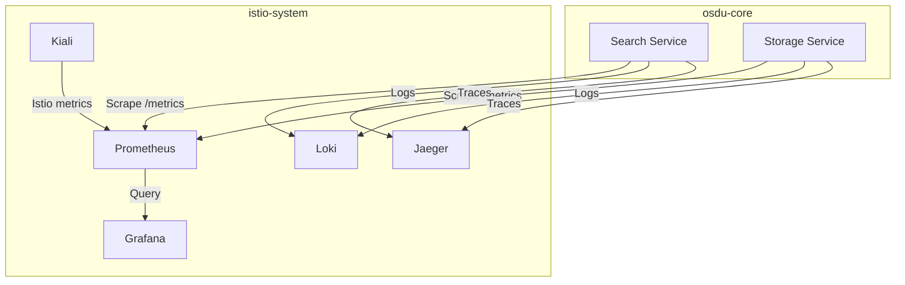
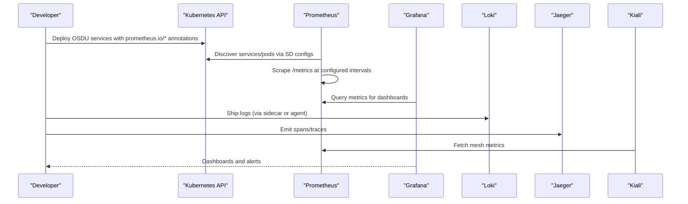
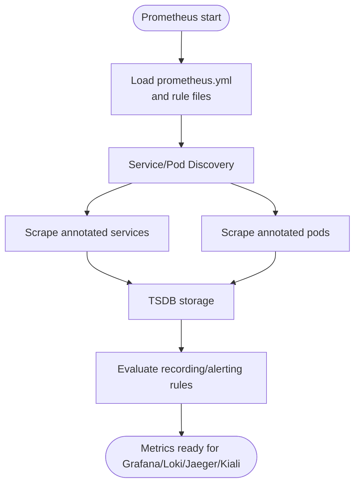
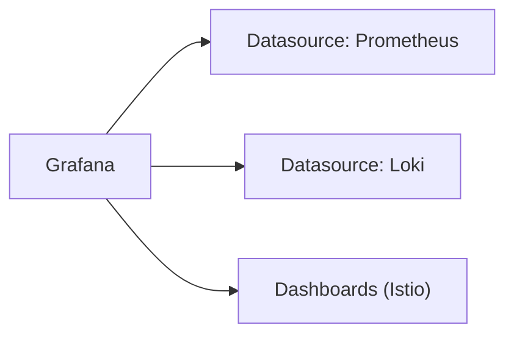
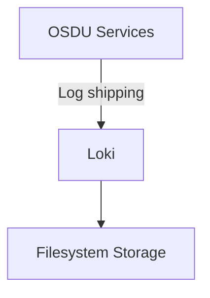
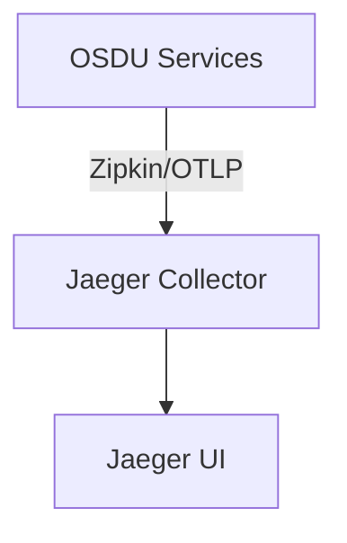
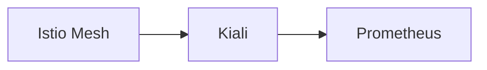
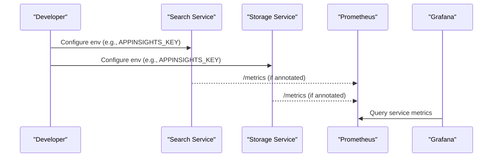
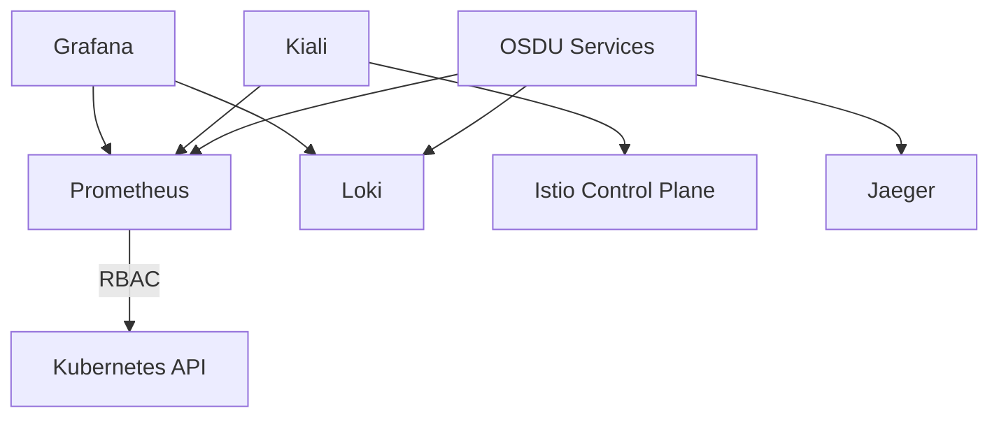

# Metrics and Monitoring

<cite>
**Referenced Files in This Document**
- [prometheus.yaml](file://software/components/observability/prometheus.yaml)
- [grafana.yaml](file://software/components/observability/grafana.yaml)
- [loki.yaml](file://software/components/observability/loki.yaml)
- [jaeger.yaml](file://software/components/observability/jaeger.yaml)
- [kiali.yaml](file://software/components/observability/kiali.yaml)
- [subnet_monitoring.yaml](file://software/components/observability/subnet_monitoring.yaml)
- [search.yaml](file://software/applications/osdu-core/search.yaml)
- [storage.yaml](file://software/applications/osdu-core/storage.yaml)
</cite>

## Table of Contents
1. [Introduction](#introduction)
2. [Project Structure](#project-structure)
3. [Core Components](#core-components)
4. [Architecture Overview](#architecture-overview)
5. [Detailed Component Analysis](#detailed-component-analysis)
6. [Dependency Analysis](#dependency-analysis)
7. [Performance Considerations](#performance-considerations)
8. [Troubleshooting Guide](#troubleshooting-guide)
9. [Conclusion](#conclusion)
10. [Appendices](#appendices)

## Introduction
This document explains how metrics collection and monitoring are implemented in the OSDU platform. It covers Prometheus configuration, metric scraping from microservices and Kubernetes components, Grafana dashboards and datasources, logging with Loki, distributed tracing with Jaeger, and service mesh observability via Kiali. It also provides guidance on creating custom metrics, setting up alerting rules, interpreting key performance indicators (KPIs), and troubleshooting performance issues using the available telemetry.

## Project Structure
The observability stack is deployed into the istio-system namespace and includes:
- Prometheus for metrics collection and rule evaluation
- Grafana for visualization and dashboard provisioning
- Loki for centralized log aggregation
- Jaeger for distributed tracing
- Kiali for service mesh visualization and metrics integration
- Subnet monitoring configuration for Azure-specific alertable metrics

**Diagram sources**
- [prometheus.yaml:39-196](file://software/components/observability/prometheus.yaml#L39-L196)
- [grafana.yaml:42-62](file://software/components/observability/grafana.yaml#L42-L62)
- [loki.yaml:28-74](file://software/components/observability/loki.yaml#L28-L74)
- [jaeger.yaml:21-38](file://software/components/observability/jaeger.yaml#L21-L38)
- [kiali.yaml:101-138](file://software/components/observability/kiali.yaml#L101-L138)
- [search.yaml:35-52](file://software/applications/osdu-core/search.yaml#L35-L52)
- [storage.yaml:35-57](file://software/applications/osdu-core/storage.yaml#L35-L57)

**Section sources**
- [prometheus.yaml:39-196](file://software/components/observability/prometheus.yaml#L39-L196)
- [grafana.yaml:42-62](file://software/components/observability/grafana.yaml#L42-L62)
- [loki.yaml:28-74](file://software/components/observability/loki.yaml#L28-L74)
- [jaeger.yaml:21-38](file://software/components/observability/jaeger.yaml#L21-L38)
- [kiali.yaml:101-138](file://software/components/observability/kiali.yaml#L101-L138)
- [search.yaml:35-52](file://software/applications/osdu-core/search.yaml#L35-L52)
- [storage.yaml:35-57](file://software/applications/osdu-core/storage.yaml#L35-L57)

## Core Components
- Prometheus: Scrapes metrics from Kubernetes APIs, nodes/cAdvisor, services, pods, and blackbox probes. Supports recording and alerting rules via mounted config files.
- Grafana: Pre-provisions Prometheus and Loki as datasources and loads Istio-related dashboards from a provisioned path.
- Loki: Centralized logs with filesystem storage and retention settings; exposes HTTP and gRPC endpoints.
- Jaeger: All-in-one tracing backend with Zipkin-compatible endpoint and OpenTelemetry collectors exposed via service ports.
- Kiali: Service mesh visualization with metrics enabled and external dashboards configured.
- Subnet monitoring: Azure subnet-level alertable metrics thresholds for container resource utilization and persistent volume usage.

Key configuration highlights:
- Prometheus scrape intervals and timeouts, rule file mounts, and dynamic service/pod discovery via annotations.
- Grafana datasources pointing to Prometheus and Loki, plus dashboard providers for Istio content.
- Loki single-binary mode with local filesystem storage and retention policies.
- Jaeger environment variables for storage type and query base path.
- Kiali configuration enabling metrics and custom dashboards.

**Section sources**
- [prometheus.yaml:39-196](file://software/components/observability/prometheus.yaml#L39-L196)
- [grafana.yaml:42-62](file://software/components/observability/grafana.yaml#L42-L62)
- [loki.yaml:28-74](file://software/components/observability/loki.yaml#L28-L74)
- [jaeger.yaml:21-38](file://software/components/observability/jaeger.yaml#L21-L38)
- [kiali.yaml:101-138](file://software/components/observability/kiali.yaml#L101-L138)
- [subnet_monitoring.yaml:144-158](file://software/components/observability/subnet_monitoring.yaml#L144-L158)

## Architecture Overview
The platform uses annotation-driven service discovery to collect metrics from OSDU microservices and Kubernetes infrastructure. Grafana consumes Prometheus time-series data and Loki logs. Tracing flows through Jaeger, while Kiali visualizes Istio traffic and integrates with Prometheus for metrics.

**Diagram sources**
- [prometheus.yaml:105-196](file://software/components/observability/prometheus.yaml#L105-L196)
- [grafana.yaml:42-62](file://software/components/observability/grafana.yaml#L42-L62)
- [loki.yaml:28-74](file://software/components/observability/loki.yaml#L28-L74)
- [jaeger.yaml:21-38](file://software/components/observability/jaeger.yaml#L21-L38)
- [kiali.yaml:101-138](file://software/components/observability/kiali.yaml#L101-L138)

## Detailed Component Analysis

### Prometheus Configuration and Scraping
- Global scrape interval and timeout are set, with rule files mounted for recording and alerting.
- Multiple scrape jobs target:
  - Prometheus itself
  - Kubernetes API servers
  - Node and cAdvisor metrics
  - Service endpoints discovered by annotations
  - Pod endpoints discovered by annotations
  - Blackbox probes for service health checks
- Relabeling maps namespaces, services, pods, and nodes into consistent labels.

**Diagram sources**
- [prometheus.yaml:39-196](file://software/components/observability/prometheus.yaml#L39-L196)

**Section sources**
- [prometheus.yaml:39-196](file://software/components/observability/prometheus.yaml#L39-L196)

### Grafana Datasources and Dashboards
- Datasources are provisioned for Prometheus and Loki.
- Dashboard providers load Istio-related dashboards from a mounted directory.
- Anonymous access is enabled for quick setup; credentials can be adjusted for production.

**Diagram sources**
- [grafana.yaml:42-62](file://software/components/observability/grafana.yaml#L42-L62)
- [grafana.yaml:63-79](file://software/components/observability/grafana.yaml#L63-L79)

**Section sources**
- [grafana.yaml:42-62](file://software/components/observability/grafana.yaml#L42-L62)
- [grafana.yaml:63-79](file://software/components/observability/grafana.yaml#L63-L79)

### Loki Logging
- Single-binary Loki with filesystem storage and retention limits.
- Exposes HTTP and gRPC endpoints for ingestion and querying.

**Diagram sources**
- [loki.yaml:28-74](file://software/components/observability/loki.yaml#L28-L74)

**Section sources**
- [loki.yaml:28-74](file://software/components/observability/loki.yaml#L28-L74)

### Jaeger Distributed Tracing
- All-in-one Jaeger deployment with Badger storage and Zipkin-compatible collector.
- Exposes OTLP and Zipkin endpoints for application instrumentation.

**Diagram sources**
- [jaeger.yaml:21-38](file://software/components/observability/jaeger.yaml#L21-L38)
- [jaeger.yaml:79-121](file://software/components/observability/jaeger.yaml#L79-L121)

**Section sources**
- [jaeger.yaml:21-38](file://software/components/observability/jaeger.yaml#L21-L38)
- [jaeger.yaml:79-121](file://software/components/observability/jaeger.yaml#L79-L121)

### Kiali Service Mesh Observability
- Kiali enables metrics and custom dashboards, integrating with Istio and Prometheus.
- Provides visibility into service topology, traffic, and errors.

**Diagram sources**
- [kiali.yaml:101-138](file://software/components/observability/kiali.yaml#L101-L138)

**Section sources**
- [kiali.yaml:101-138](file://software/components/observability/kiali.yaml#L101-L138)

### OSDU Microservices Telemetry Integration
- Services expose health endpoints used by probes and can be scraped if annotated.
- Environment variables include Application Insights keys and connection strings for additional telemetry.

**Diagram sources**
- [search.yaml:71-103](file://software/applications/osdu-core/search.yaml#L71-L103)
- [storage.yaml:76-104](file://software/applications/osdu-core/storage.yaml#L76-L104)
- [prometheus.yaml:105-196](file://software/components/observability/prometheus.yaml#L105-L196)

**Section sources**
- [search.yaml:71-103](file://software/applications/osdu-core/search.yaml#L71-L103)
- [storage.yaml:76-104](file://software/applications/osdu-core/storage.yaml#L76-L104)
- [prometheus.yaml:105-196](file://software/components/observability/prometheus.yaml#L105-L196)

## Dependency Analysis
- Prometheus depends on Kubernetes RBAC permissions to discover and scrape resources.
- Grafana depends on Prometheus and Loki datasources being reachable within the cluster.
- Kiali depends on Istio control plane and Prometheus for metrics.
- Jaeger is independent but consumed by applications emitting traces.
- Subnet monitoring defines alertable thresholds for container and PV utilization.

**Diagram sources**
- [prometheus.yaml:354-404](file://software/components/observability/prometheus.yaml#L354-L404)
- [grafana.yaml:42-62](file://software/components/observability/grafana.yaml#L42-L62)
- [kiali.yaml:101-138](file://software/components/observability/kiali.yaml#L101-L138)
- [jaeger.yaml:79-121](file://software/components/observability/jaeger.yaml#L79-L121)

**Section sources**
- [prometheus.yaml:354-404](file://software/components/observability/prometheus.yaml#L354-L404)
- [grafana.yaml:42-62](file://software/components/observability/grafana.yaml#L42-L62)
- [kiali.yaml:101-138](file://software/components/observability/kiali.yaml#L101-L138)
- [jaeger.yaml:79-121](file://software/components/observability/jaeger.yaml#L79-L121)

## Performance Considerations
- Adjust Prometheus scrape intervals and timeouts based on workload size and metric cardinality.
- Use slow-scrape jobs for expensive endpoints to avoid overloading services.
- Limit retained metrics and logs according to storage capacity and compliance requirements.
- Ensure proper resource requests/limits for observability components to prevent OOM or CPU throttling.
- For OSDU services, tune JVM/runtime metrics exporters and ensure health endpoints are lightweight.

[No sources needed since this section provides general guidance]

## Troubleshooting Guide
Common issues and resolutions:
- Missing metrics: Verify that services have correct prometheus.io/scrape annotations and expose a /metrics endpoint. Check Prometheus targets and relabeling rules.
- High scrape latency: Review slow-scrape job configurations and consider reducing label cardinality or increasing scrape intervals for heavy endpoints.
- Grafana cannot connect to datasources: Confirm network reachability and datasource URLs in Grafana provisioning.
- Logs not appearing in Loki: Ensure log shipping agents or sidecars are configured and Loki is healthy.
- Traces missing in Jaeger: Validate that applications send traces to the Zipkin/OTLP endpoints and that Jaeger is running.
- Kiali shows no mesh data: Confirm Istio control plane is healthy and Prometheus is accessible from Kiali.

**Section sources**
- [prometheus.yaml:105-196](file://software/components/observability/prometheus.yaml#L105-L196)
- [grafana.yaml:42-62](file://software/components/observability/grafana.yaml#L42-L62)
- [loki.yaml:28-74](file://software/components/observability/loki.yaml#L28-L74)
- [jaeger.yaml:21-38](file://software/components/observability/jaeger.yaml#L21-L38)
- [kiali.yaml:101-138](file://software/components/observability/kiali.yaml#L101-L138)

## Conclusion
The OSDU platform’s observability stack combines Prometheus, Grafana, Loki, Jaeger, and Kiali to provide comprehensive metrics, logs, traces, and service mesh insights. Annotation-driven scraping simplifies integration with OSDU microservices, while pre-provisioned Grafana dashboards accelerate monitoring. By tuning scrape intervals, configuring alerting rules, and leveraging dashboards tailored to different stakeholders, teams can effectively monitor service health, API performance, database queries, and resource utilization.

[No sources needed since this section summarizes without analyzing specific files]

## Appendices

### How to Create Custom Metrics
- Instrument your OSDU service to expose a /metrics endpoint compatible with Prometheus.
- Annotate the service or pod with prometheus.io/scrape and related fields to enable automatic discovery.
- Add recording rules to precompute expensive queries and alerting rules to trigger notifications.

**Section sources**
- [prometheus.yaml:105-196](file://software/components/observability/prometheus.yaml#L105-L196)
- [prometheus.yaml:39-48](file://software/components/observability/prometheus.yaml#L39-L48)

### Setting Up Alerting Rules
- Place alerting rules in the mounted rule files referenced by Prometheus configuration.
- Use recording rules to optimize frequent queries and reduce load.
- Validate rules via Prometheus UI and test against live metrics.

**Section sources**
- [prometheus.yaml:39-48](file://software/components/observability/prometheus.yaml#L39-L48)

### Interpreting Key Performance Indicators
- Service Health: Use readiness/liveness probes and error rates from Istio and application metrics.
- API Response Times: Track request duration histograms and percentiles per service and route.
- Database Query Performance: Monitor query latency and throughput for underlying databases (e.g., Cosmos DB, Redis).
- Resource Utilization: Watch CPU/memory usage for pods and nodes; use cAdvisor metrics for container-level insights.

**Section sources**
- [search.yaml:50-57](file://software/applications/osdu-core/search.yaml#L50-L57)
- [storage.yaml:52-57](file://software/applications/osdu-core/storage.yaml#L52-L57)
- [prometheus.yaml:87-104](file://software/components/observability/prometheus.yaml#L87-L104)

### Creating Effective Dashboards for Stakeholders
- Operators: Cluster-wide resource utilization, node and pod health, and alert status.
- Developers: Service-level latency, error rates, and dependency calls via Istio dashboards.
- Business: SLA-related KPIs such as request success rates and throughput trends.

**Section sources**
- [grafana.yaml:63-79](file://software/components/observability/grafana.yaml#L63-L79)

### Troubleshooting Performance Issues Using Metrics Data
- Identify spikes in latency or error rates and correlate with resource saturation.
- Use Kiali to visualize call graphs and pinpoint bottlenecks across services.
- Correlate logs in Loki with metric anomalies to understand root causes.
- Validate tracing spans in Jaeger to analyze end-to-end request paths.

**Section sources**
- [kiali.yaml:101-138](file://software/components/observability/kiali.yaml#L101-L138)
- [loki.yaml:28-74](file://software/components/observability/loki.yaml#L28-L74)
- [jaeger.yaml:21-38](file://software/components/observability/jaeger.yaml#L21-L38)