# Monitoring and Observability

<cite>
**Referenced Files in This Document**
- [Application_Insights.md](file://src/Application_Insights.md)
- [prometheus.yaml](file://software/components/observability/prometheus.yaml)
- [grafana.yaml](file://software/components/observability/grafana.yaml)
- [jaeger.yaml](file://software/components/observability/jaeger.yaml)
- [kibana.yaml](file://software/components/elastic-search/kibana.yaml)
- [loki.yaml](file://software/components/observability/loki.yaml)
- [kiali.yaml](file://software/components/observability/kiali.yaml)
- [debugging_kibana.md](file://docs/src/debugging_kibana.md)
- [debugging_istio.md](file://docs/src/debugging_istio.md)
- [debugging_airflow.md](file://docs/src/debugging_airflow.md)
- [services_core_workflow.md](file://docs/src/services_core_workflow.md)
- [workflow-init.yaml](file://charts/osdu-developer-init/templates/workflow-init.yaml)
- [local.http](file://tools/rest-scripts/local.http)
</cite>

## Table of Contents
1. Introduction
2. Project Structure
3. Core Components
4. Architecture Overview
5. Detailed Component Analysis
6. Dependency Analysis
7. Performance Considerations
8. Troubleshooting Guide
9. Conclusion
10. Appendices

## Introduction
This document provides comprehensive monitoring and observability guidance for the OSDU platform. It covers the complete stack including Application Insights, Grafana dashboards, Prometheus metrics, Jaeger distributed tracing, Kibana log analysis, Loki logs, and Istio service mesh observability via Kiali. It also explains how to set up monitoring, create custom alerts, interpret key performance indicators (KPIs), debug microservices, correlate logs across components, and monitor workflow execution with Airflow.

## Project Structure
The observability stack is deployed as Kubernetes resources under software/components/observability and related areas:
- Metrics collection and storage: Prometheus
- Visualization and dashboards: Grafana
- Distributed tracing: Jaeger (with Zipkin compatibility)
- Logs aggregation and querying: Loki
- Service mesh visualization and debugging: Kiali
- Log analytics UI: Kibana (connected to Elasticsearch)

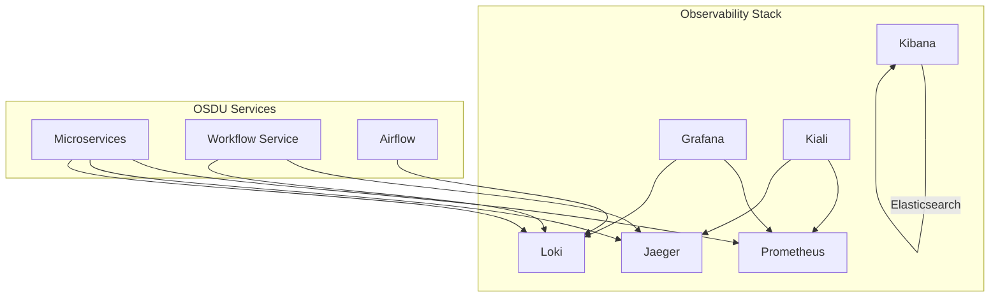

**Diagram sources**
- [prometheus.yaml:39-196](file://software/components/observability/prometheus.yaml#L39-L196)
- [grafana.yaml:42-63](file://software/components/observability/grafana.yaml#L42-L63)
- [jaeger.yaml:21-55](file://software/components/observability/jaeger.yaml#L21-L55)
- [loki.yaml:28-75](file://software/components/observability/loki.yaml#L28-L75)
- [kiali.yaml:34-140](file://software/components/observability/kiali.yaml#L34-L140)
- [kibana.yaml:1-49](file://software/components/elastic-search/kibana.yaml#L1-L49)

**Section sources**
- [prometheus.yaml:39-196](file://software/components/observability/prometheus.yaml#L39-L196)
- [grafana.yaml:42-63](file://software/components/observability/grafana.yaml#L42-L63)
- [jaeger.yaml:21-55](file://software/components/observability/jaeger.yaml#L21-L55)
- [loki.yaml:28-75](file://software/components/observability/loki.yaml#L28-L75)
- [kiali.yaml:34-140](file://software/components/observability/kiali.yaml#L34-L140)
- [kibana.yaml:1-49](file://software/components/elastic-search/kibana.yaml#L1-L49)

## Core Components
- Prometheus: Scrapes metrics from Kubernetes services, nodes, and pods; supports alerting rules and recording rules via ConfigMap.
- Grafana: Pre-provisions datasources for Prometheus and Loki; loads Istio dashboards; exposes a web UI for visualization and alerting.
- Jaeger: All-in-one deployment with Badger storage; exposes query UI and collector endpoints; compatible with Zipkin API.
- Loki: Single-binary mode with filesystem storage; exposes HTTP and gRPC APIs; integrated into Grafana.
- Kibana: Deployed via Elastic Operator; connects to Elasticsearch; configured with environment variables and secrets.
- Kiali: Istio service mesh dashboard and troubleshooting tool; integrates with Prometheus and Jaeger.

Key configuration highlights:
- Prometheus scrape intervals and targets are defined in its ConfigMap.
- Grafana datasources point to Prometheus and Loki services within istio-system.
- Jaeger runs with an all-in-one image and exposes standard ports for query and collector.
- Loki uses a single binary with persistent storage via PVC templates.
- Kibana references an Elasticsearch resource and sets encryption keys via secrets.
- Kiali configures anonymous access and external service integrations.

**Section sources**
- [prometheus.yaml:39-196](file://software/components/observability/prometheus.yaml#L39-L196)
- [grafana.yaml:42-63](file://software/components/observability/grafana.yaml#L42-L63)
- [jaeger.yaml:21-55](file://software/components/observability/jaeger.yaml#L21-L55)
- [loki.yaml:28-75](file://software/components/observability/loki.yaml#L28-L75)
- [kibana.yaml:1-49](file://software/components/elastic-search/kibana.yaml#L1-L49)
- [kiali.yaml:34-140](file://software/components/observability/kiali.yaml#L34-L140)

## Architecture Overview
The observability architecture centers on collecting telemetry from OSDU services and exposing it through unified interfaces:
- Metrics flow: Services expose /metrics endpoints; Prometheus scrapes them; Grafana visualizes; alerts can be configured in Prometheus or Grafana.
- Tracing flow: Services emit spans to Jaeger (or Zipkin-compatible endpoint); Jaanger stores and serves traces; Kiali can visualize traces alongside mesh topology.
- Logs flow: Services ship logs to Loki; Grafana queries Loki; Kibana provides advanced log analytics against Elasticsearch.
- Mesh visibility: Kiali reads Istio control plane data and correlates with metrics/traces/logs.

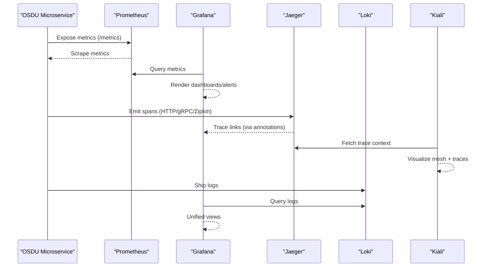

**Diagram sources**
- [prometheus.yaml:39-196](file://software/components/observability/prometheus.yaml#L39-L196)
- [grafana.yaml:42-63](file://software/components/observability/grafana.yaml#L42-L63)
- [jaeger.yaml:21-55](file://software/components/observability/jaeger.yaml#L21-L55)
- [loki.yaml:28-75](file://software/components/observability/loki.yaml#L28-L75)
- [kiali.yaml:34-140](file://software/components/observability/kiali.yaml#L34-L140)

## Detailed Component Analysis

### Prometheus
- Purpose: Time-series metrics collection and alerting.
- Configuration: Scrape configs for Kubernetes services/pods/nodes; supports slow scraping jobs; rule files mounted via ConfigMap.
- Access: Service exposed on port 9090 within istio-system.
- Alerting: Rule files and alerts can be added to the ConfigMap sections for recording_rules.yml, alerting_rules.yml, rules, and alerts.

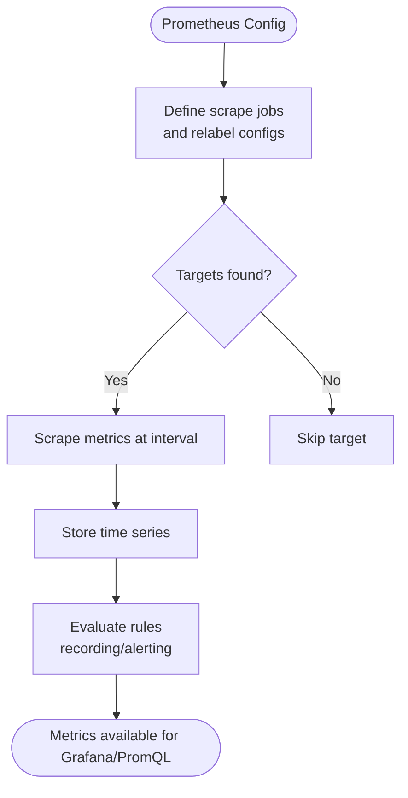

**Diagram sources**
- [prometheus.yaml:39-196](file://software/components/observability/prometheus.yaml#L39-L196)

**Section sources**
- [prometheus.yaml:39-196](file://software/components/observability/prometheus.yaml#L39-L196)
- [prometheus.yaml:428-453](file://software/components/observability/prometheus.yaml#L428-L453)

### Grafana
- Purpose: Dashboards, log/metrics correlation, and alerting UI.
- Datasources: Pre-provisioned for Prometheus and Loki.
- Dashboards: Istio dashboards loaded from mounted paths.
- Access: Service on port 3000; anonymous admin enabled by default for convenience.

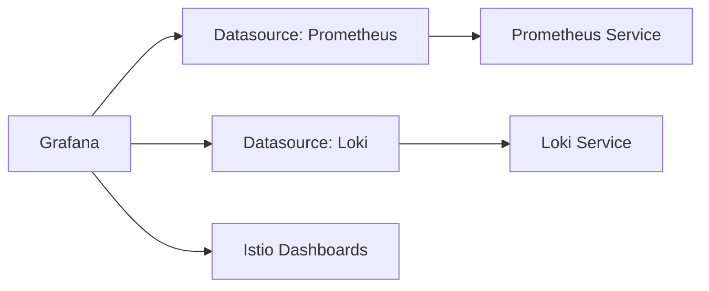

**Diagram sources**
- [grafana.yaml:42-63](file://software/components/observability/grafana.yaml#L42-L63)
- [grafana.yaml:63-79](file://software/components/observability/grafana.yaml#L63-L79)

**Section sources**
- [grafana.yaml:42-63](file://software/components/observability/grafana.yaml#L42-L63)
- [grafana.yaml:63-79](file://software/components/observability/grafana.yaml#L63-L79)

### Jaeger
- Purpose: Distributed tracing with Zipkin compatibility.
- Storage: Badger embedded store with directory mounts.
- Interfaces: Query UI, collector HTTP/gRPC, Zipkin HTTP, OpenTelemetry HTTP/gRPC.
- Access: Services named tracing and jaeger-collector; Zipkin alias for compatibility.

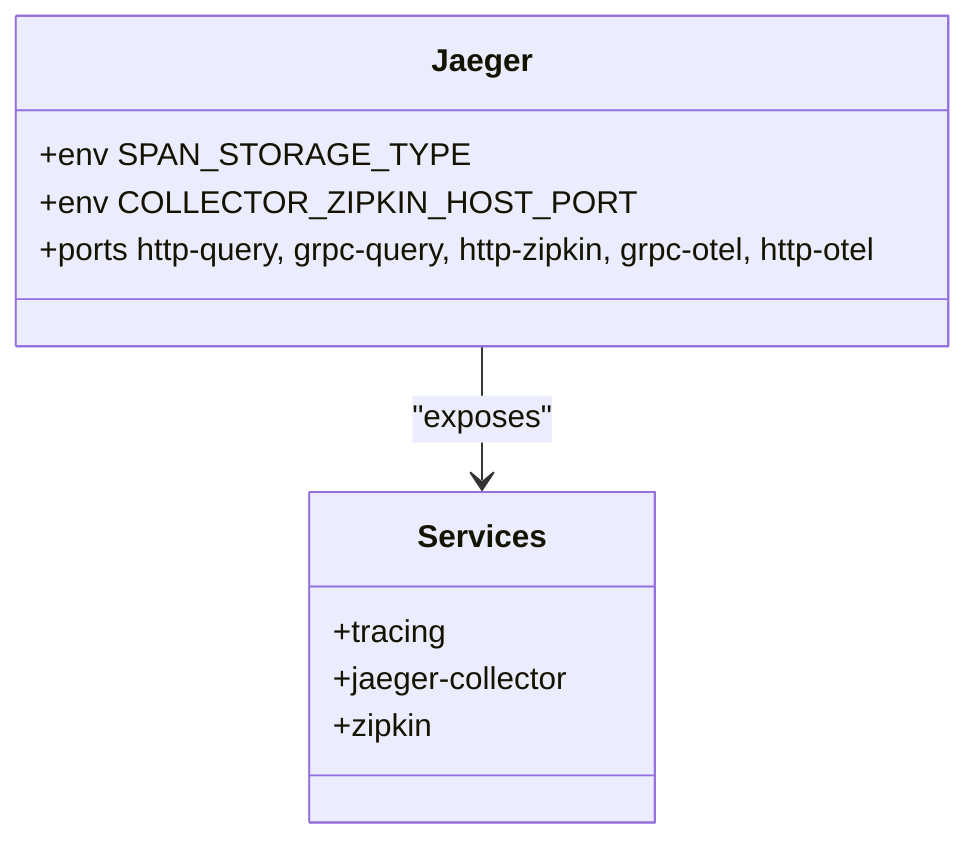

**Diagram sources**
- [jaeger.yaml:21-55](file://software/components/observability/jaeger.yaml#L21-L55)
- [jaeger.yaml:57-121](file://software/components/observability/jaeger.yaml#L57-L121)

**Section sources**
- [jaeger.yaml:21-55](file://software/components/observability/jaeger.yaml#L21-L55)
- [jaeger.yaml:57-121](file://software/components/observability/jaeger.yaml#L57-L121)

### Loki
- Purpose: Log aggregation and querying.
- Mode: Single-binary with filesystem storage; memberlist for clustering; retention and limits configured.
- Access: HTTP and gRPC services; headless service for stateful networking.

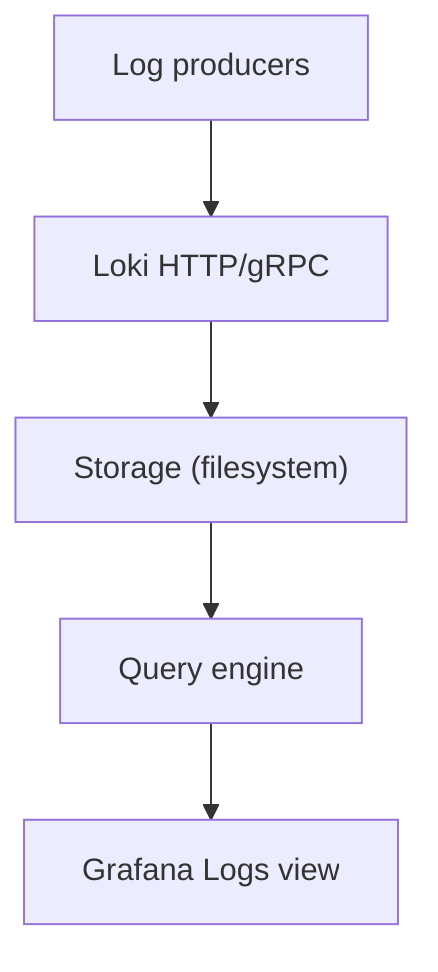

**Diagram sources**
- [loki.yaml:28-75](file://software/components/observability/loki.yaml#L28-L75)
- [loki.yaml:143-169](file://software/components/observability/loki.yaml#L143-L169)

**Section sources**
- [loki.yaml:28-75](file://software/components/observability/loki.yaml#L28-L75)
- [loki.yaml:143-169](file://software/components/observability/loki.yaml#L143-L169)

### Kibana
- Purpose: Log analytics UI connected to Elasticsearch.
- Deployment: Managed via Elastic Operator; replicas and affinity configured; secrets for encryption key; Elasticsearch hosts configured via env.

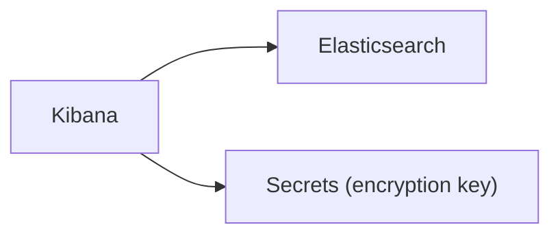

**Diagram sources**
- [kibana.yaml:1-49](file://software/components/elastic-search/kibana.yaml#L1-L49)

**Section sources**
- [kibana.yaml:1-49](file://software/components/elastic-search/kibana.yaml#L1-L49)

### Kiali (Service Mesh Observability)
- Purpose: Istio service mesh visualization, diagnostics, and integration with metrics/traces.
- Configuration: Anonymous auth strategy; external services for Istio; custom dashboards enabled; metrics exposure.
- Access: Service on port 20001.

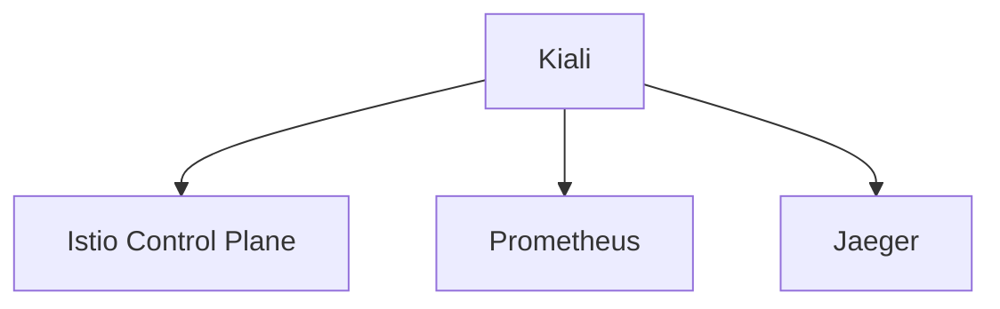

**Diagram sources**
- [kiali.yaml:34-140](file://software/components/observability/kiali.yaml#L34-L140)
- [kiali.yaml:412-437](file://software/components/observability/kiali.yaml#L412-L437)

**Section sources**
- [kiali.yaml:34-140](file://software/components/observability/kiali.yaml#L34-L140)
- [kiali.yaml:412-437](file://software/components/observability/kiali.yaml#L412-L437)

### Application Insights (Local Development)
- Purpose: Enable local development telemetry for Java-based services using the Application Insights Java agent.
- Setup: Configure JVM arguments and environment variables; ensure agent JAR is available; avoid null context exceptions by proper setup.

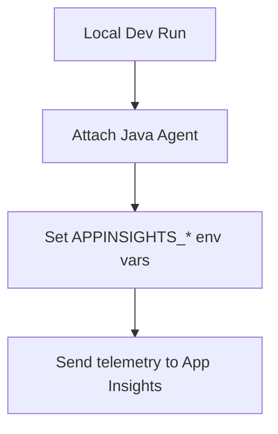

**Diagram sources**
- [Application_Insights.md:1-71](file://src/Application_Insights.md#L1-L71)

**Section sources**
- [Application_Insights.md:1-71](file://src/Application_Insights.md#L1-L71)

### Workflow Execution Monitoring (Airflow)
- Purpose: Monitor workflow registration and execution via the workflow service and Airflow.
- Registration: Init job registers workflows with the workflow service using federated identity and REST calls.
- Testing: Example HTTP requests demonstrate invoking workflow info and running executions.

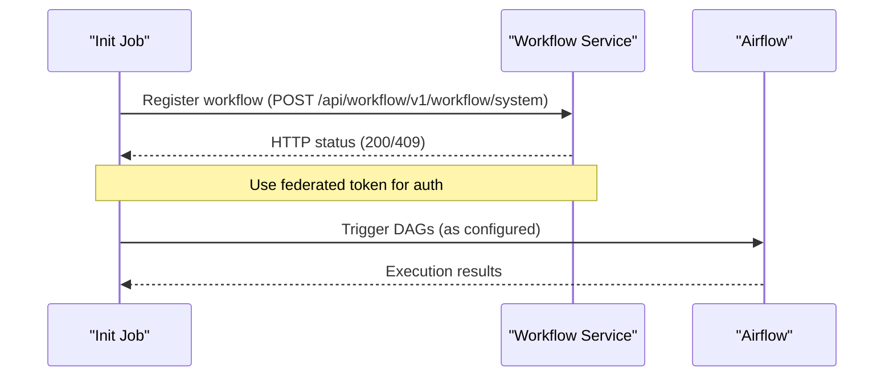

**Diagram sources**
- [workflow-init.yaml:58-126](file://charts/osdu-developer-init/templates/workflow-init.yaml#L58-L126)
- [local.http:380-411](file://tools/rest-scripts/local.http#L380-L411)

**Section sources**
- [workflow-init.yaml:58-126](file://charts/osdu-developer-init/templates/workflow-init.yaml#L58-L126)
- [local.http:380-411](file://tools/rest-scripts/local.http#L380-L411)

## Dependency Analysis
- Grafana depends on Prometheus and Loki datasources.
- Kiali depends on Istio control plane, Prometheus, and Jaeger.
- Jaeger exposes multiple protocols for collectors and clients.
- Prometheus discovers and scrapes Kubernetes endpoints and pods based on annotations.
- Kibana depends on Elasticsearch and secret-managed credentials.

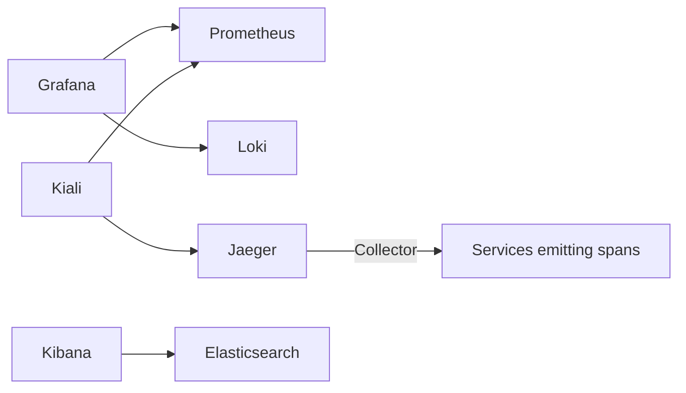

**Diagram sources**
- [grafana.yaml:42-63](file://software/components/observability/grafana.yaml#L42-L63)
- [kiali.yaml:34-140](file://software/components/observability/kiali.yaml#L34-L140)
- [jaeger.yaml:57-121](file://software/components/observability/jaeger.yaml#L57-L121)
- [kibana.yaml:1-49](file://software/components/elastic-search/kibana.yaml#L1-L49)
- [prometheus.yaml:39-196](file://software/components/observability/prometheus.yaml#L39-L196)

**Section sources**
- [grafana.yaml:42-63](file://software/components/observability/grafana.yaml#L42-L63)
- [kiali.yaml:34-140](file://software/components/observability/kiali.yaml#L34-L140)
- [jaeger.yaml:57-121](file://software/components/observability/jaeger.yaml#L57-L121)
- [kibana.yaml:1-49](file://software/components/elastic-search/kibana.yaml#L1-L49)
- [prometheus.yaml:39-196](file://software/components/observability/prometheus.yaml#L39-L196)

## Performance Considerations
- Prometheus scrape tuning: Adjust scrape_interval and scrape_timeout per job; use slow jobs for expensive endpoints; consider recording rules for heavy queries.
- Storage sizing: Ensure sufficient PVC capacity for Loki and persistent storage needs; monitor disk usage and retention policies.
- Jaeger memory: Tune MEMORY_MAX_TRACES and storage backend; evaluate Badger vs external backends for production scale.
- Grafana dashboards: Use prebuilt Istio dashboards; limit panel refresh rates; leverage variable scoping to reduce load.
- Kibana/Elasticsearch: Scale Elasticsearch nodes and shards; tune index lifecycle management; monitor heap usage.
- Istio/Kiali: Keep sidecar injection disabled for observability components where appropriate; monitor control plane health.

[No sources needed since this section provides general guidance]

## Troubleshooting Guide
- Application Insights local issues: Ensure the Java agent JAR is present and VM options include the agent; set required environment variables to avoid null context exceptions.
- Prometheus connectivity: Verify service discovery annotations on services/pods; check RBAC permissions for scraping; validate scrape targets in UI.
- Grafana datasource errors: Confirm Prometheus and Loki services are reachable; verify datasources provisioning; check network policies.
- Jaeger ingestion: Validate collector endpoints and client configurations; test Zipkin compatibility if applicable; inspect span storage availability.
- Loki log ingestion: Check log shipping configuration; verify HTTP/gRPC endpoints; review retention and limits; confirm PVC availability.
- Kibana access: Ensure Elasticsearch is healthy; verify secrets for encryption keys; confirm host URL configuration.
- Istio mesh debugging: Use Kiali to inspect traffic flows, mTLS status, and error rates; correlate with Prometheus metrics and Jaeger traces.
- Workflow execution: Use init job logs to verify registration; test workflow endpoints via provided HTTP scripts; check Airflow UI for DAG runs.

**Section sources**
- [Application_Insights.md:1-71](file://src/Application_Insights.md#L1-L71)
- [prometheus.yaml:39-196](file://software/components/observability/prometheus.yaml#L39-L196)
- [grafana.yaml:42-63](file://software/components/observability/grafana.yaml#L42-L63)
- [jaeger.yaml:21-55](file://software/components/observability/jaeger.yaml#L21-L55)
- [loki.yaml:28-75](file://software/components/observability/loki.yaml#L28-L75)
- [kibana.yaml:1-49](file://software/components/elastic-search/kibana.yaml#L1-L49)
- [kiali.yaml:34-140](file://software/components/observability/kiali.yaml#L34-L140)
- [workflow-init.yaml:58-126](file://charts/osdu-developer-init/templates/workflow-init.yaml#L58-L126)
- [local.http:380-411](file://tools/rest-scripts/local.http#L380-L411)

## Conclusion
The OSDU observability stack integrates metrics, logs, traces, and service mesh insights into a cohesive system. Prometheus collects and evaluates metrics; Grafana unifies visualization and alerting; Jaeger enables distributed tracing; Loki centralizes logs; Kibana offers advanced log analytics; Kiali provides mesh-level visibility. By following the setup and troubleshooting guidance, teams can effectively monitor OSDU services, diagnose issues, and optimize performance across the platform.

[No sources needed since this section summarizes without analyzing specific files]

## Appendices

### Key Performance Indicators (KPIs) and Where to Find Them
- Request latency and error rates: Prometheus metrics scraped from services; visualize in Grafana dashboards.
- Throughput and saturation: Node and pod metrics via Prometheus; cluster-level insights in Kiali.
- Trace duration and failure points: Jaeger traces; filter by service and namespace in Kiali.
- Log volume and error patterns: Loki queries in Grafana; Kibana for advanced filtering and aggregations.
- Workflow execution success/failure: Workflow service responses and Airflow UI; init job logs for registration outcomes.

[No sources needed since this section provides general guidance]

### Creating Custom Alerts
- Prometheus rules: Add recording and alerting rules via ConfigMap sections; reload automatically via config reloader.
- Grafana alerts: Create alert rules bound to Prometheus queries; configure notifications and thresholds.
- Loki ruler: Configure alerting rules in Loki’s runtime config or via external rule manager.

**Section sources**
- [prometheus.yaml:39-196](file://software/components/observability/prometheus.yaml#L39-L196)
- [grafana.yaml:42-63](file://software/components/observability/grafana.yaml#L42-L63)
- [loki.yaml:28-75](file://software/components/observability/loki.yaml#L28-L75)

### Debugging Techniques
- Microservices: Use Jaeger to trace request flows; correlate with logs in Loki; validate metrics anomalies in Grafana.
- Service mesh: Inspect traffic, mTLS, and routing in Kiali; cross-check with Prometheus and Jaeger.
- Workflows: Validate registration via init job; run test executions using HTTP scripts; observe Airflow DAG runs.

**Section sources**
- [jaeger.yaml:21-55](file://software/components/observability/jaeger.yaml#L21-L55)
- [loki.yaml:28-75](file://software/components/observability/loki.yaml#L28-L75)
- [kiali.yaml:34-140](file://software/components/observability/kiali.yaml#L34-L140)
- [workflow-init.yaml:58-126](file://charts/osdu-developer-init/templates/workflow-init.yaml#L58-L126)
- [local.http:380-411](file://tools/rest-scripts/local.http#L380-L411)

### Log Correlation Strategies
- Use common identifiers (request IDs, trace IDs) propagated across services.
- Correlate traces from Jaeger with logs in Loki via shared labels or annotations.
- Leverage Grafana panels to switch between metrics, logs, and traces seamlessly.

[No sources needed since this section provides general guidance]

### Performance Profiling Approaches
- Profile application code using language-specific profilers; correlate with traces and metrics.
- Use Prometheus histograms and summaries for custom metrics; analyze percentiles in Grafana.
- Evaluate resource utilization via node and pod metrics; adjust limits and scaling policies accordingly.

[No sources needed since this section provides general guidance]