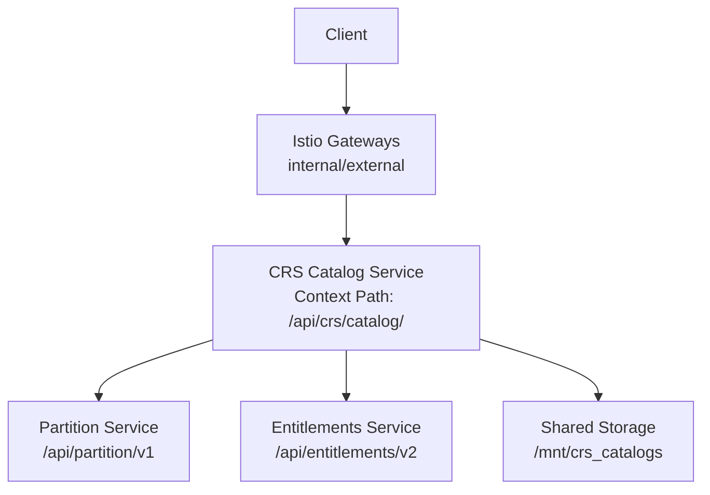
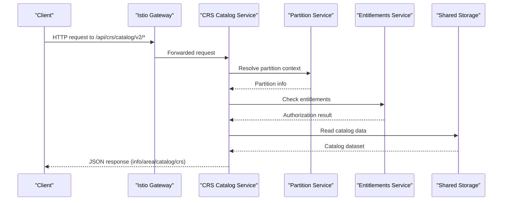
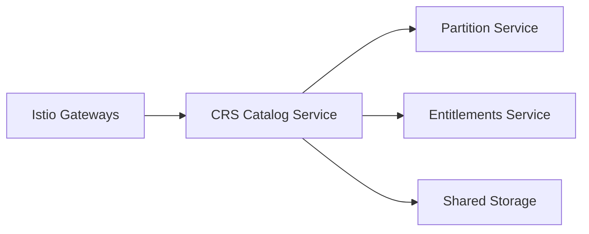

# CRS Catalog Service

<cite>
**Referenced Files in This Document**
- [crs-catalog.yaml](file://software/applications/osdu-reference/crs-catalog.yaml)
- [crs-conversion.yaml](file://software/applications/osdu-reference/crs-conversion.yaml)
- [crs-catalog.http](file://tools/rest-scripts/crs-catalog.http)
- [crs-conversion.http](file://tools/rest-scripts/crs-conversion.http)
- [services_overview.md](file://docs/src/services_overview.md)
- [docker-bake.hcl](file://src/docker-bake.hcl)
</cite>

## Table of Contents
1. Introduction
2. Project Structure
3. Core Components
4. Architecture Overview
5. Detailed Component Analysis
6. Dependency Analysis
7. Performance Considerations
8. Troubleshooting Guide
9. Conclusion

## Introduction
The CRS (Coordinate Reference Systems) Catalog service is a reference service within OSDU that exposes APIs to work with geodetic reference data. It enables developers to retrieve CRS definitions, select appropriate CRSs for data ingestion, and search for CRSs based on various constraints. It integrates with other OSDU services such as Partition and Entitlements to enforce partitioning and access control, and it can be paired with the CRS Conversion service for coordinate transformations.

## Project Structure
This repository provides deployment manifests and scripts that configure and operate the CRS Catalog service:
- Deployment manifest defines the HelmRelease, container image, context path, health probes, authentication exemptions, shared storage mount, and environment variables for integration with core services.
- REST client scripts demonstrate how to call the service endpoints after obtaining an OAuth token.
- Build configuration indicates the Java-based service and bundled catalog data used at runtime.

**Diagram sources**
- [crs-catalog.yaml:35-74](file://software/applications/osdu-reference/crs-catalog.yaml#L35-L74)
- [crs-catalog.yaml:75-107](file://software/applications/osdu-reference/crs-catalog.yaml#L75-L107)

**Section sources**
- [crs-catalog.yaml:1-107](file://software/applications/osdu-reference/crs-catalog.yaml#L1-L107)
- [docker-bake.hcl:132-142](file://src/docker-bake.hcl#L132-L142)

## Core Components
- CRS Catalog Service
  - Exposes version/info endpoint and query endpoints for area, catalog, and CRS listings under v2.
  - Runs with a defined context path and health probe pointing to Swagger UI.
  - Integrates with Partition and Entitlements via environment-configured endpoints.
  - Mounts shared storage for catalog data.
- Supporting Services
  - Partition Service: Provides partition resolution and scoping.
  - Entitlements Service: Enforces authorization policies.
  - Shared Storage: Holds catalog datasets mounted into the service container.

Key capabilities observed from available artifacts:
- Version/info retrieval
- Querying areas, catalogs, and CRS entries
- Integration with partitioning and entitlements
- Health checks via Swagger UI path

**Section sources**
- [crs-catalog.http:45-75](file://tools/rest-scripts/crs-catalog.http#L45-L75)
- [crs-catalog.yaml:35-107](file://software/applications/osdu-reference/crs-catalog.yaml#L35-L107)
- [services_overview.md:32-38](file://docs/src/services_overview.md#L32-L38)

## Architecture Overview
The CRS Catalog service is deployed as a Kubernetes workload behind Istio gateways. Requests are authenticated and routed to the service, which then consults Partition and Entitlements services for scoping and authorization. Catalog data is loaded from shared storage. The build pipeline packages the service with embedded catalog data.

**Diagram sources**
- [crs-catalog.yaml:35-107](file://software/applications/osdu-reference/crs-catalog.yaml#L35-L107)
- [crs-catalog.http:45-75](file://tools/rest-scripts/crs-catalog.http#L45-L75)

## Detailed Component Analysis

### API Endpoints and Usage
Observed endpoints under the service’s context path (/api/crs/catalog/):
- GET /v2/info
- GET /v2/area
- GET /v2/catalog
- GET /v2/crs

Authentication and headers:
- Authorization: Bearer <access_token>
- data-partition-id header required for partition scoping

Example usage pattern:
- Obtain an OAuth token using your tenant/client credentials.
- Call any of the above endpoints with the token and partition header.

Note: These endpoints are demonstrated in the provided REST client script.

**Section sources**
- [crs-catalog.http:11-75](file://tools/rest-scripts/crs-catalog.http#L11-L75)

### Deployment Configuration
- Container image and tag are configured via the HelmRelease values.
- Context path is set to serve under /api/crs/catalog/.
- Health probe targets Swagger UI index page.
- Authentication exemptions include health, configuration, and API docs paths.
- Shared storage is mounted at /mnt/crs_catalogs.
- Environment variables wire up Key Vault, Application Insights, Istio/Pod Identity flags, server port, and service endpoints for Partition and Entitlements.

**Section sources**
- [crs-catalog.yaml:30-107](file://software/applications/osdu-reference/crs-catalog.yaml#L30-L107)

### Build and Data Packaging
- The service is built using a Java Dockerfile target.
- The build includes extra files for the CRS catalog dataset.

**Section sources**
- [docker-bake.hcl:132-142](file://src/docker-bake.hcl#L132-L142)

### Relationship to CRS Conversion Service
While distinct, the CRS Catalog service often works alongside the CRS Conversion service:
- Catalog service: discover and query CRS definitions.
- Conversion service: transform coordinates between CRSs.

Conversion service highlights (for context):
- Context path: /api/crs/converter/
- Endpoints include convert, convertGeoJson, and convertTrajectory.
- Uses shared storage for conversion data.

**Section sources**
- [crs-conversion.yaml:30-114](file://software/applications/osdu-reference/crs-conversion.yaml#L30-L114)
- [crs-conversion.http:100-141](file://tools/rest-scripts/crs-conversion.http#L100-L141)

## Dependency Analysis
The CRS Catalog service depends on:
- Istio gateways for ingress routing and policy enforcement.
- Partition service for partition resolution.
- Entitlements service for authorization decisions.
- Shared storage for catalog data.

**Diagram sources**
- [crs-catalog.yaml:35-107](file://software/applications/osdu-reference/crs-catalog.yaml#L35-L107)

**Section sources**
- [crs-catalog.yaml:35-107](file://software/applications/osdu-reference/crs-catalog.yaml#L35-L107)

## Performance Considerations
- Use shared storage efficiently: ensure catalog datasets are optimized and cached where possible by the underlying storage layer.
- Scale horizontally: adjust replica count in the HelmRelease to handle higher read throughput for catalog queries.
- Health probing: keep liveness/readiness probes tuned to avoid unnecessary restarts during startup or heavy loads.
- Network latency: place the service close to consumers within the cluster to minimize cross-zone calls to Partition and Entitlements.
- Request batching: when consuming multiple endpoints (e.g., area, catalog, crs), batch requests at the client level to reduce overhead.

[No sources needed since this section provides general guidance]

## Troubleshooting Guide
Common issues and resolutions:
- Authentication failures
  - Ensure a valid Bearer token is included in the Authorization header.
  - Verify scopes and client credentials used to obtain the token.
- Missing or incorrect data-partition-id
  - Include the data-partition-id header in all requests to scope results correctly.
- Service not reachable
  - Confirm Istio gateways are configured and healthy.
  - Validate the context path matches /api/crs/catalog/.
- Health check failures
  - Check that the Swagger UI path is accessible inside the container and matches the probe configuration.
- Catalog data not found
  - Verify the shared storage volume is mounted at /mnt/crs_catalogs and contains the expected dataset.
- Integration errors with Partition or Entitlements
  - Validate the endpoints for Partition and Entitlements are reachable from the service namespace.
  - Check network policies and service discovery.

Operational tips:
- Use the provided REST client script to validate connectivity and authentication before integrating with applications.
- Monitor application insights keys and connection strings configured in the deployment to enable diagnostics.

**Section sources**
- [crs-catalog.http:11-75](file://tools/rest-scripts/crs-catalog.http#L11-L75)
- [crs-catalog.yaml:50-107](file://software/applications/osdu-reference/crs-catalog.yaml#L50-L107)

## Conclusion
The CRS Catalog service provides essential APIs for discovering and querying geodetic reference data within OSDU. It integrates with core platform services for partitioning and authorization, supports health monitoring, and leverages shared storage for catalog datasets. When combined with the CRS Conversion service, it forms a complete solution for managing and transforming spatial references across OSDU workloads.

[No sources needed since this section summarizes without analyzing specific files]