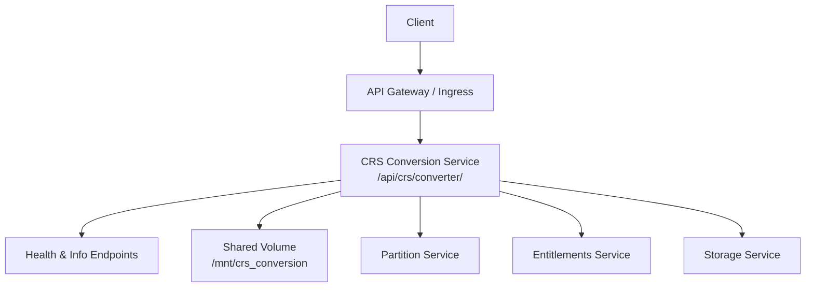
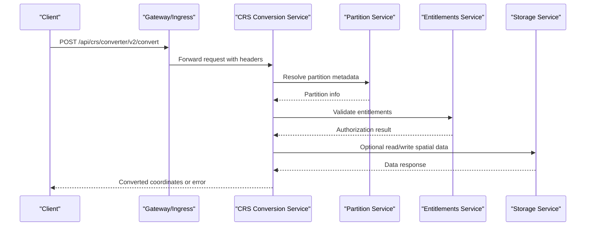
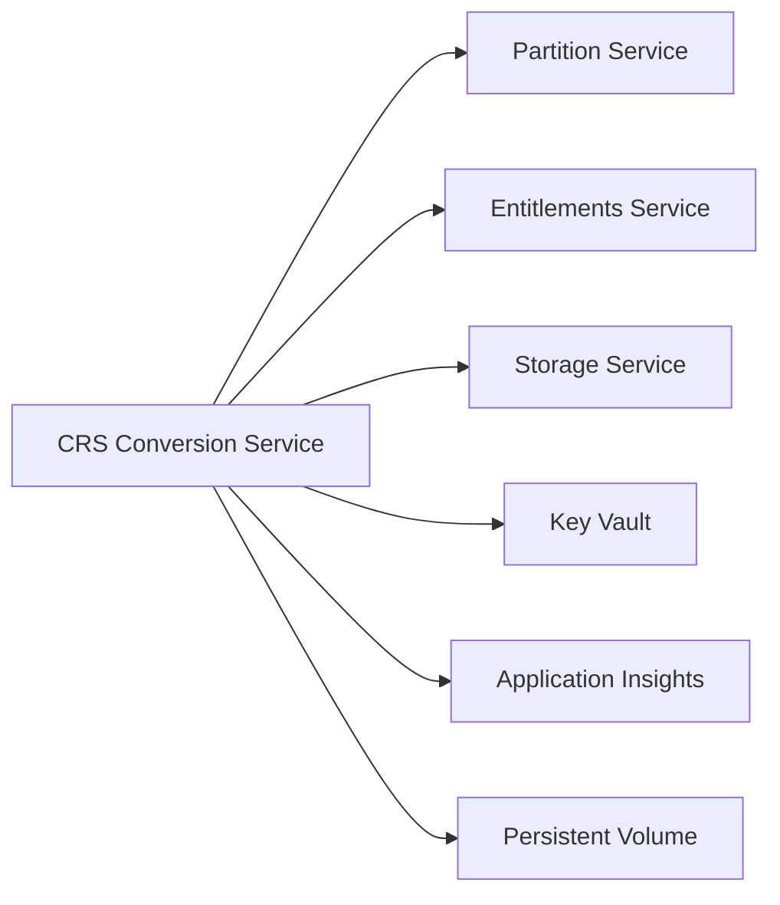

# Conversion Service

<cite>
**Referenced Files in This Document**
- [crs-conversion.yaml](file://software/applications/osdu-reference/crs-conversion.yaml)
- [crs-conversion.http](file://tools/rest-scripts/crs-conversion.http)
- [services_overview.md](file://docs/src/services_overview.md)
- [docker-bake.hcl](file://src/docker-bake.hcl)
</cite>

## Table of Contents
1. [Introduction](#introduction)
2. [Project Structure](#project-structure)
3. [Core Components](#core-components)
4. [Architecture Overview](#architecture-overview)
5. [Detailed Component Analysis](#detailed-component-analysis)
6. [Dependency Analysis](#dependency-analysis)
7. [Performance Considerations](#performance-considerations)
8. [Troubleshooting Guide](#troubleshooting-guide)
9. [Conclusion](#conclusion)
10. [Appendices](#appendices)

## Introduction
This document describes the CRS (Coordinate Reference System) conversion service as deployed and exposed within this repository. It focuses on how the service is packaged, configured, and accessed via REST endpoints for coordinate transformations and unit-aware conversions. The documentation synthesizes deployment configuration, HTTP request/response patterns, and integration points with other platform services to provide a practical guide for using and operating the CRS conversion capability.

The CRS conversion service is part of the OSDU reference services suite and provides endpoints to convert coordinates between different CRS definitions and to compute trajectories with unit handling.

**Section sources**
- [services_overview.md:32-38](file://docs/src/services_overview.md#L32-L38)

## Project Structure
The CRS conversion service is delivered as a containerized Java application and deployed via Kubernetes manifests and Helm releases. Key artifacts in this repository include:
- A Docker build target that packages the service image from a core module path.
- A Helm release manifest that configures the service’s network exposure, health checks, environment variables, and shared storage mounts.
- Example HTTP requests demonstrating usage of the v2 API endpoints for point conversion, GeoJSON conversion, and trajectory computation/conversion.

**Diagram sources**
- [crs-conversion.yaml:35-114](file://software/applications/osdu-reference/crs-conversion.yaml#L35-L114)

**Section sources**
- [docker-bake.hcl:144-154](file://src/docker-bake.hcl#L144-L154)
- [crs-conversion.yaml:35-114](file://software/applications/osdu-reference/crs-conversion.yaml#L35-L114)

## Core Components
- Service Image and Build Target: The service image is built from a Java-based core module and includes additional setup files required at runtime.
- Deployment Configuration: The Helm release defines the service context path, port, readiness/liveness probes, authentication exemptions, and environment variables for key integrations.
- Shared Data Volume: A persistent volume is mounted to support data access during conversions.
- Integration Endpoints: The service is configured to call partition, entitlements, and storage services for authorization and data operations.

Key capabilities exposed by the service (as evidenced by example requests):
- Point-to-point CRS conversion
- GeoJSON geometry conversion
- Trajectory computation and conversion with unit handling

**Section sources**
- [docker-bake.hcl:144-154](file://src/docker-bake.hcl#L144-L154)
- [crs-conversion.yaml:35-114](file://software/applications/osdu-reference/crs-conversion.yaml#L35-L114)
- [crs-conversion.http:117-141](file://tools/rest-scripts/crs-conversion.http#L117-L141)

## Architecture Overview
The CRS conversion service exposes a REST API under a fixed context path. Clients authenticate via bearer tokens and include a data-partition header for multi-tenant routing. Internally, the service may interact with partition, entitlements, and storage services to enforce access control and retrieve or persist spatial data.

**Diagram sources**
- [crs-conversion.yaml:35-114](file://software/applications/osdu-reference/crs-conversion.yaml#L35-L114)
- [crs-conversion.http:117-141](file://tools/rest-scripts/crs-conversion.http#L117-L141)

## Detailed Component Analysis

### REST API Endpoints
The service exposes versioned endpoints under the base path /api/crs/converter/. Example requests demonstrate:
- GET /v2/info: Service information endpoint
- POST /v2/convert: Convert points between CRS definitions
- POST /v2/convertGeoJson: Convert GeoJSON geometries with CRS and units
- POST /v2/convertTrajectory: Compute and convert trajectories with specified method and units

Request characteristics:
- Authentication: Bearer token required for protected endpoints
- Multi-tenancy: data-partition-id header specifies the partition context
- Content-Type: application/json for payloads

Response characteristics:
- JSON payloads containing converted coordinates or computed trajectories
- Error responses when inputs are invalid or transformations cannot be applied

Example payloads (from example script):
- Point conversion includes fromCRS and toCRS definitions along with an array of points with x, y, z values
- GeoJSON conversion includes input stations, interpolation flags, azimuth reference, method selection, reference point, and unit specifications for XY and Z axes

**Section sources**
- [crs-conversion.http:104-141](file://tools/rest-scripts/crs-conversion.http#L104-L141)

### Deployment and Runtime Configuration
- Context Path: The service runs under /api/crs/converter/
- Port: Exposed on port 80 internally
- Probes: Liveness/readiness probe targets Swagger UI index page
- Authentication Exemptions: Health, configuration, and OpenAPI-related paths are exempted
- Environment Variables:
  - KEYVAULT_URI, AAD_CLIENT_ID, APPINSIGHTS_KEY, APPLICATIONINSIGHTS_CONNECTION_STRING for secrets and telemetry
  - AZURE_ISTIOAUTH_ENABLED, AZURE_PAAS_PODIDENTITY_ISENABLED for identity and mesh auth
  - SERVER_PORT, ACCEPT_HTTP, SPRING_APPLICATION_NAME, SERVER_SERVLET_CONTEXTPATH for server behavior
  - SERVICE_DOMAIN_NAME for domain resolution
  - SIS_DATA for Apache SIS data directory
  - PARTITION_SERVICE_ENDPOINT, ENTITLEMENT_URL, STORAGE_URL for downstream service calls
- Shared Storage: Mounted at /mnt/crs_conversion for persistent data access

**Section sources**
- [crs-conversion.yaml:35-114](file://software/applications/osdu-reference/crs-conversion.yaml#L35-L114)

### Build and Packaging
- Docker build target creates the crs-conversion image from a Java Dockerfile and includes extra setup files necessary for runtime initialization.

**Section sources**
- [docker-bake.hcl:144-154](file://src/docker-bake.hcl#L144-L154)

## Dependency Analysis
The service depends on several platform components:
- Partition Service: For partition resolution and routing
- Entitlements Service: For authorization checks
- Storage Service: For reading/writing spatial data as needed
- Shared Volume: For persistent data access during conversions
- Identity and Telemetry: Azure AD, Key Vault, Application Insights

**Diagram sources**
- [crs-conversion.yaml:76-114](file://software/applications/osdu-reference/crs-conversion.yaml#L76-L114)

**Section sources**
- [crs-conversion.yaml:76-114](file://software/applications/osdu-reference/crs-conversion.yaml#L76-L114)

## Performance Considerations
- Batch Processing: Use the batch-friendly endpoints (e.g., convert, convertGeoJson) to process multiple points or geometries in a single request to reduce overhead.
- Request Size: Keep payloads reasonable; large datasets should be chunked into multiple requests to avoid timeouts and memory pressure.
- Concurrency: Scale replicas horizontally to handle concurrent conversion workloads.
- Caching: If applicable, cache frequently used CRS definitions or transformation parameters to reduce repeated computations.
- I/O: Ensure the shared volume has adequate throughput for large spatial datasets.
- Monitoring: Leverage Application Insights to track latency, errors, and resource utilization.

[No sources needed since this section provides general guidance]

## Troubleshooting Guide
Common issues and strategies:
- Authentication Errors: Ensure a valid bearer token is included and that the requesting principal has appropriate entitlements.
- Partition Misconfiguration: Verify the data-partition-id header matches the intended partition and that the partition service is reachable.
- Endpoint Availability: Confirm the service context path (/api/crs/converter/) and versioned routes (e.g., /v2/...) are correct.
- Health Checks: Use the health and info endpoints to verify service status and configuration.
- Storage Access: Validate the shared volume mount path and permissions.
- Downstream Services: Check connectivity to partition, entitlements, and storage services via their configured endpoints.

Operational tips:
- Use the provided HTTP examples to validate end-to-end flows.
- Inspect logs and metrics through Application Insights for detailed diagnostics.
- Review environment variables to ensure correct configuration of service URLs and data directories.

**Section sources**
- [crs-conversion.yaml:50-67](file://software/applications/osdu-reference/crs-conversion.yaml#L50-L67)
- [crs-conversion.http:104-141](file://tools/rest-scripts/crs-conversion.http#L104-L141)

## Conclusion
The CRS conversion service in this repository provides a robust, containerized REST API for coordinate system transformations and unit-aware conversions. Its deployment configuration integrates with partitioning, entitlements, storage, and observability services to deliver secure, scalable functionality. By leveraging the documented endpoints and best practices, teams can efficiently perform CRS conversions and integrate them into broader GIS and spatial data processing workflows.

[No sources needed since this section summarizes without analyzing specific files]

## Appendices

### API Usage Examples
- Point Conversion: Submit fromCRS and toCRS definitions along with an array of points to obtain transformed coordinates.
- GeoJSON Conversion: Provide input stations, interpolation settings, azimuth reference, method, reference point, and unit specifications to convert geometries.
- Trajectory Computation: Use the trajectory endpoint to compute and convert trajectories with specified methods and units.

**Section sources**
- [crs-conversion.http:39-96](file://tools/rest-scripts/crs-conversion.http#L39-L96)
- [crs-conversion.http:117-141](file://tools/rest-scripts/crs-conversion.http#L117-L141)