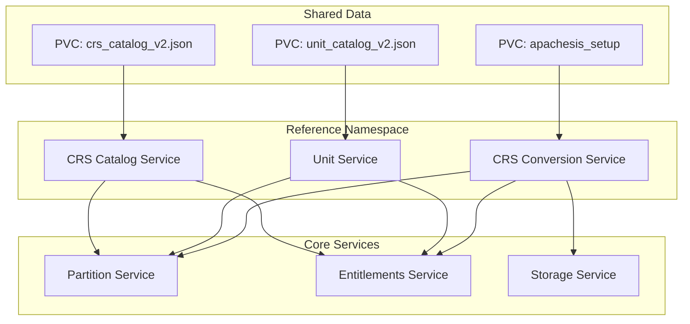
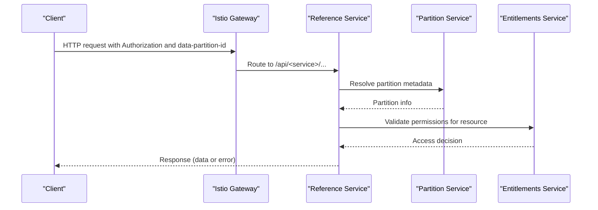
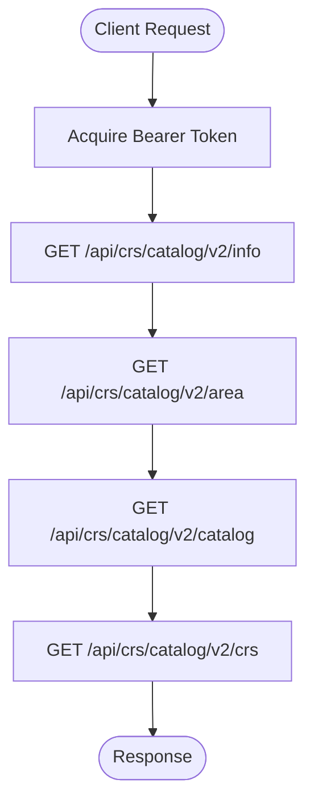
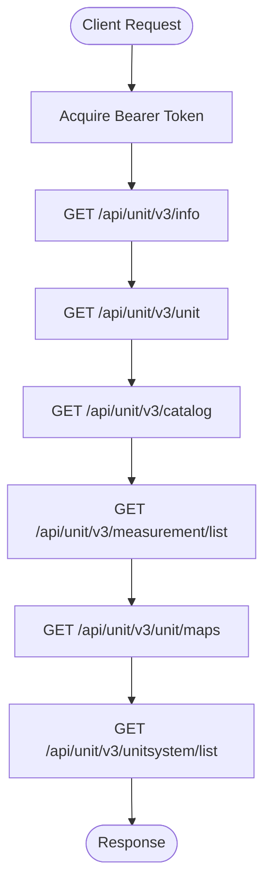
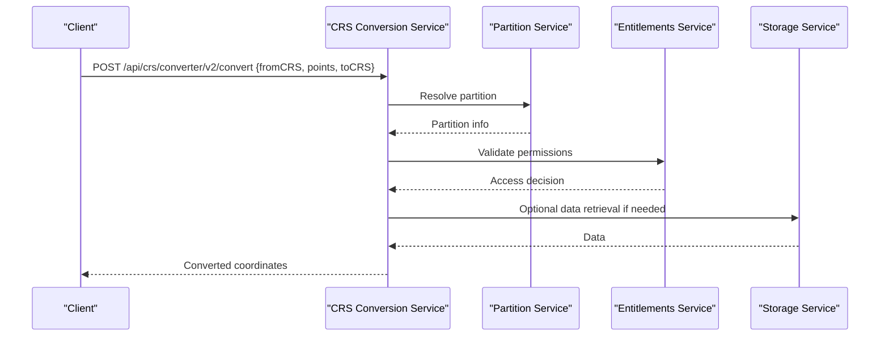
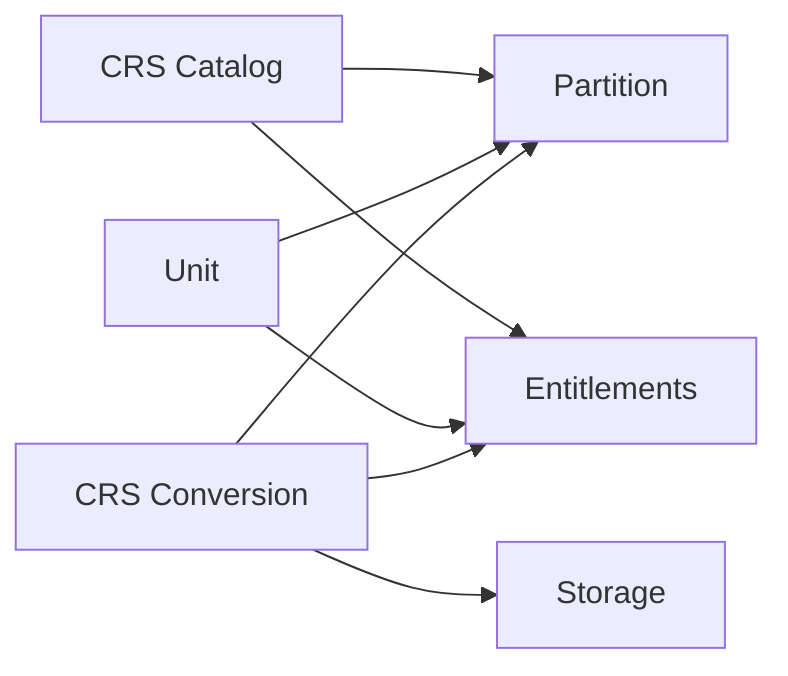

# Reference Services

<cite>
**Referenced Files in This Document**
- [base.yaml](file://software/applications/osdu-reference/base.yaml)
- [crs-catalog.yaml](file://software/applications/osdu-reference/crs-catalog.yaml)
- [crs-conversion.yaml](file://software/applications/osdu-reference/crs-conversion.yaml)
- [unit.yaml](file://software/applications/osdu-reference/unit.yaml)
- [services_overview.md](file://docs/src/services_overview.md)
- [crs-catalog.http](file://tools/rest-scripts/crs-catalog.http)
- [crs-conversion.http](file://tools/rest-scripts/crs-conversion.http)
- [unit.http](file://tools/rest-scripts/unit.http)
</cite>

## Table of Contents
1. [Introduction](#introduction)
2. [Project Structure](#project-structure)
3. [Core Components](#core-components)
4. [Architecture Overview](#architecture-overview)
5. [Detailed Component Analysis](#detailed-component-analysis)
6. [Dependency Analysis](#dependency-analysis)
7. [Performance Considerations](#performance-considerations)
8. [Troubleshooting Guide](#troubleshooting-guide)
9. [Conclusion](#conclusion)
10. [Appendices](#appendices)

## Introduction
This document describes the OSDU reference services that provide standard implementations and utilities for geospatial reference data, unit conversion, and development/validation support. It focuses on:
- CRS Catalog Service: a catalog of coordinate reference systems (CRS) for geospatial reference data management.
- Unit Service: standardized units, measurements, and unit maps to ensure consistent measurement semantics across OSDU.
- CRS Conversion Service: conversion between coordinate reference systems and trajectory computations.

These reference services demonstrate best practices for configuration, security, observability, and integration with core OSDU services such as Partition and Entitlements. They can serve as templates for building custom services that follow the same patterns.

## Project Structure
The reference services are deployed via Kubernetes HelmRelease manifests under software/applications/osdu-reference. Each service is configured with:
- A container image repository and tag
- Ingress path and gateway exposure
- Health probes
- Key Vault-backed secrets
- Environment variables for partitioning, entitlements, and storage
- Persistent volumes for catalogs and conversion datasets

**Diagram sources**
- [base.yaml:27-48](file://software/applications/osdu-reference/base.yaml#L27-L48)
- [crs-catalog.yaml:38-107](file://software/applications/osdu-reference/crs-catalog.yaml#L38-L107)
- [unit.yaml:38-110](file://software/applications/osdu-reference/unit.yaml#L38-L110)
- [crs-conversion.yaml:38-114](file://software/applications/osdu-reference/crs-conversion.yaml#L38-L114)

**Section sources**
- [base.yaml:27-48](file://software/applications/osdu-reference/base.yaml#L27-L48)
- [crs-catalog.yaml:38-107](file://software/applications/osdu-reference/crs-catalog.yaml#L38-L107)
- [unit.yaml:38-110](file://software/applications/osdu-reference/unit.yaml#L38-L110)
- [crs-conversion.yaml:38-114](file://software/applications/osdu-reference/crs-conversion.yaml#L38-L114)

## Core Components
- CRS Catalog Service: Exposes endpoints to retrieve area, catalog, and CRS definitions. It mounts a shared catalog file and integrates with Partition and Entitlements for access control.
- Unit Service: Exposes endpoints to list units, catalogs, measurements, unit maps, and unit systems. It mounts a shared unit catalog and integrates with Partition and Entitlements.
- CRS Conversion Service: Provides conversion APIs for points, GeoJSON, and trajectories. It mounts Apache SIS setup data and integrates with Partition, Entitlements, and Storage.

Best practices demonstrated:
- Consistent context paths per service
- Health/readiness probes for orchestration
- Key Vault-backed secrets for credentials
- Explicit environment variables for partitioning and entitlements
- Shared persistent volumes for static catalogs and datasets
- Gateway-based ingress with internal/external exposure

**Section sources**
- [crs-catalog.yaml:38-107](file://software/applications/osdu-reference/crs-catalog.yaml#L38-L107)
- [unit.yaml:38-110](file://software/applications/osdu-reference/unit.yaml#L38-L110)
- [crs-conversion.yaml:38-114](file://software/applications/osdu-reference/crs-conversion.yaml#L38-L114)
- [base.yaml:27-48](file://software/applications/osdu-reference/base.yaml#L27-L48)

## Architecture Overview
The reference services follow a common deployment pattern:
- Container images are pulled from a registry and exposed via Istio gateways.
- Each service mounts a persistent volume containing its catalog or dataset.
- Services authenticate via Azure AD/Istio and enforce partition-scoped access using the Partition and Entitlements services.
- Observability is enabled through Application Insights keys and connection strings.

**Diagram sources**
- [crs-catalog.yaml:38-107](file://software/applications/osdu-reference/crs-catalog.yaml#L38-L107)
- [unit.yaml:38-110](file://software/applications/osdu-reference/unit.yaml#L38-L110)
- [crs-conversion.yaml:38-114](file://software/applications/osdu-reference/crs-conversion.yaml#L38-L114)

## Detailed Component Analysis

### CRS Catalog Service
Purpose:
- Provide read-only access to geodetic reference data (areas, catalogs, CRS definitions).
- Enable selection and search of appropriate CRSs for data ingestion.

Key configuration:
- Context path: /api/crs/catalog/
- Image repository and tag defined in the manifest
- Probes targeting Swagger UI endpoint
- Mounts shared PVC at /mnt/crs_catalogs
- Integrates with Partition and Entitlements via environment variables
- Uses Key Vault for secrets and Application Insights for telemetry

API surface (from REST scripts):
- GET /v2/info
- GET /v2/area
- GET /v2/catalog
- GET /v2/crs

Authentication and headers:
- Bearer token via OAuth
- data-partition-id header required for partition scoping

Integration example:
- Use the provided REST script to obtain an access token and call the version and catalog endpoints.

**Diagram sources**
- [crs-catalog.http:45-76](file://tools/rest-scripts/crs-catalog.http#L45-L76)

**Section sources**
- [crs-catalog.yaml:38-107](file://software/applications/osdu-reference/crs-catalog.yaml#L38-L107)
- [crs-catalog.http:45-76](file://tools/rest-scripts/crs-catalog.http#L45-L76)

### Unit Service
Purpose:
- Provide standardized units, measurements, and unit maps for consistent measurement semantics.
- Support listing units, catalogs, measurements, unit maps, and unit systems.

Key configuration:
- Context path: /api/unit/
- Image repository and tag defined in the manifest
- Readiness probe targeting _ah/readiness_check
- Mounts shared PVC at /mnt/unit_catalogs
- Integrates with Partition and Entitlements via environment variables
- Uses Key Vault for secrets and Application Insights for telemetry

API surface (from REST scripts):
- GET /v3/info
- GET /v3/unit
- GET /v3/catalog
- GET /v3/measurement/list
- GET /v3/unit/maps
- GET /v3/unitsystem/list

Authentication and headers:
- Bearer token via OAuth
- data-partition-id header required for partition scoping

Integration example:
- Use the provided REST script to obtain an access token and call the info and unit endpoints.

**Diagram sources**
- [unit.http:45-89](file://tools/rest-scripts/unit.http#L45-L89)

**Section sources**
- [unit.yaml:38-110](file://software/applications/osdu-reference/unit.yaml#L38-L110)
- [unit.http:45-89](file://tools/rest-scripts/unit.http#L45-L89)

### CRS Conversion Service
Purpose:
- Convert coordinates between CRSs and compute trajectories with interpolation.
- Support point conversion, GeoJSON conversion, and trajectory computation.

Key configuration:
- Context path: /api/crs/converter/
- Image repository and tag defined in the manifest
- Probes targeting Swagger UI endpoint
- Mounts shared PVC at /mnt/crs_conversion with subPath crs-conversion
- Integrates with Partition, Entitlements, and Storage via environment variables
- Uses Key Vault for secrets and Application Insights for telemetry

API surface (from REST scripts):
- GET /v2/info
- POST /v2/convert (point conversion)
- POST /v2/convertGeoJson (GeoJSON conversion)
- POST /v2/convertTrajectory (trajectory computation and conversion)

Authentication and headers:
- Bearer token via OAuth
- data-partition-id header required for partition scoping

Integration example:
- Use the provided REST script to obtain an access token and call convert, convertGeoJson, and convertTrajectory endpoints with sample payloads.

**Diagram sources**
- [crs-conversion.http:104-142](file://tools/rest-scripts/crs-conversion.http#L104-L142)
- [crs-conversion.yaml:38-114](file://software/applications/osdu-reference/crs-conversion.yaml#L38-L114)

**Section sources**
- [crs-conversion.yaml:38-114](file://software/applications/osdu-reference/crs-conversion.yaml#L38-L114)
- [crs-conversion.http:104-142](file://tools/rest-scripts/crs-conversion.http#L104-L142)

## Dependency Analysis
Common dependencies across reference services:
- Partition Service: Used to resolve partition metadata for scoped operations.
- Entitlements Service: Used to validate permissions for accessing resources within partitions.
- Storage Service: Used by CRS Conversion for additional data access when required.
- Shared Persistent Volumes: Provide static catalogs and datasets for each service.

**Diagram sources**
- [crs-catalog.yaml:104-107](file://software/applications/osdu-reference/crs-catalog.yaml#L104-L107)
- [unit.yaml:106-109](file://software/applications/osdu-reference/unit.yaml#L106-L109)
- [crs-conversion.yaml:109-114](file://software/applications/osdu-reference/crs-conversion.yaml#L109-L114)

**Section sources**
- [crs-catalog.yaml:104-107](file://software/applications/osdu-reference/crs-catalog.yaml#L104-L107)
- [unit.yaml:106-109](file://software/applications/osdu-reference/unit.yaml#L106-L109)
- [crs-conversion.yaml:109-114](file://software/applications/osdu-reference/crs-conversion.yaml#L109-L114)

## Performance Considerations
- Replica count is set to 1 for each reference service; consider scaling horizontally for higher load.
- Health probes are configured to detect readiness and liveness; tune delays and periods based on startup times.
- Shared PVCs reduce duplication of large catalogs; ensure adequate storage capacity and IOPS.
- Use partition-aware queries to minimize cross-partition overhead.
- Monitor Application Insights metrics and logs for performance bottlenecks.

[No sources needed since this section provides general guidance]

## Troubleshooting Guide
Common issues and resolutions:
- Authentication failures: Ensure a valid Bearer token is included and the client has appropriate scopes. Verify OAuth configuration in your environment.
- Partition errors: Confirm the data-partition-id header matches the target partition and that the Partition Service endpoint is reachable.
- Permission denied: Check Entitlements Service connectivity and that the caller has necessary permissions for the requested resource.
- Missing catalogs: Verify that the shared PVCs are mounted correctly and contain the expected files (unit_catalog_v2.json, crs_catalog_v2.json, apachesis_setup).
- Health check failures: Inspect probe endpoints (/swagger-ui/index.html or readiness checks) and application logs for startup issues.

**Section sources**
- [crs-catalog.yaml:50-67](file://software/applications/osdu-reference/crs-catalog.yaml#L50-L67)
- [unit.yaml:50-67](file://software/applications/osdu-reference/unit.yaml#L50-L67)
- [crs-conversion.yaml:50-67](file://software/applications/osdu-reference/crs-conversion.yaml#L50-L67)
- [base.yaml:34-48](file://software/applications/osdu-reference/base.yaml#L34-L48)

## Conclusion
The OSDU reference services provide robust, configurable, and observable implementations for managing geospatial reference data, standardized units, and CRS conversions. They demonstrate best practices for:
- Secure authentication and authorization
- Partition-scoped access
- Persistent data sharing
- Health monitoring and observability
- Integration with core OSDU services

These services can serve as templates for custom service development, ensuring consistency and reliability across the platform.

[No sources needed since this section summarizes without analyzing specific files]

## Appendices

### API Specifications Summary
- CRS Catalog Service
  - Base path: /api/crs/catalog
  - Endpoints: /v2/info, /v2/area, /v2/catalog, /v2/crs
  - Headers: Authorization (Bearer), data-partition-id

- Unit Service
  - Base path: /api/unit
  - Endpoints: /v3/info, /v3/unit, /v3/catalog, /v3/measurement/list, /v3/unit/maps, /v3/unitsystem/list
  - Headers: Authorization (Bearer), data-partition-id

- CRS Conversion Service
  - Base path: /api/crs/converter
  - Endpoints: /v2/info, /v2/convert, /v2/convertGeoJson, /v2/convertTrajectory
  - Headers: Authorization (Bearer), data-partition-id

**Section sources**
- [crs-catalog.http:45-76](file://tools/rest-scripts/crs-catalog.http#L45-L76)
- [unit.http:45-89](file://tools/rest-scripts/unit.http#L45-L89)
- [crs-conversion.http:104-142](file://tools/rest-scripts/crs-conversion.http#L104-L142)

### Configuration Options Summary
- Common options
  - Image repository and tag
  - Context path per service
  - Probes for health/readiness
  - Key Vault-backed secrets
  - Application Insights keys and connection string
  - Partition and Entitlements endpoints
  - Shared PVC mounts for catalogs/datasets

- Service-specific options
  - CRS Catalog: mount path /mnt/crs_catalogs
  - Unit: mount path /mnt/unit_catalogs
  - CRS Conversion: mount path /mnt/crs_conversion with subPath crs-conversion; SERVICE_DOMAIN_NAME and SIS_DATA

**Section sources**
- [crs-catalog.yaml:38-107](file://software/applications/osdu-reference/crs-catalog.yaml#L38-L107)
- [unit.yaml:38-110](file://software/applications/osdu-reference/unit.yaml#L38-L110)
- [crs-conversion.yaml:38-114](file://software/applications/osdu-reference/crs-conversion.yaml#L38-L114)
- [base.yaml:27-48](file://software/applications/osdu-reference/base.yaml#L27-L48)

### Integration Examples
- Use the provided REST scripts to:
  - Obtain an OAuth token
  - Call service endpoints with proper headers
  - Test CRUD-like operations where applicable (read-only for these reference services)

**Section sources**
- [crs-catalog.http:11-76](file://tools/rest-scripts/crs-catalog.http#L11-L76)
- [unit.http:11-89](file://tools/rest-scripts/unit.http#L11-L89)
- [crs-conversion.http:11-142](file://tools/rest-scripts/crs-conversion.http#L11-L142)