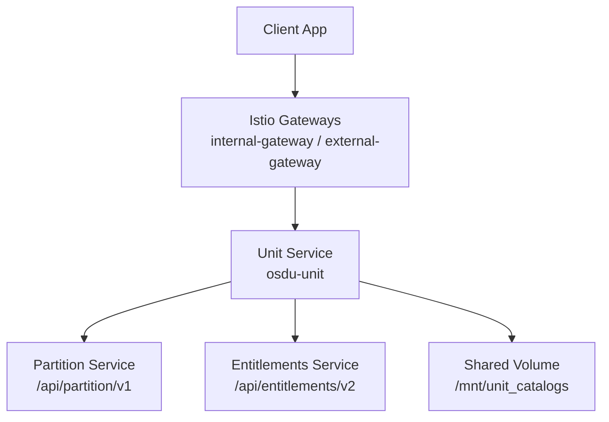
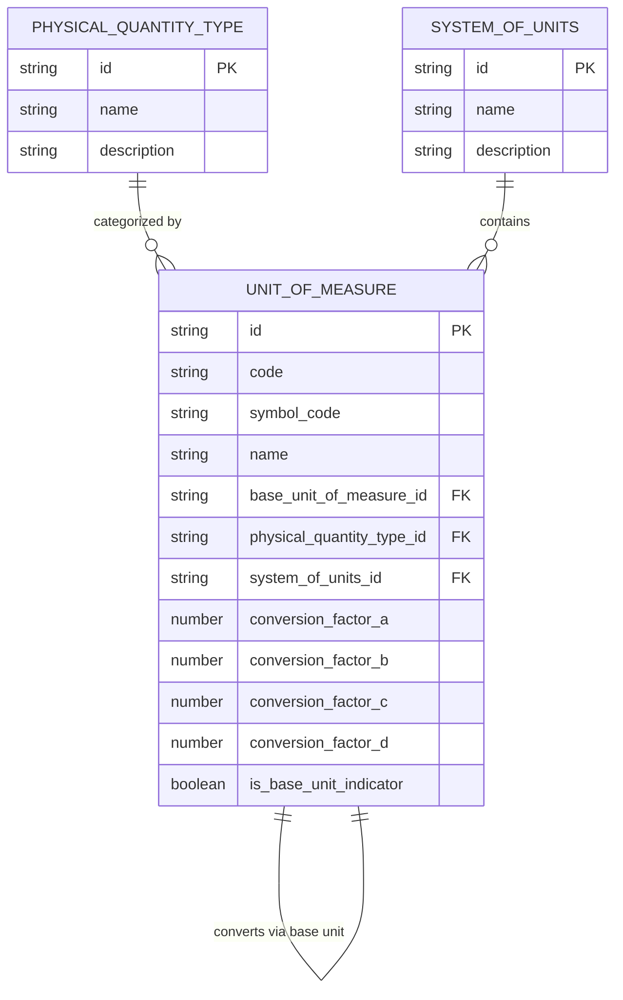
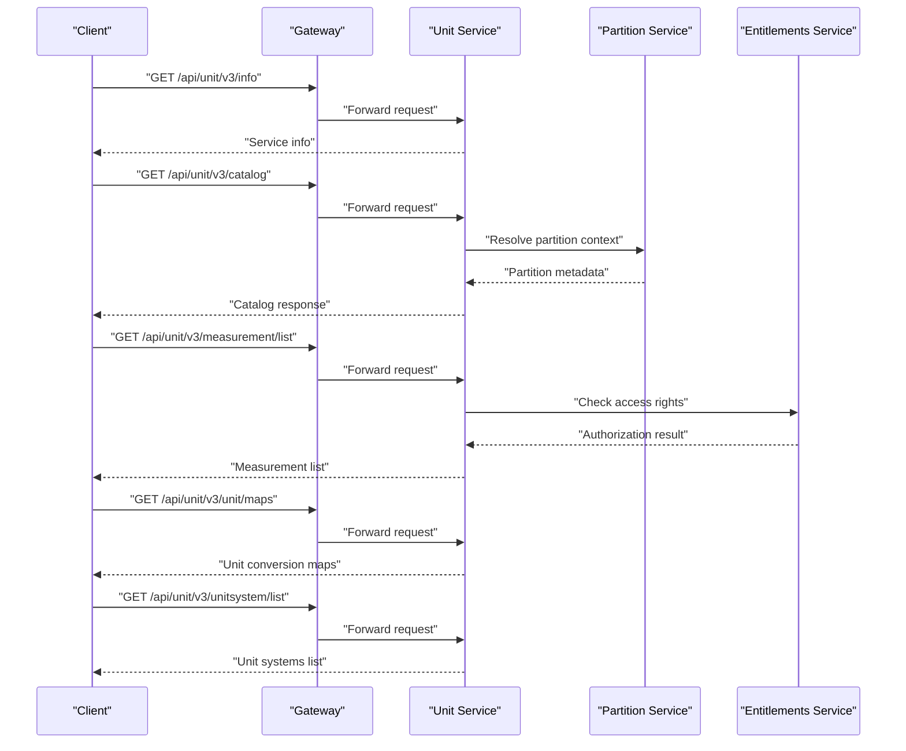
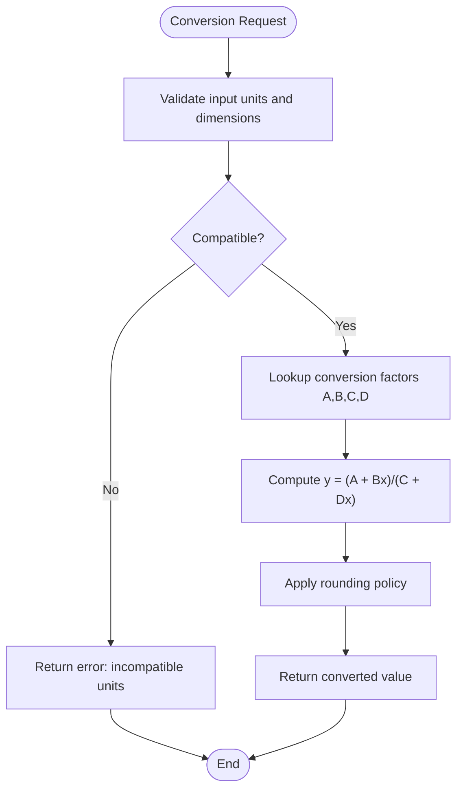
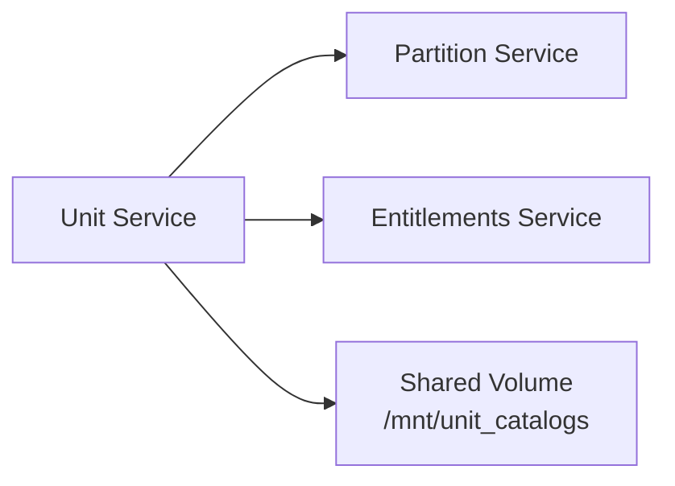

# Unit Service

<cite>
**Referenced Files in This Document**
- [unit.http](file://tools/rest-scripts/unit.http)
- [unit.yaml](file://software/applications/osdu-reference/unit.yaml)
- [UnitOfMeasure_3.0.0.json](file://ofp-schema-deploy/schemas/ofp_wks_reference-data--UnitOfMeasure_3.0.0.json)
- [SystemOfUnits_3.0.0.json](file://ofp-schema-deploy/schemas/ofp_wks_reference-data--SystemOfUnits_3.0.0.json)
- [PhysicalQuantityType_3.0.0.json](file://ofp-schema-deploy/schemas/ofp_wks_reference-data--PhysicalQuantityType_3.0.0.json)
- [services_overview.md](file://docs/src/services_overview.md)
</cite>

## Table of Contents
1. [Introduction](#introduction)
2. [Project Structure](#project-structure)
3. [Core Components](#core-components)
4. [Architecture Overview](#architecture-overview)
5. [Detailed Component Analysis](#detailed-component-analysis)
6. [Dependency Analysis](#dependency-analysis)
7. [Performance Considerations](#performance-considerations)
8. [Troubleshooting Guide](#troubleshooting-guide)
9. [Conclusion](#conclusion)
10. [Appendices](#appendices)

## Introduction
This document describes the Unit Service within OSDU, which provides standardized measurement units and unit conversions. It explains the unit registry architecture, supported categories (length, area, volume, mass, etc.), conversion factors and precision handling, validation rules for unit compatibility, and the REST API surface exposed by the service. It also covers configuration options for custom units, integration examples with scientific computing tools, best practices for maintaining unit consistency across applications, and performance optimization strategies including caching for high-frequency conversion operations.

The Unit Service is part of OSDU’s reference services and exposes endpoints to retrieve catalogs, measurements, unit maps, and unit systems. It integrates with core platform services such as partitioning and entitlements and is deployed via Kubernetes using Helm/Flux.

**Section sources**
- [services_overview.md:32-38](file://docs/src/services_overview.md#L32-L38)

## Project Structure
The repository includes deployment manifests and REST client scripts that define how the Unit Service is exposed and used:
- Deployment manifest defines the service name, namespace, ingress routing, health checks, environment variables, and dependencies on other platform services.
- REST client script demonstrates available API endpoints under /api/unit/v3.

**Diagram sources**
- [unit.yaml:35-74](file://software/applications/osdu-reference/unit.yaml#L35-L74)
- [unit.yaml:106-110](file://software/applications/osdu-reference/unit.yaml#L106-L110)

**Section sources**
- [unit.yaml:1-110](file://software/applications/osdu-reference/unit.yaml#L1-L110)

## Core Components
The Unit Service manages a registry of units organized around three key concepts defined by schemas:
- Physical Quantity Type: The dimension or category of measurement (e.g., length, area, volume, mass).
- System of Units: A coherent set of units (e.g., SI, Imperial).
- Unit of Measure: A specific unit within a system, linked to a physical quantity type and optionally to a base unit, with conversion factors.

These entities are stored as OSDU records and can be queried via the service’s REST API.

**Diagram sources**
- [PhysicalQuantityType_3.0.0.json:104-124](file://ofp-schema-deploy/schemas/ofp_wks_reference-data--PhysicalQuantityType_3.0.0.json#L104-L124)
- [SystemOfUnits_3.0.0.json:104-128](file://ofp-schema-deploy/schemas/ofp_wks_reference-data--SystemOfUnits_3.0.0.json#L104-L128)
- [UnitOfMeasure_3.0.0.json:104-167](file://ofp-schema-deploy/schemas/ofp_wks_reference-data--UnitOfMeasure_3.0.0.json#L104-L167)

Supported categories include:
- Length, Area, Volume, Mass, Time, Temperature, Pressure, Energy, Power, Velocity, Acceleration, Force, Density, and more, as represented by Physical Quantity Types.

Conversion model:
- Units may define conversion factors A, B, C, D enabling linear fractional transformations between units: y = (A + Bx)/(C + Dx). Base units provide canonical references for consistent conversions.

Validation rules:
- Units must belong to a valid Physical Quantity Type and System of Units.
- Conversion requires compatible dimensions; cross-category conversions are rejected unless explicitly supported.
- Required fields include identifiers, codes, names, and symbols for traceability.

**Section sources**
- [UnitOfMeasure_3.0.0.json:104-167](file://ofp-schema-deploy/schemas/ofp_wks_reference-data--UnitOfMeasure_3.0.0.json#L104-L167)
- [SystemOfUnits_3.0.0.json:104-128](file://ofp-schema-deploy/schemas/ofp_wks_reference-data--SystemOfUnits_3.0.0.json#L104-L128)
- [PhysicalQuantityType_3.0.0.json:104-124](file://ofp-schema-deploy/schemas/ofp_wks_reference-data--PhysicalQuantityType_3.0.0.json#L104-L124)

## Architecture Overview
The Unit Service exposes a v3 REST API for unit operations. Clients authenticate and specify a data-partition-id header to scope requests. Endpoints include version info, catalog retrieval, measurement listing, unit maps, and unit systems listing.

**Diagram sources**
- [unit.http:45-89](file://tools/rest-scripts/unit.http#L45-L89)
- [unit.yaml:35-74](file://software/applications/osdu-reference/unit.yaml#L35-L74)
- [unit.yaml:106-110](file://software/applications/osdu-reference/unit.yaml#L106-L110)

**Section sources**
- [unit.http:45-89](file://tools/rest-scripts/unit.http#L45-L89)
- [unit.yaml:35-74](file://software/applications/osdu-reference/unit.yaml#L35-L74)

## Detailed Component Analysis

### REST API Surface
The following endpoints are demonstrated in the REST client script:
- Version info: GET /api/unit/v3/info
- Catalog: GET /api/unit/v3/catalog
- Measurement list: GET /api/unit/v3/measurement/list
- Unit maps: GET /api/unit/v3/unit/maps
- Unit systems list: GET /api/unit/v3/unitsystem/list

Authentication and scoping:
- Authorization: Bearer token required for protected endpoints.
- data-partition-id header scopes requests to a specific partition.

Example usage paths:
- See the sample HTTP file for request templates and variable definitions.

**Section sources**
- [unit.http:45-89](file://tools/rest-scripts/unit.http#L45-L89)

### Unit Registry Data Model
The registry is built from three primary entity types:
- Physical Quantity Type: Defines the dimension/category (e.g., length, mass).
- System of Units: Groups related units (e.g., SI).
- Unit of Measure: Represents a concrete unit with identifiers, codes, symbols, and conversion parameters.

Key attributes:
- Unit of Measure includes conversion factors A, B, C, D for flexible mapping and a base unit indicator to anchor conversions.
- Relationships ensure dimensional consistency and enable conversion through base units.

**Section sources**
- [UnitOfMeasure_3.0.0.json:104-167](file://ofp-schema-deploy/schemas/ofp_wks_reference-data--UnitOfMeasure_3.0.0.json#L104-L167)
- [SystemOfUnits_3.0.0.json:104-128](file://ofp-schema-deploy/schemas/ofp_wks_reference-data--SystemOfUnits_3.0.0.json#L104-L128)
- [PhysicalQuantityType_3.0.0.json:104-124](file://ofp-schema-deploy/schemas/ofp_wks_reference-data--PhysicalQuantityType_3.0.0.json#L104-L124)

### Conversion Factors and Precision Handling
- Conversion formula: y = (A + Bx)/(C + Dx), allowing affine and non-linear mappings where appropriate.
- Base units: When a unit is marked as a base unit, conversions route through it to maintain consistency.
- Precision: Use double-precision floating-point arithmetic for factor calculations; apply rounding at output boundaries based on application requirements.
- Validation: Reject conversions between incompatible physical quantities; enforce schema constraints for required fields.

[No sources needed since this diagram shows conceptual workflow, not actual code structure]

### Validation Rules for Unit Compatibility
- Dimensional check: Ensure both source and target units share the same Physical Quantity Type.
- Schema compliance: All required fields (id, kind, acl, legal, data) must be present for records.
- Reference integrity: Units must reference valid System of Units and optional base units.

**Section sources**
- [UnitOfMeasure_3.0.0.json:104-167](file://ofp-schema-deploy/schemas/ofp_wks_reference-data--UnitOfMeasure_3.0.0.json#L104-L167)
- [SystemOfUnits_3.0.0.json:104-128](file://ofp-schema-deploy/schemas/ofp_wks_reference-data--SystemOfUnits_3.0.0.json#L104-L128)
- [PhysicalQuantityType_3.0.0.json:104-124](file://ofp-schema-deploy/schemas/ofp_wks_reference-data--PhysicalQuantityType_3.0.0.json#L104-L124)

### Configuration Options for Custom Units
- Shared storage mount: Units and catalogs can be loaded from a shared volume mounted at /mnt/unit_catalogs.
- Environment variables:
  - KEYVAULT_URI, AAD_CLIENT_ID, APPINSIGHTS_KEY, APPLICATIONINSIGHTS_CONNECTION_STRING for secrets and telemetry.
  - AZURE_ISTIOAUTH_ENABLED, AZURE_PAAS_PODIDENTITY_ISENABLED for authentication and identity.
  - SERVER_PORT, ACCEPT_HTTP, SPRING_APPLICATION_NAME, SERVER_SERVLET_CONTEXTPATH for runtime behavior.
  - PARTITION_SERVICE_ENDPOINT, ENTITLEMENT_URL for integration with core services.

**Section sources**
- [unit.yaml:68-110](file://software/applications/osdu-reference/unit.yaml#L68-L110)

### Integration Examples with Scientific Computing Tools
- Python (Pint): Load unit catalogs into Pint registries for type-safe conversions in scientific workflows.
- R (units): Import unit definitions to ensure consistent units in statistical analyses.
- MATLAB: Use unit libraries to validate and convert measurement data before processing.
- Jupyter notebooks: Leverage unit-aware libraries to prevent unit mismatches during exploratory analysis.

[No sources needed since this section doesn't analyze specific files]

### Best Practices for Maintaining Unit Consistency Across Applications
- Centralize unit definitions: Maintain a single source of truth via the Unit Service registry.
- Enforce dimensional checks: Validate units at ingestion points to avoid mixing incompatible quantities.
- Standardize rounding policies: Define precision rules per domain (e.g., engineering vs. finance).
- Version control unit catalogs: Track changes to units and conversions to ensure reproducibility.
- Audit conversions: Log conversion inputs, outputs, and applied factors for traceability.

[No sources needed since this section doesn't analyze specific files]

## Dependency Analysis
The Unit Service depends on:
- Partition Service: To resolve partition context and scope data access.
- Entitlements Service: To enforce access control for unit operations.
- Shared storage: For loading unit catalogs and reference data.

**Diagram sources**
- [unit.yaml:106-110](file://software/applications/osdu-reference/unit.yaml#L106-L110)
- [unit.yaml:68-74](file://software/applications/osdu-reference/unit.yaml#L68-L74)

**Section sources**
- [unit.yaml:106-110](file://software/applications/osdu-reference/unit.yaml#L106-L110)
- [unit.yaml:68-74](file://software/applications/osdu-reference/unit.yaml#L68-L74)

## Performance Considerations
Optimization strategies for high-frequency conversion operations:
- In-memory caching: Cache unit maps and conversion factors keyed by unit pairs to reduce lookup overhead.
- Batch conversions: Support bulk conversion endpoints to minimize network round-trips.
- Precompute base-unit conversions: Normalize conversions through base units to simplify computation graphs.
- Connection pooling: Pool connections to Partition and Entitlements services to reduce latency.
- Horizontal scaling: Increase replicas behind the gateway to handle load spikes.
- Monitoring: Use Application Insights and metrics to track conversion latency and error rates.

[No sources needed since this section provides general guidance]

## Troubleshooting Guide
Common issues and resolutions:
- Authentication failures: Verify Bearer token validity and correct data-partition-id header.
- Partition resolution errors: Check connectivity to Partition Service endpoint.
- Entitlement denials: Confirm user roles and permissions for accessing unit resources.
- Missing unit catalogs: Ensure shared volume is mounted and catalogs are present at /mnt/unit_catalogs.
- Health checks: Use readiness/liveness probes configured in deployment to verify service status.

**Section sources**
- [unit.yaml:50-67](file://software/applications/osdu-reference/unit.yaml#L50-L67)
- [unit.yaml:106-110](file://software/applications/osdu-reference/unit.yaml#L106-L110)

## Conclusion
The Unit Service provides a robust foundation for managing standardized measurement units and conversions within OSDU. By leveraging a well-defined registry model, clear REST APIs, and integrations with core platform services, it enables consistent and reliable unit handling across applications. Adhering to best practices and optimizing for performance ensures scalability and accuracy in scientific and industrial workflows.

[No sources needed since this section summarizes without analyzing specific files]

## Appendices

### API Endpoints Summary
- GET /api/unit/v3/info: Service information
- GET /api/unit/v3/catalog: Retrieve unit catalog
- GET /api/unit/v3/measurement/list: List measurements
- GET /api/unit/v3/unit/maps: Get unit conversion maps
- GET /api/unit/v3/unitsystem/list: List unit systems

**Section sources**
- [unit.http:45-89](file://tools/rest-scripts/unit.http#L45-L89)