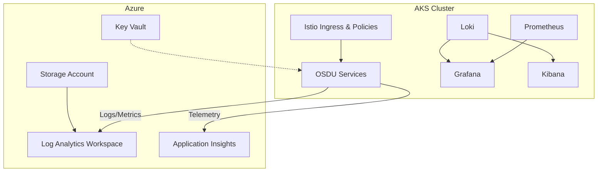
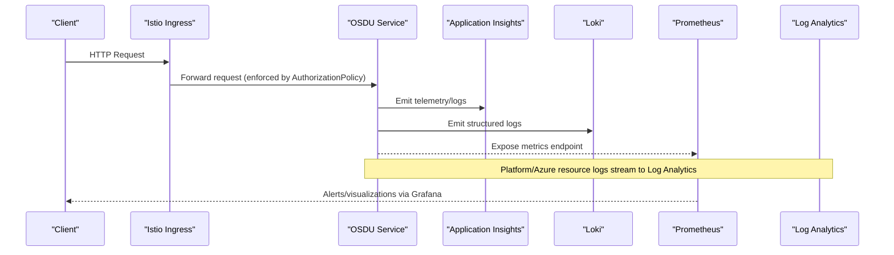
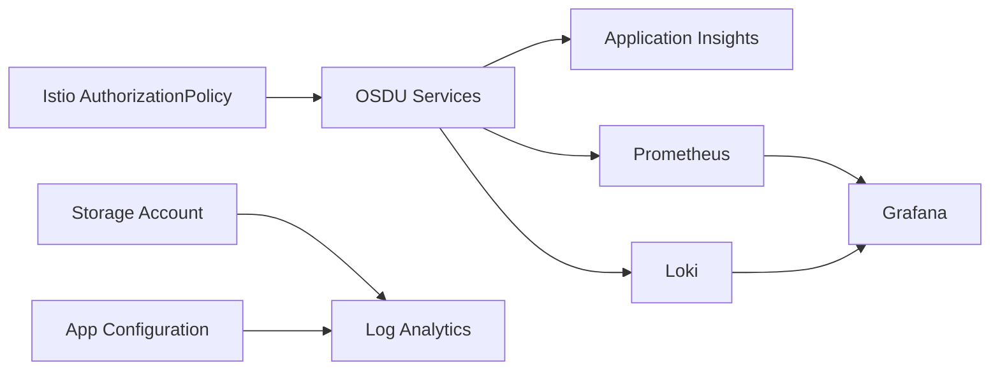

# Audit Logging and Security Monitoring

<cite>
**Referenced Files in This Document**
- [SECURITY.md](file://SECURITY.md)
- [Application_Insights.md](file://src/Application_Insights.md)
- [main.bicep](file://bicep/main.bicep)
- [app-configuration/main.bicep](file://bicep/modules/app-configuration/main.bicep)
- [storage-account/main.json](file://bicep/modules/storage-account/main.json)
- [prometheus.yaml](file://software/components/observability/prometheus.yaml)
- [loki.yaml](file://software/components/observability/loki.yaml)
- [auth-policy.yaml](file://charts/osdu-developer-service/templates/auth-policy.yaml)
- [access_control.yaml](file://charts/istio-certs/templates/access_control.yaml)
- [subnet_monitoring.yaml](file://software/components/observability/subnet_monitoring.yaml)
- [design_architecture.md](file://docs/src/design_architecture.md)
</cite>

## Table of Contents
1. Introduction
2. Project Structure
3. Core Components
4. Architecture Overview
5. Detailed Component Analysis
6. Dependency Analysis
7. Performance Considerations
8. Troubleshooting Guide
9. Conclusion

## Introduction
This document provides comprehensive guidance for audit logging and security monitoring on the OSDU platform deployed to Azure. It covers:
- Collecting audit trails for user actions, API calls, and administrative operations
- Aggregating logs into Azure Monitor (Log Analytics) and Application Insights
- Real-time monitoring and alerting with Prometheus, Grafana, Loki, and Kibana
- Configuring audit policies and security controls via Istio and Azure resources
- Analyzing logs for compliance reporting and incident response

The guidance is grounded in the repository’s infrastructure-as-code (Bicep), Kubernetes manifests (Helm/Kustomize), and observability components.

## Project Structure
The OSDU deployment uses a GitOps approach with Helm charts and Bicep templates to provision Azure resources and deploy services to an AKS cluster. Observability is provided by Prometheus, Loki, Grafana, and Kibana, while Azure Log Analytics and Application Insights serve as central log and metrics sinks.

**Diagram sources**
- [main.bicep:191-247](file://bicep/main.bicep#L191-L247)
- [prometheus.yaml:39-352](file://software/components/observability/prometheus.yaml#L39-L352)
- [loki.yaml:28-75](file://software/components/observability/loki.yaml#L28-L75)
- [auth-policy.yaml:1-28](file://charts/osdu-developer-service/templates/auth-policy.yaml#L1-L28)

**Section sources**
- [design_architecture.md:11-28](file://docs/src/design_architecture.md#L11-L28)
- [main.bicep:191-247](file://bicep/main.bicep#L191-L247)

## Core Components
- Azure Log Analytics and Application Insights: Centralized ingestion of logs and metrics from services and Azure resources.
- Istio AuthorizationPolicy: Enforces authentication at the service mesh level, ensuring only authenticated requests reach services.
- Prometheus: Scrapes metrics from Kubernetes and services; supports recording rules and alerts.
- Loki: Centralized log storage and query engine for application and system logs.
- Grafana and Kibana: Visualization and exploration of metrics and logs.
- Storage Account diagnostics: Streams diagnostic logs and metrics to Log Analytics.

**Section sources**
- [main.bicep:191-247](file://bicep/main.bicep#L191-L247)
- [auth-policy.yaml:1-28](file://charts/osdu-developer-service/templates/auth-policy.yaml#L1-L28)
- [prometheus.yaml:39-352](file://software/components/observability/prometheus.yaml#L39-L352)
- [loki.yaml:28-75](file://software/components/observability/loki.yaml#L28-L75)
- [storage-account/main.json:4066-4629](file://bicep/modules/storage-account/main.json#L4066-L4629)

## Architecture Overview
The platform collects telemetry from services and Azure resources and routes it to centralized stores:
- Application-level logs and traces are sent to Application Insights and/or Loki.
- Infrastructure and platform logs (e.g., storage account diagnostics) are streamed to Log Analytics.
- Metrics are scraped by Prometheus and visualized in Grafana; alerts can be configured via Prometheus rules.
- Istio enforces access control at the ingress and service boundaries.

**Diagram sources**
- [auth-policy.yaml:1-28](file://charts/osdu-developer-service/templates/auth-policy.yaml#L1-L28)
- [Application_Insights.md:1-71](file://src/Application_Insights.md#L1-L71)
- [prometheus.yaml:39-352](file://software/components/observability/prometheus.yaml#L39-L352)
- [loki.yaml:28-75](file://software/components/observability/loki.yaml#L28-L75)
- [main.bicep:191-247](file://bicep/main.bicep#L191-L247)

## Detailed Component Analysis

### Azure Log Analytics and Application Insights Integration
- Log Analytics workspace is provisioned and tagged for governance.
- Application Insights is linked to the workspace and configured to collect metrics and custom diagnostics.
- Services running locally or in-cluster emit telemetry using the Application Insights Java agent configuration documented in the repository.

Operational notes:
- Ensure the Application Insights Java agent JAR is available and configured when running services locally to avoid runtime exceptions related to missing telemetry context.
- Configure environment variables and VM arguments per the local development guide.

**Section sources**
- [main.bicep:191-247](file://bicep/main.bicep#L191-L247)
- [Application_Insights.md:1-71](file://src/Application_Insights.md#L1-L71)

### Istio Authorization Policy for Access Control
- An AuthorizationPolicy denies requests without a valid principal unless explicitly allowed by configured paths.
- This policy ensures that all inbound traffic to OSDU services must be authenticated before reaching application logic.

Configuration highlights:
- The policy targets services via label selectors and applies a deny action for unauthenticated principals.
- Paths can be excluded from enforcement where necessary.

**Section sources**
- [auth-policy.yaml:1-28](file://charts/osdu-developer-service/templates/auth-policy.yaml#L1-L28)

### Prometheus Metrics Collection and Alerting
- Prometheus scrapes Kubernetes APIs, nodes, pods, and services based on annotations.
- Supports slow-scrape jobs for expensive endpoints and blackbox probes for availability checks.
- Recording rules and alerting rules can be mounted via ConfigMaps.

Operational notes:
- Adjust scrape intervals and timeouts to balance freshness and load.
- Use labels (namespace, service, pod, node) to segment metrics for dashboards and alerts.

**Section sources**
- [prometheus.yaml:39-352](file://software/components/observability/prometheus.yaml#L39-L352)

### Loki Logs Aggregation and Querying
- Loki runs in single-binary mode with filesystem storage for chunks and rules.
- Auth is disabled in this deployment; secure access via network policies and RBAC is recommended.
- Retention and schema settings are defined in the config.

Operational notes:
- Mount persistent storage for durability.
- Integrate with Grafana for unified log exploration alongside metrics.

**Section sources**
- [loki.yaml:28-75](file://software/components/observability/loki.yaml#L28-L75)
- [loki.yaml:171-290](file://software/components/observability/loki.yaml#L171-L290)

### Storage Account Diagnostics and Compliance
- Storage accounts support diagnostic settings to stream logs and metrics to Log Analytics.
- Categories include access logs, audit logs, and metrics, configurable per service.

Operational notes:
- Enable appropriate categories for compliance requirements.
- Set retention policies aligned with organizational standards.

**Section sources**
- [storage-account/main.json:4066-4629](file://bicep/modules/storage-account/main.json#L4066-L4629)

### App Configuration Diagnostic Logs
- App Configuration can stream HttpRequest and Audit logs to Log Analytics with retention policies.

Operational notes:
- Enable both HttpRequest and Audit logs for comprehensive visibility into configuration changes and access patterns.

**Section sources**
- [app-configuration/main.bicep:89-139](file://bicep/modules/app-configuration/main.bicep#L89-L139)

### Subnet and Resource Monitoring Thresholds
- Subnet monitoring defines thresholds for container CPU/memory and persistent volume usage to trigger alerts.

Operational notes:
- Tune thresholds to match workload profiles and SLOs.
- Combine with Log Analytics alerts for cross-resource correlation.

**Section sources**
- [subnet_monitoring.yaml:144-158](file://software/components/observability/subnet_monitoring.yaml#L144-L158)

### RBAC for Ingress and Cert Management
- Role and RoleBinding grant permissions to manage services, certificates, and Gateway API resources required for secure ingress.

Operational notes:
- Restrict roles to least privilege.
- Review permissions periodically.

**Section sources**
- [access_control.yaml:1-37](file://charts/istio-certs/templates/access_control.yaml#L1-L37)

## Dependency Analysis

**Diagram sources**
- [auth-policy.yaml:1-28](file://charts/osdu-developer-service/templates/auth-policy.yaml#L1-L28)
- [Application_Insights.md:1-71](file://src/Application_Insights.md#L1-L71)
- [prometheus.yaml:39-352](file://software/components/observability/prometheus.yaml#L39-L352)
- [loki.yaml:28-75](file://software/components/observability/loki.yaml#L28-L75)
- [storage-account/main.json:4066-4629](file://bicep/modules/storage-account/main.json#L4066-L4629)
- [app-configuration/main.bicep:89-139](file://bicep/modules/app-configuration/main.bicep#L89-L139)

**Section sources**
- [main.bicep:191-247](file://bicep/main.bicep#L191-L247)
- [prometheus.yaml:39-352](file://software/components/observability/prometheus.yaml#L39-L352)
- [loki.yaml:28-75](file://software/components/observability/loki.yaml#L28-L75)

## Performance Considerations
- Scrape tuning: Adjust Prometheus scrape intervals and timeouts to balance data freshness with cluster overhead.
- Log volume: Limit Loki retention and chunk sizes to control storage costs; use efficient queries and filters.
- Telemetry overhead: Ensure Application Insights sampling is tuned to reduce cost while preserving critical traces.
- Network egress: Route logs and metrics through private endpoints where possible to minimize exposure and latency.

[No sources needed since this section provides general guidance]

## Troubleshooting Guide
- Local Application Insights errors: If you see exceptions about missing telemetry context during local runs, verify the Java agent JAR path and environment variables per the local setup guide.
- Missing logs in Log Analytics: Confirm diagnostic settings on Storage Accounts and other resources are enabled and pointed to the correct workspace.
- Unauthenticated requests denied: Check Istio AuthorizationPolicy to ensure required paths are excluded if necessary and that clients present valid tokens.
- High memory/CPU alerts: Review subnet monitoring thresholds and adjust based on observed baselines.

**Section sources**
- [Application_Insights.md:1-71](file://src/Application_Insights.md#L1-L71)
- [storage-account/main.json:4066-4629](file://bicep/modules/storage-account/main.json#L4066-L4629)
- [auth-policy.yaml:1-28](file://charts/osdu-developer-service/templates/auth-policy.yaml#L1-L28)
- [subnet_monitoring.yaml:144-158](file://software/components/observability/subnet_monitoring.yaml#L144-L158)

## Conclusion
The OSDU platform integrates robust audit logging and security monitoring across Azure and Kubernetes layers. By leveraging Application Insights, Log Analytics, Istio policies, Prometheus, and Loki, teams can enforce strong access controls, collect comprehensive audit trails, visualize real-time metrics and logs, and respond quickly to incidents. Align configurations with organizational compliance requirements and continuously tune thresholds and retention policies to maintain performance and cost efficiency.

[No sources needed since this section summarizes without analyzing specific files]