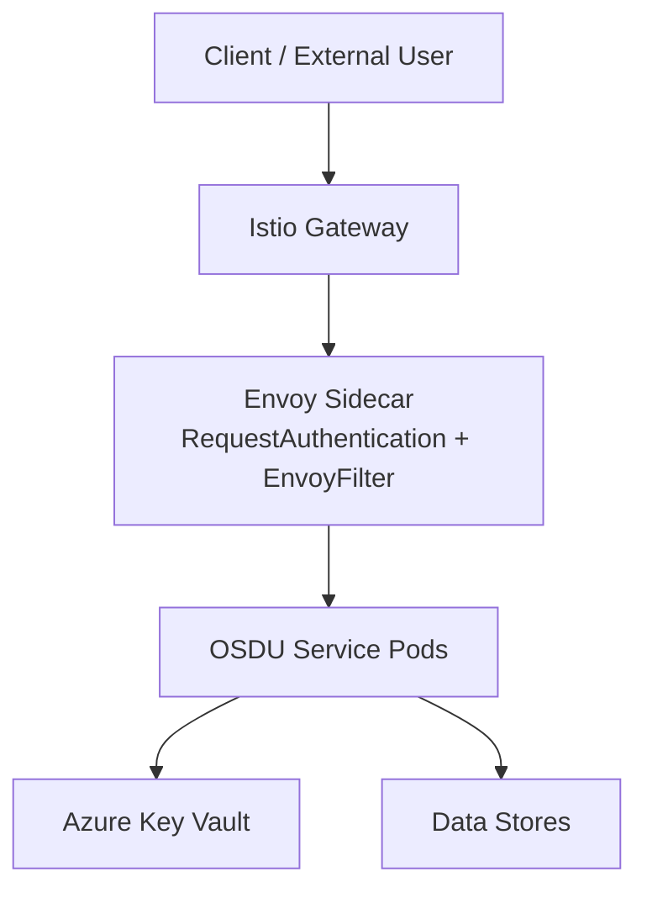
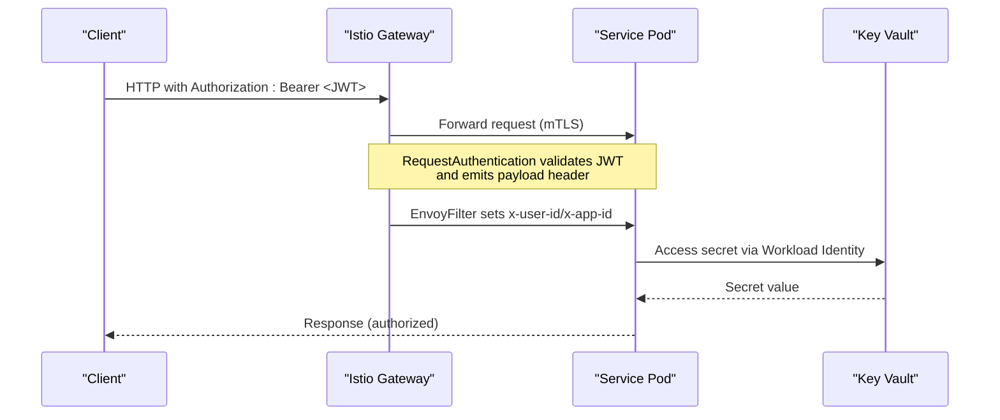
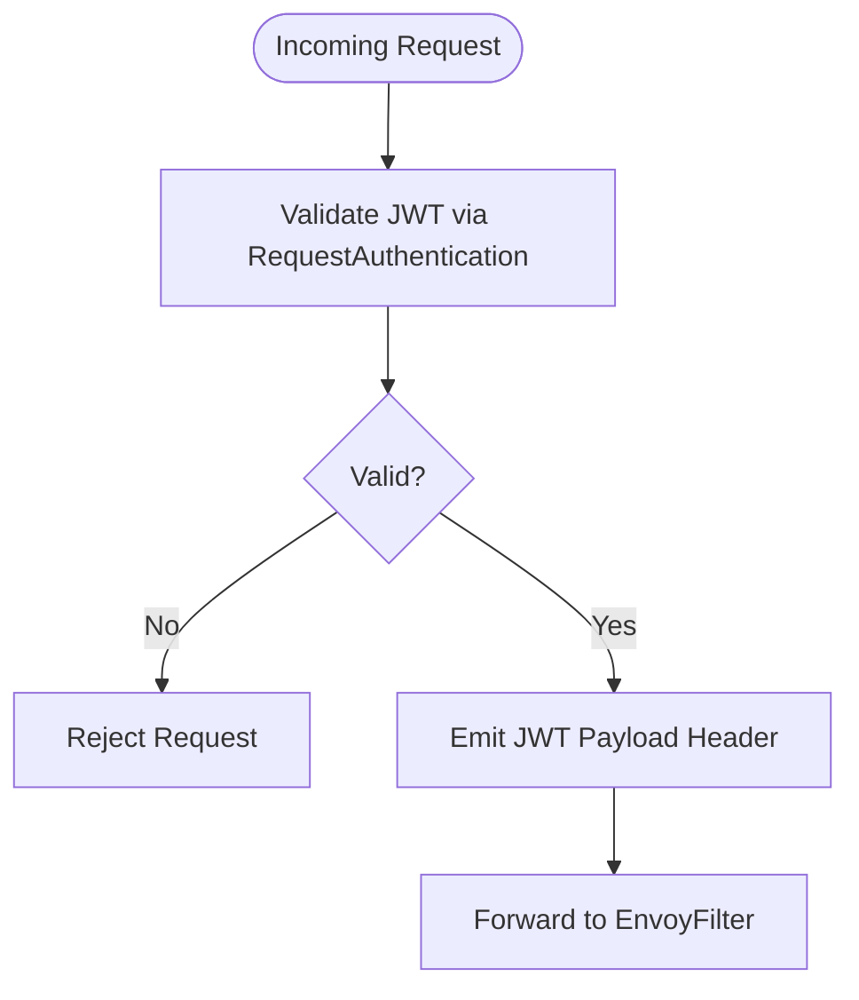
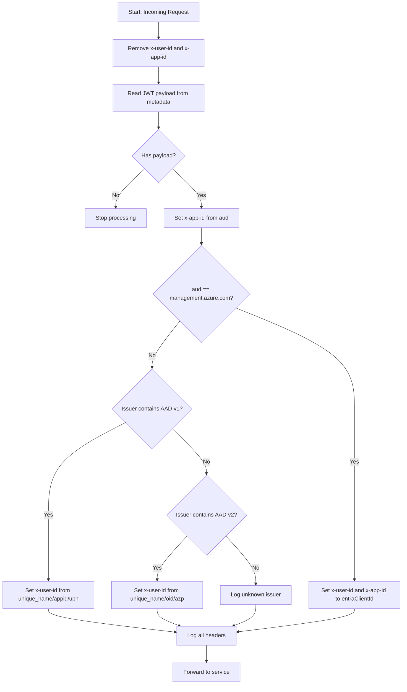
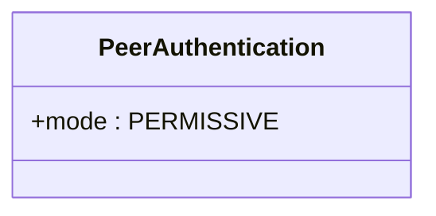
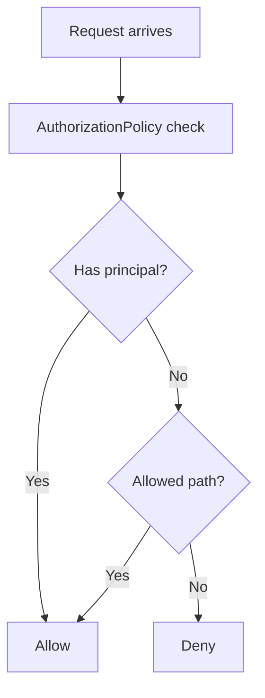
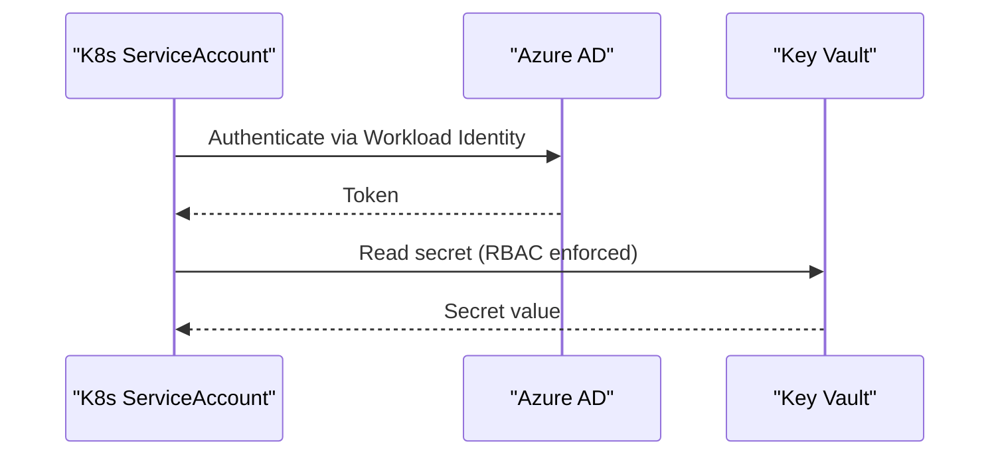
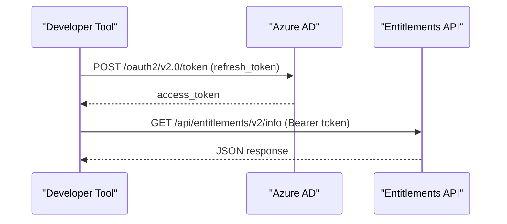
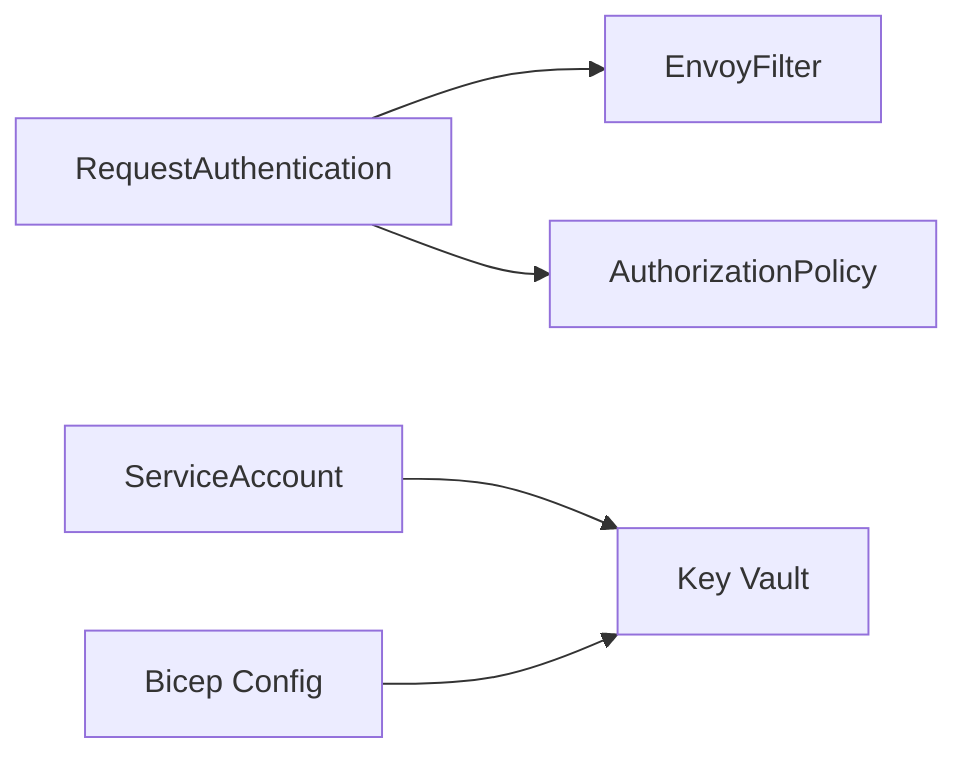

# Authentication and Authorization

<cite>
**Referenced Files in This Document**
- [envoy-filter.md](file://charts/osdu-developer-base/envoy-filter.md)
- [request-authentication.yaml](file://charts/osdu-developer-base/templates/request-authentication.yaml)
- [peer-authentication.yaml](file://charts/osdu-developer-base/templates/peer-authentication.yaml)
- [envoy-filter.yaml](file://charts/osdu-developer-base/templates/envoy-filter.yaml)
- [auth-policy.yaml](file://charts/osdu-developer-service/templates/auth-policy.yaml)
- [serviceaccount.yaml](file://charts/osdu-developer-base/templates/serviceaccount.yaml)
- [check-secrets.yaml](file://charts/keyvault-secrets/templates/check-secrets.yaml)
- [keyvault_serviceaccount.yaml](file://charts/keyvault-secrets/templates/serviceaccount.yaml)
- [network_acl_vault.bicep](file://bicep/modules/network_acl_vault.bicep)
- [main.bicep](file://bicep/main.bicep)
- [blade_configuration.bicep](file://bicep/modules/blade_configuration.bicep)
- [entitlement.http](file://tools/rest-scripts/entitlement.http)
- [admin.http](file://tools/rest-scripts/admin.http)
</cite>

## Table of Contents
1. Introduction
2. Project Structure
3. Core Components
4. Architecture Overview
5. Detailed Component Analysis
6. Dependency Analysis
7. Performance Considerations
8. Troubleshooting Guide
9. Conclusion
10. Appendices

## Introduction
This document explains how the OSDU platform implements authentication and authorization across its services. It covers:
- OAuth2/OpenID Connect integration with Azure Active Directory (AAD) via Istio RequestAuthentication
- Service-to-service security using Istio mTLS
- Role-based access control (RBAC) enforcement at the service boundary
- Token management, identity propagation, and session handling patterns
- Identity provider configuration for AAD v1/v2 tokens
- Secure access to Azure Key Vault using Workload Identity and RBAC
- Practical examples of API authentication flows, JWT validation, and inter-service communication security

## Project Structure
The authentication and authorization stack is primarily defined in Helm charts and Bicep templates:
- Istio policies for JWT validation, peer authentication, and authorization
- Envoy Lua filter to normalize identity headers from AAD tokens
- Kubernetes ServiceAccounts annotated for Azure Workload Identity
- Bicep modules that configure Key Vault RBAC and network ACLs
- REST scripts demonstrating OAuth flows and authenticated API calls

**Diagram sources**
- [request-authentication.yaml:1-33](file://charts/osdu-developer-base/templates/request-authentication.yaml#L1-L33)
- [envoy-filter.yaml:1-143](file://charts/osdu-developer-base/templates/envoy-filter.yaml#L1-L143)
- [peer-authentication.yaml:1-7](file://charts/osdu-developer-base/templates/peer-authentication.yaml#L1-L7)
- [serviceaccount.yaml:1-9](file://charts/osdu-developer-base/templates/serviceaccount.yaml#L1-L9)
- [check-secrets.yaml:1-50](file://charts/keyvault-secrets/templates/check-secrets.yaml#L1-L50)

**Section sources**
- [request-authentication.yaml:1-33](file://charts/osdu-developer-base/templates/request-authentication.yaml#L1-L33)
- [envoy-filter.yaml:1-143](file://charts/osdu-developer-base/templates/envoy-filter.yaml#L1-L143)
- [peer-authentication.yaml:1-7](file://charts/osdu-developer-base/templates/peer-authentication.yaml#L1-L7)
- [serviceaccount.yaml:1-9](file://charts/osdu-developer-base/templates/serviceaccount.yaml#L1-L9)
- [check-secrets.yaml:1-50](file://charts/keyvault-secrets/templates/check-secrets.yaml#L1-L50)

## Core Components
- Istio RequestAuthentication validates incoming JWTs from AAD v1 and v2 issuers and forwards original tokens while emitting payload to a header for downstream processing.
- Istio PeerAuthentication enforces mutual TLS between services (permissive mode by default).
- Envoy Lua filter normalizes identity into well-known headers (x-user-id, x-app-id) based on token issuer and claims, including special handling for Azure management audience.
- Istio AuthorizationPolicy denies requests without valid principals except explicitly allowed paths.
- Azure Workload Identity enables services to securely access Key Vault without secrets in code.
- Bicep configures Key Vault RBAC roles and network ACLs to restrict access to trusted cluster egress.

**Section sources**
- [request-authentication.yaml:1-33](file://charts/osdu-developer-base/templates/request-authentication.yaml#L1-L33)
- [peer-authentication.yaml:1-7](file://charts/osdu-developer-base/templates/peer-authentication.yaml#L1-L7)
- [envoy-filter.yaml:1-143](file://charts/osdu-developer-base/templates/envoy-filter.yaml#L1-L143)
- [auth-policy.yaml:1-29](file://charts/osdu-developer-service/templates/auth-policy.yaml#L1-L29)
- [serviceaccount.yaml:1-9](file://charts/osdu-developer-base/templates/serviceaccount.yaml#L1-L9)
- [network_acl_vault.bicep:1-47](file://bicep/modules/network_acl_vault.bicep#L1-L47)
- [main.bicep:599-661](file://bicep/main.bicep#L599-L661)

## Architecture Overview
The end-to-end flow combines client-side OAuth2/OIDC with Istio-based gateway controls and per-service authorization.

**Diagram sources**
- [request-authentication.yaml:1-33](file://charts/osdu-developer-base/templates/request-authentication.yaml#L1-L33)
- [envoy-filter.yaml:1-143](file://charts/osdu-developer-base/templates/envoy-filter.yaml#L1-L143)
- [peer-authentication.yaml:1-7](file://charts/osdu-developer-base/templates/peer-authentication.yaml#L1-L7)
- [serviceaccount.yaml:1-9](file://charts/osdu-developer-base/templates/serviceaccount.yaml#L1-L9)
- [check-secrets.yaml:1-50](file://charts/keyvault-secrets/templates/check-secrets.yaml#L1-L50)

## Detailed Component Analysis

### OAuth2/OpenID Connect Integration with Istio
- RequestAuthentication accepts Bearer tokens from AAD v1 and v2 issuers, validates audiences, and forwards the original token. The decoded JWT payload is emitted to a header for further processing.
- This enables consistent identity propagation across services without custom middleware.

**Diagram sources**
- [request-authentication.yaml:1-33](file://charts/osdu-developer-base/templates/request-authentication.yaml#L1-L33)

**Section sources**
- [request-authentication.yaml:1-33](file://charts/osdu-developer-base/templates/request-authentication.yaml#L1-L33)

### Envoy Filter for Microsoft Identity Normalization
- The Envoy Lua filter resets identity headers, reads the JWT payload, and sets x-app-id from aud. For Azure management audience, it maps identity to entraClientId. For AAD v1/v2 user tokens, it sets x-user-id from appropriate claims.
- Supports delegation via x-on-behalf-of to preserve user identity across service chains.

**Diagram sources**
- [envoy-filter.yaml:1-143](file://charts/osdu-developer-base/templates/envoy-filter.yaml#L1-L143)
- [envoy-filter.md:1-67](file://charts/osdu-developer-base/envoy-filter.md#L1-L67)

**Section sources**
- [envoy-filter.yaml:1-143](file://charts/osdu-developer-base/templates/envoy-filter.yaml#L1-L143)
- [envoy-filter.md:1-67](file://charts/osdu-developer-base/envoy-filter.md#L1-L67)

### Inter-Service Security with Istio mTLS
- PeerAuthentication is configured in permissive mode, allowing gradual rollout of mTLS while maintaining compatibility during transitions.
- All sidecars enforce encrypted traffic between services when enabled.

**Diagram sources**
- [peer-authentication.yaml:1-7](file://charts/osdu-developer-base/templates/peer-authentication.yaml#L1-L7)

**Section sources**
- [peer-authentication.yaml:1-7](file://charts/osdu-developer-base/templates/peer-authentication.yaml#L1-L7)

### Role-Based Access Control at Service Boundary
- AuthorizationPolicy denies requests lacking a valid principal unless the path is explicitly allowed.
- This enforces that only authenticated and authorized callers can reach service endpoints.

**Diagram sources**
- [auth-policy.yaml:1-29](file://charts/osdu-developer-service/templates/auth-policy.yaml#L1-L29)

**Section sources**
- [auth-policy.yaml:1-29](file://charts/osdu-developer-service/templates/auth-policy.yaml#L1-L29)

### Azure Key Vault Access via Workload Identity
- ServiceAccount annotations bind Kubernetes identities to Azure identities, enabling secure access to Key Vault without storing secrets in pods.
- A job mounts secrets via CSI and waits for availability before proceeding.

**Diagram sources**
- [serviceaccount.yaml:1-9](file://charts/osdu-developer-base/templates/serviceaccount.yaml#L1-L9)
- [keyvault_serviceaccount.yaml:1-11](file://charts/keyvault-secrets/templates/serviceaccount.yaml#L1-L11)
- [check-secrets.yaml:1-50](file://charts/keyvault-secrets/templates/check-secrets.yaml#L1-L50)
- [main.bicep:599-661](file://bicep/main.bicep#L599-L661)
- [network_acl_vault.bicep:1-47](file://bicep/modules/network_acl_vault.bicep#L1-L47)

**Section sources**
- [serviceaccount.yaml:1-9](file://charts/osdu-developer-base/templates/serviceaccount.yaml#L1-L9)
- [keyvault_serviceaccount.yaml:1-11](file://charts/keyvault-secrets/templates/serviceaccount.yaml#L1-L11)
- [check-secrets.yaml:1-50](file://charts/keyvault-secrets/templates/check-secrets.yaml#L1-L50)
- [main.bicep:599-661](file://bicep/main.bicep#L599-L661)
- [network_acl_vault.bicep:1-47](file://bicep/modules/network_acl_vault.bicep#L1-L47)

### Federated Identity Configuration
- Federated identity credentials map Kubernetes service accounts to Azure AD app registrations, enabling OIDC-based trust for workloads.

**Section sources**
- [blade_configuration.bicep:135-184](file://bicep/modules/blade_configuration.bicep#L135-L184)
- [blade_configuration.bicep:186-206](file://bicep/modules/blade_configuration.bicep#L186-L206)

### Practical API Authentication Flows
- Use the provided REST scripts to obtain tokens via refresh_token and call protected APIs with Authorization: Bearer.
- Include data-partition-id where required by services.

**Diagram sources**
- [entitlement.http:1-60](file://tools/rest-scripts/entitlement.http#L1-L60)
- [admin.http:102-312](file://tools/rest-scripts/admin.http#L102-L312)

**Section sources**
- [entitlement.http:1-60](file://tools/rest-scripts/entitlement.http#L1-L60)
- [admin.http:102-312](file://tools/rest-scripts/admin.http#L102-L312)

## Dependency Analysis
- RequestAuthentication depends on AAD JWKS endpoints and tenant-specific issuers.
- EnvoyFilter depends on the presence of JWT metadata emitted by RequestAuthentication.
- AuthorizationPolicy depends on validated principals produced by RequestAuthentication.
- Workload Identity depends on properly annotated ServiceAccounts and federated identity mappings.
- Key Vault access depends on RBAC role assignments and network ACLs.

**Diagram sources**
- [request-authentication.yaml:1-33](file://charts/osdu-developer-base/templates/request-authentication.yaml#L1-L33)
- [envoy-filter.yaml:1-143](file://charts/osdu-developer-base/templates/envoy-filter.yaml#L1-L143)
- [auth-policy.yaml:1-29](file://charts/osdu-developer-service/templates/auth-policy.yaml#L1-L29)
- [serviceaccount.yaml:1-9](file://charts/osdu-developer-base/templates/serviceaccount.yaml#L1-L9)
- [main.bicep:599-661](file://bicep/main.bicep#L599-L661)

**Section sources**
- [request-authentication.yaml:1-33](file://charts/osdu-developer-base/templates/request-authentication.yaml#L1-L33)
- [envoy-filter.yaml:1-143](file://charts/osdu-developer-base/templates/envoy-filter.yaml#L1-L143)
- [auth-policy.yaml:1-29](file://charts/osdu-developer-service/templates/auth-policy.yaml#L1-L29)
- [serviceaccount.yaml:1-9](file://charts/osdu-developer-base/templates/serviceaccount.yaml#L1-L9)
- [main.bicep:599-661](file://bicep/main.bicep#L599-L661)

## Performance Considerations
- Istio mTLS adds minimal overhead; ensure certificates are rotated and mesh is healthy.
- Envoy Lua filtering introduces small CPU usage; tune logging levels to avoid excessive logs in production.
- RequestAuthentication performs JWKS lookups; caching is handled by Istio proxies.
- Key Vault access latency depends on network proximity and RBAC checks; consider caching secrets at application boundaries where appropriate.

## Troubleshooting Guide
- Increase logging for debugging JWT and RBAC issues in Envoy proxies.
- Verify that RequestAuthentication is enabled and audiences match your app registration.
- Confirm that AuthorizationPolicy allows intended paths and that principals are present after JWT validation.
- Validate Key Vault RBAC roles and network ACLs to ensure cluster egress is permitted.

**Section sources**
- [envoy-filter.md:58-67](file://charts/osdu-developer-base/envoy-filter.md#L58-L67)
- [request-authentication.yaml:1-33](file://charts/osdu-developer-base/templates/request-authentication.yaml#L1-L33)
- [auth-policy.yaml:1-29](file://charts/osdu-developer-service/templates/auth-policy.yaml#L1-L29)
- [network_acl_vault.bicep:1-47](file://bicep/modules/network_acl_vault.bicep#L1-L47)

## Conclusion
The OSDU platform secures external and internal traffic through a layered approach:
- Client authentication via OAuth2/OIDC with Istio RequestAuthentication
- Identity normalization and propagation using an Envoy Lua filter
- Strict service-level authorization via Istio AuthorizationPolicy
- Encrypted service-to-service communication with Istio mTLS
- Secure Key Vault access using Azure Workload Identity and RBAC

This design provides robust, scalable, and auditable authentication and authorization suitable for enterprise deployments.

## Appendices

### Token Management and Session Handling
- Tokens are validated at the gateway and propagated as headers; services should rely on these headers rather than implementing custom JWT parsing.
- For long-lived sessions, use refresh tokens obtained via OAuth flows and exchange them for short-lived access tokens as needed.

**Section sources**
- [request-authentication.yaml:1-33](file://charts/osdu-developer-base/templates/request-authentication.yaml#L1-L33)
- [entitlement.http:1-60](file://tools/rest-scripts/entitlement.http#L1-L60)

### Identity Provider Configuration
- Configure AAD v1 and v2 issuers in RequestAuthentication with correct tenants and audiences.
- Ensure federated identities are set up for workload identity mapping.

**Section sources**
- [request-authentication.yaml:1-33](file://charts/osdu-developer-base/templates/request-authentication.yaml#L1-L33)
- [blade_configuration.bicep:135-184](file://bicep/modules/blade_configuration.bicep#L135-L184)