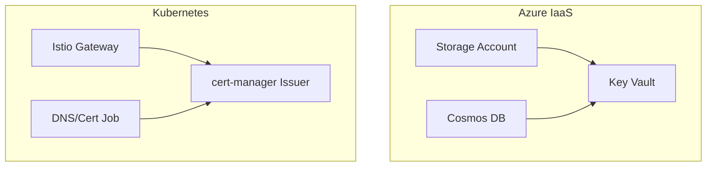
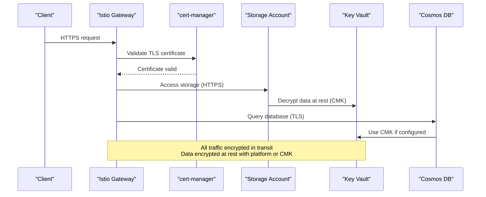
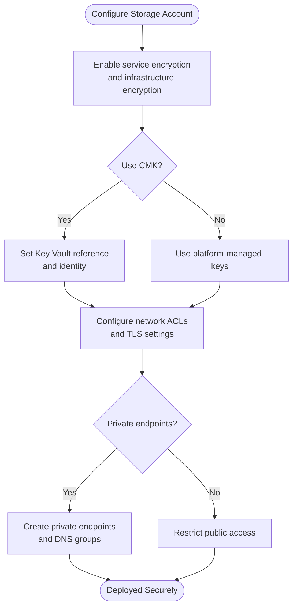
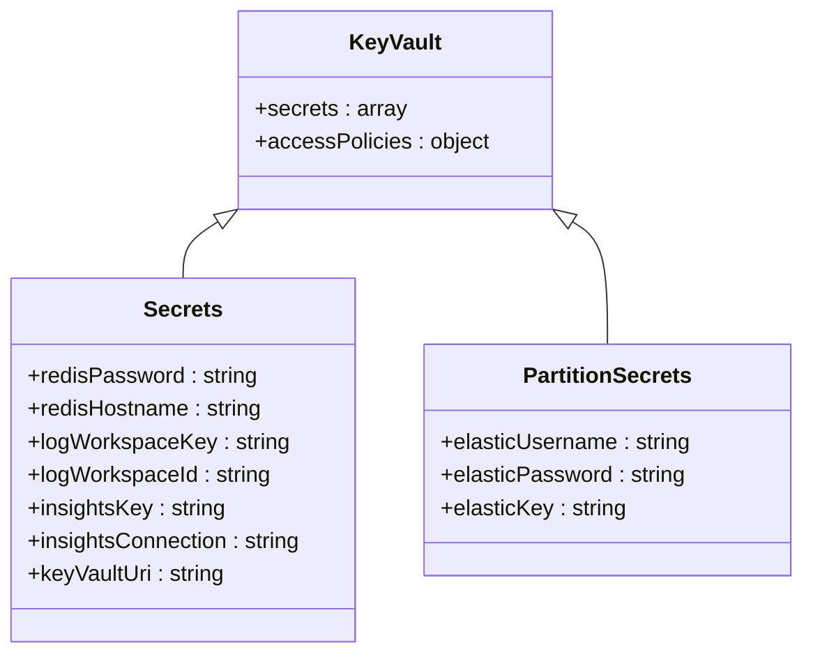
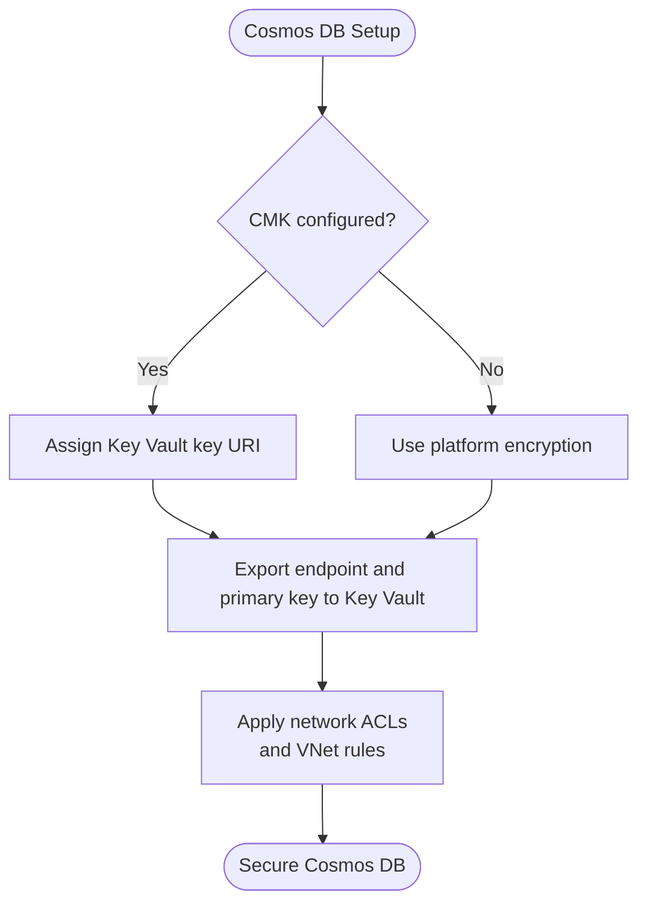
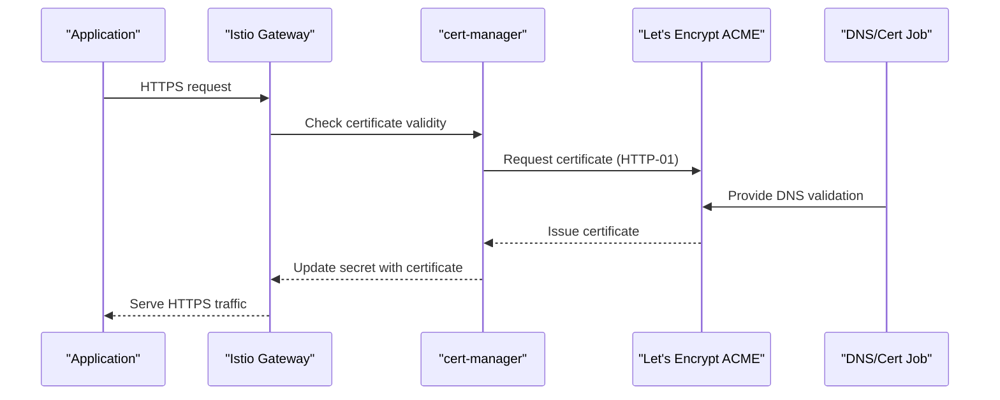
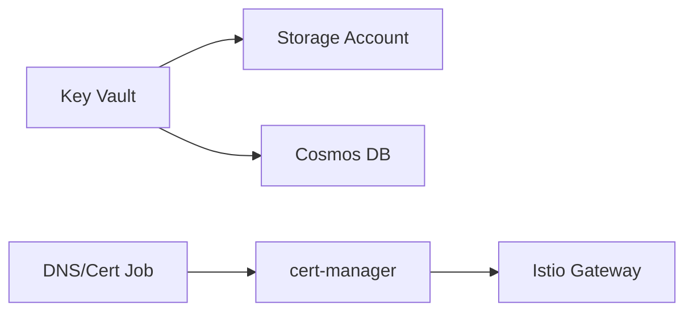

# Data Protection and Encryption

<cite>
**Referenced Files in This Document**
- [bicep/modules/storage-account/main.bicep](file://bicep/modules/storage-account/main.bicep)
- [bicep/modules/storage-account/tests/e2e/system-assigned-cmk-encryption/dependencies.bicep](file://bicep/modules/storage-account/tests/e2e/system-assigned-cmk-encryption/dependencies.bicep)
- [bicep/modules/keyvault_secrets.bicep](file://bicep/modules/keyvault_secrets.bicep)
- [bicep/modules/keyvault_secrets_partition.bicep](file://bicep/modules/keyvault_secrets_partition.bicep)
- [bicep/modules/cosmos-db/main.bicep](file://bicep/modules/cosmos-db/main.bicep)
- [charts/istio-ingress/values.yaml](file://charts/istio-ingress/values.yaml)
- [charts/istio-ingress/templates/gateways.yaml](file://charts/istio-ingress/templates/gateways.yaml)
- [charts/istio-certs/templates/job.yaml](file://charts/istio-certs/templates/job.yaml)
- [software/components/certs-issuer/lets-encrypt.yaml](file://software/components/certs-issuer/lets-encrypt.yaml)
- [software/components/mesh-ingress/certs.yaml](file://software/components/mesh-ingress/certs.yaml)
- [charts/osdu-developer-init/templates/partition-init.yaml](file://charts/osdu-developer-init/templates/partition-init.yaml)
- [tools/rest-scripts/local.http](file://tools/rest-scripts/local.http)
- [tools/rest-scripts/partition.http](file://tools/rest-scripts/partition.http)
</cite>

## Table of Contents
1. Introduction
2. Project Structure
3. Core Components
4. Architecture Overview
5. Detailed Component Analysis
6. Dependency Analysis
7. Performance Considerations
8. Troubleshooting Guide
9. Conclusion

## Introduction
This document provides comprehensive data protection guidance for the OSDU platform, focusing on encryption at rest and in transit across Azure services and Kubernetes ingress. It covers:
- Azure Key Vault integration for secrets management
- Storage account encryption settings (including customer-managed keys and infrastructure encryption)
- Cosmos DB encryption configuration
- TLS/SSL certificate lifecycle via cert-manager and Istio Gateways
- Network security policies and private endpoints
- Sensitive field handling and partition-level configuration patterns
- Guidance for implementing field-level encryption, key rotation, and compliance considerations

## Project Structure
The repository organizes security-related configurations across Infrastructure-as-Code (Bicep), Helm charts, and Kubernetes manifests:
- Bicep modules define Azure resources with encryption and network controls
- Helm charts configure Istio Gateways and cert-manager issuers for TLS termination
- Kubernetes Jobs orchestrate DNS and certificate issuance workflows
- Partition initialization templates mark sensitive configuration fields

**Diagram sources**
- [bicep/modules/storage-account/main.bicep:371-414](file://bicep/modules/storage-account/main.bicep#L371-L414)
- [bicep/modules/keyvault_secrets.bicep:17-96](file://bicep/modules/keyvault_secrets.bicep#L17-L96)
- [bicep/modules/cosmos-db/main.bicep:515-550](file://bicep/modules/cosmos-db/main.bicep#L515-L550)
- [charts/istio-ingress/templates/gateways.yaml:1-96](file://charts/istio-ingress/templates/gateways.yaml#L1-L96)
- [software/components/certs-issuer/lets-encrypt.yaml:1-34](file://software/components/certs-issuer/lets-encrypt.yaml#L1-L34)
- [charts/istio-certs/templates/job.yaml:1-47](file://charts/istio-certs/templates/job.yaml#L1-L47)

**Section sources**
- [bicep/modules/storage-account/main.bicep:371-414](file://bicep/modules/storage-account/main.bicep#L371-L414)
- [bicep/modules/keyvault_secrets.bicep:17-96](file://bicep/modules/keyvault_secrets.bicep#L17-L96)
- [bicep/modules/cosmos-db/main.bicep:515-550](file://bicep/modules/cosmos-db/main.bicep#L515-L550)
- [charts/istio-ingress/templates/gateways.yaml:1-96](file://charts/istio-ingress/templates/gateways.yaml#L1-L96)
- [software/components/certs-issuer/lets-encrypt.yaml:1-34](file://software/components/certs-issuer/lets-encrypt.yaml#L1-L34)
- [charts/istio-certs/templates/job.yaml:1-47](file://charts/istio-certs/templates/job.yaml#L1-L47)

## Core Components
- Storage Account Encryption at Rest:
  - Enables service-level encryption for blob/file/table/queue
  - Supports Customer Managed Keys (CMK) via Key Vault
  - Enforces infrastructure encryption by default
  - Restricts public access and enforces HTTPS-only traffic
  - Configures minimum TLS version and network ACLs
- Key Vault Secrets Management:
  - Stores Redis credentials, Log Analytics keys, and Key Vault URIs
  - Per-partition secrets for Elastic and other services
- Cosmos DB Encryption:
  - Supports Customer Managed Encryption Keys
  - Exposes endpoint and primary key as secrets for system partitions
- Ingress TLS Termination:
  - Istio Gateways terminate TLS using cert-manager managed certificates
  - Automated DNS and HTTP-01 challenge workflow via a Job
- Sensitive Configuration Handling:
  - Partition properties mark sensitive values to prevent accidental exposure

**Section sources**
- [bicep/modules/storage-account/main.bicep:77-79](file://bicep/modules/storage-account/main.bicep#L77-L79)
- [bicep/modules/storage-account/main.bicep:371-414](file://bicep/modules/storage-account/main.bicep#L371-L414)
- [bicep/modules/storage-account/main.bicep:422-446](file://bicep/modules/storage-account/main.bicep#L422-L446)
- [bicep/modules/keyvault_secrets.bicep:17-96](file://bicep/modules/keyvault_secrets.bicep#L17-L96)
- [bicep/modules/keyvault_secrets_partition.bicep:48-75](file://bicep/modules/keyvault_secrets_partition.bicep#L48-L75)
- [bicep/modules/cosmos-db/main.bicep:515-550](file://bicep/modules/cosmos-db/main.bicep#L515-L550)
- [charts/istio-ingress/templates/gateways.yaml:1-96](file://charts/istio-ingress/templates/gateways.yaml#L1-L96)
- [software/components/certs-issuer/lets-encrypt.yaml:1-34](file://software/components/certs-issuer/lets-encrypt.yaml#L1-L34)
- [charts/osdu-developer-init/templates/partition-init.yaml:57-94](file://charts/osdu-developer-init/templates/partition-init.yaml#L57-L94)

## Architecture Overview
End-to-end data protection flow:
- Client requests reach Istio Gateways which terminate TLS using certificates issued by cert-manager
- Services authenticate to Azure resources via managed identities or secrets stored in Key Vault
- Storage accounts encrypt data at rest using platform keys or CMKs; network access is restricted via private endpoints and ACLs
- Cosmos DB uses CMK where configured and exposes secrets securely through Key Vault

**Diagram sources**
- [charts/istio-ingress/templates/gateways.yaml:1-96](file://charts/istio-ingress/templates/gateways.yaml#L1-L96)
- [software/components/certs-issuer/lets-encrypt.yaml:1-34](file://software/components/certs-issuer/lets-encrypt.yaml#L1-L34)
- [bicep/modules/storage-account/main.bicep:371-414](file://bicep/modules/storage-account/main.bicep#L371-L414)
- [bicep/modules/cosmos-db/main.bicep:515-550](file://bicep/modules/cosmos-db/main.bicep#L515-L550)

## Detailed Component Analysis

### Storage Account Encryption at Rest and Network Security
- Encryption at rest:
  - Service encryption enabled for supported services
  - Optional CMK via Key Vault with identity support
  - Infrastructure encryption enforced by default
- Network controls:
  - HTTPS-only traffic required
  - Minimum TLS version set to modern standards
  - Network ACLs default to deny with explicit bypass rules
  - Public network access disabled when private endpoints are used
- Private endpoints:
  - Module supports multiple private endpoints per service group
  - Private DNS zone groups can be configured for internal resolution

**Diagram sources**
- [bicep/modules/storage-account/main.bicep:371-414](file://bicep/modules/storage-account/main.bicep#L371-L414)
- [bicep/modules/storage-account/main.bicep:422-446](file://bicep/modules/storage-account/main.bicep#L422-L446)
- [bicep/modules/storage-account/main.bicep:502-551](file://bicep/modules/storage-account/main.bicep#L502-L551)

**Section sources**
- [bicep/modules/storage-account/main.bicep:77-79](file://bicep/modules/storage-account/main.bicep#L77-L79)
- [bicep/modules/storage-account/main.bicep:371-414](file://bicep/modules/storage-account/main.bicep#L371-L414)
- [bicep/modules/storage-account/main.bicep:422-446](file://bicep/modules/storage-account/main.bicep#L422-L446)
- [bicep/modules/storage-account/main.bicep:502-551](file://bicep/modules/storage-account/main.bicep#L502-L551)
- [bicep/modules/storage-account/tests/e2e/system-assigned-cmk-encryption/dependencies.bicep:15-30](file://bicep/modules/storage-account/tests/e2e/system-assigned-cmk-encryption/dependencies.bicep#L15-L30)

### Azure Key Vault Integration for Secrets Management
- Centralized secret storage for:
  - Redis password and hostname
  - Log Analytics workspace key and ID
  - Application Insights instrumentation key and connection string
  - Key Vault URI itself for bootstrapping
- Per-partition secrets for:
  - Elastic username and password
  - Elastic API key
- Export capabilities:
  - Storage account names, keys, connection strings, endpoints, and SAS tokens can be exported into Key Vault

**Diagram sources**
- [bicep/modules/keyvault_secrets.bicep:17-96](file://bicep/modules/keyvault_secrets.bicep#L17-L96)
- [bicep/modules/keyvault_secrets_partition.bicep:48-75](file://bicep/modules/keyvault_secrets_partition.bicep#L48-L75)

**Section sources**
- [bicep/modules/keyvault_secrets.bicep:17-96](file://bicep/modules/keyvault_secrets.bicep#L17-L96)
- [bicep/modules/keyvault_secrets_partition.bicep:48-75](file://bicep/modules/keyvault_secrets_partition.bicep#L48-L75)

### Cosmos DB Encryption and Secret Exposure
- Customer Managed Encryption Key support via parameter
- System partition secrets:
  - Document endpoint exposed as a secret
  - Primary master key exposed as a secret
- Network restrictions:
  - IP rules, virtual network rules, and public network access controls

**Diagram sources**
- [bicep/modules/cosmos-db/main.bicep:515-550](file://bicep/modules/cosmos-db/main.bicep#L515-L550)
- [bicep/modules/cosmos-db/main.bicep:589-604](file://bicep/modules/cosmos-db/main.bicep#L589-L604)

**Section sources**
- [bicep/modules/cosmos-db/main.bicep:515-550](file://bicep/modules/cosmos-db/main.bicep#L515-L550)
- [bicep/modules/cosmos-db/main.bicep:589-604](file://bicep/modules/cosmos-db/main.bicep#L589-L604)

### TLS/SSL Certificate Management and Ingress Termination
- Istio Gateways terminate TLS using secrets referenced in values
- cert-manager ClusterIssuers configured for staging and production Let’s Encrypt
- A Job orchestrates DNS configuration and certificate creation via HTTP-01 challenges
- Values specify credential names matching secrets created by the certs chart

**Diagram sources**
- [charts/istio-ingress/values.yaml:4-17](file://charts/istio-ingress/values.yaml#L4-L17)
- [charts/istio-ingress/templates/gateways.yaml:1-96](file://charts/istio-ingress/templates/gateways.yaml#L1-L96)
- [software/components/certs-issuer/lets-encrypt.yaml:1-34](file://software/components/certs-issuer/lets-encrypt.yaml#L1-L34)
- [charts/istio-certs/templates/job.yaml:1-47](file://charts/istio-certs/templates/job.yaml#L1-L47)
- [software/components/mesh-ingress/certs.yaml:1-26](file://software/components/mesh-ingress/certs.yaml#L1-L26)

**Section sources**
- [charts/istio-ingress/values.yaml:4-17](file://charts/istio-ingress/values.yaml#L4-L17)
- [charts/istio-ingress/templates/gateways.yaml:1-96](file://charts/istio-ingress/templates/gateways.yaml#L1-L96)
- [software/components/certs-issuer/lets-encrypt.yaml:1-34](file://software/components/certs-issuer/lets-encrypt.yaml#L1-L34)
- [charts/istio-certs/templates/job.yaml:1-47](file://charts/istio-certs/templates/job.yaml#L1-L47)
- [software/components/mesh-ingress/certs.yaml:1-26](file://software/components/mesh-ingress/certs.yaml#L1-L26)

### Network Security Policies and Private Endpoints
- Storage account module supports private endpoints per service group
- Private DNS zone groups enable internal name resolution
- Network ACLs default to deny with explicit bypass for Azure services
- Public network access disabled when private endpoints are present and no ACLs override

**Section sources**
- [bicep/modules/storage-account/main.bicep:502-551](file://bicep/modules/storage-account/main.bicep#L502-L551)
- [bicep/modules/storage-account/main.bicep:422-446](file://bicep/modules/storage-account/main.bicep#L422-L446)

### Sensitive Field Handling and Partition Configuration
- Partition initialization templates mark sensitive configuration fields to avoid logging or exposure
- Examples include endpoints, usernames, passwords, connection strings, and storage keys
- These markers guide downstream systems to treat values as secrets

**Section sources**
- [charts/osdu-developer-init/templates/partition-init.yaml:57-94](file://charts/osdu-developer-init/templates/partition-init.yaml#L57-L94)
- [tools/rest-scripts/local.http:52-98](file://tools/rest-scripts/local.http#L52-L98)
- [tools/rest-scripts/partition.http:59-108](file://tools/rest-scripts/partition.http#L59-L108)

## Dependency Analysis
- Storage Account depends on Key Vault for CMK and optional secret export
- Cosmos DB depends on Key Vault for CMK and secret exposure
- Istio Gateways depend on cert-manager and DNS configuration job for TLS certificates
- Partition initialization depends on sensitive field markers to enforce secure handling

**Diagram sources**
- [bicep/modules/storage-account/main.bicep:371-414](file://bicep/modules/storage-account/main.bicep#L371-L414)
- [bicep/modules/cosmos-db/main.bicep:515-550](file://bicep/modules/cosmos-db/main.bicep#L515-L550)
- [charts/istio-ingress/templates/gateways.yaml:1-96](file://charts/istio-ingress/templates/gateways.yaml#L1-L96)
- [software/components/certs-issuer/lets-encrypt.yaml:1-34](file://software/components/certs-issuer/lets-encrypt.yaml#L1-L34)
- [charts/istio-certs/templates/job.yaml:1-47](file://charts/istio-certs/templates/job.yaml#L1-L47)

**Section sources**
- [bicep/modules/storage-account/main.bicep:371-414](file://bicep/modules/storage-account/main.bicep#L371-L414)
- [bicep/modules/cosmos-db/main.bicep:515-550](file://bicep/modules/cosmos-db/main.bicep#L515-L550)
- [charts/istio-ingress/templates/gateways.yaml:1-96](file://charts/istio-ingress/templates/gateways.yaml#L1-L96)
- [software/components/certs-issuer/lets-encrypt.yaml:1-34](file://software/components/certs-issuer/lets-encrypt.yaml#L1-L34)
- [charts/istio-certs/templates/job.yaml:1-47](file://charts/istio-certs/templates/job.yaml#L1-L47)

## Performance Considerations
- Prefer platform-managed keys for lower overhead unless regulatory requirements mandate CMK
- Use private endpoints to reduce latency and improve security posture
- Ensure minimum TLS versions align with client compatibility while maintaining performance
- Monitor certificate renewal processes to avoid downtime during rotations

[No sources needed since this section provides general guidance]

## Troubleshooting Guide
- TLS certificate issues:
  - Verify DNS configuration and HTTP-01 challenge routing
  - Confirm cert-manager ClusterIssuer targets the correct gateway
  - Check that the Job has sufficient retries and intervals
- Storage access failures:
  - Validate network ACLs and private endpoint connectivity
  - Ensure HTTPS-only and minimum TLS settings match client expectations
  - Confirm CMK permissions and identity assignments
- Cosmos DB connectivity:
  - Review IP rules and virtual network rules
  - Ensure secrets for endpoint and primary key are correctly exported to Key Vault

**Section sources**
- [charts/istio-certs/templates/job.yaml:1-47](file://charts/istio-certs/templates/job.yaml#L1-L47)
- [software/components/certs-issuer/lets-encrypt.yaml:1-34](file://software/components/certs-issuer/lets-encrypt.yaml#L1-L34)
- [bicep/modules/storage-account/main.bicep:422-446](file://bicep/modules/storage-account/main.bicep#L422-L446)
- [bicep/modules/cosmos-db/main.bicep:515-550](file://bicep/modules/cosmos-db/main.bicep#L515-L550)
- [bicep/modules/cosmos-db/main.bicep:589-604](file://bicep/modules/cosmos-db/main.bicep#L589-L604)

## Conclusion
The OSDU platform implements robust data protection through:
- Encryption at rest with platform or customer-managed keys for storage and databases
- Encrypted in-transit communication via Istio Gateways and cert-manager managed TLS certificates
- Centralized secrets management in Key Vault with per-partition isolation
- Strict network controls including private endpoints and ACLs
Adhering to these configurations ensures compliance with data protection regulations and reduces risk of data exposure.

[No sources needed since this section summarizes without analyzing specific files]