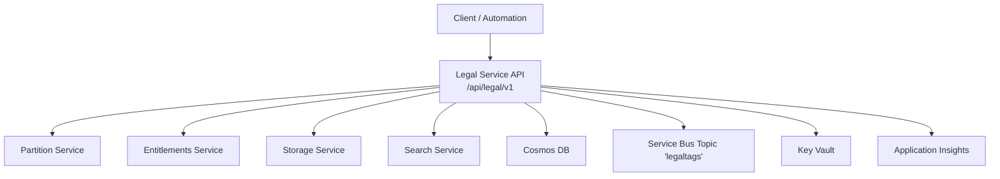
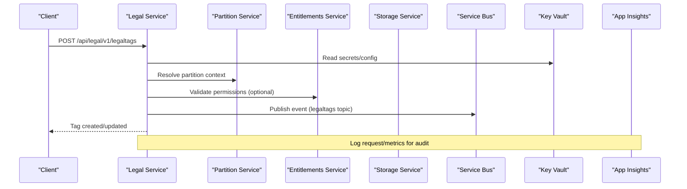
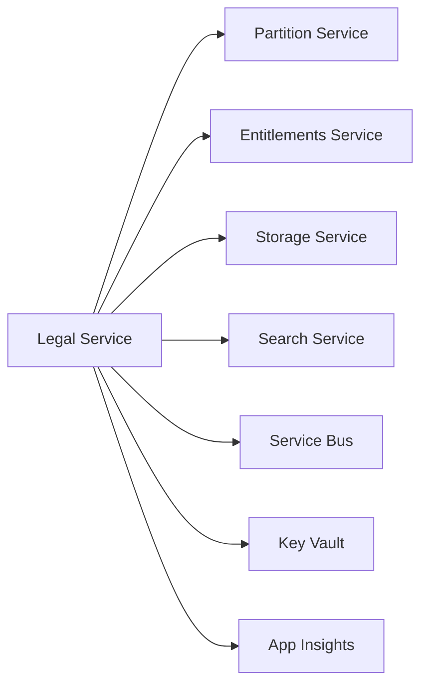

# Legal Compliance Framework

<cite>
**Referenced Files in This Document**
- [Legal_COO.json](file://Legal_COO.json)
- [Legal_COO.json (deploy)](file://bicep/modules/deploy-scripts/Legal_COO.json)
- [services_core_legal.md](file://docs/src/services_core_legal.md)
- [legal.yaml](file://software/applications/osdu-core/legal.yaml)
- [partition-init.yaml](file://charts/osdu-developer-init/templates/partition-init.yaml)
- [legal.http](file://tools/rest-scripts/legal.http)
- [check-record.http](file://tools/rest-scripts/check-record.http)
- [check-ingest.http](file://tools/rest-scripts/check-ingest.http)
- [generate_schemas.py](file://ofp-schema-deploy/generate_schemas.py)
- [ofp_wks_reference-data--SystemOfUnits_3.0.0.json](file://ofp-schema-deploy/schemas/ofp_wks_reference-data--SystemOfUnits_3.0.0.json)
- [ofp_wks_master-data--Standard_3.0.0.json](file://ofp-schema-deploy/schemas/ofp_wks_master-data--Standard_3.0.0.json)
- [services_overview.md](file://docs/src/services_overview.md)
</cite>

## Table of Contents
1. Introduction
2. Project Structure
3. Core Components
4. Architecture Overview
5. Detailed Component Analysis
6. Dependency Analysis
7. Performance Considerations
8. Troubleshooting Guide
9. Conclusion

## Introduction
This document explains the legal compliance framework for the OSDU platform with a focus on rights and obligations management, compliance tagging, policy enforcement, and auditability. It covers how to configure legal tags, define compliance rules via partitions and schemas, enforce data residency and licensing constraints through COO (Conditions of Use), and monitor compliance status across data partitions. It also provides practical examples using REST scripts and deployment artifacts included in this repository.

## Project Structure
The legal compliance capabilities are implemented across several layers:
- Legal Service: Exposes APIs for managing legal tags and metadata; integrated with partition and entitlement services.
- Partition Configuration: Declares compliance-related settings per partition (e.g., compliance-ruleset).
- Schema Definitions: Enforce required legal fields such as legaltags and otherRelevantDataCountries.
- COO Data: Country-level residency risk and exemptions used by compliance logic.
- Deployment Artifacts: Helm release and environment configuration for the Legal service.
- REST Scripts: Examples to create, update, query, and delete legal tags and to attach them to records.

**Diagram sources**
- [legal.yaml:39-124](file://software/applications/osdu-core/legal.yaml#L39-L124)
- [services_core_legal.md:14-37](file://docs/src/services_core_legal.md#L14-L37)

**Section sources**
- [legal.yaml:1-124](file://software/applications/osdu-core/legal.yaml#L1-L124)
- [services_core_legal.md:1-50](file://docs/src/services_core_legal.md#L1-L50)
- [services_overview.md:17-30](file://docs/src/services_overview.md#L17-L30)

## Core Components
- Legal Service: Manages legal tags and metadata; integrates with partition and entitlement services; persists configuration and events.
- Partition Service: Provides per-partition context including compliance rulesets that influence behavior.
- Schema Enforcement: System properties require legal metadata (legaltags, otherRelevantDataCountries) on records.
- COO (Conditions of Use): Country-based residency risk and exemptions guide data residency decisions.
- Audit and Observability: Application Insights and diagnostic logs enable monitoring and auditing.

Key configuration highlights:
- Legal service endpoints and environment variables are defined in the Helm release values.
- Partition initialization includes a compliance-ruleset property.
- Schemas enforce presence of legal fields on all records.

**Section sources**
- [legal.yaml:39-124](file://software/applications/osdu-core/legal.yaml#L39-L124)
- [partition-init.yaml:57-62](file://charts/osdu-developer-init/templates/partition-init.yaml#L57-L62)
- [generate_schemas.py:80-96](file://ofp-schema-deploy/generate_schemas.py#L80-L96)
- [ofp_wks_reference-data--SystemOfUnits_3.0.0.json:74-94](file://ofp-schema-deploy/schemas/ofp_wks_reference-data--SystemOfUnits_3.0.0.json#L74-L94)

## Architecture Overview
The compliance flow combines tag management, schema validation, and policy checks:
- Clients create or update legal tags via the Legal Service.
- Records must include required legal metadata enforced by schemas.
- Partition-level compliance rulesets influence processing and access.
- Country-based COO data informs residency restrictions.
- Events and changes can be published to Service Bus for downstream processing and auditing.
- Observability tools capture requests and metrics for audit trails.

**Diagram sources**
- [legal.http:67-89](file://tools/rest-scripts/legal.http#L67-L89)
- [legal.yaml:74-124](file://software/applications/osdu-core/legal.yaml#L74-L124)
- [services_core_legal.md:14-37](file://docs/src/services_core_legal.md#L14-L37)

## Detailed Component Analysis

### Legal Tags Management
- Create, read, update, and delete legal tags via the Legal Service REST API.
- Tags carry properties such as country of origin, contract identifiers, expiration dates, data type classifications, security classification, personal data indicators, and export classification.
- Example usage is provided in the REST script collection.

Operational notes:
- Authentication is handled via OAuth tokens.
- Requests must include the data-partition-id header to scope operations.
- The service exposes info and swagger endpoints for discovery.

**Section sources**
- [legal.http:33-120](file://tools/rest-scripts/legal.http#L33-L120)

### Record-Level Compliance Metadata
- All records must include a legal section with required fields: legaltags and otherRelevantDataCountries.
- Optional status field may be used to track lifecycle or review state.
- Schemas enforce these requirements at ingestion time.

Practical guidance:
- Ensure every record includes a valid legaltags array referencing existing tags.
- Populate otherRelevantDataCountries with relevant ISO codes to support residency checks.
- Use status to reflect compliance review outcomes when applicable.

**Section sources**
- [generate_schemas.py:80-96](file://ofp-schema-deploy/generate_schemas.py#L80-L96)
- [ofp_wks_reference-data--SystemOfUnits_3.0.0.json:74-94](file://ofp-schema-deploy/schemas/ofp_wks_reference-data--SystemOfUnits_3.0.0.json#L74-L94)

### Partition-Based Compliance Rulesets
- Partitions can declare a compliance-ruleset property that influences how legal policies are applied within that partition.
- Initialization templates demonstrate setting a shared ruleset for consistent policy application.

Configuration tips:
- Define the compliance-ruleset during partition setup to align with organizational policy.
- Combine with legal tags and record metadata to achieve fine-grained control.

**Section sources**
- [partition-init.yaml:57-62](file://charts/osdu-developer-init/templates/partition-init.yaml#L57-L62)

### COO (Conditions of Use) and Data Residency
- COO data defines country-level residency risk and exemptions for specific data types.
- The dataset includes standard country codes and risk categories, enabling automated residency checks.
- TypesNotApplyDataResidency indicates which data types bypass residency restrictions.

Usage patterns:
- Integrate COO data into policy engines to validate cross-border data movement.
- Use dataType from legal tags to determine applicability of residency rules.

**Section sources**
- [Legal_COO.json:1-800](file://Legal_COO.json#L1-L800)
- [Legal_COO.json (deploy):1-800](file://bicep/modules/deploy-scripts/Legal_COO.json#L1-L800)

### License and Regulatory Compliance Indicators
- Standards and reference data can include compliance flags to mark regulatory requirements.
- For example, standards may have a compliance_requirement flag to indicate mandatory adherence.

Integration approach:
- Link records to standards that carry compliance flags.
- Use search and indexing to surface records tied to compliance-critical standards.

**Section sources**
- [ofp_wks_master-data--Standard_3.0.0.json:104-146](file://ofp-schema-deploy/schemas/ofp_wks_master-data--Standard_3.0.0.json#L104-L146)

### Ingesting Records with Legal Metadata
- Sample ingestion payloads demonstrate attaching legal tags and countries to records.
- These examples show how to structure ACLs, legal metadata, and data sections for compliance.

Best practices:
- Always include legaltags and otherRelevantDataCountries in ingest payloads.
- Align dataType with COO exemptions where appropriate.
- Use workflows to automate validation and enrichment before storage.

**Section sources**
- [check-ingest.http:523-576](file://tools/rest-scripts/check-ingest.http#L523-L576)
- [check-record.http:55-70](file://tools/rest-scripts/check-record.http#L55-L70)

### Monitoring and Auditing
- The Legal service publishes telemetry to Application Insights and supports diagnostic logging.
- Environment variables configure observability and secure secret access.
- Use logs and metrics to audit tag changes, access patterns, and policy evaluations.

Operational steps:
- Enable HttpRequest and Audit logs for comprehensive visibility.
- Correlate events with Service Bus messages for end-to-end traceability.

**Section sources**
- [legal.yaml:74-124](file://software/applications/osdu-core/legal.yaml#L74-L124)
- [services_core_legal.md:14-37](file://docs/src/services_core_legal.md#L14-L37)

## Dependency Analysis
The Legal service depends on core platform services and infrastructure components to enforce compliance:
- Partition Service: Provides partition-scoped context and rulesets.
- Entitlements Service: Validates permissions for sensitive operations.
- Storage and Search Services: Persist and index records with legal metadata.
- Service Bus: Emits events for asynchronous processing and auditing.
- Key Vault: Secures secrets and configuration.
- Application Insights: Captures telemetry for monitoring and audits.

**Diagram sources**
- [legal.yaml:39-124](file://software/applications/osdu-core/legal.yaml#L39-L124)
- [services_core_legal.md:14-37](file://docs/src/services_core_legal.md#L14-L37)

**Section sources**
- [legal.yaml:39-124](file://software/applications/osdu-core/legal.yaml#L39-L124)
- [services_core_legal.md:14-37](file://docs/src/services_core_legal.md#L14-L37)

## Performance Considerations
- Minimize tag lookups by caching frequently accessed legal tag metadata where supported.
- Batch ingest records with consistent legal metadata to reduce validation overhead.
- Use partition-scoped operations to limit scope and improve performance.
- Monitor throughput and latency via Application Insights and adjust scaling accordingly.

[No sources needed since this section provides general guidance]

## Troubleshooting Guide
Common issues and resolutions:
- Missing legal fields: Ensure records include legaltags and otherRelevantDataCountries as enforced by schemas.
- Invalid tags: Verify that referenced legal tags exist and are active in the target partition.
- Residency violations: Cross-check COO data against record countries and data types to identify breaches.
- Permission errors: Confirm entitlements allow the requested operations on the specified partition.
- Observability gaps: Enable HttpRequest and Audit logs and verify Application Insights connectivity.

Validation steps:
- Use REST scripts to test tag creation, retrieval, updates, and deletion.
- Inspect partition configuration to ensure compliance-ruleset is set as intended.
- Review ingestion payloads to confirm legal metadata correctness.

**Section sources**
- [legal.http:67-120](file://tools/rest-scripts/legal.http#L67-L120)
- [partition-init.yaml:57-62](file://charts/osdu-developer-init/templates/partition-init.yaml#L57-L62)
- [generate_schemas.py:80-96](file://ofp-schema-deploy/generate_schemas.py#L80-L96)

## Conclusion
The OSDU platform’s legal compliance framework centers on robust legal tag management, schema-enforced metadata, partition-scoped rulesets, and COO-driven residency controls. By configuring legal tags, embedding compliance metadata in records, and leveraging partition and COO data, organizations can enforce licensing and regulatory requirements consistently across partitions. Observability and auditing capabilities provide the transparency needed to maintain compliance over time. Use the included REST scripts and deployment artifacts to implement and validate compliance workflows effectively.

[No sources needed since this section summarizes without analyzing specific files]