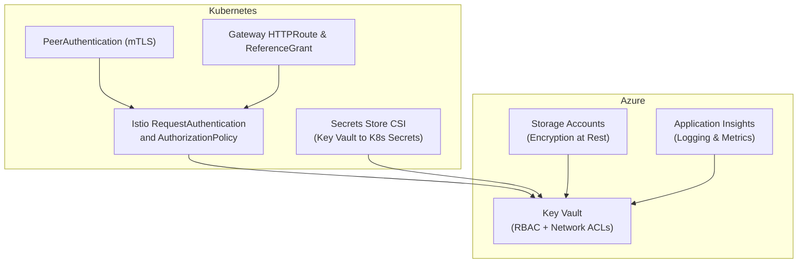
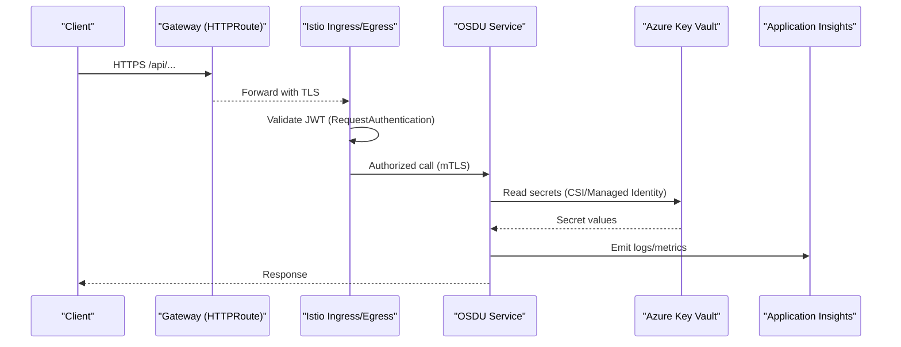
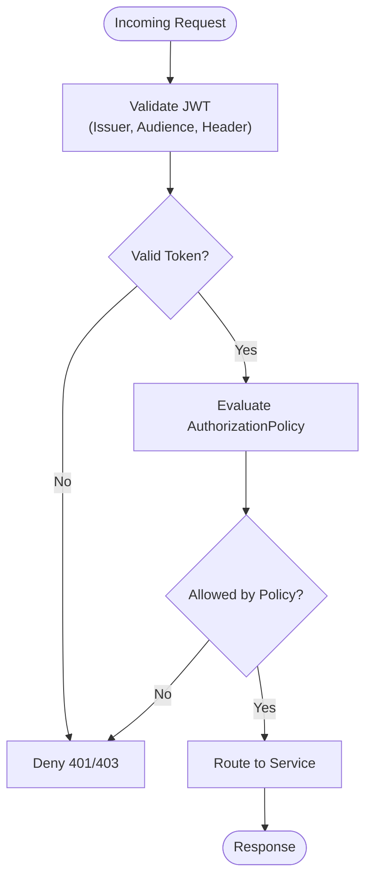
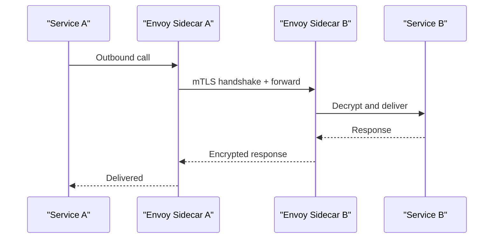
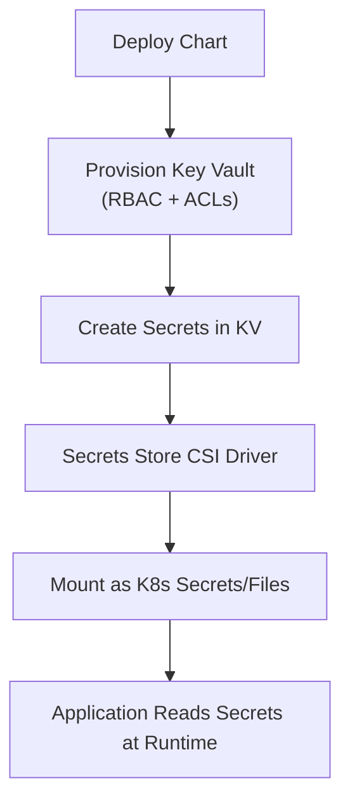
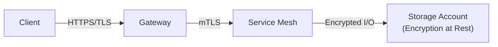
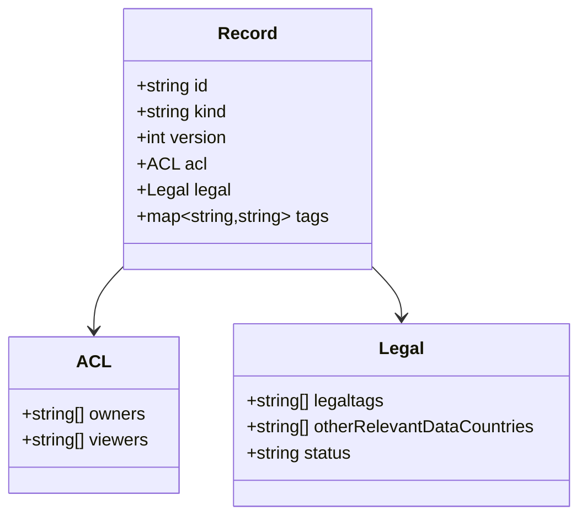
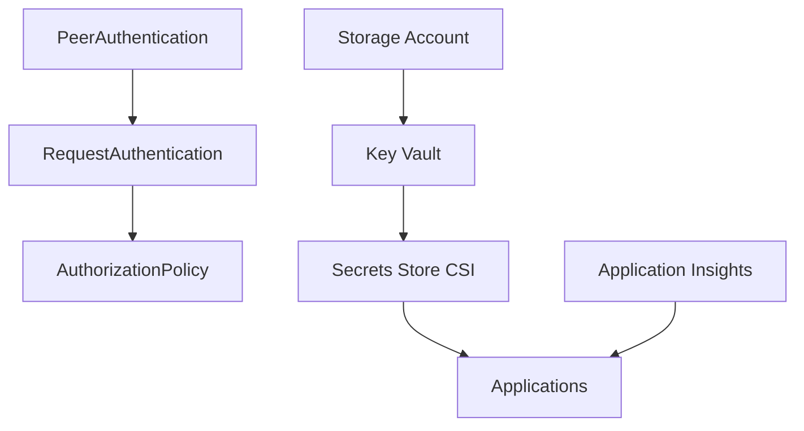

# Security and Compliance

<cite>
**Referenced Files in This Document**
- [SECURITY.md](file://SECURITY.md)
- [COMPLIANCE_FIX_SUMMARY.md](file://COMPLIANCE_FIX_SUMMARY.md)
- [request-authentication.yaml](file://charts/osdu-developer-base/templates/request-authentication.yaml)
- [auth-policy.yaml](file://charts/osdu-developer-service/templates/auth-policy.yaml)
- [peer-authentication.yaml](file://charts/osdu-developer-base/templates/peer-authentication.yaml)
- [http-route.yaml](file://charts/osdu-developer-auth/templates/http-route.yaml)
- [reference-grant.yaml](file://charts/osdu-developer-auth/templates/reference-grant.yaml)
- [deployment.yaml](file://charts/osdu-developer-auth/templates/deployment.yaml)
- [kv-secret.yaml](file://charts/osdu-developer-service/templates/kv-secret.yaml)
- [values.yaml](file://charts/keyvault-secrets/values.yaml)
- [main.bicep](file://bicep/main.bicep)
- [keyvault_secrets.bicep](file://bicep/modules/keyvault_secrets.bicep)
- [services_core_legal.md](file://docs/src/services_core_legal.md)
- [Application_Insights.md](file://src/Application_Insights.md)
- [Legal_COO.json](file://Legal_COO.json)
</cite>

## Table of Contents
1. Introduction
2. Project Structure
3. Core Components
4. Architecture Overview
5. Detailed Component Analysis
6. Dependency Analysis
7. Performance Considerations
8. Troubleshooting Guide
9. Conclusion

## Introduction
This document provides comprehensive security and compliance guidance for the OSDU platform deployment as implemented in this repository. It covers authentication and authorization (OAuth2/OpenID Connect via Azure AD, Istio-based request authentication and authorization policies), service-to-service communication with mTLS, data protection (encryption at rest and in transit), secrets management using Azure Key Vault, legal and rights obligations metadata, audit logging and observability, vulnerability management processes, and compliance monitoring approaches.

## Project Structure
Security-relevant configuration is primarily defined in:
- Kubernetes manifests and Helm charts under charts/ for identity, mesh security, and secret provisioning
- Infrastructure-as-code under bicep/ for Azure resources including Key Vault, Application Insights, and storage encryption settings
- Documentation and scripts under docs/ and src/ for local development and observability setup
- Legal and compliance metadata schemas under ofp-schema-deploy/schemas/ and a country risk dataset in Legal_COO.json

**Diagram sources**
- [request-authentication.yaml:1-33](file://charts/osdu-developer-base/templates/request-authentication.yaml#L1-L33)
- [auth-policy.yaml:1-29](file://charts/osdu-developer-service/templates/auth-policy.yaml#L1-L29)
- [peer-authentication.yaml:1-7](file://charts/osdu-developer-base/templates/peer-authentication.yaml#L1-L7)
- [http-route.yaml:1-36](file://charts/osdu-developer-auth/templates/http-route.yaml#L1-L36)
- [reference-grant.yaml:1-33](file://charts/osdu-developer-auth/templates/reference-grant.yaml#L1-L33)
- [kv-secret.yaml:1-36](file://charts/osdu-developer-service/templates/kv-secret.yaml#L1-L36)
- [main.bicep:599-661](file://bicep/main.bicep#L599-L661)
- [keyvault_secrets.bicep:1-97](file://bicep/modules/keyvault_secrets.bicep#L1-L97)

**Section sources**
- [request-authentication.yaml:1-33](file://charts/osdu-developer-base/templates/request-authentication.yaml#L1-L33)
- [auth-policy.yaml:1-29](file://charts/osdu-developer-service/templates/auth-policy.yaml#L1-L29)
- [peer-authentication.yaml:1-7](file://charts/osdu-developer-base/templates/peer-authentication.yaml#L1-L7)
- [http-route.yaml:1-36](file://charts/osdu-developer-auth/templates/http-route.yaml#L1-L36)
- [reference-grant.yaml:1-33](file://charts/osdu-developer-auth/templates/reference-grant.yaml#L1-L33)
- [kv-secret.yaml:1-36](file://charts/osdu-developer-service/templates/kv-secret.yaml#L1-L36)
- [main.bicep:599-661](file://bicep/main.bicep#L599-L661)
- [keyvault_secrets.bicep:1-97](file://bicep/modules/keyvault_secrets.bicep#L1-L97)

## Core Components
- Identity and Access Management
  - JWT validation against Azure AD via Istio RequestAuthentication
  - Per-service AuthorizationPolicy to deny requests without valid principals except whitelisted paths
  - Gateway routing and reference grants for auth endpoints
- Service Mesh Security
  - PeerAuthentication set to PERMISSIVE mode for mTLS between services
- Secrets Management
  - Azure Key Vault provisioned with RBAC and network ACLs
  - Secrets injected into pods via Secrets Store CSI driver
- Data Protection
  - Storage accounts configured with encryption at rest, optionally using customer-managed keys from Key Vault
  - In-transit encryption enforced by TLS at ingress/mesh
- Observability and Audit Logging
  - Application Insights integrated for metrics and logs
  - Key Vault diagnostic settings to Log Analytics workspace
- Legal and Compliance Metadata
  - Schema fields for ACL and legal tags/countries/status
  - Country residency risk dataset used by legal workflows

**Section sources**
- [request-authentication.yaml:1-33](file://charts/osdu-developer-base/templates/request-authentication.yaml#L1-L33)
- [auth-policy.yaml:1-29](file://charts/osdu-developer-service/templates/auth-policy.yaml#L1-L29)
- [peer-authentication.yaml:1-7](file://charts/osdu-developer-base/templates/peer-authentication.yaml#L1-L7)
- [kv-secret.yaml:1-36](file://charts/osdu-developer-service/templates/kv-secret.yaml#L1-L36)
- [main.bicep:599-661](file://bicep/main.bicep#L599-L661)
- [keyvault_secrets.bicep:1-97](file://bicep/modules/keyvault_secrets.bicep#L1-L97)
- [Application_Insights.md:1-71](file://src/Application_Insights.md#L1-L71)
- [Legal_COO.json:1-800](file://Legal_COO.json#L1-L800)

## Architecture Overview
The platform enforces zero-trust networking within the cluster using Istio, validates user tokens at the edge, and restricts service access via fine-grained policies. Secrets are never stored in code; they are provisioned into Key Vault and mounted securely into workloads. Data at rest is encrypted, and all traffic is secured in transit.

**Diagram sources**
- [http-route.yaml:1-36](file://charts/osdu-developer-auth/templates/http-route.yaml#L1-L36)
- [request-authentication.yaml:1-33](file://charts/osdu-developer-base/templates/request-authentication.yaml#L1-L33)
- [peer-authentication.yaml:1-7](file://charts/osdu-developer-base/templates/peer-authentication.yaml#L1-L7)
- [kv-secret.yaml:1-36](file://charts/osdu-developer-service/templates/kv-secret.yaml#L1-L36)
- [Application_Insights.md:1-71](file://src/Application_Insights.md#L1-L71)

## Detailed Component Analysis

### Authentication and Authorization (OAuth2/OpenID Connect and Istio)
- RequestAuthentication defines JWT issuers for Azure AD, audiences, token extraction from Authorization header, and payload forwarding to downstream services.
- AuthorizationPolicy denies requests lacking a valid principal unless explicitly allowed via path exemptions per service.
- Gateway routes expose auth-related endpoints and use ReferenceGrants to allow cross-namespace routing to backend services.

**Diagram sources**
- [request-authentication.yaml:1-33](file://charts/osdu-developer-base/templates/request-authentication.yaml#L1-L33)
- [auth-policy.yaml:1-29](file://charts/osdu-developer-service/templates/auth-policy.yaml#L1-L29)
- [http-route.yaml:1-36](file://charts/osdu-developer-auth/templates/http-route.yaml#L1-L36)
- [reference-grant.yaml:1-33](file://charts/osdu-developer-auth/templates/reference-grant.yaml#L1-L33)

**Section sources**
- [request-authentication.yaml:1-33](file://charts/osdu-developer-base/templates/request-authentication.yaml#L1-L33)
- [auth-policy.yaml:1-29](file://charts/osdu-developer-service/templates/auth-policy.yaml#L1-L29)
- [http-route.yaml:1-36](file://charts/osdu-developer-auth/templates/http-route.yaml#L1-L36)
- [reference-grant.yaml:1-33](file://charts/osdu-developer-auth/templates/reference-grant.yaml#L1-L33)

### Service-to-Service Authentication (mTLS)
- PeerAuthentication enables mTLS in PERMISSIVE mode to ensure secure service-to-service communication while allowing gradual rollout.
- Requests between sidecars are encrypted and authenticated via certificates managed by the mesh.

**Diagram sources**
- [peer-authentication.yaml:1-7](file://charts/osdu-developer-base/templates/peer-authentication.yaml#L1-L7)

**Section sources**
- [peer-authentication.yaml:1-7](file://charts/osdu-developer-base/templates/peer-authentication.yaml#L1-L7)

### Secrets Management with Azure Key Vault
- Key Vault is provisioned with RBAC-enabled access and network ACLs restricting access to specific IPs.
- Secrets are created programmatically and referenced by services through the Secrets Store CSI driver, which mounts them as Kubernetes secrets or files.
- Values.yaml defines mappings between Kubernetes secret keys and Key Vault secret names for each service.

**Diagram sources**
- [main.bicep:599-661](file://bicep/main.bicep#L599-L661)
- [keyvault_secrets.bicep:1-97](file://bicep/modules/keyvault_secrets.bicep#L1-L97)
- [kv-secret.yaml:1-36](file://charts/osdu-developer-service/templates/kv-secret.yaml#L1-L36)
- [values.yaml:1-11](file://charts/keyvault-secrets/values.yaml#L1-L11)

**Section sources**
- [main.bicep:599-661](file://bicep/main.bicep#L599-L661)
- [keyvault_secrets.bicep:1-97](file://bicep/modules/keyvault_secrets.bicep#L1-L97)
- [kv-secret.yaml:1-36](file://charts/osdu-developer-service/templates/kv-secret.yaml#L1-L36)
- [values.yaml:1-11](file://charts/keyvault-secrets/values.yaml#L1-L11)

### Data Protection (Encryption at Rest and In Transit)
- Storage accounts are configured with encryption enabled and can integrate with Key Vault for customer-managed keys.
- All external traffic is terminated over TLS at the gateway; internal traffic uses mTLS.

**Diagram sources**
- [peer-authentication.yaml:1-7](file://charts/osdu-developer-base/templates/peer-authentication.yaml#L1-L7)
- [main.bicep:599-661](file://bicep/main.bicep#L599-L661)

**Section sources**
- [peer-authentication.yaml:1-7](file://charts/osdu-developer-base/templates/peer-authentication.yaml#L1-L7)
- [main.bicep:599-661](file://bicep/main.bicep#L599-L661)

### Legal Compliance, Rights and Obligations, and Audit Logging
- Legal metadata fields (legaltags, otherRelevantDataCountries, status) are part of record schemas to enforce data governance.
- Country residency risk dataset supports compliance decisions based on jurisdiction.
- Application Insights integration provides telemetry and logs; Key Vault diagnostics send logs to Log Analytics.

**Diagram sources**
- [Legal_COO.json:1-800](file://Legal_COO.json#L1-L800)

**Section sources**
- [services_core_legal.md:1-50](file://docs/src/services_core_legal.md#L1-L50)
- [Application_Insights.md:1-71](file://src/Application_Insights.md#L1-L71)
- [Legal_COO.json:1-800](file://Legal_COO.json#L1-L800)

### Vulnerability Management and Compliance Monitoring
- Security issue reporting follows Microsoft’s coordinated disclosure process.
- Deployment templates include strict parameter validation to prevent non-compliant configurations.

**Section sources**
- [SECURITY.md:1-42](file://SECURITY.md#L1-L42)
- [COMPLIANCE_FIX_SUMMARY.md:1-47](file://COMPLIANCE_FIX_SUMMARY.md#L1-L47)

## Dependency Analysis
- Istio components depend on correct JWT issuer and audience configuration to validate tokens.
- Services depend on Key Vault for secrets; CSI driver depends on proper RBAC and network ACLs.
- Storage encryption depends on Key Vault integration for CMK scenarios.
- Observability depends on Application Insights instrumentation and connection strings stored securely.

**Diagram sources**
- [request-authentication.yaml:1-33](file://charts/osdu-developer-base/templates/request-authentication.yaml#L1-L33)
- [auth-policy.yaml:1-29](file://charts/osdu-developer-service/templates/auth-policy.yaml#L1-L29)
- [peer-authentication.yaml:1-7](file://charts/osdu-developer-base/templates/peer-authentication.yaml#L1-L7)
- [kv-secret.yaml:1-36](file://charts/osdu-developer-service/templates/kv-secret.yaml#L1-L36)
- [main.bicep:599-661](file://bicep/main.bicep#L599-L661)

**Section sources**
- [request-authentication.yaml:1-33](file://charts/osdu-developer-base/templates/request-authentication.yaml#L1-L33)
- [auth-policy.yaml:1-29](file://charts/osdu-developer-service/templates/auth-policy.yaml#L1-L29)
- [peer-authentication.yaml:1-7](file://charts/osdu-developer-base/templates/peer-authentication.yaml#L1-L7)
- [kv-secret.yaml:1-36](file://charts/osdu-developer-service/templates/kv-secret.yaml#L1-L36)
- [main.bicep:599-661](file://bicep/main.bicep#L599-L661)

## Performance Considerations
- Use minimal path exemptions in AuthorizationPolicy to reduce evaluation overhead.
- Prefer least-privilege RBAC roles for Key Vault access to minimize token scope and latency.
- Enable selective diagnostic settings to avoid excessive log volume impacting performance.
- Monitor mesh traffic with Kiali and adjust mTLS modes during rollouts to balance security and compatibility.

[No sources needed since this section provides general guidance]

## Troubleshooting Guide
- Authentication failures: Verify JWT issuer, audience, and Authorization header prefix in RequestAuthentication.
- Denied requests: Review per-service AuthorizationPolicy rules and path exemptions.
- Secret mount errors: Confirm CSI parameters, Key Vault RBAC, and network ACLs allow access from the cluster.
- Local development issues: Ensure Application Insights agent is correctly configured when running services locally.

**Section sources**
- [request-authentication.yaml:1-33](file://charts/osdu-developer-base/templates/request-authentication.yaml#L1-L33)
- [auth-policy.yaml:1-29](file://charts/osdu-developer-service/templates/auth-policy.yaml#L1-L29)
- [kv-secret.yaml:1-36](file://charts/osdu-developer-service/templates/kv-secret.yaml#L1-L36)
- [Application_Insights.md:1-71](file://src/Application_Insights.md#L1-L71)

## Conclusion
This deployment implements a robust security posture for OSDU using industry-standard practices: OAuth2/OpenID Connect with Azure AD, Istio-based request authentication and authorization, mTLS for service-to-service communication, encryption at rest and in transit, centralized secrets management with Azure Key Vault, and comprehensive observability and legal compliance metadata. Adhering to the documented configurations and best practices ensures a secure, compliant, and auditable platform.

[No sources needed since this section summarizes without analyzing specific files]