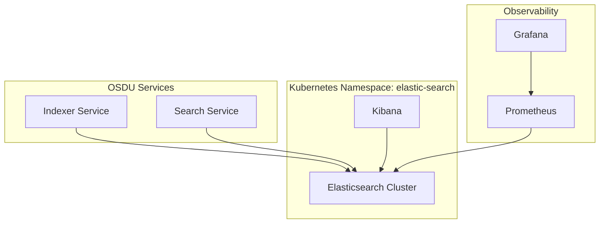
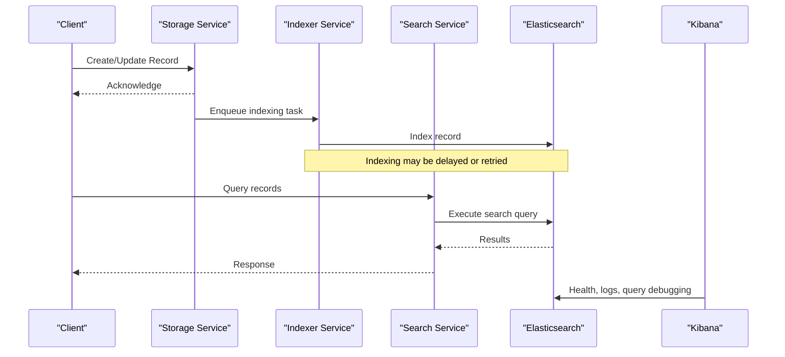
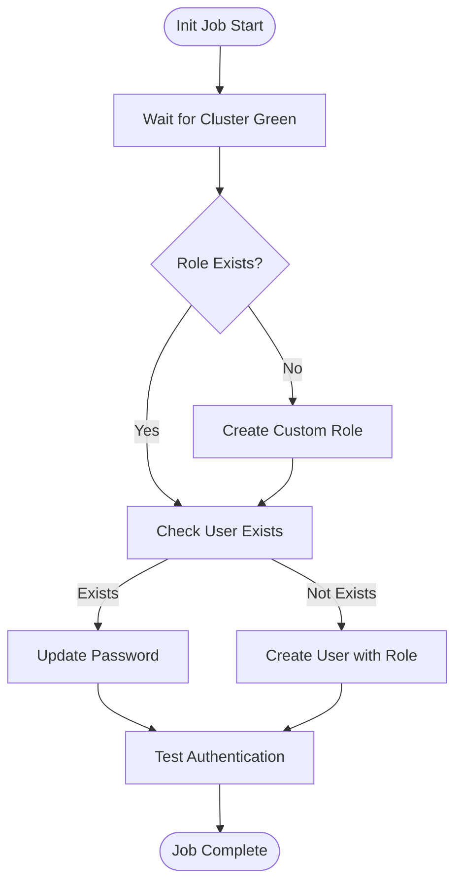
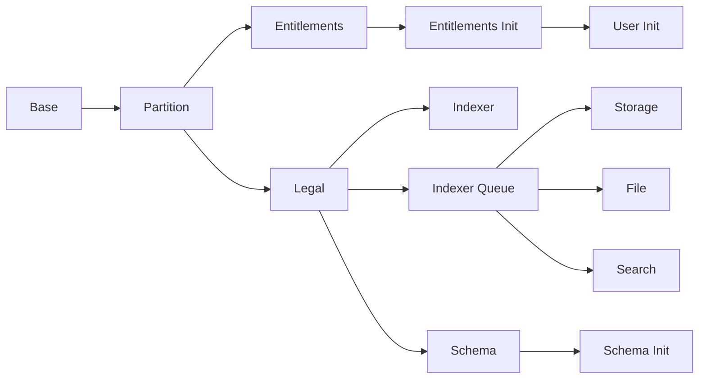

# Data and Search Debugging

<cite>
**Referenced Files in This Document**
- [elastic-search.yaml](file://software/components/elastic-search/elastic-search.yaml)
- [kibana.yaml](file://software/components/elastic-search/kibana.yaml)
- [elastic-job.yaml](file://software/components/elastic-search/elastic-job.yaml)
- [elastic-init.yaml](file://charts/osdu-developer-init/templates/elastic-init.yaml)
- [services_core_search.md](file://docs/src/services_core_search.md)
- [services_core_indexer.md](file://docs/src/services_core_indexer.md)
- [check-record.http](file://tools/rest-scripts/check-record.http)
- [check-ingest.http](file://tools/rest-scripts/check-ingest.http)
- [README.md (osdu-core)](file://software/applications/osdu-core/README.md)
- [grafana.yaml](file://software/components/observability/grafana.yaml)
</cite>

## Table of Contents
1. Introduction
2. Project Structure
3. Core Components
4. Architecture Overview
5. Detailed Component Analysis
6. Dependency Analysis
7. Performance Considerations
8. Troubleshooting Guide
9. Conclusion
10. Appendices

## Introduction
This document provides a comprehensive guide for diagnosing Elasticsearch-based data operations in the OSDU platform. It focuses on search query performance, indexing behavior, and data consistency issues. It also includes guidance for using Kibana for log analysis, query optimization, and cluster health monitoring, along with troubleshooting steps for common search-related problems such as slow queries, index corruption, shard allocation issues, and ingestion failures.

## Project Structure
The OSDU deployment provisions an Elasticsearch cluster and Kibana via Kubernetes manifests, initializes security roles and users through a Job, and exposes REST endpoints for storage, search, and related services. The indexer and search services integrate with Elasticsearch to index and retrieve records. Observability is provided by Prometheus and Grafana for metrics visualization.

**Diagram sources**
- [elastic-search.yaml:1-89](file://software/components/elastic-search/elastic-search.yaml#L1-L89)
- [kibana.yaml:1-49](file://software/components/elastic-search/kibana.yaml#L1-L49)
- [grafana.yaml:363-732](file://software/components/observability/grafana.yaml#L363-L732)

**Section sources**
- [elastic-search.yaml:1-89](file://software/components/elastic-search/elastic-search.yaml#L1-L89)
- [kibana.yaml:1-49](file://software/components/elastic-search/kibana.yaml#L1-L49)
- [README.md (osdu-core):1-33](file://software/applications/osdu-core/README.md#L1-L33)

## Core Components
- Elasticsearch cluster: Configured with node roles, resource limits, and zone-awareness for resilience.
- Kibana: Deployed with references to the Elasticsearch service and environment variables for secure access.
- Initialization Job: Waits for cluster readiness and creates a custom role and user for OSDU services.
- Indexer and Search services: Consume Elasticsearch for indexing and querying; configured with endpoints and logging levels.
- Observability: Prometheus scrapes metrics; Grafana dashboards visualize performance and availability.

**Section sources**
- [elastic-search.yaml:1-89](file://software/components/elastic-search/elastic-search.yaml#L1-L89)
- [kibana.yaml:1-49](file://software/components/elastic-search/kibana.yaml#L1-L49)
- [elastic-init.yaml:1-176](file://charts/osdu-developer-init/templates/elastic-init.yaml#L1-L176)
- [services_core_search.md:1-38](file://docs/src/services_core_search.md#L1-L38)
- [services_core_indexer.md:1-31](file://docs/src/services_core_indexer.md#L1-L31)
- [grafana.yaml:363-732](file://software/components/observability/grafana.yaml#L363-L732)

## Architecture Overview
The data flow involves ingestion into Storage, asynchronous indexing via the Indexer, and retrieval through the Search service against Elasticsearch. Kibana connects directly to Elasticsearch for diagnostics. Observability tools collect metrics from the cluster and services.

**Diagram sources**
- [README.md (osdu-core):1-33](file://software/applications/osdu-core/README.md#L1-L33)
- [elastic-search.yaml:1-89](file://software/components/elastic-search/elastic-search.yaml#L1-L89)
- [kibana.yaml:1-49](file://software/components/elastic-search/kibana.yaml#L1-L49)

## Detailed Component Analysis

### Elasticsearch Cluster Configuration
- Node roles include master, data, and ingest to support both coordination and processing workloads.
- Resource requests and limits are set to balance performance and stability.
- Zone awareness and topology spread constraints improve resilience across availability zones.
- TLS is disabled for HTTP in this configuration; ensure network-level security controls are applied.

Operational implications:
- Monitor JVM heap settings and memory pressure.
- Validate that nodes are scheduled across zones per constraints.
- Use cluster health checks during initialization and ongoing operations.

**Section sources**
- [elastic-search.yaml:1-89](file://software/components/elastic-search/elastic-search.yaml#L1-L89)

### Kibana Deployment
- Kibana references the Elasticsearch service endpoint and uses secrets for encryption keys.
- Count and pod template define high availability and scheduling preferences.

Operational implications:
- Verify connectivity between Kibana and Elasticsearch.
- Ensure credentials and encryption keys are correctly provisioned.
- Use Kibana Dev Tools and Logs UI for query and log diagnostics.

**Section sources**
- [kibana.yaml:1-49](file://software/components/elastic-search/kibana.yaml#L1-L49)

### Initialization Job for Elasticsearch Security
- Waits for cluster health before proceeding.
- Creates a custom role and user, updates passwords if needed, and validates authentication.

Operational implications:
- Confirm the job completes successfully; failures indicate misconfiguration or cluster unavailability.
- Review logs for HTTP status codes returned by Elasticsearch security APIs.

**Diagram sources**
- [elastic-init.yaml:1-176](file://charts/osdu-developer-init/templates/elastic-init.yaml#L1-L176)

**Section sources**
- [elastic-init.yaml:1-176](file://charts/osdu-developer-init/templates/elastic-init.yaml#L1-L176)

### Indexer and Search Services
- Indexer integrates with Storage and Schema services; configured with endpoints and logging level.
- Search service runs locally with specific modules and can enable detailed logging for diagnostics.

Operational implications:
- Adjust logging levels to capture request/response details when diagnosing issues.
- Validate endpoints and authentication configurations.

**Section sources**
- [services_core_indexer.md:1-31](file://docs/src/services_core_indexer.md#L1-L31)
- [services_core_search.md:1-38](file://docs/src/services_core_search.md#L1-L38)

### REST Scripts for Validation
- Scripts demonstrate OAuth flows, legal tag management, schema retrieval, storage record operations, and search queries.
- Useful for reproducing issues and validating end-to-end flows.

Operational implications:
- Use scripts to create test records and run targeted searches to isolate problems.
- Capture responses and errors for deeper analysis in Kibana or logs.

**Section sources**
- [check-record.http:1-198](file://tools/rest-scripts/check-record.http#L1-L198)
- [check-ingest.http:1-800](file://tools/rest-scripts/check-ingest.http#L1-L800)

## Dependency Analysis
The installation sequence shows dependencies among core components: partition, entitlements, legal, indexer, indexer-queue, schema, storage, file, and search. The search service depends on Elasticsearch indirectly through the indexer and direct query paths.

**Diagram sources**
- [README.md (osdu-core):1-33](file://software/applications/osdu-core/README.md#L1-L33)

**Section sources**
- [README.md (osdu-core):1-33](file://software/applications/osdu-core/README.md#L1-L33)

## Performance Considerations
- Elasticsearch JVM heap and memory limits should align with workload demands; monitor GC and memory usage.
- Zone-awareness and topology spread constraints help distribute load and reduce hotspots.
- Enable appropriate logging levels in Indexer and Search services to capture performance bottlenecks.
- Use Kibana Dev Tools to analyze query plans and identify inefficient patterns.
- Leverage Prometheus and Grafana to track request latencies, error rates, and throughput.

[No sources needed since this section provides general guidance]

## Troubleshooting Guide

### Slow Queries
Symptoms:
- High latency in search responses.
- Elevated CPU or memory usage on Elasticsearch nodes.

Steps:
- Use Kibana Dev Tools to run the same query and inspect profiling information.
- Check for full scans, wildcard patterns, or complex aggregations.
- Validate index mappings and consider adding appropriate field types or filters.
- Review Search service logs for query composition and parameters.

Tools:
- Kibana Dev Tools for query execution and profiling.
- Search service logs with DEBUG level enabled.

**Section sources**
- [services_core_search.md:1-38](file://docs/src/services_core_search.md#L1-L38)
- [kibana.yaml:1-49](file://software/components/elastic-search/kibana.yaml#L1-L49)

### Indexing Problems
Symptoms:
- Records not appearing in search results.
- Delays between storage updates and searchable state.

Steps:
- Verify indexer queue processing and retries.
- Check Elasticsearch cluster health and node status.
- Inspect indexer logs for mapping errors or validation failures.
- Use REST scripts to create a test record and confirm indexing path.

Tools:
- Indexer logs and queue status.
- Elasticsearch cluster health API.
- REST scripts for end-to-end validation.

**Section sources**
- [services_core_indexer.md:1-31](file://docs/src/services_core_indexer.md#L1-L31)
- [check-record.http:1-198](file://tools/rest-scripts/check-record.http#L1-L198)

### Data Consistency Issues
Symptoms:
- Discrepancies between stored records and search results.
- Inconsistent counts or missing fields after updates.

Steps:
- Compare Storage record retrieval with Search results for the same ID.
- Re-run indexing tasks if necessary and verify completion.
- Check for partial updates or version conflicts.
- Validate legal tags and ACLs affecting visibility.

Tools:
- Storage and Search REST endpoints.
- Kibana to inspect indexed documents.

**Section sources**
- [check-record.http:1-198](file://tools/rest-scripts/check-record.http#L1-L198)

### Index Corruption
Symptoms:
- Shard red or yellow status.
- Errors when accessing indices.

Steps:
- Inspect cluster health and shard allocation.
- Attempt shard reroute or reindex if corruption is suspected.
- Review Elasticsearch logs for I/O or segment errors.
- Consider restoring from backups if available.

Tools:
- Elasticsearch cluster health and shard APIs.
- Elasticsearch logs.

**Section sources**
- [elastic-search.yaml:1-89](file://software/components/elastic-search/elastic-search.yaml#L1-L89)

### Shard Allocation Problems
Symptoms:
- Unassigned shards.
- Nodes overloaded or under-resourced.

Steps:
- Check node resources and disk usage.
- Validate zone affinity and topology spread constraints.
- Investigate allocation decisions and reroute if necessary.
- Scale nodes or adjust resource limits based on observed load.

Tools:
- Elasticsearch allocation APIs.
- Kubernetes events and node metrics.

**Section sources**
- [elastic-search.yaml:1-89](file://software/components/elastic-search/elastic-search.yaml#L1-L89)

### Data Ingestion Failures
Symptoms:
- Workflow runs failing or stalling.
- Missing records after ingestion attempts.

Steps:
- Use REST scripts to trigger workflows and observe outcomes.
- Check workflow logs and queue status.
- Validate input payloads and schema compliance.
- Inspect Elasticsearch for successful indexing post-processing.

Tools:
- REST scripts for workflow invocation.
- Indexer and workflow logs.

**Section sources**
- [check-ingest.http:1-800](file://tools/rest-scripts/check-ingest.http#L1-L800)

### Using Kibana for Log Analysis and Monitoring
- Access Kibana to view application logs, including Search and Indexer services.
- Use Discover to filter logs by time range, service name, and severity.
- Create visualizations for error rates, latency percentiles, and throughput.
- Employ Saved Objects and Dashboards to standardize monitoring views.

**Section sources**
- [kibana.yaml:1-49](file://software/components/elastic-search/kibana.yaml#L1-L49)

### Analyzing Search Performance Metrics
- Use Prometheus to scrape service metrics and Elasticsearch metrics where applicable.
- Configure Grafana dashboards to visualize P95/P99 latencies, success rates, and error rates.
- Correlate spikes in latency with query complexity or cluster load.

**Section sources**
- [grafana.yaml:363-732](file://software/components/observability/grafana.yaml#L363-L732)

## Conclusion
Effective debugging of Elasticsearch-based data operations in OSDU requires a combination of cluster health checks, service-level logging, query profiling in Kibana, and observability via Prometheus and Grafana. By following the procedures outlined here—validating initialization, inspecting indexing pipelines, optimizing queries, and addressing shard and ingestion issues—you can diagnose and resolve performance and consistency problems efficiently.

[No sources needed since this section summarizes without analyzing specific files]

## Appendices

### Quick Reference: Common Commands and Checks
- Cluster health: Use Elasticsearch cluster health API to verify green/yellow/red status.
- Shard allocation: Inspect shard allocation decisions and node resources.
- Query profiling: Run queries in Kibana Dev Tools and review profiling output.
- Service logs: Set Search/Indexer logging to DEBUG for detailed traces.
- End-to-end validation: Use REST scripts to create records and execute searches.

[No sources needed since this section provides general guidance]