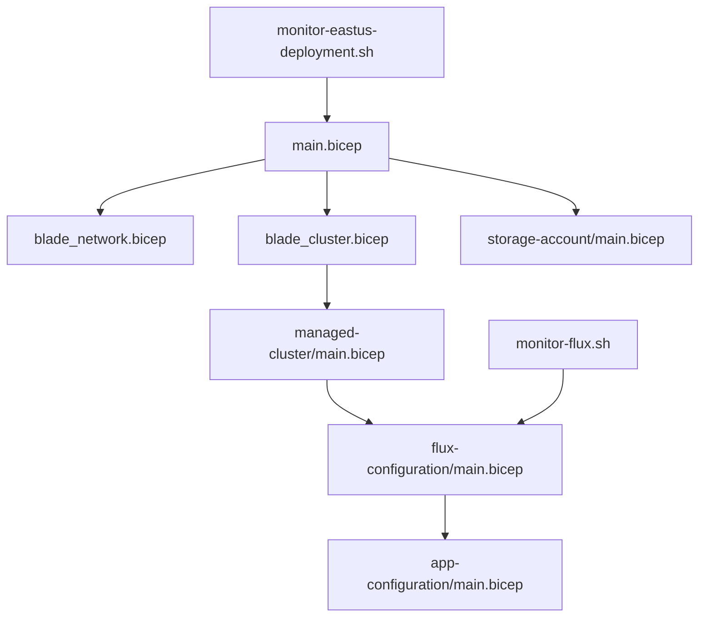
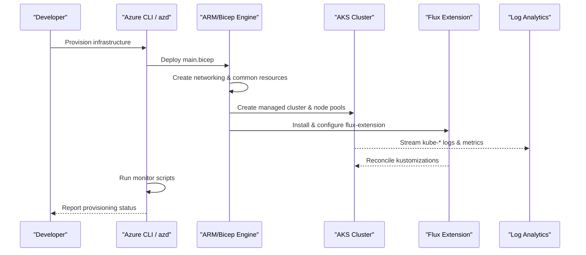
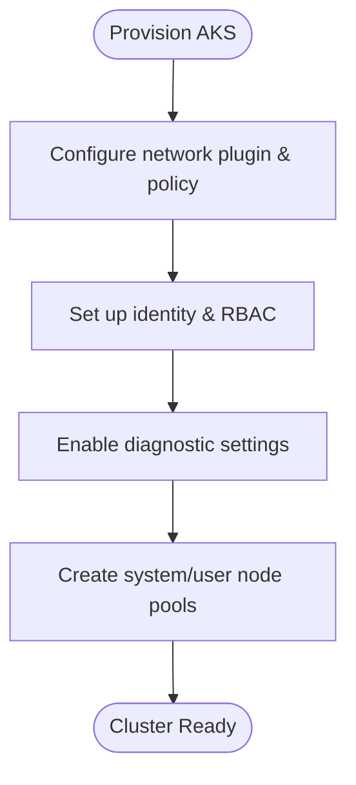
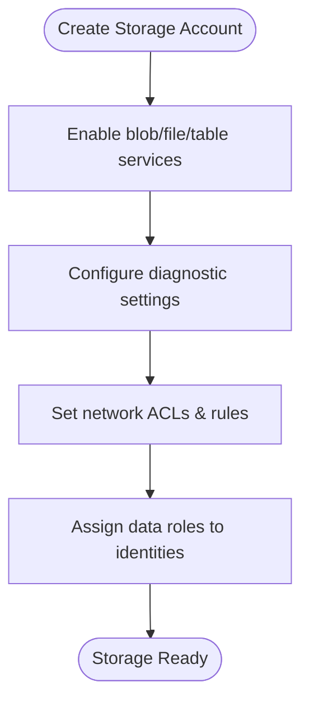
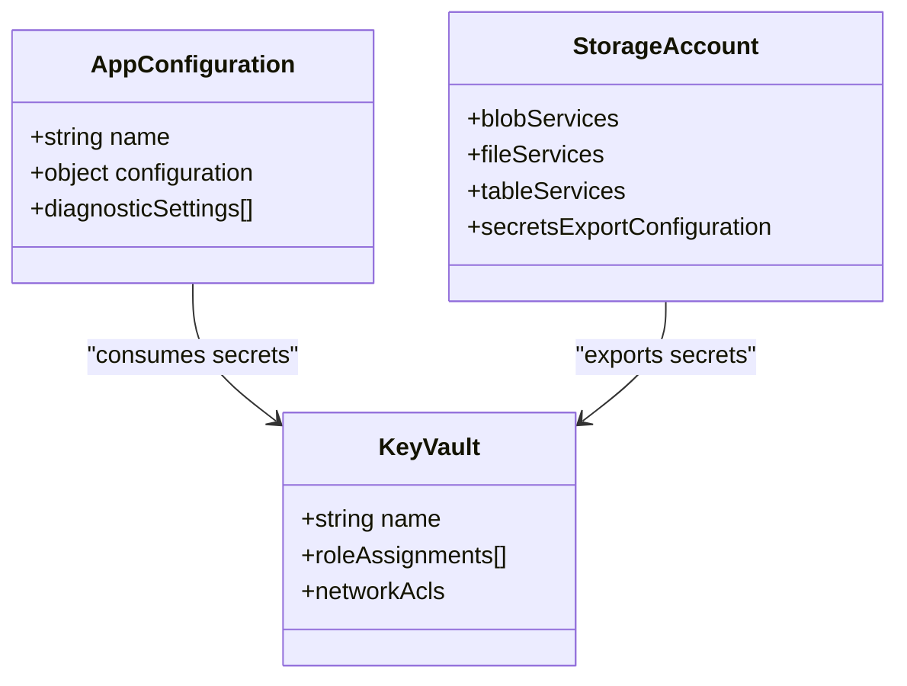
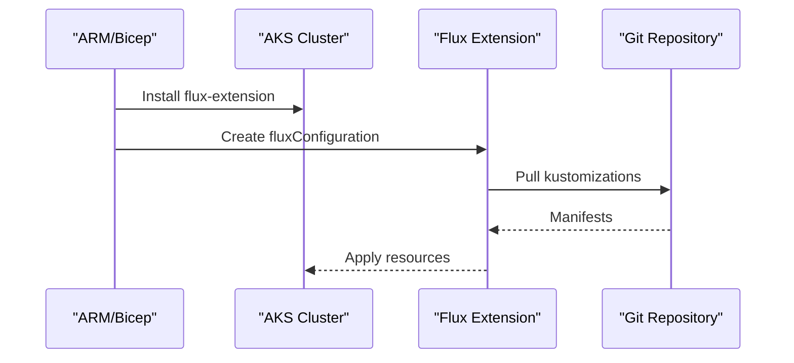
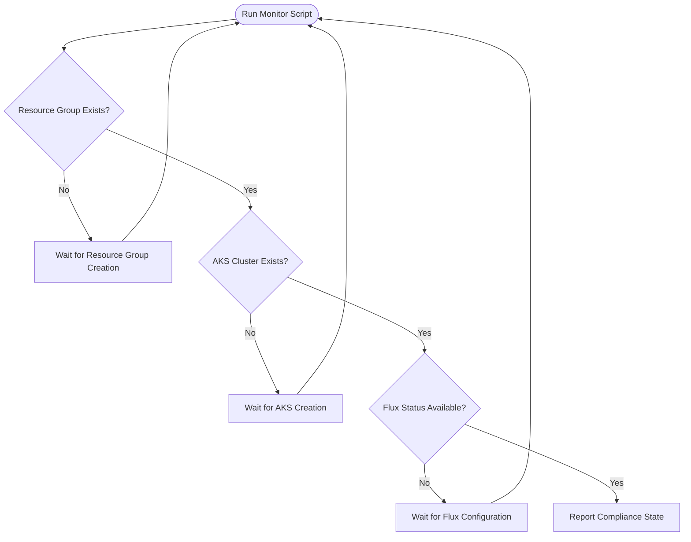
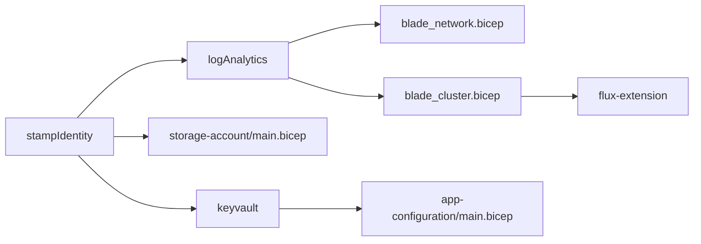

# Infrastructure Debugging

<cite>
**Referenced Files in This Document**
- [README.md](file://README.md)
- [bicep/README.md](file://bicep/README.md)
- [bicep/main.bicep](file://bicep/main.bicep)
- [bicep/modules/managed-cluster/main.bicep](file://bicep/modules/managed-cluster/main.bicep)
- [bicep/modules/flux-configuration/main.bicep](file://bicep/modules/flux-configuration/main.bicep)
- [bicep/modules/app-configuration/main.bicep](file://bicep/modules/app-configuration/main.bicep)
- [bicep/modules/storage-account/main.bicep](file://bicep/modules/storage-account/main.bicep)
- [monitor-eastus-deployment.sh](file://monitor-eastus-deployment.sh)
- [monitor-flux.sh](file://monitor-flux.sh)
- [docs/src/design_infrastructure.md](file://docs/src/design_infrastructure.md)
- [docs/src/getting_started.md](file://docs/src/getting_started.md)
- [docs/src/debugging_rest.md](file://docs/src/debugging_rest.md)
</cite>

## Table of Contents
1. [Introduction](#introduction)
2. [Project Structure](#project-structure)
3. [Core Components](#core-components)
4. [Architecture Overview](#architecture-overview)
5. [Detailed Component Analysis](#detailed-component-analysis)
6. [Dependency Analysis](#dependency-analysis)
7. [Performance Considerations](#performance-considerations)
8. [Troubleshooting Guide](#troubleshooting-guide)
9. [Conclusion](#conclusion)
10. [Appendices](#appendices)

## Introduction
This document provides comprehensive infrastructure debugging guidance for Azure resources and Kubernetes clusters in the OSDU platform. It focuses on diagnosing provisioning issues, resource allocation problems, and deployment failures using the repository’s Bicep templates, monitoring scripts, and configuration modules. You will learn how to analyze Bicep outputs, check Azure resource health, troubleshoot AKS cluster issues, and apply monitoring and automated remediation strategies.

## Project Structure
The OSDU platform uses a stamp-based architecture defined by Bicep templates organized into “blades” that group related resources (networking, common services, partitions, and services). The main template orchestrates module calls and dependencies, while specialized modules deploy AKS, storage, Key Vault, App Configuration, and Flux configurations. Monitoring and validation are supported by shell scripts that poll deployment progress and resource states.

**Diagram sources**
- [bicep/main.bicep:353-421](file://bicep/main.bicep#L353-L421)
- [bicep/modules/managed-cluster/main.bicep:1-200](file://bicep/modules/managed-cluster/main.bicep#L1-L200)
- [bicep/modules/flux-configuration/main.bicep:73-91](file://bicep/modules/flux-configuration/main.bicep#L73-L91)
- [bicep/modules/storage-account/main.bicep:211-240](file://bicep/modules/storage-account/main.bicep#L211-L240)
- [monitor-eastus-deployment.sh:1-43](file://monitor-eastus-deployment.sh#L1-L43)
- [monitor-flux.sh:1-11](file://monitor-flux.sh#L1-L11)

**Section sources**
- [bicep/README.md:1-87](file://bicep/README.md#L1-L87)
- [docs/src/design_infrastructure.md:1-308](file://docs/src/design_infrastructure.md#L1-L308)

## Core Components
- AKS Cluster and Node Pools: Provisioned via the managed cluster module with configurable networking, diagnostics, and identity settings.
- Storage Account: Configured with blob/file/table services, diagnostic settings, network ACLs, and role assignments.
- Key Vault and Secrets: Centralized secret management with RBAC and network access controls.
- App Configuration: Stores key-value pairs and supports diagnostics and private link settings.
- Flux Configuration: Manages GitOps reconciliation on AKS for deployments and updates.
- Monitoring Scripts: Provide continuous checks for resource groups, AKS status, and Flux compliance.

Key responsibilities:
- Orchestrate resource creation order and dependencies.
- Enable diagnostics and centralized logging.
- Configure secure access via managed identities and RBAC.
- Automate application delivery through Flux.

**Section sources**
- [bicep/main.bicep:166-800](file://bicep/main.bicep#L166-L800)
- [bicep/modules/managed-cluster/main.bicep:1-200](file://bicep/modules/managed-cluster/main.bicep#L1-L200)
- [bicep/modules/storage-account/main.bicep:211-240](file://bicep/modules/storage-account/main.bicep#L211-L240)
- [bicep/modules/app-configuration/main.bicep:89-139](file://bicep/modules/app-configuration/main.bicep#L89-L139)
- [bicep/modules/flux-configuration/main.bicep:1-101](file://bicep/modules/flux-configuration/main.bicep#L1-L101)

## Architecture Overview
The deployment pipeline starts with the main Bicep file, which calls blade modules to create networking, common services, partitions, and service resources. AKS is provisioned with optional VNet injection and node pools. Flux is installed as an extension and configured to reconcile Git repositories. Diagnostics stream logs and metrics to Log Analytics. Monitoring scripts continuously check resource states and provide early visibility into provisioning progress.

**Diagram sources**
- [bicep/main.bicep:353-421](file://bicep/main.bicep#L353-L421)
- [bicep/modules/managed-cluster/main.bicep:901-928](file://bicep/modules/managed-cluster/main.bicep#L901-L928)
- [bicep/modules/flux-configuration/main.bicep:73-91](file://bicep/modules/flux-configuration/main.bicep#L73-L91)
- [monitor-eastus-deployment.sh:1-43](file://monitor-eastus-deployment.sh#L1-L43)

## Detailed Component Analysis

### AKS Cluster and Node Pools
- Networking options include Azure or kubenet plugins, overlay mode, and policy enforcement.
- Diagnostics can be enabled to send logs and metrics to Log Analytics or Event Hubs.
- Identity profiles support AAD integration and Azure RBAC for Kubernetes authorization.
- Private clusters and outbound routing can be configured for security and connectivity requirements.

**Diagram sources**
- [bicep/modules/managed-cluster/main.bicep:1-200](file://bicep/modules/managed-cluster/main.bicep#L1-L200)
- [bicep/modules/managed-cluster/main.bicep:901-928](file://bicep/modules/managed-cluster/main.bicep#L901-L928)

**Section sources**
- [bicep/modules/managed-cluster/main.bicep:1-200](file://bicep/modules/managed-cluster/main.bicep#L1-L200)
- [bicep/modules/managed-cluster/main.bicep:901-928](file://bicep/modules/managed-cluster/main.bicep#L901-L928)

### Storage Account and Access Controls
- Blob, file, and table services are provisioned with containers/shares/tables.
- Diagnostic settings stream logs and metrics to Log Analytics.
- Network ACLs control inbound traffic; IP rules and virtual network rules can restrict access.
- Role assignments grant least-privilege data access to managed identities.

**Diagram sources**
- [bicep/modules/storage-account/main.bicep:211-240](file://bicep/modules/storage-account/main.bicep#L211-L240)

**Section sources**
- [bicep/modules/storage-account/main.bicep:211-240](file://bicep/modules/storage-account/main.bicep#L211-L240)

### App Configuration and Secrets Management
- App Configuration stores key-value pairs and supports diagnostics and private link.
- Key Vault centralizes secrets with RBAC and network access controls.
- Secrets can be exported from storage accounts to Key Vault for secure consumption.

**Diagram sources**
- [bicep/modules/app-configuration/main.bicep:89-139](file://bicep/modules/app-configuration/main.bicep#L89-L139)
- [bicep/main.bicep:599-661](file://bicep/main.bicep#L599-L661)
- [bicep/main.bicep:715-800](file://bicep/main.bicep#L715-L800)

**Section sources**
- [bicep/modules/app-configuration/main.bicep:89-139](file://bicep/modules/app-configuration/main.bicep#L89-L139)
- [bicep/main.bicep:599-661](file://bicep/main.bicep#L599-L661)
- [bicep/main.bicep:715-800](file://bicep/main.bicep#L715-L800)

### Flux Configuration and GitOps
- Flux extension is installed on AKS and configured with kustomizations and source types.
- Kustomizations define namespaces, scopes, and sync intervals for reconciling manifests.
- Suspend flag allows pausing reconciliation during maintenance.

**Diagram sources**
- [bicep/modules/flux-configuration/main.bicep:73-91](file://bicep/modules/flux-configuration/main.bicep#L73-L91)
- [bicep/main.bicep:398-421](file://bicep/main.bicep#L398-L421)

**Section sources**
- [bicep/modules/flux-configuration/main.bicep:1-101](file://bicep/modules/flux-configuration/main.bicep#L1-L101)
- [bicep/main.bicep:398-421](file://bicep/main.bicep#L398-L421)

### Monitoring and Validation Scripts
- East US deployment monitor checks resource group existence, AKS cluster status, and Flux compliance state.
- Flux monitor script validates AKS accessibility and reports status.
- These scripts enable rapid detection of provisioning stalls and misconfigurations.

**Diagram sources**
- [monitor-eastus-deployment.sh:1-43](file://monitor-eastus-deployment.sh#L1-L43)
- [monitor-flux.sh:1-11](file://monitor-flux.sh#L1-L11)

**Section sources**
- [monitor-eastus-deployment.sh:1-43](file://monitor-eastus-deployment.sh#L1-L43)
- [monitor-flux.sh:1-11](file://monitor-flux.sh#L1-L11)

## Dependency Analysis
The main template defines explicit dependencies between modules to ensure correct ordering:
- Identity and monitoring resources must exist before networking and cluster blades.
- Cluster blade depends on identity and log analytics.
- Flux extension depends on the cluster being available.
- Storage and Key Vault depend on identity and monitoring resources.

**Diagram sources**
- [bicep/main.bicep:166-206](file://bicep/main.bicep#L166-L206)
- [bicep/main.bicep:353-421](file://bicep/main.bicep#L353-L421)
- [bicep/main.bicep:599-661](file://bicep/main.bicep#L599-L661)
- [bicep/main.bicep:715-800](file://bicep/main.bicep#L715-L800)

**Section sources**
- [bicep/main.bicep:166-800](file://bicep/main.bicep#L166-L800)

## Performance Considerations
- Use appropriate VM sizes for node pools to balance cost and performance; defaults are set for quota constraints.
- Enable autoscaling for agent pools to handle variable workloads efficiently.
- Configure diagnostic settings judiciously to avoid excessive log ingestion costs.
- Prefer private clusters and restricted network ACLs to reduce exposure and improve security posture.

[No sources needed since this section provides general guidance]

## Troubleshooting Guide

### Diagnosing Provisioning Failures
- Validate required Azure resource providers are registered before deployment.
- Check deployment logs for errors in module instantiation or parameter validation.
- Use monitoring scripts to detect stalled resource creation and report statuses.

Steps:
- Confirm resource provider registration for critical services such as Container Service, Storage, Key Vault, and Operational Insights.
- Inspect Bicep outputs and module dependencies to identify failed steps.
- Review Log Analytics queries for error patterns and throttling events.

**Section sources**
- [docs/src/getting_started.md:104-129](file://docs/src/getting_started.md#L104-L129)
- [bicep/main.bicep:166-800](file://bicep/main.bicep#L166-L800)
- [monitor-eastus-deployment.sh:1-43](file://monitor-eastus-deployment.sh#L1-L43)

### Resource Allocation Problems
- Inspect vCPU usage and quotas in the target region to prevent allocation failures.
- Adjust node pool counts and VM sizes based on workload demands and subscription limits.
- Verify autoscaling thresholds and minimum/maximum pod counts per node pool.

Actions:
- Use regional usage queries to assess capacity constraints.
- Modify server configuration parameters for system and user pools if necessary.
- Re-run provisioning after increasing quotas or adjusting cluster sizing.

**Section sources**
- [monitor-eastus-deployment.sh:35-36](file://monitor-eastus-deployment.sh#L35-L36)
- [bicep/main.bicep:46-57](file://bicep/main.bicep#L46-L57)

### Deployment Failures and Rollbacks
- Analyze deployment script outputs and environment variables for authentication or permission errors.
- Check Flux extension installation and configuration for Git repository access issues.
- Temporarily suspend Flux reconciliation to isolate and fix manifest errors.

Remediation:
- Ensure managed identities have required roles for storage and registry access.
- Validate Git repository URLs, branches, and authentication tokens.
- Reapply Flux configuration after correcting kustomization paths or permissions.

**Section sources**
- [bicep/main.bicep:432-474](file://bicep/main.bicep#L432-L474)
- [bicep/modules/flux-configuration/main.bicep:73-91](file://bicep/modules/flux-configuration/main.bicep#L73-L91)

### Insufficient Permissions
- Verify role assignments for managed identities across storage, Key Vault, and container registry.
- Confirm application client principal has Key Vault Secrets User role when consuming secrets.
- Ensure AKS kubelet identity has AcrPull role for image pulls.

Fixes:
- Add missing role assignments in storage and Key Vault modules.
- Update application client principal OID and permissions in Key Vault.
- Re-provision AKS with correct identity profile and RBAC settings.

**Section sources**
- [bicep/main.bicep:485-529](file://bicep/main.bicep#L485-L529)
- [bicep/main.bicep:599-661](file://bicep/main.bicep#L599-L661)
- [bicep/modules/storage-account/main.bicep:211-240](file://bicep/modules/storage-account/main.bicep#L211-L240)

### Resource Quotas
- Monitor regional vCPU usage and adjust cluster sizing or node pool counts.
- Consider enabling node auto-provisioning to dynamically scale nodes within quota limits.
- Use smaller VM SKUs for development environments to minimize quota pressure.

**Section sources**
- [monitor-eastus-deployment.sh:35-36](file://monitor-eastus-deployment.sh#L35-L36)
- [bicep/main.bicep:46-57](file://bicep/main.bicep#L46-L57)

### Network Connectivity Issues
- Validate network plugin and policy settings for AKS; ensure subnets and NSGs allow required traffic.
- Check storage account network ACLs and allowed IPs; add NAT cluster IP where necessary.
- For private clusters, verify private DNS zones and endpoint configurations.

Diagnostics:
- Review NSG rules and subnet associations in the network blade.
- Inspect storage account IP rules and bypass settings.
- Test connectivity from cluster nodes to external endpoints.

**Section sources**
- [bicep/modules/managed-cluster/main.bicep:1-200](file://bicep/modules/managed-cluster/main.bicep#L1-L200)
- [bicep/main.bicep:715-800](file://bicep/main.bicep#L715-L800)

### Storage Access Issues
- Confirm storage services (blob/file/table) are enabled and containers/shares exist.
- Validate role assignments for managed identities to read/write data.
- Check diagnostic settings and logs for access denied or throttling errors.

Resolution:
- Add missing containers/shares and update role assignments.
- Enable hierarchical namespace only if required by applications.
- Review storage logs in Log Analytics for detailed error messages.

**Section sources**
- [bicep/main.bicep:715-800](file://bicep/main.bicep#L715-L800)
- [bicep/modules/storage-account/main.bicep:211-240](file://bicep/modules/storage-account/main.bicep#L211-L240)

### Monitoring Techniques
- Use Log Analytics to query kube-apiserver, kube-controller-manager, and kube-scheduler logs.
- Stream metrics from AKS and storage to Log Analytics for alerting and dashboards.
- Employ monitoring scripts to automate status checks and notify on failures.

Best practices:
- Define retention policies and alert rules for critical metrics.
- Correlate deployment events with runtime logs to pinpoint failures.
- Use Grafana dashboards (when enabled) for visual monitoring.

**Section sources**
- [bicep/modules/managed-cluster/main.bicep:901-928](file://bicep/modules/managed-cluster/main.bicep#L901-L928)
- [bicep/main.bicep:191-247](file://bicep/main.bicep#L191-L247)
- [monitor-eastus-deployment.sh:1-43](file://monitor-eastus-deployment.sh#L1-L43)

### Automated Remediation Strategies
- Suspend Flux reconciliation during maintenance to prevent conflicting changes.
- Use deployment scripts to reconfigure extensions or fetch missing identifiers.
- Implement retry logic in monitoring scripts to handle transient failures.

Implementation tips:
- Set Flux suspend flag to true during rollouts and revert after success.
- Add idempotent checks in scripts to avoid repeated operations.
- Leverage Azure Policy and Blueprints to enforce baseline configurations.

**Section sources**
- [bicep/modules/flux-configuration/main.bicep:51-52](file://bicep/modules/flux-configuration/main.bicep#L51-L52)
- [bicep/main.bicep:432-474](file://bicep/main.bicep#L432-L474)
- [monitor-eastus-deployment.sh:1-43](file://monitor-eastus-deployment.sh#L1-L43)

## Conclusion
Effective infrastructure debugging in OSDU relies on understanding the Bicep module structure, verifying dependencies, and leveraging monitoring tools. By systematically checking resource health, permissions, quotas, and network configurations, you can quickly diagnose and resolve provisioning and deployment issues. Automated scripts and diagnostic settings provide actionable insights and support resilient operations.

[No sources needed since this section summarizes without analyzing specific files]

## Appendices

### REST API Debugging
- Use integrated REST scripts in VS Code to execute API sequences and validate service behavior.
- Ensure Azure Developer CLI hooks are run to configure the environment for REST execution.

**Section sources**
- [docs/src/debugging_rest.md:1-14](file://docs/src/debugging_rest.md#L1-L14)

### Getting Started and Provider Registration
- Register required resource providers to avoid deployment failures.
- Follow quickstart guides to authenticate, initialize, provision, and configure the environment.

**Section sources**
- [docs/src/getting_started.md:104-129](file://docs/src/getting_started.md#L104-L129)
- [README.md:25-65](file://README.md#L25-L65)