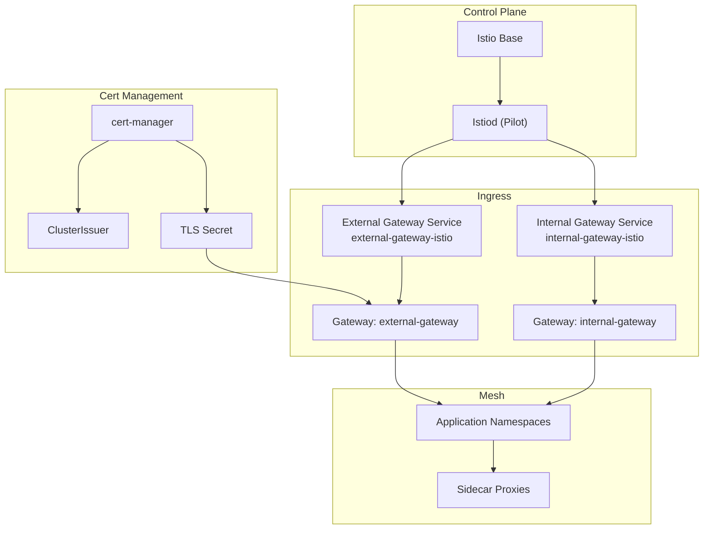
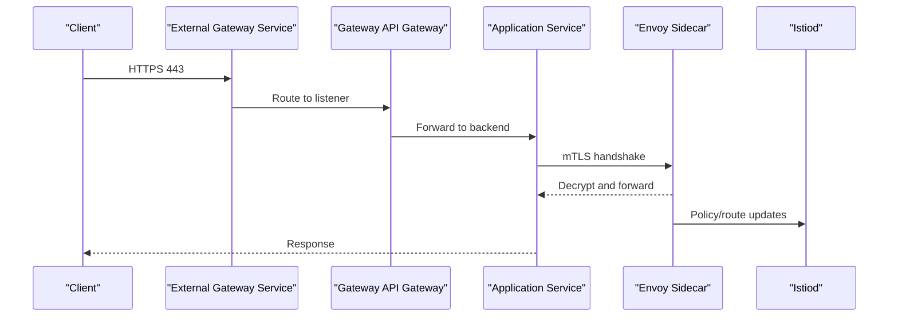
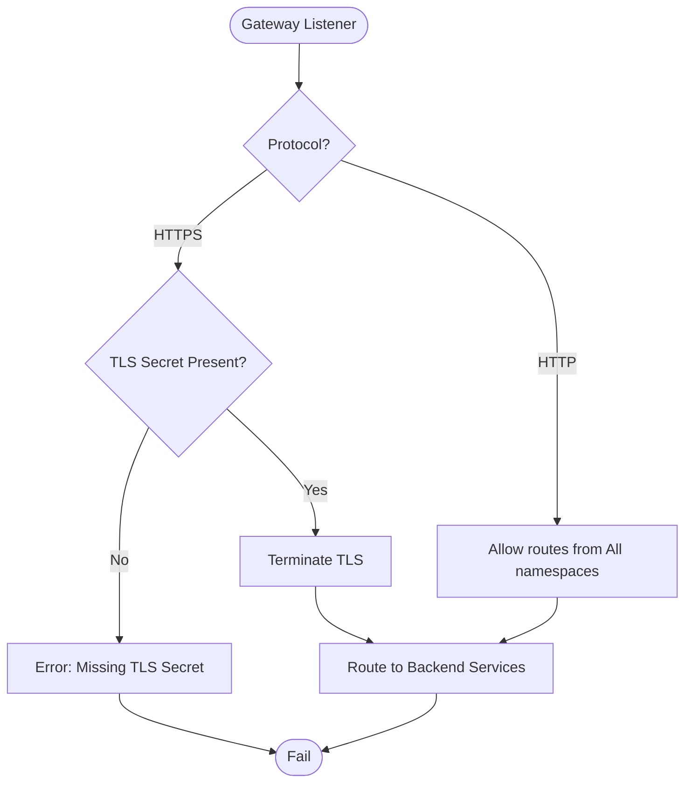
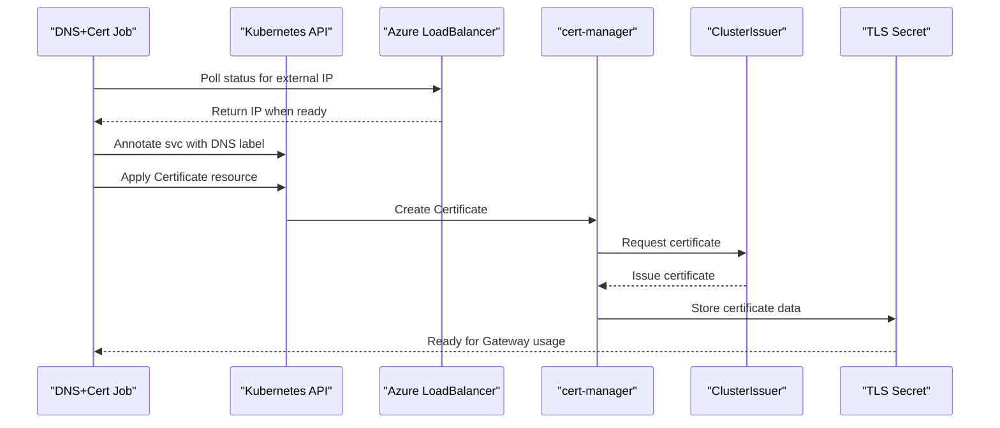
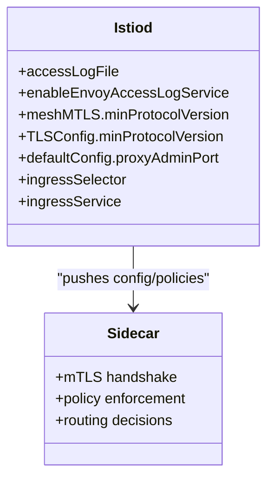
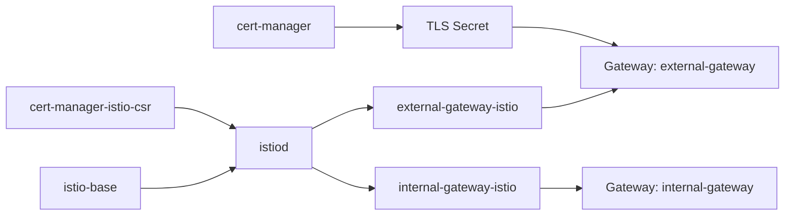

# Network and Service Mesh Debugging

<cite>
**Referenced Files in This Document**
- [mesh.yaml](file://software/components/osdu-system/mesh.yaml)
- [gateway.yaml](file://software/components/mesh-ingress/gateway.yaml)
- [certs.yaml](file://software/components/mesh-ingress/certs.yaml)
- [gateways.yaml](file://charts/istio-ingress/templates/gateways.yaml)
- [httproutes.yaml](file://charts/istio-ingress/templates/httproutes.yaml)
- [configmap.yaml](file://charts/istio-certs/templates/configmap.yaml)
</cite>

## Table of Contents
1. Introduction
2. Project Structure
3. Core Components
4. Architecture Overview
5. Detailed Component Analysis
6. Dependency Analysis
7. Performance Considerations
8. Troubleshooting Guide
9. Conclusion

## Introduction
This document provides a comprehensive guide to diagnosing network connectivity, service discovery, and traffic routing issues for Istio-based service communication in the OSDU platform. It focuses on analyzing Istio proxy logs, examining service mesh configurations, troubleshooting mTLS certificate issues, and debugging ingress/egress traffic, load balancing, and service-to-service communication failures. It also covers network policy enforcement and firewall rule debugging techniques relevant to the OSDU deployment.

## Project Structure
The OSDU platform deploys Istio via Flux-managed Helm releases and configures Gateway API resources for ingress. The key components include:
- Istio control plane (istiod) and base components managed by HelmRelease
- Internal and external Istio gateways exposed as Kubernetes LoadBalancer services
- Gateway API Gateways with HTTP/HTTPS listeners and TLS termination
- cert-manager integration for provisioning certificates to the external gateway
- DNS annotation automation for Azure LoadBalancer FQDN assignment

**Diagram sources**
- [mesh.yaml:47-143](file://software/components/osdu-system/mesh.yaml#L47-L143)
- [mesh.yaml:144-241](file://software/components/osdu-system/mesh.yaml#L144-L241)
- [gateways.yaml:1-96](file://charts/istio-ingress/templates/gateways.yaml#L1-L96)
- [configmap.yaml:44-87](file://charts/istio-certs/templates/configmap.yaml#L44-L87)

**Section sources**
- [mesh.yaml:47-143](file://software/components/osdu-system/mesh.yaml#L47-L143)
- [mesh.yaml:144-241](file://software/components/osdu-system/mesh.yaml#L144-L241)
- [gateway.yaml:1-55](file://software/components/mesh-ingress/gateway.yaml#L1-L55)
- [certs.yaml:1-26](file://software/components/mesh-ingress/certs.yaml#L1-L26)
- [gateways.yaml:1-96](file://charts/istio-ingress/templates/gateways.yaml#L1-L96)
- [httproutes.yaml:1-13](file://charts/istio-ingress/templates/httproutes.yaml#L1-L13)
- [configmap.yaml:1-87](file://charts/istio-certs/templates/configmap.yaml#L1-L87)

## Core Components
- Istio Control Plane:
  - istiod is installed via HelmRelease with access logging enabled and mTLS minimum protocol version set to TLS 1.3.
  - Ingress selector/service configured to use an external gateway for primary ingress.
- Gateways:
  - Two Istio gateway deployments are provisioned: internal and external, both exposing HTTP (80) and HTTPS (443).
  - External gateway uses an Azure public LoadBalancer; internal gateway uses an internal LoadBalancer.
- Gateway API:
  - Gateway resources define HTTP and HTTPS listeners, with TLS termination using secrets from cert-manager.
  - Allowed routes are scoped across namespaces.
- Certificates:
  - A script waits for the external LoadBalancer IP, annotates the service with an Azure DNS label, and applies a cert-manager Certificate resource for the FQDN.
  - The certificate references a ClusterIssuer and stores the resulting secret for the Gateway’s TLS configuration.

**Section sources**
- [mesh.yaml:127-143](file://software/components/osdu-system/mesh.yaml#L127-L143)
- [mesh.yaml:144-241](file://software/components/osdu-system/mesh.yaml#L144-L241)
- [gateways.yaml:1-96](file://charts/istio-ingress/templates/gateways.yaml#L1-L96)
- [configmap.yaml:23-57](file://charts/istio-certs/templates/configmap.yaml#L23-L57)
- [configmap.yaml:60-87](file://charts/istio-certs/templates/configmap.yaml#L60-L87)

## Architecture Overview
The architecture integrates Istio with Kubernetes Gateway API for ingress and cert-manager for TLS. Traffic flows from clients through the external or internal gateway into application workloads protected by sidecar proxies. The control plane manages policies, mTLS, and routing.

**Diagram sources**
- [mesh.yaml:127-143](file://software/components/osdu-system/mesh.yaml#L127-L143)
- [gateways.yaml:1-96](file://charts/istio-ingress/templates/gateways.yaml#L1-L96)

## Detailed Component Analysis

### Ingress Gateway Configuration
- Listeners:
  - HTTP on port 80 and HTTPS on port 443 with TLS termination.
  - TLS uses a secret name derived from values for each gateway type (internal/external).
- Allowed Routes:
  - Both gateways allow routes from all namespaces, enabling cross-namespace routing.
- Labels:
  - Gateway resources are labeled to identify internal vs external gateways.

**Diagram sources**
- [gateways.yaml:1-96](file://charts/istio-ingress/templates/gateways.yaml#L1-L96)

**Section sources**
- [gateways.yaml:1-96](file://charts/istio-ingress/templates/gateways.yaml#L1-L96)

### Certificate Provisioning and DNS Annotation
- Process:
  - Wait for the external LoadBalancer IP to be assigned.
  - Annotate the external gateway service with an Azure DNS label.
  - Apply a cert-manager Certificate resource targeting the FQDN.
  - The resulting secret is referenced by the Gateway’s TLS configuration.
- Notes:
  - The script installs kubectl within the job environment and retries until the IP is available.
  - The certificate uses a ClusterIssuer and RSA private key algorithm.

**Diagram sources**
- [configmap.yaml:23-57](file://charts/istio-certs/templates/configmap.yaml#L23-L57)
- [configmap.yaml:60-87](file://charts/istio-certs/templates/configmap.yaml#L60-L87)

**Section sources**
- [configmap.yaml:23-57](file://charts/istio-certs/templates/configmap.yaml#L23-L57)
- [configmap.yaml:60-87](file://charts/istio-certs/templates/configmap.yaml#L60-L87)

### Istio Control Plane and mTLS Settings
- Access Logging:
  - Access log output is enabled to stdout and Envoy access log service is enabled.
- mTLS:
  - Minimum TLS protocol version enforced at mesh level and TLSConfig level.
- Ingress Selector:
  - Configured to use the external gateway as the primary ingress service.

**Diagram sources**
- [mesh.yaml:127-143](file://software/components/osdu-system/mesh.yaml#L127-L143)

**Section sources**
- [mesh.yaml:127-143](file://software/components/osdu-system/mesh.yaml#L127-L143)

### HTTPRoutes and ACME Challenges
- HTTPRoutes:
  - The template includes comments indicating that ACME challenge handling is delegated to individual applications or temporary resources created by cert-manager.
- Implication:
  - Ensure application-level HTTPRoutes can handle ACME challenges if needed during certificate issuance.

**Section sources**
- [httproutes.yaml:1-13](file://charts/istio-ingress/templates/httproutes.yaml#L1-L13)

## Dependency Analysis
- HelmRelease dependencies:
  - istiod depends on istio-base and cert-manager-istio-csr.
  - Internal and external gateways depend on istio-base and istiod.
- Values and References:
  - Ingress chart values are sourced from a ConfigMap.
  - Gateway templates reference values for TLS credentials and DNS names.
- External Integrations:
  - Azure LoadBalancer annotations configure internal vs external exposure.
  - cert-manager ClusterIssuer provisions certificates for the external gateway.

**Diagram sources**
- [mesh.yaml:47-143](file://software/components/osdu-system/mesh.yaml#L47-L143)
- [mesh.yaml:144-241](file://software/components/osdu-system/mesh.yaml#L144-L241)
- [gateways.yaml:1-96](file://charts/istio-ingress/templates/gateways.yaml#L1-L96)
- [configmap.yaml:60-87](file://charts/istio-certs/templates/configmap.yaml#L60-L87)

**Section sources**
- [mesh.yaml:47-143](file://software/components/osdu-system/mesh.yaml#L47-L143)
- [mesh.yaml:144-241](file://software/components/osdu-system/mesh.yaml#L144-L241)
- [gateway.yaml:1-55](file://software/components/mesh-ingress/gateway.yaml#L1-L55)
- [certs.yaml:1-26](file://software/components/mesh-ingress/certs.yaml#L1-L26)

## Performance Considerations
- Access Logging:
  - Enabling access logs and Envoy access log service can increase I/O overhead; monitor resource usage accordingly.
- mTLS Overhead:
  - Enforcing TLS 1.3 ensures security but adds handshake costs; ensure adequate CPU and memory for sidecars.
- Gateway Scaling:
  - External and internal gateways are LoadBalanced; consider horizontal scaling based on traffic patterns.
- Certificate Rotation:
  - Short-lived certificates reduce risk but require efficient rotation; ensure cert-manager and DNS annotations remain healthy.

[No sources needed since this section provides general guidance]

## Troubleshooting Guide

### Diagnosing Network Connectivity Issues
- Verify Gateway Services:
  - Confirm external and internal gateway services have assigned IPs and correct ports (80/443).
  - Check Azure LoadBalancer annotations to ensure correct internal/external exposure.
- Validate DNS and TLS:
  - Ensure the external gateway service has the DNS label annotation applied.
  - Confirm the TLS secret exists and matches the Gateway’s certificateRefs.
- Test Connectivity:
  - Use curl or similar tools against the external IP/FQDN to verify HTTP/HTTPS reachability.

**Section sources**
- [mesh.yaml:175-241](file://software/components/osdu-system/mesh.yaml#L175-L241)
- [configmap.yaml:23-57](file://charts/istio-certs/templates/configmap.yaml#L23-L57)
- [gateways.yaml:1-96](file://charts/istio-ingress/templates/gateways.yaml#L1-L96)

### Diagnosing Service Discovery Problems
- Check Istiod Status:
  - Ensure istiod is running and not reporting errors in its logs.
- Validate Sidecar Injection:
  - Confirm sidecars are present in application pods and connected to Istiod.
- Inspect Policies:
  - Review PeerAuthentication and AuthorizationPolicy resources for misconfigurations blocking discovery.

**Section sources**
- [mesh.yaml:127-143](file://software/components/osdu-system/mesh.yaml#L127-L143)

### Diagnosing Traffic Routing Failures
- Gateway Listeners:
  - Verify HTTP and HTTPS listeners are active and correctly configured.
- HTTPRoutes:
  - Ensure application HTTPRoutes exist and match hostnames/path rules.
- Cross-Namespace Routing:
  - Confirm allowedRoutes settings permit cross-namespace access.

**Section sources**
- [gateways.yaml:1-96](file://charts/istio-ingress/templates/gateways.yaml#L1-L96)
- [httproutes.yaml:1-13](file://charts/istio-ingress/templates/httproutes.yaml#L1-L13)

### Analyzing Istio Proxy Logs
- Access Logs:
  - Access logs are enabled and streamed to stdout; collect logs from gateway and sidecar containers.
- Envoy Access Log Service:
  - If enabled, route logs to your observability stack for centralized analysis.
- Common Indicators:
  - Look for upstream connection errors, TLS handshake failures, and 5xx responses.

**Section sources**
- [mesh.yaml:127-143](file://software/components/osdu-system/mesh.yaml#L127-L143)

### Examining Service Mesh Configurations
- Mesh-wide mTLS:
  - Confirm minProtocolVersion is set appropriately and consistent across mesh and TLSConfig.
- Ingress Selection:
  - Verify ingressSelector and ingressService point to the intended external gateway.
- Gateway Values:
  - Check values passed via ConfigMap for CORS and TLS credential names.

**Section sources**
- [mesh.yaml:127-143](file://software/components/osdu-system/mesh.yaml#L127-L143)
- [gateway.yaml:21-55](file://software/components/mesh-ingress/gateway.yaml#L21-L55)

### Troubleshooting mTLS Certificate Issues
- Certificate Existence:
  - Ensure the TLS secret referenced by the Gateway exists and contains valid certificates.
- Issuer Health:
  - Check cert-manager and ClusterIssuer status for errors during issuance.
- DNS Annotation:
  - Confirm the external gateway service has the DNS label annotation; re-run the DNS+Cert job if missing.
- Renewal:
  - Monitor certificate expiration and renewal windows; update secrets if necessary.

**Section sources**
- [configmap.yaml:23-57](file://charts/istio-certs/templates/configmap.yaml#L23-L57)
- [configmap.yaml:60-87](file://charts/istio-certs/templates/configmap.yaml#L60-L87)
- [gateways.yaml:1-96](file://charts/istio-ingress/templates/gateways.yaml#L1-L96)

### Ingress/Egress Traffic Problems
- Ingress:
  - Validate Gateway listeners and TLS termination; test HTTP/HTTPS endpoints.
- Egress:
  - Ensure egress policies allow outbound traffic to required destinations; check DNS resolution and network policies.
- Load Balancer:
  - Confirm Azure LoadBalancer health probes and routing rules are correct for both internal and external gateways.

**Section sources**
- [mesh.yaml:175-241](file://software/components/osdu-system/mesh.yaml#L175-L241)
- [gateways.yaml:1-96](file://charts/istio-ingress/templates/gateways.yaml#L1-L96)

### Load Balancing Issues
- Service Ports:
  - Verify ports 80 and 443 are exposed and mapped correctly.
- Backend Endpoints:
  - Check that application services have healthy endpoints and are reachable from gateways.
- Scaling:
  - Adjust replica counts or HPA settings if under high load.

**Section sources**
- [mesh.yaml:175-241](file://software/components/osdu-system/mesh.yaml#L175-L241)

### Service-to-Service Communication Failures
- Sidecar Connectivity:
  - Confirm sidecars are injected and connected to Istiod.
- Policies:
  - Review PeerAuthentication and AuthorizationPolicy for restrictive rules.
- DNS Resolution:
  - Ensure services resolve correctly within the cluster; test with nslookup or dig inside pods.

**Section sources**
- [mesh.yaml:127-143](file://software/components/osdu-system/mesh.yaml#L127-L143)

### Network Policy Enforcement and Firewall Rule Debugging
- Kubernetes NetworkPolicies:
  - Inspect policies that may restrict ingress/egress between namespaces.
- Azure Firewall/NSGs:
  - Validate NSG rules and Azure Firewall policies for allowed traffic paths to/from gateways and services.
- Observability:
  - Correlate packet drops with firewall logs and Kubernetes network policy events.

[No sources needed since this section provides general guidance]

## Conclusion
Effective debugging of Istio-based service communication in OSDU requires a systematic approach: validate gateway configurations, ensure proper certificate management, analyze proxy logs, and inspect policies. By leveraging the provided HelmRelease and Gateway API resources, along with cert-manager integration, you can maintain secure and reliable ingress/egress traffic while diagnosing connectivity and routing issues efficiently.

[No sources needed since this section summarizes without analyzing specific files]