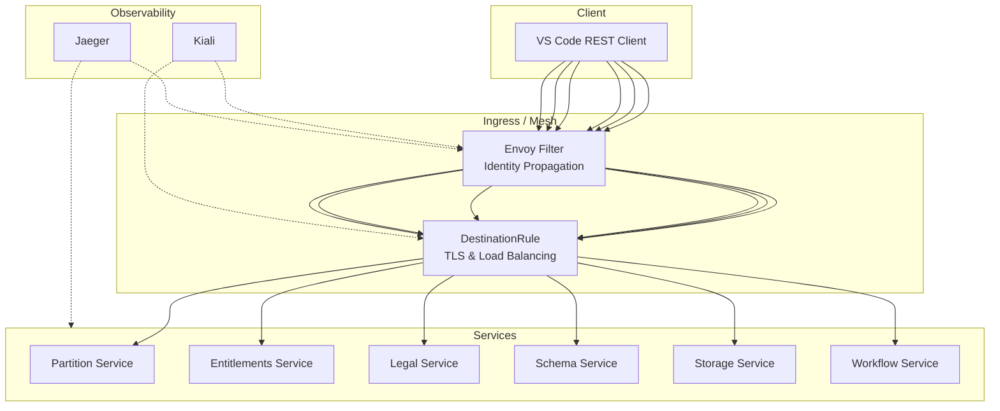
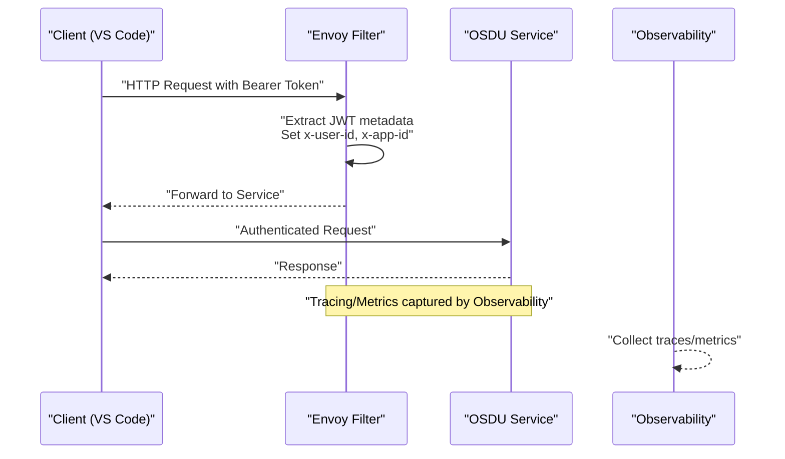
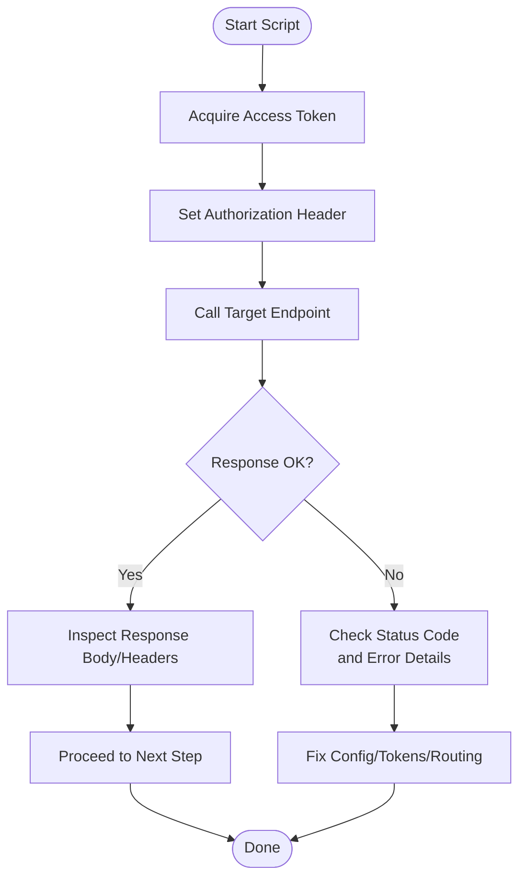
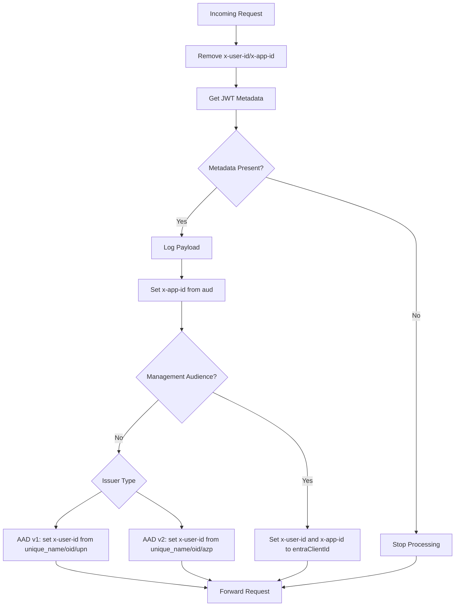
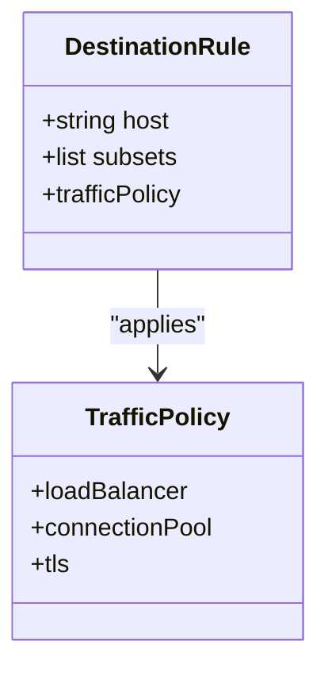
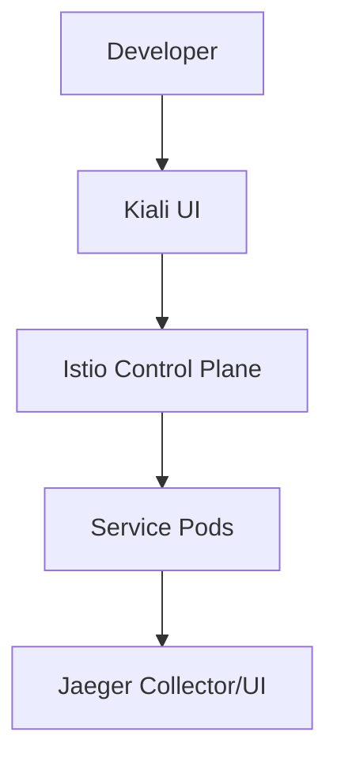

# Service Debugging

<cite>
**Referenced Files in This Document**
- [debugging_rest.md](file://docs/src/debugging_rest.md)
- [README.md](file://tools/rest-scripts/README.md)
- [local.http](file://tools/rest-scripts/local.http)
- [admin.http](file://tools/rest-scripts/admin.http)
- [partition.http](file://tools/rest-scripts/partition.http)
- [storage.http](file://tools/rest-scripts/storage.http)
- [envoy-filter.md](file://charts/osdu-developer-base/envoy-filter.md)
- [envoy-filter.yaml](file://charts/osdu-developer-base/templates/envoy-filter.yaml)
- [destination-rule.yaml](file://charts/osdu-developer-service/templates/destination-rule.yaml)
- [gateway-migration-summary.md](file://docs/gateway-migration-summary.md)
- [kiali.yaml](file://software/components/observability/kiali.yaml)
- [jaeger.yaml](file://software/components/observability/jaeger.yaml)
</cite>

## Table of Contents
1. [Introduction](#introduction)
2. [Project Structure](#project-structure)
3. [Core Components](#core-components)
4. [Architecture Overview](#architecture-overview)
5. [Detailed Component Analysis](#detailed-component-analysis)
6. [Dependency Analysis](#dependency-analysis)
7. [Performance Considerations](#performance-considerations)
8. [Troubleshooting Guide](#troubleshooting-guide)
9. [Conclusion](#conclusion)

## Introduction
This document provides a comprehensive, step-by-step guide to debugging OSDU platform services with a focus on REST API issues, service connectivity problems, and microservice communication failures. It explains how to use the provided HTTP scripts to exercise endpoints, analyze request/response patterns, and identify authentication and authorization issues. It also covers Istio service mesh integration points, traffic flow analysis, and observability tooling for end-to-end troubleshooting.

## Project Structure
The repository includes:
- REST client scripts under tools/rest-scripts for executing and sequencing API calls via VS Code’s REST Client extension.
- Istio configuration artifacts (Envoy filters, DestinationRules) that shape identity propagation and traffic policies.
- Observability components (Kiali, Jaeger) for tracing and service graph visibility.
- Gateway migration notes for troubleshooting ingress and routing.

**Diagram sources**
- [envoy-filter.yaml:90-143](file://charts/osdu-developer-base/templates/envoy-filter.yaml#L90-L143)
- [destination-rule.yaml:1-27](file://charts/osdu-developer-service/templates/destination-rule.yaml#L1-L27)
- [kiali.yaml:412-437](file://software/components/observability/kiali.yaml#L412-L437)
- [jaeger.yaml:57-121](file://software/components/observability/jaeger.yaml#L57-L121)

**Section sources**
- [debugging_rest.md:1-14](file://docs/src/debugging_rest.md#L1-L14)
- [README.md:1-25](file://tools/rest-scripts/README.md#L1-L25)

## Core Components
- REST Scripts: Predefined sequences to authenticate and call core OSDU APIs (Partition, Entitlements, Legal, Schema, Storage, Workflow). They demonstrate typical headers, token flows, and data partition usage.
- Identity Propagation: An Envoy filter extracts JWT metadata and sets x-user-id and x-app-id headers for downstream services, supporting both AAD v1 and v2 tokens and delegation scenarios.
- Traffic Policies: DestinationRules configure mTLS and load balancing per service subset.
- Observability: Kiali provides service graphs and diagnostics; Jaeger exposes tracing endpoints for distributed traces.

**Section sources**
- [local.http:8-45](file://tools/rest-scripts/local.http#L8-L45)
- [admin.http:8-38](file://tools/rest-scripts/admin.http#L8-L38)
- [partition.http:8-47](file://tools/rest-scripts/partition.http#L8-L47)
- [storage.http:8-59](file://tools/rest-scripts/storage.http#L8-L59)
- [envoy-filter.md:1-67](file://charts/osdu-developer-base/envoy-filter.md#L1-L67)
- [envoy-filter.yaml:90-143](file://charts/osdu-developer-base/templates/envoy-filter.yaml#L90-L143)
- [destination-rule.yaml:1-27](file://charts/osdu-developer-service/templates/destination-rule.yaml#L1-L27)
- [kiali.yaml:412-437](file://software/components/observability/kiali.yaml#L412-L437)
- [jaeger.yaml:57-121](file://software/components/observability/jaeger.yaml#L57-L121)

## Architecture Overview
End-to-end request path through the mesh:
- Client uses VS Code REST Client to run scripted requests.
- Requests traverse the gateway and are processed by an Envoy filter that normalizes identity headers from the JWT.
- DestinationRules enforce mTLS and routing policies.
- Downstream services handle business logic; observability tools capture traces and metrics.

**Diagram sources**
- [envoy-filter.yaml:90-143](file://charts/osdu-developer-base/templates/envoy-filter.yaml#L90-L143)
- [destination-rule.yaml:1-27](file://charts/osdu-developer-service/templates/destination-rule.yaml#L1-L27)
- [kiali.yaml:412-437](file://software/components/observability/kiali.yaml#L412-L437)
- [jaeger.yaml:57-121](file://software/components/observability/jaeger.yaml#L57-L121)

## Detailed Component Analysis

### REST Scripts: Authentication and Endpoints
- Use the REST Client extension in VS Code to execute sequences defined in .http files.
- Typical flow:
  - Acquire access token using client credentials or refresh token.
  - Set Authorization header with Bearer token.
  - Call service endpoints with required data-partition-id and other headers.
- Key scripts:
  - local.http: Demonstrates partition, entitlements, legal, schema, storage, workflow endpoints.
  - admin.http: Focuses on entitlements group and user management operations.
  - partition.http: Shows partition lifecycle endpoints.
  - storage.http: Demonstrates record creation, retrieval, querying, and deletion.

**Diagram sources**
- [local.http:8-45](file://tools/rest-scripts/local.http#L8-L45)
- [admin.http:8-38](file://tools/rest-scripts/admin.http#L8-L38)
- [partition.http:8-47](file://tools/rest-scripts/partition.http#L8-L47)
- [storage.http:8-59](file://tools/rest-scripts/storage.http#L8-L59)

**Section sources**
- [debugging_rest.md:1-14](file://docs/src/debugging_rest.md#L1-L14)
- [README.md:1-25](file://tools/rest-scripts/README.md#L1-L25)
- [local.http:8-45](file://tools/rest-scripts/local.http#L8-L45)
- [admin.http:8-38](file://tools/rest-scripts/admin.http#L8-L38)
- [partition.http:8-47](file://tools/rest-scripts/partition.http#L8-L47)
- [storage.http:8-59](file://tools/rest-scripts/storage.http#L8-L59)

### Identity Propagation via Envoy Filter
- The Envoy filter removes existing identity headers, retrieves JWT metadata, logs payload for debugging, sets x-app-id from audience, and sets x-user-id based on issuer-specific claims or delegation headers.
- Supports AAD v1 and v2 issuers and special handling for management audience.

**Diagram sources**
- [envoy-filter.yaml:90-143](file://charts/osdu-developer-base/templates/envoy-filter.yaml#L90-L143)
- [envoy-filter.md:14-31](file://charts/osdu-developer-base/envoy-filter.md#L14-L31)

**Section sources**
- [envoy-filter.md:1-67](file://charts/osdu-developer-base/envoy-filter.md#L1-L67)
- [envoy-filter.yaml:90-143](file://charts/osdu-developer-base/templates/envoy-filter.yaml#L90-L143)

### Traffic Policies and TLS
- DestinationRules define subsets and apply ISTIO_MUTUAL TLS and connection pooling per service.
- Ensures secure service-to-service communication within the mesh.

**Diagram sources**
- [destination-rule.yaml:1-27](file://charts/osdu-developer-service/templates/destination-rule.yaml#L1-L27)

**Section sources**
- [destination-rule.yaml:1-27](file://charts/osdu-developer-service/templates/destination-rule.yaml#L1-L27)

### Observability: Tracing and Service Graphs
- Kiali is deployed in istio-system and exposes UI for service mesh visualization and diagnostics.
- Jaeger provides tracing endpoints for distributed trace analysis.

**Diagram sources**
- [kiali.yaml:412-437](file://software/components/observability/kiali.yaml#L412-L437)
- [jaeger.yaml:57-121](file://software/components/observability/jaeger.yaml#L57-L121)

**Section sources**
- [kiali.yaml:412-437](file://software/components/observability/kiali.yaml#L412-L437)
- [jaeger.yaml:57-121](file://software/components/observability/jaeger.yaml#L57-L121)

## Dependency Analysis
- REST scripts depend on environment variables (tenant, client credentials, host, refresh token) configured for VS Code REST Client.
- Envoy filter depends on JWT metadata injected by prior authentication steps.
- DestinationRules depend on service naming conventions and labels for correct routing.
- Observability tools depend on sidecar injection and proper network exposure.

**Diagram sources**
- [README.md:1-25](file://tools/rest-scripts/README.md#L1-L25)
- [envoy-filter.yaml:90-143](file://charts/osdu-developer-base/templates/envoy-filter.yaml#L90-L143)
- [destination-rule.yaml:1-27](file://charts/osdu-developer-service/templates/destination-rule.yaml#L1-L27)
- [kiali.yaml:412-437](file://software/components/observability/kiali.yaml#L412-L437)
- [jaeger.yaml:57-121](file://software/components/observability/jaeger.yaml#L57-L121)

**Section sources**
- [README.md:1-25](file://tools/rest-scripts/README.md#L1-L25)
- [envoy-filter.yaml:90-143](file://charts/osdu-developer-base/templates/envoy-filter.yaml#L90-L143)
- [destination-rule.yaml:1-27](file://charts/osdu-developer-service/templates/destination-rule.yaml#L1-L27)

## Performance Considerations
- Prefer minimal logging in production; increase log levels only during debugging sessions.
- Use DestinationRule connection pool settings to tune concurrency and avoid resource exhaustion.
- Leverage Kiali to identify hot paths and high-latency services; correlate with Jaeger traces.
- Validate that mTLS is enabled across all inter-service calls to prevent retries due to handshake errors.

[No sources needed since this section provides general guidance]

## Troubleshooting Guide

### REST API Issues
- Verify environment variables for VS Code REST Client are correctly set (tenant, client id/secret, host, refresh token).
- Confirm token acquisition succeeds and Bearer token is attached to subsequent requests.
- Check response status codes and error bodies; validate required headers like data-partition-id.

**Section sources**
- [debugging_rest.md:1-14](file://docs/src/debugging_rest.md#L1-L14)
- [README.md:1-25](file://tools/rest-scripts/README.md#L1-L25)
- [local.http:8-45](file://tools/rest-scripts/local.http#L8-L45)
- [storage.http:8-59](file://tools/rest-scripts/storage.http#L8-L59)

### Authentication and Authorization Failures
- Ensure JWT metadata is present and the Envoy filter can extract it; check logs for missing payload or unknown issuer.
- Validate x-user-id and x-app-id are set appropriately for the token type (user vs application vs delegation).
- For management audience cases, confirm x-user-id and x-app-id are set to the expected client identifier.

**Section sources**
- [envoy-filter.md:14-31](file://charts/osdu-developer-base/envoy-filter.md#L14-L31)
- [envoy-filter.yaml:90-143](file://charts/osdu-developer-base/templates/envoy-filter.yaml#L90-L143)

### Network Connectivity Problems
- If internal gateway is not working, verify the internal gateway service has an internal IP and that HTTPRoutes reference the correct gateway.
- For external gateway issues, ensure public IP and DNS/certificates are configured.
- Check ReferenceGrant permissions when using cross-namespace routing.

**Section sources**
- [gateway-migration-summary.md:122-138](file://docs/gateway-migration-summary.md#L122-L138)

### Service-to-Service Communication Failures
- Confirm DestinationRules are applied and mTLS mode is ISTIO_MUTUAL.
- Use Kiali to inspect service graphs and identify broken links or misrouted traffic.
- Correlate with Jaeger traces to pinpoint failing hops and examine span durations and errors.

**Section sources**
- [destination-rule.yaml:1-27](file://charts/osdu-developer-service/templates/destination-rule.yaml#L1-L27)
- [kiali.yaml:412-437](file://software/components/observability/kiali.yaml#L412-L437)
- [jaeger.yaml:57-121](file://software/components/observability/jaeger.yaml#L57-L121)

### Configuration Mismatches
- Ensure data-partition-id matches the target partition and is consistent across calls.
- Validate service endpoints and hosts used in scripts match your deployment (local vs cluster).
- Re-run scripts after updating environment variables to reflect new configurations.

**Section sources**
- [local.http:8-45](file://tools/rest-scripts/local.http#L8-L45)
- [partition.http:8-47](file://tools/rest-scripts/partition.http#L8-L47)
- [storage.http:8-59](file://tools/rest-scripts/storage.http#L8-L59)

## Conclusion
By combining the provided REST scripts with Istio-based identity propagation, traffic policies, and observability tools, you can systematically diagnose REST API issues, connectivity problems, and microservice communication failures. Start with script execution and token validation, then leverage Envoy logs, Kiali service graphs, and Jaeger traces to isolate root causes. Adjust configurations incrementally and retest to resolve issues efficiently.