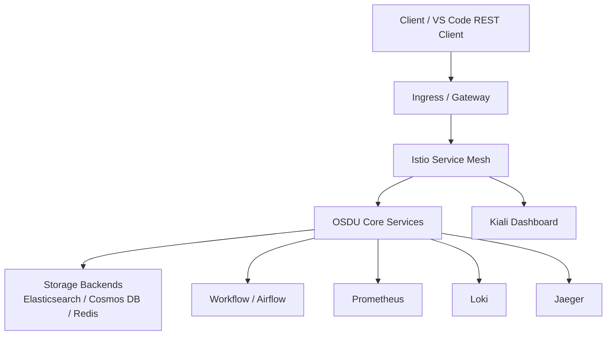
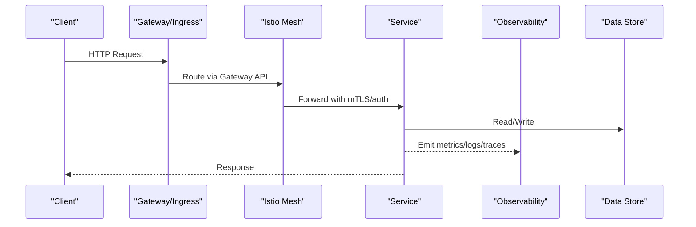
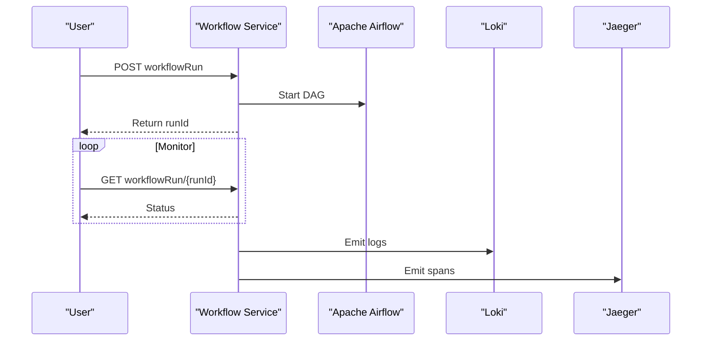
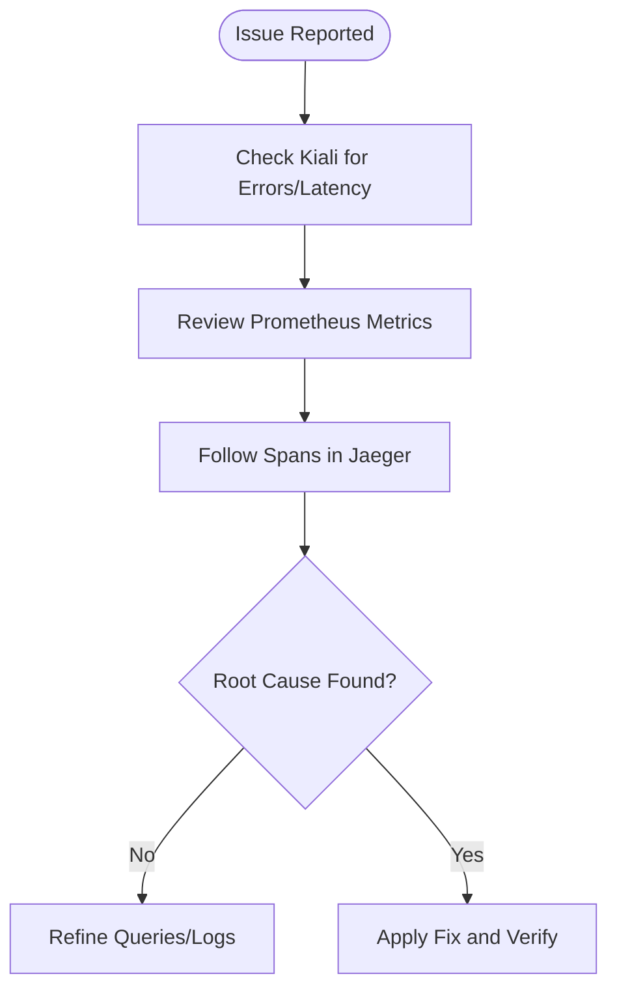
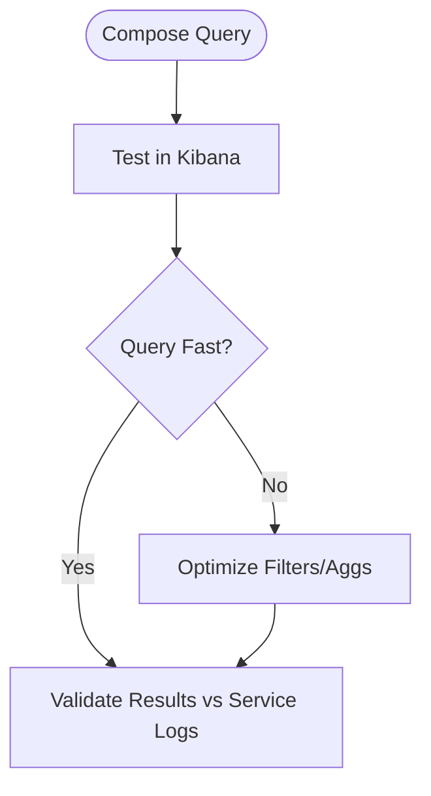
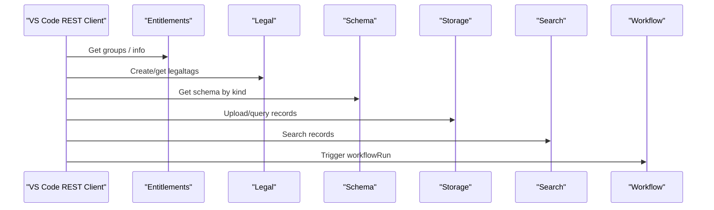
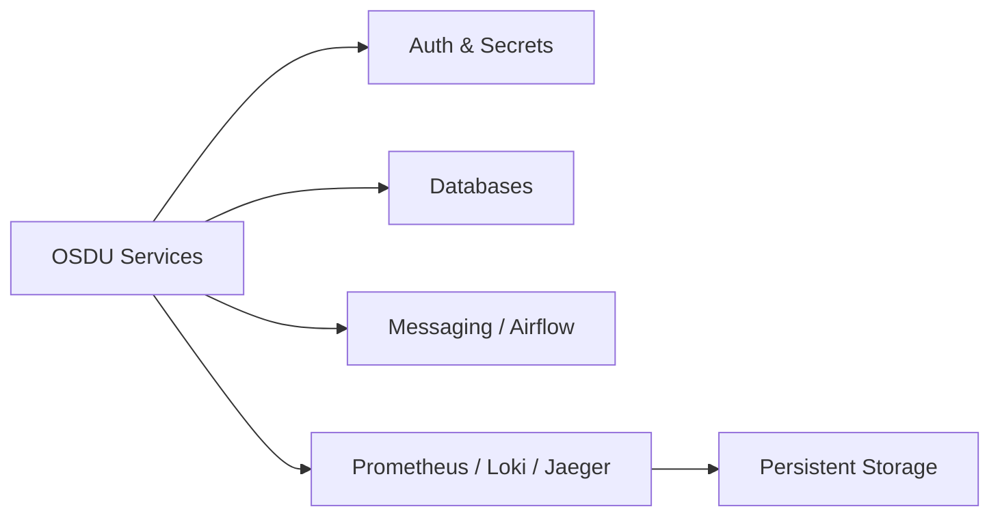

# Troubleshooting Guide

<cite>
**Referenced Files in This Document**
- [debugging_rest.md](file://docs/src/debugging_rest.md)
- [services_core.md](file://docs/src/services_core.md)
- [services_overview.md](file://docs/src/services_overview.md)
- [Application_Insights.md](file://src/Application_Insights.md)
- [prometheus.yaml](file://software/components/observability/prometheus.yaml)
- [loki.yaml](file://software/components/observability/loki.yaml)
- [jaeger.yaml](file://software/components/observability/jaeger.yaml)
- [kiali.yaml](file://software/components/observability/kiali.yaml)
- [admin.http](file://tools/rest-scripts/admin.http)
- [check-ingest.http](file://tools/rest-scripts/check-ingest.http)
- [main.bicep](file://bicep/modules/app-configuration/main.bicep)
- [main.json](file://bicep/modules/storage-account/main.json)
- [AUTH_CODE_GUIDE.md](file://AUTH_CODE_GUIDE.md)
</cite>

## Table of Contents
1. [Introduction](#introduction)
2. [Project Structure](#project-structure)
3. [Core Components](#core-components)
4. [Architecture Overview](#architecture-overview)
5. [Detailed Component Analysis](#detailed-component-analysis)
6. [Dependency Analysis](#dependency-analysis)
7. [Performance Considerations](#performance-considerations)
8. [Troubleshooting Guide](#troubleshooting-guide)
9. [Conclusion](#conclusion)
10. [Appendices](#appendices)

## Introduction
This guide provides a systematic approach to diagnosing and resolving common issues across the OSDU platform, including infrastructure problems, service failures, and performance bottlenecks. It focuses on practical steps for debugging Apache Airflow workflows, Istio service mesh behavior, Elasticsearch queries via Kibana, and REST API calls. It also covers log analysis techniques, metric interpretation, and alert response procedures using the observability stack included in this repository.

## Project Structure
The troubleshooting workflow spans multiple layers:
- Services: Core services (Partition, Entitlements, Legal, Schema, Storage, Indexer, Search, File, Workflow) with environment variables and local run configurations.
- Observability: Prometheus metrics, Loki logs, Jaeger traces, and Kiali for Istio service mesh visualization.
- REST Scripts: Ready-to-run HTTP scripts for testing APIs and end-to-end flows.
- Infrastructure: Bicep templates enabling diagnostic logging and metrics collection for Azure resources.

**Diagram sources**
- [prometheus.yaml:39-348](file://software/components/observability/prometheus.yaml#L39-L348)
- [loki.yaml:28-53](file://software/components/observability/loki.yaml#L28-L53)
- [jaeger.yaml:57-121](file://software/components/observability/jaeger.yaml#L57-L121)
- [kiali.yaml:474-520](file://software/components/observability/kiali.yaml#L474-L520)
- [services_core.md:8-384](file://docs/src/services_core.md#L8-L384)

**Section sources**
- [services_core.md:8-384](file://docs/src/services_core.md#L8-L384)
- [services_overview.md:17-56](file://docs/src/services_overview.md#L17-L56)

## Core Components
- Services: Each core service exposes endpoints and requires specific environment variables for authentication, endpoints, and feature toggles. Use these as anchors when isolating failures.
- Observability:
  - Prometheus scrapes Kubernetes services/pods and exposes metrics at port 9090.
  - Loki stores logs with retention and query settings.
  - Jaeger provides distributed tracing endpoints.
  - Kiali visualizes Istio traffic and errors.
- REST Scripts: Provide reusable sequences to exercise authentication, schema, legal, storage, search, and workflow endpoints.

**Section sources**
- [services_core.md:8-384](file://docs/src/services_core.md#L8-L384)
- [prometheus.yaml:39-348](file://software/components/observability/prometheus.yaml#L39-L348)
- [loki.yaml:28-53](file://software/components/observability/loki.yaml#L28-L53)
- [jaeger.yaml:57-121](file://software/components/observability/jaeger.yaml#L57-L121)
- [kiali.yaml:474-520](file://software/components/observability/kiali.yaml#L474-L520)
- [admin.http:1-357](file://tools/rest-scripts/admin.http#L1-L357)
- [check-ingest.http:1-800](file://tools/rest-scripts/check-ingest.http#L1-L800)

## Architecture Overview
The request path typically goes through ingress/gateway into the Istio mesh, which enforces policies and routes traffic to services. Services call downstream dependencies (storage, databases, queues). Observability components collect metrics, logs, and traces to support diagnosis.

**Diagram sources**
- [prometheus.yaml:39-348](file://software/components/observability/prometheus.yaml#L39-L348)
- [loki.yaml:28-53](file://software/components/observability/loki.yaml#L28-L53)
- [jaeger.yaml:57-121](file://software/components/observability/jaeger.yaml#L57-L121)
- [kiali.yaml:474-520](file://software/components/observability/kiali.yaml#L474-L520)

## Detailed Component Analysis

### Apache Airflow Workflows (Workflow Service)
- Purpose: The Workflow Service orchestrates ingestion and processing by invoking Apache Airflow.
- Key environment variables include Airflow URL, credentials, version flags, and storage account references.
- Debugging steps:
  - Verify connectivity to Airflow endpoint and credentials.
  - Trigger a workflow run via the Workflow Service and poll status.
  - Inspect logs in Loki and traces in Jaeger for each step.
  - Use REST scripts to sequence calls and capture IDs for follow-up.

**Diagram sources**
- [check-ingest.http:116-189](file://tools/rest-scripts/check-ingest.http#L116-L189)
- [services_core.md:344-384](file://docs/src/services_core.md#L344-L384)
- [loki.yaml:28-53](file://software/components/observability/loki.yaml#L28-L53)
- [jaeger.yaml:57-121](file://software/components/observability/jaeger.yaml#L57-L121)

**Section sources**
- [services_core.md:344-384](file://docs/src/services_core.md#L344-L384)
- [check-ingest.http:116-189](file://tools/rest-scripts/check-ingest.http#L116-L189)

### Istio Service Mesh
- Purpose: Enforces mTLS, routing, retries, and visibility via Kiali.
- Diagnostic tools:
  - Kiali dashboard for latency, errors, saturation.
  - Prometheus metrics for mesh-level insights.
  - Jaeger traces to pinpoint slow or failing hops.
- Common checks:
  - Validate Gateway and VirtualService configuration.
  - Confirm sidecar injection and policy enforcement.
  - Inspect error rates and timeouts in Kiali.

**Diagram sources**
- [kiali.yaml:474-520](file://software/components/observability/kiali.yaml#L474-L520)
- [prometheus.yaml:39-348](file://software/components/observability/prometheus.yaml#L39-L348)
- [jaeger.yaml:57-121](file://software/components/observability/jaeger.yaml#L57-L121)

**Section sources**
- [kiali.yaml:474-520](file://software/components/observability/kiali.yaml#L474-L520)
- [prometheus.yaml:39-348](file://software/components/observability/prometheus.yaml#L39-L348)
- [jaeger.yaml:57-121](file://software/components/observability/jaeger.yaml#L57-L121)

### Elasticsearch Queries (via Kibana)
- Purpose: Search and analytics over indexed data.
- Diagnostics:
  - Use Kibana to validate index patterns and visualize results.
  - Correlate query performance with service logs and traces.
  - Ensure indexes exist and mappings are correct before querying.

[No sources needed since this diagram shows conceptual workflow, not actual code structure]

### REST API Calls
- Purpose: Exercise core APIs for partitioning, entitlements, legal, schema, storage, search, and workflow.
- Tools:
  - VS Code REST Client with provided .http files.
  - OAuth flow and token acquisition defined in scripts.
- Steps:
  - Set variables (tenant, client id/secret, host, partition).
  - Execute login/refresh to obtain tokens.
  - Run sequential API calls to reproduce flows and capture responses.

**Diagram sources**
- [admin.http:1-357](file://tools/rest-scripts/admin.http#L1-L357)
- [check-ingest.http:1-800](file://tools/rest-scripts/check-ingest.http#L1-L800)

**Section sources**
- [debugging_rest.md:1-14](file://docs/src/debugging_rest.md#L1-L14)
- [admin.http:1-357](file://tools/rest-scripts/admin.http#L1-L357)
- [check-ingest.http:1-800](file://tools/rest-scripts/check-ingest.http#L1-L800)

## Dependency Analysis
- Services depend on:
  - Authentication and authorization (AAD, Key Vault).
  - Data stores (Elasticsearch, Cosmos DB, Redis).
  - Messaging/workflow (Airflow, Service Bus).
- Observability depends on:
  - Kubernetes scraping targets and annotations.
  - Persistent storage for logs/metrics.
  - Network access to dashboards (Kiali, Grafana, etc.).

[No sources needed since this diagram shows conceptual relationships, not direct code mapping]

## Performance Considerations
- Metrics:
  - Prometheus scrape intervals and timeouts are configured; adjust if under high load.
  - Use Kiali to identify hot paths and error spikes.
- Logs:
  - Loki retention and query limits affect performance; tune as needed.
- Tracing:
  - Enable sampling judiciously to avoid overhead while retaining visibility.
- Local development:
  - Ensure Application Insights Java agent is configured to avoid startup exceptions and enable telemetry.

**Section sources**
- [prometheus.yaml:39-348](file://software/components/observability/prometheus.yaml#L39-L348)
- [loki.yaml:28-53](file://software/components/observability/loki.yaml#L28-L53)
- [jaeger.yaml:57-121](file://software/components/observability/jaeger.yaml#L57-L121)
- [Application_Insights.md:1-34](file://src/Application_Insights.md#L1-L34)

## Troubleshooting Guide

### General Approach
- Reproduce with minimal inputs using REST scripts.
- Capture correlation IDs from responses and trace them in Jaeger.
- Filter logs in Loki by service name and time window.
- Inspect mesh behavior in Kiali for routing and TLS issues.
- Validate infrastructure diagnostics (logs/metrics) for backing services.

### Infrastructure Issues
- Symptoms: Deployment failures, resource quota errors, networking issues.
- Actions:
  - Review deployment region and quotas; switch regions if necessary.
  - Validate network policies and private endpoints.
  - Check diagnostic settings for storage accounts and app configuration.

**Section sources**
- [AUTH_CODE_GUIDE.md:50-135](file://AUTH_CODE_GUIDE.md#L50-L135)
- [main.bicep:89-139](file://bicep/modules/app-configuration/main.bicep#L89-L139)
- [main.json:2415-2433](file://bicep/modules/storage-account/main.json#L2415-L2433)

### Service Failures
- Symptoms: 5xx errors, timeouts, auth failures.
- Actions:
  - Verify environment variables for endpoints and secrets.
  - Use Kiali to confirm mTLS and route correctness.
  - Check service logs in Loki and traces in Jaeger.
  - Re-run targeted REST script sequences to isolate failure points.

**Section sources**
- [services_core.md:8-384](file://docs/src/services_core.md#L8-L384)
- [kiali.yaml:474-520](file://software/components/observability/kiali.yaml#L474-L520)
- [loki.yaml:28-53](file://software/components/observability/loki.yaml#L28-L53)
- [jaeger.yaml:57-121](file://software/components/observability/jaeger.yaml#L57-L121)

### Performance Bottlenecks
- Symptoms: High latency, throttling, resource saturation.
- Actions:
  - Identify slow spans in Jaeger and correlate with logs.
  - Analyze Prometheus metrics for CPU/memory pressure and queue backlogs.
  - Optimize queries in Kibana and reduce heavy aggregations.
  - Adjust scrape intervals and retention in Prometheus/Loki if needed.

**Section sources**
- [prometheus.yaml:39-348](file://software/components/observability/prometheus.yaml#L39-L348)
- [loki.yaml:28-53](file://software/components/observability/loki.yaml#L28-L53)
- [jaeger.yaml:57-121](file://software/components/observability/jaeger.yaml#L57-L121)

### Apache Airflow Workflows
- Symptoms: DAGs not starting, tasks failing, long-running jobs.
- Actions:
  - Confirm Airflow URL and credentials in Workflow Service configuration.
  - Trigger a workflow run and monitor status via REST scripts.
  - Inspect task logs in Loki and traces in Jaeger.
  - Validate input payloads and permissions for referenced resources.

**Section sources**
- [services_core.md:344-384](file://docs/src/services_core.md#L344-L384)
- [check-ingest.http:116-189](file://tools/rest-scripts/check-ingest.http#L116-L189)
- [loki.yaml:28-53](file://software/components/observability/loki.yaml#L28-L53)
- [jaeger.yaml:57-121](file://software/components/observability/jaeger.yaml#L57-L121)

### Istio Service Mesh
- Symptoms: 401/403 errors, 502/504 timeouts, routing anomalies.
- Actions:
  - Open Kiali to inspect error rates and latency per route.
  - Validate Gateway/VirtualService and PeerAuthentication.
  - Use Prometheus to check upstream connection metrics.
  - Follow traces in Jaeger to locate failing hops.

**Section sources**
- [kiali.yaml:474-520](file://software/components/observability/kiali.yaml#L474-L520)
- [prometheus.yaml:39-348](file://software/components/observability/prometheus.yaml#L39-L348)
- [jaeger.yaml:57-121](file://software/components/observability/jaeger.yaml#L57-L121)

### Elasticsearch Queries
- Symptoms: Empty results, slow queries, mapping errors.
- Actions:
  - Validate index existence and mappings in Kibana.
  - Simplify queries to isolate problematic filters/aggregations.
  - Correlate with service logs to ensure data was indexed correctly.

[No sources needed since this section doesn't analyze specific files]

### REST API Calls
- Symptoms: Auth failures, invalid payloads, unexpected responses.
- Actions:
  - Use admin.http and check-ingest.http to execute controlled sequences.
  - Capture tokens and propagate headers consistently.
  - Compare expected vs actual responses and escalate with full payloads.

**Section sources**
- [debugging_rest.md:1-14](file://docs/src/debugging_rest.md#L1-L14)
- [admin.http:1-357](file://tools/rest-scripts/admin.http#L1-L357)
- [check-ingest.http:1-800](file://tools/rest-scripts/check-ingest.http#L1-L800)

### Log Analysis Techniques
- Filter by service name, namespace, and time range in Loki.
- Use structured fields like correlation IDs to join logs across services.
- Combine with Prometheus alerts to detect anomalies early.

**Section sources**
- [loki.yaml:28-53](file://software/components/observability/loki.yaml#L28-L53)
- [prometheus.yaml:39-348](file://software/components/observability/prometheus.yaml#L39-L348)

### Metric Interpretation and Alerts
- Review Prometheus job targets and scrape health.
- Build or refine alert rules based on error rates and latency thresholds.
- Use Kiali dashboards to contextualize metrics with mesh topology.

**Section sources**
- [prometheus.yaml:39-348](file://software/components/observability/prometheus.yaml#L39-L348)
- [kiali.yaml:474-520](file://software/components/observability/kiali.yaml#L474-L520)

### Alert Response Procedures
- Triage: Identify affected service and scope using Kiali and Prometheus.
- Investigate: Pull relevant logs from Loki and traces from Jaeger.
- Mitigate: Rollback changes, scale resources, or adjust configurations.
- Verify: Confirm resolution via metrics and user-facing tests using REST scripts.

[No sources needed since this section provides general guidance]

## Conclusion
By combining REST-based validation, service environment checks, and the integrated observability stack (Prometheus, Loki, Jaeger, Kiali), you can systematically diagnose and resolve issues across the OSDU platform. Use the provided scripts and dashboards to reproduce problems, gather evidence, and verify fixes efficiently.

## Appendices

### Quick Reference: Where to Look
- REST scripts: tools/rest-scripts/*.http
- Service configs and env vars: docs/src/services_core.md
- Observability: software/components/observability/*
- Infrastructure diagnostics: bicep/modules/*/main.*

**Section sources**
- [admin.http:1-357](file://tools/rest-scripts/admin.http#L1-L357)
- [check-ingest.http:1-800](file://tools/rest-scripts/check-ingest.http#L1-L800)
- [services_core.md:8-384](file://docs/src/services_core.md#L8-L384)
- [prometheus.yaml:39-348](file://software/components/observability/prometheus.yaml#L39-L348)
- [loki.yaml:28-53](file://software/components/observability/loki.yaml#L28-L53)
- [jaeger.yaml:57-121](file://software/components/observability/jaeger.yaml#L57-L121)
- [kiali.yaml:474-520](file://software/components/observability/kiali.yaml#L474-L520)
- [main.bicep:89-139](file://bicep/modules/app-configuration/main.bicep#L89-L139)
- [main.json:2415-2433](file://bicep/modules/storage-account/main.json#L2415-L2433)