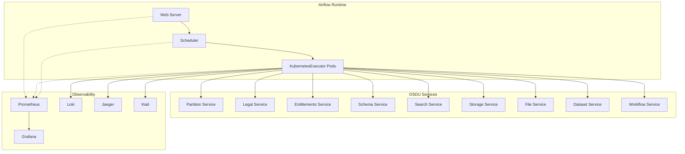
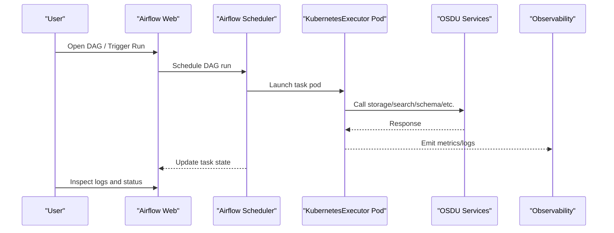
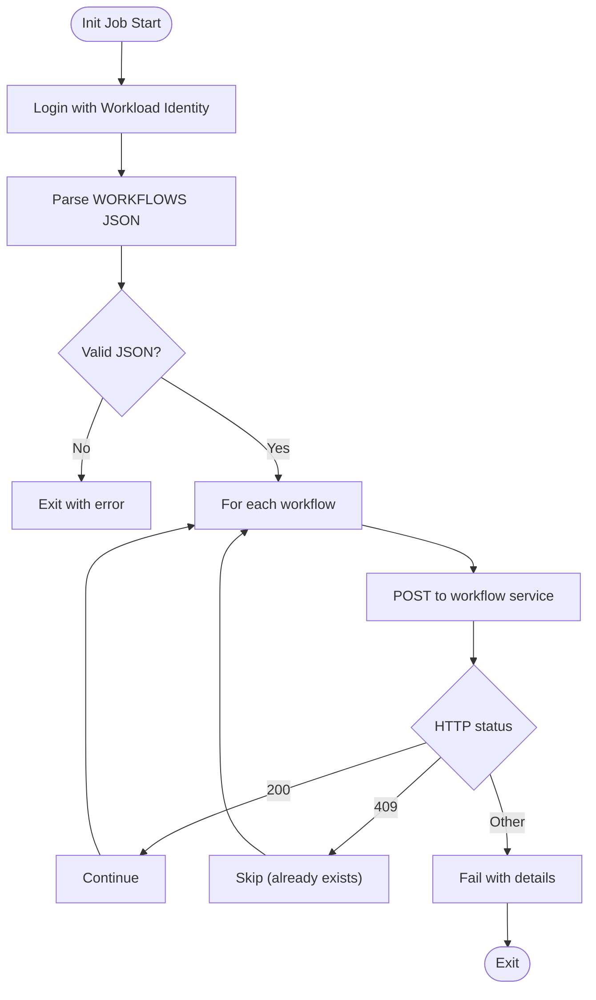
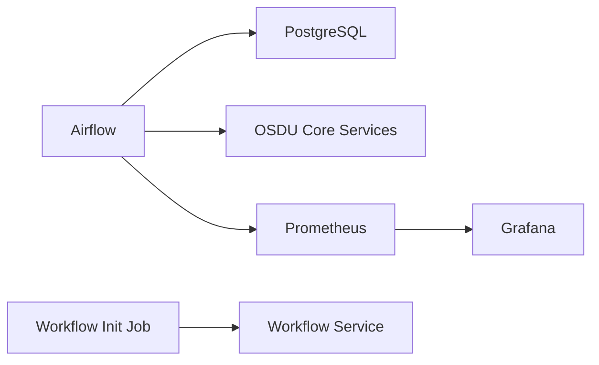

# Workflow Debugging

<cite>
**Referenced Files in This Document**
- [debugging_airflow.md](file://docs/src/debugging_airflow.md)
- [services_core_workflow.md](file://docs/src/services_core_workflow.md)
- [release.yaml](file://software/components/airflow/release.yaml)
- [config-map-airflow.yaml](file://charts/config-maps/templates/config-map-airflow.yaml)
- [workflow-init.yaml](file://charts/osdu-developer-init/templates/workflow-init.yaml)
- [README.md](file://charts/airflow-dags/README.md)
- [prometheus.yaml](file://software/components/observability/prometheus.yaml)
</cite>

## Table of Contents
1. [Introduction](#introduction)
2. [Project Structure](#project-structure)
3. [Core Components](#core-components)
4. [Architecture Overview](#architecture-overview)
5. [Detailed Component Analysis](#detailed-component-analysis)
6. [Dependency Analysis](#dependency-analysis)
7. [Performance Considerations](#performance-considerations)
8. [Troubleshooting Guide](#troubleshooting-guide)
9. [Conclusion](#conclusion)

## Introduction
This document provides a practical, code-backed guide to debugging Apache Airflow-based workflows in the OSDU platform. It focuses on diagnosing execution failures, task dependency issues, and data pipeline problems; accessing logs via the Airflow UI and Kubernetes; interpreting task states; and validating DAG definitions. It also covers monitoring techniques for performance and execution metrics using the observability stack included in the repository.

## Project Structure
The OSDU deployment configures Airflow as a Helm release with:
- A KubernetesExecutor-driven Airflow runtime (scheduler, web, workers disabled in favor of dynamic executor pods).
- Persistent storage for DAGs and logs.
- External PostgreSQL for metadata and Redis disabled due to executor choice.
- Environment variables wiring Airflow to core OSDU services (partition, legal, entitlements, schema, search, storage, file, dataset, workflow).
- An init job that registers system workflows with the workflow service.
- Observability components (Prometheus, Grafana, Loki, Jaeger, Kiali) installed separately.

**Diagram sources**
- [release.yaml:41-201](file://software/components/airflow/release.yaml#L41-L201)
- [prometheus.yaml:39-352](file://software/components/observability/prometheus.yaml#L39-L352)

**Section sources**
- [release.yaml:41-201](file://software/components/airflow/release.yaml#L41-L201)
- [prometheus.yaml:39-352](file://software/components/observability/prometheus.yaml#L39-L352)

## Core Components
- Airflow runtime configured via Helm values:
  - Image tag and executor type.
  - Security context and user templates.
  - Pip packages for OSDU SDKs and operators.
  - Config keys for logging, metrics, scheduler intervals, and web server settings.
  - Environment variables pointing to core services and Azure identity configuration.
  - Persistence for DAGs and logs.
  - External database and Redis configuration.
- Workflow registration job:
  - Uses workload identity to authenticate and register system workflows with the workflow service.
  - Validates JSON input and HTTP responses during registration.
- Configuration injection:
  - Azure App Configuration provider creates a ConfigMap consumed by Airflow.

Key references:
- Airflow Helm release values and environment variables: [release.yaml:41-201](file://software/components/airflow/release.yaml#L41-L201)
- Workflow registration script: [workflow-init.yaml:53-126](file://charts/osdu-developer-init/templates/workflow-init.yaml#L53-L126)
- ConfigMap generation from Azure App Configuration: [config-map-airflow.yaml:1-30](file://charts/config-maps/templates/config-map-airflow.yaml#L1-L30)

**Section sources**
- [release.yaml:41-201](file://software/components/airflow/release.yaml#L41-L201)
- [workflow-init.yaml:53-126](file://charts/osdu-developer-init/templates/workflow-init.yaml#L53-L126)
- [config-map-airflow.yaml:1-30](file://charts/config-maps/templates/config-map-airflow.yaml#L1-L30)

## Architecture Overview
The typical workflow execution flow involves:
- The Airflow scheduler discovers and triggers DAG runs.
- Tasks execute as ephemeral Kubernetes pods managed by the KubernetesExecutor.
- Task pods call OSDU core services (storage, search, schema, etc.) using internal cluster endpoints.
- Logs are written to persistent volumes and can be viewed via kubectl or the Airflow UI.
- Metrics are scraped by Prometheus and visualized in Grafana.

**Diagram sources**
- [release.yaml:41-201](file://software/components/airflow/release.yaml#L41-L201)
- [prometheus.yaml:39-352](file://software/components/observability/prometheus.yaml#L39-L352)

## Detailed Component Analysis

### Airflow Runtime Configuration
- Execution model: KubernetesExecutor is enabled, so each task runs in its own pod with isolated resources and dependencies.
- Concurrency and scheduling:
  - High parallelism and DAG concurrency values are set to support large-scale workloads.
  - DAG file processor timeout and scheduler interval are tuned for responsiveness.
- Authentication and access:
  - Basic auth enabled for the web server.
  - RBAC enabled for fine-grained permissions.
- Secrets and configuration:
  - Fernet key and webserver secret loaded from Key Vault-backed secrets.
  - Azure credentials and tenant info injected via secrets for authenticated calls to Azure resources.
- Service endpoints:
  - All core service URLs are provided as environment variables for tasks to reach partition, legal, entitlements, schema, search, storage, file, dataset, and workflow services.

Operational notes:
- DAGs and logs are persisted to PVCs, enabling post-mortem analysis after pod restarts.
- StatsD is enabled for metrics collection.

**Section sources**
- [release.yaml:41-201](file://software/components/airflow/release.yaml#L41-L201)

### Workflow Registration Job
- Purpose: Registers system workflows with the workflow service at install time.
- Behavior:
  - Authenticates using workload identity.
  - Parses a JSON array of workflows and posts each to the workflow service endpoint.
  - Handles common outcomes: created (200), already exists (409), unexpected errors.
- Debugging tips:
  - Validate the WORKFLOWS variable format before running.
  - Inspect HTTP status codes and response bodies when registration fails.

**Diagram sources**
- [workflow-init.yaml:53-126](file://charts/osdu-developer-init/templates/workflow-init.yaml#L53-L126)

**Section sources**
- [workflow-init.yaml:53-126](file://charts/osdu-developer-init/templates/workflow-init.yaml#L53-L126)

### DAG Deployment and Logging
- DAG artifacts are deployed via a dedicated chart and can be refreshed or inspected.
- Logs for DAG-related jobs can be retrieved using kubectl commands targeting the airflow namespace.
- ConfigMaps and Secrets should be verified during troubleshooting to ensure correct service endpoints and credentials.

Practical steps:
- Retrieve logs for specific DAG upload jobs.
- Describe ConfigMap and Secret objects to validate configuration.

**Section sources**
- [README.md:104-115](file://charts/airflow-dags/README.md#L104-L115)

### Observability and Metrics
- Prometheus scrapes Kubernetes and service endpoints, providing metrics for nodes, pods, and services.
- Grafana dashboards can visualize these metrics for capacity planning and anomaly detection.
- Additional tools (Loki, Jaeger, Kiali) complement log aggregation, distributed tracing, and service mesh visibility.

Relevant configuration highlights:
- Scrape intervals and timeouts.
- Relabeling rules for Kubernetes discovery.
- Retention policies for TSDB storage.

**Section sources**
- [prometheus.yaml:39-352](file://software/components/observability/prometheus.yaml#L39-L352)

## Dependency Analysis
- Airflow depends on:
  - External PostgreSQL for metadata.
  - OSDU core services via internal DNS names.
  - Azure identity configuration for secure access to cloud resources.
- Workflow service integration:
  - Init job registers workflows with the workflow service using a bearer token obtained via workload identity.
- Observability stack:
  - Prometheus collects metrics from multiple targets; Grafana consumes Prometheus data.

**Diagram sources**
- [release.yaml:219-240](file://software/components/airflow/release.yaml#L219-L240)
- [workflow-init.yaml:64-126](file://charts/osdu-developer-init/templates/workflow-init.yaml#L64-L126)
- [prometheus.yaml:39-352](file://software/components/observability/prometheus.yaml#L39-L352)

**Section sources**
- [release.yaml:219-240](file://software/components/airflow/release.yaml#L219-L240)
- [workflow-init.yaml:64-126](file://charts/osdu-developer-init/templates/workflow-init.yaml#L64-L126)
- [prometheus.yaml:39-352](file://software/components/observability/prometheus.yaml#L39-L352)

## Performance Considerations
- Concurrency tuning:
  - Parallelism, DAG concurrency, and max active runs per DAG are set high to support large-scale processing.
- Scheduler responsiveness:
  - DAG directory list interval controls how frequently new/updated DAGs are discovered.
- Resource isolation:
  - KubernetesExecutor ensures tasks run in isolated pods, reducing interference between concurrent tasks.
- Metrics collection:
  - StatsD enabled for capturing runtime metrics.
  - Prometheus scrape intervals balance freshness vs. overhead.

Recommendations:
- Monitor CPU/memory pressure on worker pods and adjust resource requests/limits accordingly.
- Review DAG concurrency and task-level parallelism if queue backlogs appear.
- Use Prometheus/Grafana to identify hotspots and plan scaling.

**Section sources**
- [release.yaml:104-129](file://software/components/airflow/release.yaml#L104-L129)
- [release.yaml:243-245](file://software/components/airflow/release.yaml#L243-L245)
- [prometheus.yaml:39-52](file://software/components/observability/prometheus.yaml#L39-L52)

## Troubleshooting Guide

### Accessing Airflow UI Logs
- Use the Airflow web interface under the DAG’s task instance to view logs for each task run.
- For direct access to pod logs, use kubectl to retrieve logs from the relevant airflow namespace.

References:
- Log retrieval examples for DAG jobs: [README.md:104-115](file://charts/airflow-dags/README.md#L104-L115)

**Section sources**
- [README.md:104-115](file://charts/airflow-dags/README.md#L104-L115)

### Interpreting Task States
- Common states include queued, running, success, failed, skipped, up_for_retry, and upstream_failed.
- Upstream failures often indicate dependency issues; inspect parent tasks first.
- Skipped tasks may result from conditional logic or explicit skip directives.

No direct file analysis required for this conceptual section.

### Diagnosing DAG Definition Issues
- Verify DAG files are present and parseable by checking the Airflow UI’s DAG list and parsing errors.
- Ensure Python path includes the DAGs directory and any required packages are installed via extraPipPackages.
- Confirm environment variables for service endpoints are correctly set.

References:
- Python path and package installation: [release.yaml:142-102](file://software/components/airflow/release.yaml#L142-L102)
- Service endpoint environment variables: [release.yaml:153-176](file://software/components/airflow/release.yaml#L153-L176)

**Section sources**
- [release.yaml:142-102](file://software/components/airflow/release.yaml#L142-L102)
- [release.yaml:153-176](file://software/components/airflow/release.yaml#L153-L176)

### Failed Tasks
- Check task logs in the Airflow UI and via kubectl for stack traces and error messages.
- Validate authentication and authorization to OSDU services using the configured identities and secrets.
- Inspect network connectivity to internal service endpoints.

References:
- Service endpoints and credentials: [release.yaml:153-201](file://software/components/airflow/release.yaml#L153-L201)

**Section sources**
- [release.yaml:153-201](file://software/components/airflow/release.yaml#L153-L201)

### Timeout Errors
- Increase task-level timeouts where appropriate and review long-running operations.
- Adjust scheduler and DAG file processor timeouts if DAG parsing or scheduling delays occur.

References:
- Scheduler and file processor timeouts: [release.yaml:115-119](file://software/components/airflow/release.yaml#L115-L119)

**Section sources**
- [release.yaml:115-119](file://software/components/airflow/release.yaml#L115-L119)

### Resource Constraints
- Monitor pod resource usage via Prometheus/Grafana and adjust requests/limits for task pods.
- Scale node pools or adjust affinity/tolerations if scheduling bottlenecks occur.

References:
- Node affinity and topology spread constraints: [release.yaml:277-301](file://software/components/airflow/release.yaml#L277-L301)

**Section sources**
- [release.yaml:277-301](file://software/components/airflow/release.yaml#L277-L301)

### Data Processing Failures
- Validate inputs and outputs for storage and search operations.
- Check schema validation errors and search indexing issues.
- Use distributed tracing (Jaeger) to pinpoint slow or failing steps in multi-service calls.

References:
- Observability stack availability: [prometheus.yaml:39-352](file://software/components/observability/prometheus.yaml#L39-L352)

**Section sources**
- [prometheus.yaml:39-352](file://software/components/observability/prometheus.yaml#L39-L352)

### Monitoring Techniques
- Enable and verify StatsD metrics emission from Airflow.
- Configure Prometheus scraping targets and retention policies suitable for your environment.
- Build Grafana dashboards to track:
  - DAG run durations and success rates.
  - Task queue lengths and execution latency.
  - Resource utilization trends.

References:
- StatsD enablement: [release.yaml:243-245](file://software/components/airflow/release.yaml#L243-L245)
- Prometheus configuration: [prometheus.yaml:39-352](file://software/components/observability/prometheus.yaml#L39-L352)

**Section sources**
- [release.yaml:243-245](file://software/components/airflow/release.yaml#L243-L245)
- [prometheus.yaml:39-352](file://software/components/observability/prometheus.yaml#L39-L352)

## Conclusion
Effective debugging of Airflow-based workflows in OSDU requires a combination of UI inspection, Kubernetes log access, configuration validation, and observability-driven insights. By leveraging the provided Helm configurations, init jobs, and observability stack, you can systematically diagnose failures, optimize performance, and maintain reliable data pipelines.